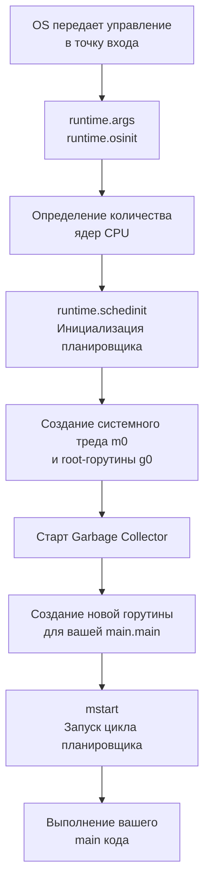

Команда `go run main.go` кажется магией. Вы нажимаете Enter, и спустя долю секунды текст появляется в терминале, веб-сервер начинает слушать порт или данные улетают в базу. 

Но для инженера магии не существует. Существуют только уровни абстракции. Чем глубже вы понимаете каждый из этих уровней, тем лучше вы проектируете системы, оптимизируете узкие места и находите баги, от которых у других опускаются руки.

Эта статья — обзорная экскурсия (10,000-foot view) по стеку технологий от исходного текста до физического движения электронов в кремнии. В последующих статьях этого раздела мы разберем каждый этап под микроскопом.

---

## 1. Фронтенд: От текста к AST

Первое, что нужно понимать: `go run` — это композитная команда. В отличие от интерпретируемых языков (PHP, Python), Go не выполняет исходный код напрямую. Под капотом `go run` создает временную директорию, вызывает компилятор `go build`, линкует бинарный файл, запускает его, а после завершения — удаляет.

Путь начинается в компиляторе.

1. **Лексический и синтаксический анализ (Lexing & Parsing):** Исходный код (поток символов) разбивается на токены (ключевые слова, идентификаторы, операторы). Затем парсер строит из них **AST (Abstract Syntax Tree)** — абстрактное синтаксическое дерево. На этом этапе компилятор понимает структуру вашей программы.
2. **Проверка типов (Type Checking):** Компилятор обходит AST, проверяя, что вы не пытаетесь умножить строку на интерфейс. Go строго типизирован, и этот этап отсекает огромный пласт рантайм-ошибок.

## 2. Бэкенд компилятора: SSA и Оптимизации

Далее AST преобразуется в промежуточное представление — **SSA (Static Single Assignment)**.
Особенность SSA в том, что каждой переменной значение присваивается ровно один раз. Это позволяет компилятору применять мощнейшие оптимизации.

> [!info] Под капотом
> На этапе SSA компилятор Go делает то, за что мы любим язык:
> - **Escape Analysis:** Решает, где аллоцировать переменную — на стеке (быстро, без сборщика мусора) или в куче (медленно, требует GC).
> - **Dead Code Elimination:** Удаляет код, который никогда не выполнится.
> - **Inlining:** Встраивает тела мелких функций прямо в место вызова, чтобы сэкономить такты CPU на `CALL`/`RET` и подготовке стековых фреймов.

После десятков проходов оптимизации SSA-форма транслируется в машинный код конкретной архитектуры (amd64, arm64). Компилятор генерирует ассемблерные инструкции, а линкер (linker) собирает их вместе с Go Runtime в единый исполняемый файл (например, в формате ELF для Linux).

> [!tip] Собеседование
> **Вопрос:** В чем фундаментальное отличие запуска программы на Go от Java или C#?
> **Ответ:** Go компилируется по модели AOT (Ahead-of-Time) в статически слинкованный бинарник с нативным машинным кодом. Ему не нужна виртуальная машина (JVM/CLR) или JIT-компиляция в рантайме. Это дает предсказуемое время старта (нет прогрева JIT) и меньшее потребление памяти.

## 3. Взаимодействие с ОС: Загрузка в память

Когда скомпилированный бинарник готов к запуску, в дело вступает операционная система.

1. Оболочка (ваш терминал) делает системный вызов `fork` (или `clone` в Linux), создавая новый процесс.
2. Затем вызывается `execve`, которому передается путь к нашему бинарнику.
3. ОС не загружает весь бинарник в физическую RAM сразу. Вместо этого она настраивает **Виртуальную память** (подробнее в [[27. Виртуальная память. Взгляд со стороны железа]]) и маппит куски файла в адресное пространство процесса.
4. Данные подгружаются в физическую память лениво, через механизм Page Faults, когда процессор реально пытается прочитать конкретную инструкцию.

## 4. Бутстраппинг: Инициализация Go Runtime

Многие думают, что выполнение программы начинается с функции `main()`. Это большое заблуждение. До того как ваша первая строчка кода получит управление, происходит огромная работа по поднятию внутреннего "государства" Go.

Точка входа в бинарник зависит от ОС и архитектуры (например, `_rt0_amd64_linux` в исходниках Go).

>[!warning] Ловушка / Gotcha
> Ваша функция `main()` работает в виде отдельной горутины. Но для работы планировщика Go (модель G-M-P) нужен фундамент. 
> В самом начале рантайм создает **`m0`** — главный системный поток (OS thread), и **`g0`** — специальную системную горутину. У `g0` нестандартный стек (намного больше дефолтных 2 КБ), и она используется исключительно для выполнения кода планировщика, а не пользовательского кода.

Только после того, как инициализированы структуры `P` (Processors/Contexts), `M` (Machines/Threads) и `G` (Goroutines), рантайм берет вашу функцию `main`, оборачивает её в новую горутину, кладет в локальную очередь одного из `P` и запускает.

## 5. Исполнение на уровне железа (Mechanical Sympathy)

Наконец, ваш код выполняется. Но CPU ничего не знает про интерфейсы, слайсы или каналы. Он видит только непрерывный поток нулей и единиц в памяти.

Чтобы выполнить простую операцию, например инкремент переменной `i++`, процессор делает следующее:

1. **Fetch (Выборка):** Запрашивает машинную инструкцию из памяти. Сначала он ищет её в сверхбыстром кэше L1. Если её там нет (Cache Miss), идет в L2, затем в L3, и только потом в медленную RAM (подробнее об этом разрыве скоростей в [[17. Пирамида памяти. Регистры, SRAM, DRAM и цена доступа]]).
2. **Decode (Декодирование):** Контроллер процессора понимает, что это инструкция `ADD`, и определяет, какие регистры нужно использовать. (Детали в [[7. Цикл исполнения инструкции. Fetch, Decode, Execute]]).
3. **Execute (Выполнение):** ALU (Арифметико-логическое устройство) получает данные. 

И вот здесь мы доходим до самого низа — физики.

ALU состоит из микроскопических транзисторов. Комбинации транзисторов образуют логические вентили (AND, OR, NOT, XOR). Когда инструкция приказывает сложить два числа, напряжение (электроны) подается на определенные входы этих вентилей. Физические свойства полупроводников (кремния) заставляют ток протекать или блокироваться, формируя на выходе новую последовательность высокого и низкого напряжения, что интерпретируется нами как новый бит информации.

## Итог

Ваша программа проходит колоссальный путь:
1. **Софт:** Парсинг, типизация, SSA, Escape Analysis, генерация машинного кода.
2. **ОС:** Создание процесса, виртуальная память, маппинг страниц.
3. **Рантайм Go:** Инициализация тредов (`m0`), системных горутин (`g0`), аллокатора, сборщика мусора и старт планировщика (G-M-P).
4. **Железо:** Загрузка данных в кэши, конвейерное исполнение инструкций, переключение логических вентилей на уровне полупроводников.

Понимание всего этого стека делает из вас инженера, который не просто "пишет код по ТЗ", а осознает, сколько стоит каждая операция для системы. 

В следующей статье мы спустимся на самый нижний, фундаментальный уровень и разберем, как именно из кусков кремния получается вычислительная машина: [[2. Транзисторы, биты и логические вентили]].