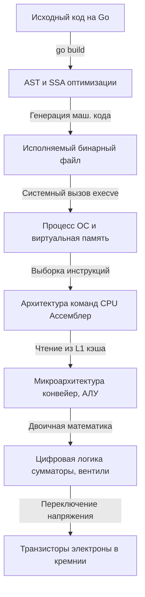

Мы пишем код на высокоуровневом языке, нажимаем кнопку в IDE или вводим команду в терминал, и магия случается: на экране появляется текст, данные улетают в базу, а по сети бегают пакеты. Но для настоящего инженера это не магия, а строгая последовательность преобразований информации через уровни абстракций.

В этой статье мы возьмем простейшую программу на Go и спустимся на лифте абстракций на самое дно: от исходного текста до движения электронов в кремнии. Эта «карта территории» понадобится нам для того, чтобы в следующих статьях точно понимать, на каком уровне мы находимся и как наши решения в коде влияют на железо (концепция **Mechanical Sympathy**).

Возьмем элементарный код:

```go
package main

import "fmt"

func main() {
    a := 42
    b := 27
    result := a + b
    fmt.Println(result)
}
```

Что на самом деле происходит, когда мы пишем в терминале `go run main.go`?

## Уровень 6. Компилятор и Рантайм (Go)

Первое, что нужно понимать: в отличие от PHP или Python, в Go нет интерпретатора, исполняющего код построчно. И в отличие от Java или C#, здесь нет виртуальной машины (JVM/CLR) и JIT-компиляции. Go — это классический компилируемый язык (как C/C++), который транслируется напрямую в машинный код под конкретную архитектуру.

> [!info] Под капотом
> Команда `go run main.go` — это на самом деле синтаксический сахар. Под капотом Go выполняет компиляцию программы во временную директорию (через `go build`), а затем просит ОС запустить получившийся бинарный файл.

Процесс компиляции проходит несколько стадий:
1. **Лексический и синтаксический анализ**: Код разбирается на токены и превращается в **AST** (Abstract Syntax Tree — абстрактное синтаксическое дерево).
2. **Проверка типов и Escape Analysis**: Компилятор проверяет типы и решает, где будут жить наши переменные: в стеке (быстро) или в куче (медленно, потребует работы GC).
3. **SSA (Static Single Assignment)**: Код переводится во внутреннее представление. Здесь происходит магия оптимизаций: удаление мертвого кода, разворачивание циклов.
4. **Генерация машинного кода**: SSA превращается в набор ассемблерных инструкций для конкретной платформы (например, `linux/amd64` или `darwin/arm64`).

> [!warning] Ловушка / Gotcha
> Вы можете подумать, что переменные `a`, `b` и `result` выделяются на стеке, так как это простые числа. Но `fmt.Println(a ...any)` принимает аргументы как пустой интерфейс (`any`). Передача значения в `interface{}` заставляет компилятор аллоцировать память под `result` в куче (heap). Это можно увидеть, запустив `go build -gcflags="-m"`. [[Escape Analysis]] — важнейшая тема для оптимизации бэкенда на Go.

Вместе с нашим кодом компилятор «зашивает» в бинарник **рантайм Go**. Это код, который управляет выделением памяти, сборкой мусора (GC) и [[Goroutine Scheduler|планировщиком горутин]].

## Уровень 5. Операционная система (ОС)

Итак, у нас есть бинарный файл (в формате ELF для Linux, Mach-O для macOS или PE для Windows). ОС должна его запустить.

1. Оболочка (bash/zsh) вызывает [[Системные вызовы (Syscalls)|системный вызов]] `execve`.
2. Ядро ОС читает заголовки ELF-файла и создает новый **процесс**.
3. Настраивается виртуальная память. ОС обманывает программу, давая ей иллюзию, что она владеет всей оперативной памятью (RAM) единолично.
4. ОС передает управление на точку входа (Entry point) программы.

Здесь стартует не наша функция `main()`, а рантайм Go:
* Инициализируется системный тред (в терминах Go — машинный поток `m0`).
* Создается главная горутина (`g0`), которая настраивает сборщик мусора.
* Только после этого рантайм запускает *нашу* функцию `main.main` в отдельной горутине.

## Уровень 4. Архитектура системы команд (ISA / Ассемблер)

Наш процесс загружен в оперативную память. Теперь за работу берется процессор (CPU).

Процессор не понимает Go, он понимает только инструкции своей архитектуры (например, x86-64 или ARM64). Наша строка `result := a + b` на уровне ассемблера x86-64 выглядит примерно так:

```asm
MOV EAX, 42    ; Поместить 42 в регистр EAX
MOV EBX, 27    ; Поместить 27 в регистр EBX
ADD EAX, EBX   ; Сложить EAX и EBX, результат останется в EAX
```

> [!tip] Собеседование
> Вопрос: "Почему бинарник, скомпилированный на Mac с процессором M1, не запустится на сервере с Ubuntu x86?"
> Ответ: Разные ОС используют разные форматы бинарников (Mach-O vs ELF), а процессоры — разные наборы команд (ISA). M1 — это ARM64 (RISC архитектура), а большинство серверов — x86-64 (CISC архитектура). Инструкции сложения для них выглядят в бинарном виде абсолютно по-разному. В Go эта проблема решается элементарной кросс-компиляцией: `GOOS=linux GOARCH=amd64 go build`.

## Уровень 3. Микроархитектура CPU

Теперь мы спускаемся внутрь самого кремниевого чипа. Процессор берет машинные инструкции из оперативной памяти.

Так как оперативная память (RAM) невероятно медленная по меркам CPU, процессор затягивает код программы и данные в [[Кэши CPU]] (L1, L2, L3). 

Внутри ядра CPU работает конвейер (Pipeline). Выполнение нашей инструкции `ADD` бьется на микроэтапы:
1. **Fetch (Выборка)**: Забрать инструкцию из L1 кэша.
2. **Decode (Декодирование)**: Понять, что это команда сложения, и определить нужные регистры.
3. **Execute (Исполнение)**: Отправить данные в АЛУ (Арифметико-логическое устройство).
4. **Write-back (Запись)**: Вернуть результат в регистр.

Современные процессоры умеют выполнять эти шаги параллельно для разных команд, предсказывать ветвления (`if/else`) и даже выполнять инструкции вне очереди (Out-of-Order Execution), чтобы не простаивать, ожидая данные из памяти.

## Уровень 2. Цифровая логика (Вентили)

Как АЛУ (Арифметико-логическое устройство) внутри процессора понимает, как сложить 42 и 27?
На этом уровне нет чисел, есть только электрические сигналы: высокое напряжение (1) и низкое напряжение (0). 
Число 42 в двоичной системе — это `101010`. Число 27 — это `011011`.

АЛУ состоит из миллионов **логических вентилей** (Gates). Вентиль — это простейшая микросхема, которая реализует булеву логику: И (AND), ИЛИ (OR), ИСКЛЮЧАЮЩЕЕ ИЛИ (XOR). 

Чтобы сложить два бита, железо использует комбинацию вентилей XOR и AND, образуя схему, называемую **сумматором** (Adder). Миллионы таких сумматоров, объединенных вместе, способны складывать 64-битные числа за долю наносекунды.

## Уровень 1. Физика транзисторов и электронов

Из чего состоят логические вентили? Из **транзисторов**. 

В современных процессорах используются полевые транзисторы (MOSFET). По сути, это микроскопические переключатели.
Когда на управляющий контакт (затвор) подается напряжение, он меняет свойства кремния под ним: полупроводник начинает пропускать ток, и электроны устремляются от истока к стоку. Переключатель "включен" (1). Снимаем напряжение — кремний снова становится изолятором, ток не идет (0).

Тактовый генератор материнской платы задает ритм (например, 3 миллиарда раз в секунду — 3 GHz). С каждым тактом миллиарды транзисторов в процессоре одновременно открываются и закрываются, управляя потоками электронов.

## Резюме: Путь сверху вниз



**Зачем бэкендеру все это знать?**
Писать CRUD-приложения на фреймворках можно и без знания транзисторов. Но Go — это язык для высоконагруженных систем. Когда ваш сервис обрабатывает 100 000 RPS, незнание нижних уровней обходится бизнесу в тысячи долларов на сервера. 

Понимая, как устроены кэш-линии процессора (Уровень 3), вы напишете структуру данных, которая работает в 10 раз быстрее. Зная про Escape Analysis (Уровень 6), вы избавите GC от работы и снизите latency приложения до микросекунд. Зная цену системным вызовам (Уровень 5), вы будете правильно буферизировать I/O операции.

Это и есть **Mechanical Sympathy** — разработка софта с уважением и пониманием того железа, на котором он будет работать. В следующих статьях мы начнем детально разбирать эти уровни снизу вверх, начав с транзисторов и вентилей.