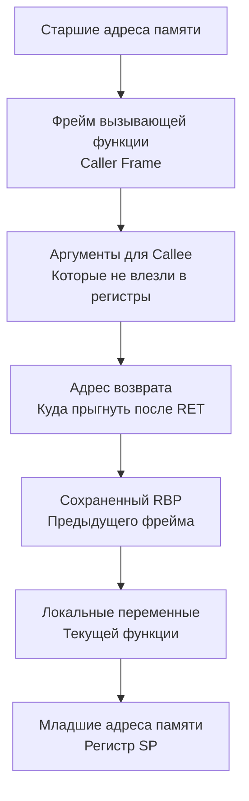

В статье [[9. Базовый Ассемблер. Как CPU видит код]] мы смотрели на ассемблерный выхлоп компилятора и видели, как процессор перекладывает значения между регистрами. Но когда одна функция вызывает другую, возникает фундаментальная проблема коммуникации:

Откуда вызываемая функция узнает, где лежат аргументы? В регистре `AX`? На стеке? А куда положить результат, чтобы вызывающая функция (Caller) смогла его прочитать? И кто должен очищать память после завершения работы?

Процессор не знает ответов на эти вопросы. Железо лишь послушно выполняет инструкции. Порядок взаимодействия между функциями устанавливается на уровне компилятора и операционной системы. Этот свод строгих правил называется **ABI** и **Конвенцией вызова (Calling Convention)**.

## API против ABI

Все разработчики знают, что такое API (Application Programming Interface). В Go сигнатура `func Process(id int, data[]byte) error` — это API. Это контракт на уровне *исходного кода*.

Но когда программа скомпилирована в машинный код, имена переменных и типы исчезают. Остаются только регистры и адреса памяти.
**ABI (Application Binary Interface)** — это контракт на уровне *бинарного кода*. Он определяет:
1.  Размер и выравнивание типов данных (сколько байт занимает `int` или `slice`).
2.  Как именно параметры передаются в функции и возвращаются из них (Calling Convention).
3.  За какие регистры процессора отвечает вызывающая функция (Caller-saved), а за какие — вызываемая (Callee-saved).

## Стек вызовов (Call Stack) и Stack Frame

Прежде чем говорить о конвенциях, нужно понять, где функции хранят свои данные. 
Для этого каждая горутина в Go при рождении получает собственный участок памяти — **Стек (Stack)**. 

Стек растет "вниз" — от старших адресов памяти к младшим. Каждый раз, когда функция `A` вызывает функцию `B`, на стеке выделяется новый блок памяти, который называется **Стековым фреймом (Stack Frame)**.

За границы текущего фрейма отвечают два аппаратных регистра процессора:
*   **`SP` (Stack Pointer)** — указывает на вершину стека (самый младший занятый адрес).
*   **`BP` (Base Pointer / Frame Pointer)** — указывает на начало фрейма текущей функции.

Когда функция завершает работу (инструкция `RET`), указатель стека просто сдвигается обратно, мгновенно "освобождая" всю память локальных переменных. 



## Эволюция Calling Convention в Go

Долгое время Go был "белой вороной" в мире компилируемых языков из-за своего подхода к передаче аргументов.

### ABI0: Классический (медленный) стек
До версии Go 1.17 компилятор использовал конвенцию вызова **ABI0**. 
В ней **абсолютно все** аргументы и возвращаемые значения передавались исключительно через стек.

Если вы писали `add(10, 20)`, процессор делал следующее:
1. Писал `10` в оперативную память (на стек).
2. Писал `20` в оперативную память (на стек).
3. Делал `CALL`.
4. Функция `add` читала `10` и `20` из оперативной памяти обратно в регистры ALU.
5. Результат `30` снова писался в память.

Это было невероятно медленно. Оперативная память (даже кэш L1) на порядки медленнее регистров. Но разработчики Go выбрали этот путь осознанно: стек-ориентированная архитектура радикально упрощала написание Garbage Collector'а (GC всегда знал, где искать указатели) и кросс-компиляцию.

### ABIInternal: Регистровая революция (Go 1.17+)
В Go 1.17 произошел тектонический сдвиг. Компилятор перевели на новый контракт — **ABIInternal** (Register-based calling convention).

Теперь Go ведет себя как C++ или Rust. Компилятор старается передать максимум данных напрямую через аппаратные регистры процессора, минуя оперативную память.

**Правила ABIInternal в Go (на архитектуре amd64):**
1. Выделено **9 целочисленных регистров**: `RAX`, `RBX`, `RCX`, `RDI`, `RSI`, `R8`, `R9`, `R10`, `R11`.
2. Выделено **15 регистров для чисел с плавающей точкой**: `X0` - `X14`.
3. Аргументы функции маппятся на эти регистры слева направо.
4. **Возвращаемые значения** тоже отдаются через эти же регистры!

Именно переход на ABIInternal подарил всем Go-разработчикам бесплатный прирост производительности на 5-10% просто за счет обновления версии компилятора: процессор перестал тратить такты на бессмысленный `I/O` с памятью.

>[!tip] Собеседование
> **Вопрос:** В Go функции могут возвращать несколько значений (например, `result, err := Do()`). Как это реализовано на уровне ассемблера, ведь в C++ функция может вернуть только одно значение через регистр `RAX`?
> **Ответ:** Благодаря собственному ABIInternal, компилятор Go просто использует следующие свободные регистры. Если `Do()` возвращает `int` и `error` (интерфейс состоит из двух указателей), Go вернет первое значение в `RAX`, а два указателя интерфейса `error` — в регистрах `RBX` и `RCX`. Множественный возврат в Go практически бесплатен.

## Mechanical Sympathy: Ловушки регистров

Аппаратные регистры конечны. Их всего 9 для целых чисел и указателей.
Что произойдет, если ваша функция принимает огромную структуру по значению?

```go
type User struct {
    ID      int
    RoleID  int
    Age     int
    // ... еще 7 int полей
}

// Передача по значению
func ProcessUser(u User) { ... }
```

Если количество полей (каждое из которых "съедает" один регистр при разворачивании структуры) превысит доступный лимит в 9 штук, компилятору не хватит аппаратных ресурсов. 
В этот момент произойдет **Spill (проливание) на стек**. Оставшиеся аргументы будут переданы "по-старинке" — через медленную оперативную память.

> [!warning] Ловушка / Gotcha
> Передавать структуры по значению (by value) в Go — это хорошая практика, так как она снижает нагрузку на Garbage Collector (данные не "убегают" в кучу). 
> Но из-за ABIInternal размер имеет значение! Передача по значению структуры из 3-5 полей отработает со скоростью света (в регистрах). Передача по значению мега-структуры из 20 полей приведет к тому, что процессор будет копировать десятки байт в стек и обратно, убивая производительность. В таких случаях передача по указателю (pointer) `*User` становится обязательной, так как указатель всегда занимает ровно 1 регистр (8 байт).

## Динамическая диспетчеризация (Интерфейсы)

Вызовы методов через интерфейсы в Go работают медленнее, чем прямые вызовы функций. ABI помогает понять, почему.

Когда вы вызываете функцию напрямую (`user.Save()`), компилятор еще на этапе сборки жестко зашивает адрес функции в инструкцию `CALL`.
Когда вы вызываете метод через интерфейс (`repository.Save()`), компилятору неизвестен точный адрес на этапе компиляции. 

На уровне ABI и ассемблера вызов через интерфейс выглядит так:
1. Процессор читает интерфейс (который под капотом состоит из указателя на тип `itab` и указателя на данные).
2. Процессор лезет по указателю `itab` в память, чтобы найти таблицу виртуальных методов.
3. Процессор вычисляет смещение нужного метода (например, `Save`) в этой таблице.
4. Выполняет косвенный прыжок (Indirect Call) по найденному адресу.

Хотя сами аргументы все равно передадутся через быстрые регистры (ABIInternal), сам процесс поиска адреса требует дополнительных чтений из памяти (Pointer Dereferencing), что увеличивает шанс промаха в кэше (Cache Miss).

## Итог

1. **ABI** — это бинарный контракт, описывающий, как машинный код использует регистры и память для взаимодействия.
2. **Стек вызовов** состоит из фреймов. Границы фрейма определяются регистрами `BP` и `SP`. Локальные переменные живут внутри фрейма и "уничтожаются" простым сдвигом регистра `SP`.
3. До Go 1.17 использовался **ABI0**, где все аргументы и возвращаемые значения передавались через медленный стек.
4. Современный Go использует **ABIInternal**. Аргументы (до 9 `int` и 15 `float`) и мульти-возвращаемые значения летают между функциями через сверхбыстрые регистры CPU.
5. Передача гигантских структур по значению ломает ABIInternal, вызывая дорогой "spill" аргументов на стек.

Мы рассмотрели, как процессор шаг за шагом читает и исполняет линейный код, прыгая по функциям через `CALL` и `RET`. Но современные процессоры давно перестали быть просто "линейными" исполнителями. Чтобы достичь текущих частот в 5 ГГц, инженерам пришлось заставить CPU выполнять несколько стадий разных инструкций *одновременно*. В следующей статье мы познакомимся с магией параллелизма внутри одного ядра: [[11. Конвейеризация. Почему CPU исполняет несколько инструкций одновременно]].