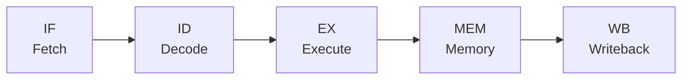

В статье [[7. Цикл исполнения инструкции. Fetch, Decode, Execute]] мы описали работу процессора как строгий, последовательный цикл. Процессор берет команду из памяти, декодирует ее, выполняет, записывает результат, и только потом переходит к следующей команде.

Если бы современные процессоры действительно работали так, они были бы невероятно медленными.

Представьте, что фазы Fetch, Decode и Execute занимают по 1 такту каждая. На выполнение одной инструкции уходит 3 такта. Значит, процессор с частотой 3 ГГц (3 миллиарда тактов в секунду) выполнял бы всего 1 миллиард инструкций в секунду. Но современные CPU выполняют гораздо больше. Как? Благодаря **Конвейеризации (Pipelining)** — главному механизму распараллеливания на уровне железа (Instruction-Level Parallelism, ILP).

## Аналогия: Завод и Прачечная

Понять конвейер проще всего на примере прачечной. У вас есть стиральная машина (занимает 30 минут), сушилка (30 минут) и утюг (30 минут). У вас три корзины грязного белья.

**Без конвейера:** Вы стираете первую корзину, затем сушите ее, затем гладите. Только через 90 минут вы берете вторую корзину. На три корзины уйдет 270 минут (4.5 часа). Большую часть времени сушилка и утюг просто простаивают.

**С конвейером:** Как только первая корзина перекладывается в сушилку, вы *сразу же* закидываете вторую корзину в освободившуюся стиральную машину. Когда первая корзина доходит до глажки, вторая сушится, а третья уже стирается. Все устройства работают одновременно. На три корзины уйдет всего 150 минут! 

## Классический 5-стадийный конвейер RISC

Инженеры применили тот же принцип к архитектуре процессора. Вместо того чтобы ждать завершения инструкции целиком, цикл разбили на более мелкие, независимые аппаратные блоки (стадии), каждый из которых выполняет свою часть работы за 1 такт.

Классическая схема конвейера (которую изучают во всех университетах) состоит из 5 стадий:

1. **IF (Instruction Fetch):** Выборка инструкции из кэша L1i.
2. **ID (Instruction Decode):** Декодирование команды и чтение регистров (Register File).
3. **EX (Execute):** Выполнение математики в ALU.
4. **MEM (Memory Access):** Чтение или запись в оперативную память (если это инструкция Load/Store).
5. **WB (Writeback):** Запись итогового результата обратно в регистр.



Посмотрим, как это выглядит во времени:

| Такт | Стадия 1 | Стадия 2 | Стадия 3 | Стадия 4 | Стадия 5 | Стадия 6 | Стадия 7 |
| :--- | :--- | :--- | :--- | :--- | :--- | :--- | :--- |
| **Инстр 1** | IF | ID | EX | MEM | WB | | |
| **Инстр 2** | | IF | ID | EX | MEM | WB | |
| **Инстр 3** | | | IF | ID | EX | MEM | WB |

> [!tip] Собеседование
> **Вопрос:** Сколько времени (в тактах) выполняется одна инструкция в 5-стадийном конвейере?
> **Ответ:** Сама по себе инструкция (Latency) выполняется **5 тактов**. Она не стала быстрее! Но благодаря конвейеру, начиная с 5-го такта, процессор завершает по **одной инструкции каждый такт**. Пропускная способность (Throughput) возрастает в 5 раз. Это называется показателем **IPC (Instructions Per Cycle)**. В идеальном конвейере IPC = 1.

## Проблемы конвейера (Pipeline Hazards)

В идеальном мире все инструкции независимы. В реальном коде на Go инструкции постоянно взаимодействуют друг с другом. Когда плавный поток инструкций ломается, возникают **Опасности (Hazards)**. Чтобы не допустить ошибки в вычислениях, процессору приходится вставлять пустые такты простоя — **Пузыри конвейера (Pipeline Bubbles)**.

### 1. Конфликты по данным (Data Hazards)

Самая частая проблема. Возникает, когда следующей инструкции нужен результат предыдущей, а предыдущая еще не успела его вычислить или записать.

Посмотрим на этот Go-код:
```go
a := 10       // Инструкция 1
b := a + 5    // Инструкция 2: ждет a
c := b * 2    // Инструкция 3: ждет b
```
Инструкция 2 (на этапе `EX`) не может сложить `a + 5`, потому что Инструкция 1 запишет значение `10` в регистр только на этапе `WB` (через два такта!).
Если процессор пустит их друг за другом, Инструкция 2 прочитает старый "мусор" из регистра. 

Чтобы этого не произошло, процессор аппаратно "замораживает" конвейер:

| Такт | 1 | 2 | 3 | 4 | 5 | 6 | 7 |
| :--- | :--- | :--- | :--- | :--- | :--- | :--- | :--- |
| `a := 10` | IF | ID | EX | MEM | **WB** (записали) | | |
| `b := a + 5` | | IF | ID | **Ждет** | **Ждет** | EX (прочитали) | MEM |

Эти циклы ожидания — такты, когда ваш процессор на частоте 5 ГГц не делает **вообще ничего**, сжигая электричество вхолостую.

> [!info] Под капотом: Data Forwarding
> Современные инженеры придумали хак — перенаправление данных (Data Forwarding или Bypassing). Они добавили дополнительные провода (шины), которые берут результат прямо с выхода ALU (конец стадии EX) и мгновенно подают его на вход ALU для следующей инструкции, не дожидаясь фазы WB. Это устраняет большинство простых Data Hazards, спасая конвейер от простоя.

### 2. Конфликты управления (Control Hazards)

Эта проблема намного страшнее. Что произойдет, если в коде есть ветвление (`if / else` или `for`)?

```go
if user.IsAdmin {
    // Инструкция А
} else {
    // Инструкция Б
}
```

Конвейер должен загружать следующую инструкцию (`IF`) на каждом такте. Но на этапе выборки процессор еще не дошел до вычисления условия `IsAdmin` (оно вычислится только на этапе `EX` через два такта!). 
**Процессор не знает, какую инструкцию грузить следующей — А или Б!**

Если он просто остановится и будет ждать (Stall), это убьет всю производительность (современные конвейеры имеют длину не 5, а 15-20 стадий, простой будет катастрофическим).

Вместо этого процессор бросает монетку и пытается **угадать** (Спекулятивное исполнение). Если он не угадал, ему приходится стирать весь конвейер, отменять уже наполовину выполненные инструкции и начинать заново. Это называется **Сброс конвейера (Pipeline Flush)** — самая дорогая операция с точки зрения задержек (штраф в 15-20 тактов). (Мы погрузимся в эту магию в [[13. Предсказание ветвлений и Спекулятивное исполнение]]).

## Mechanical Sympathy: Пишем конвейерно-дружелюбный код

Как бэкендер на Go может помочь процессору не создавать пузыри в конвейере? Секрет в минимизации зависимостей по данным.

Рассмотрим классическую задачу — подсчет суммы элементов массива.

**Плохой (наивный) подход:**
```go
func sumSlow(nums[]int) int {
	sum := 0
	for i := 0; i < len(nums); i++ {
		sum += nums[i] // Data Hazard: каждая итерация жестко ждет завершения предыдущей
	}
	return sum
}
```
Здесь значение `sum` заблокировано. Следующая итерация не может начать сложение в ALU, пока предыдущая не закончит. Конвейер буксует.

**Оптимизированный подход (Loop Unrolling и независимые аккумуляторы):**
```go
func sumFast(nums[]int) int {
	sum1, sum2, sum3, sum4 := 0, 0, 0, 0
	i := 0
	
	// Обрабатываем по 4 элемента за раз (разворачивание цикла)
	for ; i < len(nums)-3; i += 4 {
		sum1 += nums[i]   // Независима
		sum2 += nums[i+1] // Независима
		sum3 += nums[i+2] // Независима
		sum4 += nums[i+3] // Независима
	}
	
	// Добиваем остатки
	res := sum1 + sum2 + sum3 + sum4
	for ; i < len(nums); i++ {
		res += nums[i]
	}
	
	return res
}
```
Почему второй код на больших массивах может работать почти в 2-3 раза быстрее?
Потому что инструкции сложения `sum1`, `sum2`, `sum3` и `sum4` **абсолютно независимы друг от друга по данным**. Процессор загружает их в конвейер одну за другой, перекрывая их во времени. Пока вычисляется `sum1`, в ALU уже подаются данные для `sum2` и так далее. Мы полностью задействуем пропускную способность конвейера (максимизируем IPC).

> [!warning] Ловушка / Gotcha
> Вы не должны писать такой код руками в бизнес-логике на Go! Компилятор Go (его этап SSA) умеет автоматически применять базовый Loop Unrolling.
> Однако, важно понимать принцип: если вы пишете сложный математический или криптографический алгоритм, избегайте создания длинных цепочек переменных, где каждая следующая зависит от результата предыдущей. Разбейте вычисления на параллельные, независимые ветки переменных — железо скажет вам спасибо.

## Итог

1. **Конвейеризация (Pipelining)** позволяет процессору исполнять несколько инструкций одновременно на разных стадиях (Fetch, Decode, Execute).
2. Это не ускоряет отдельную инструкцию (Latency), но кратно увеличивает пропускную способность (Throughput / IPC).
3. **Пузыри (Bubbles) и Сбросы (Flushes)** происходят, когда инструкции зависят друг от друга по данным, или процессор не угадал ветвление. Это убивает производительность CPU.
4. Устранение зависимостей в коде позволяет конвейеру работать без простоя, перекрывая исполнение.

Но инженеры пошли еще дальше. Если конвейер позволяет выполнять 1 инструкцию за такт (IPC = 1), можно ли сделать IPC = 2, 4 или 8? Можно ли засунуть в процессор сразу несколько независимых ALU и заставить их работать параллельно внутри одного ядра? Об этом — в следующей статье: [[12. Суперскалярность, Out Of Order Execution и Register Renaming]].