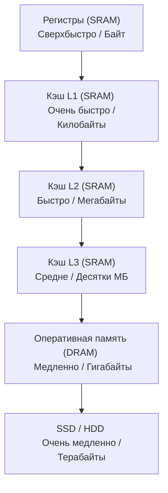

## Стена памяти и борьба за наносекунды

В предыдущих статьях мы видели, как процессор с невероятной скоростью прокручивает цикл **Fetch-Decode-Execute**. Мы узнали, что современные CPU работают на частотах 3-5 ГГц, что означает один такт примерно каждые **0.3 наносекунды**.

Но здесь кроется главная проблема современного компьютерного железа, которую называют **Memory Wall (Стена памяти)**. 

Пока скорость процессора росла экспоненциально, скорость доступа к оперативной памяти (RAM) росла крайне медленно. В итоге возник чудовищный разрыв: процессор может выполнить сотни инструкций за то время, пока оперативная память просто «отвечает» на один запрос о чтении данных.

Если бы процессор обращался к RAM за каждой переменной, он бы простаивал 99% своего времени. Чтобы решить эту проблему, инженеры создали **Иерархию памяти (Пирамиду памяти)**.

## Пирамида памяти

Идея проста: мы создаем несколько уровней памяти. Чем выше уровень, тем она быстрее, но меньше по объему и дороже в производстве.



### 1. SRAM (Static Random Access Memory)
Это память, построенная на базе **триггеров** (те самых D-триггеров из статьи [[4. Последовательностная логика. Учим кремний помнить]]). 

*   **Физика**: Чтобы хранить 1 бит, нужно около 6 транзисторов.
*   **Плюсы**: Невероятно быстрая, не требует обновления (refresh) данных.
*   **Минусы**: Занимает много места на кристалле, очень дорогая.
*   **Где используется**: Регистры CPU и Кэши (L1, L2, L3).

### 2. DRAM (Dynamic Random Access Memory)
Это то, что мы привыкли называть «плашкой оперативной памяти». Она устроена принципиально иначе.

*   **Физика**: 1 бит хранится в одном крошечном **конденсаторе** и одном транзисторе.
*   **Плюсы**: Очень плотная компоновка (миллиарды ячеек на маленьком чипе), дешевизна.
*   **Минусы**: Конденсаторы постоянно «протекают» (заряд уходит). Чтобы данные не исчезли, память должна постоянно обновляться (Refresh) тысячи раз в секунду. Это делает её намного медленнее SRAM.
*   **Где используется**: Основная оперативная память компьютера.

---

## Цена доступа: Цифры, которые должен знать каждый Senior

Чтобы понять масштаб проблемы, давайте посмотрим на время доступа к разным уровням памяти. Эти цифры (приблизительные) называют «Latency Numbers Every Programmer Should Know».

| Уровень памяти | Примерное время доступа | В тактах CPU (при 3ГГц) | Аналогия (если 1 такт = 1 сек) |
| :--- | :--- | :--- | :--- |
| **Регистр** | $\approx 0.3$ нс | 1 такт | 1 секунда |
| **Кэш L1** | $\approx 1$ нс | $\approx 3$ такта | 3 секунды |
| **Кэш L2** | $\approx 4$ нс | $\approx 12$ тактов | 12 секунд |
| **Кэш L3** | $\approx 15$ нс | $\approx 45$ тактов | 45 секунд |
| **Main RAM** | $\approx 100$ нс | $\approx 300$ тактов | **5 минут** |
| **SSD (NVMe)** | $\approx 10\ \mu\text{с}$ | $\approx 30\ 000$ тактов | **8 часов** |
| **HDD (Disk)** | $\approx 10\ \text{мс}$ | $\approx 30\ \text{млн}$ тактов | **1 год** |

> [!warning] Ловушка / Gotcha
> Посмотрите на разницу между L3 и RAM. Переход из кэша в оперативку — это прыжок с 45 секунд до 5 минут. Если ваш Go-код вызывает «промах по кэшу» (Cache Miss), процессор буквально замирает в ожидании данных. В этот момент суперскалярность, предсказание ветвлений и все остальные оптимизации CPU становятся бесполезными.

## Mechanical Sympathy: Slices vs Linked Lists

Теперь перенесем это на язык Go. Почему в Go мы почти всегда используем **слайсы** (Slices) и крайне редко — **связные списки** (Linked Lists)?

Дело в **локальности данных (Data Locality)**.

### Как работает слайс (Массив)
Слайс в Go — это непрерывный блок памяти. Когда процессор запрашивает один элемент массива, он не забирает из RAM только один байт. Он забирает сразу целую **кэш-линию** (обычно 64 байта). 
Если ваши данные лежат подряд, то при обращении к `arr[0]`, элементы `arr[1]`, `arr[2]` и т.д. уже автоматически оказываются в L1 кэше. Это называется **Spatial Locality (Пространственная локальность)**.

### Как работает связный список
В связном списке каждый элемент — это отдельный объект в куче, который содержит указатель на следующий элемент. Эти объекты могут быть разбросаны по всей оперативной памяти.
Чтобы прочитать следующий элемент, процессор должен:
1. Прочитать адрес следующего элемента из текущего.
2. Сходить в RAM по этому адресу (ждем 300 тактов).
3. Повторить это для каждого элемента.

Это приводит к бесконечным **Cache Misses**. Слайс в таком случае будет работать в десятки и сотни раз быстрее, даже если алгоритмическая сложность у них одинаковая ($O(n)$).

```go
package main

import (
	"fmt"
	"runtime"
	"time"
)

// Пример: почему линейное расположение данных побеждает
func benchmark() {
	size := 10_000_000
	
	// Слайс - данные лежат плотно (L1/L2 friendly)
	slice := make([]int, size)
	
	// Симуляция разбросанных данных (как в связном списке)
	// Создаем массив указателей на разрозненные числа
	linked := make([]*int, size)
	for i := 0; i < size; i++ {
		val := i
		linked[i] = &val
	}

	// Тест слайса
	start := time.Now()
	sumS := 0
	for _, v := range slice {
		sumS += v
	}
	fmt.Printf("Slice sum: %d, Time: %v\n", sumS, time.Since(start))

	// Тест "связного" списка
	start = time.Now()
	sumL := 0
	for _, v := range linked {
		sumL += *v // Разыменование указателя = возможный поход в RAM
	}
	fmt.Printf("Linked sum: %d, Time: %v\n", sumL, time.Since(start))
}

func main() {
	runtime.GC()
	benchmark()
}
```

> [!tip] Собеседование
> **Вопрос:** Почему в Go рекомендуют использовать `struct` вместо указателей на `struct` внутри больших слайсов (например, `[]User` вместо `[]*User`), если размер структуры невелик?
> **Ответ:** Для повышения **Cache Locality**. 
> В слайсе `[]User` все данные пользователей лежат одним сплошным массивом. Процессор читает их пачками (кэш-линиями). 
> В слайсе `[]*User` мы имеем массив указателей. Чтобы получить данные пользователя, процессору нужно сначала прочитать указатель, а затем сделать еще один прыжок в память по этому адресу. Это удваивает количество обращений к памяти и резко увеличивает вероятность Cache Miss, что катастрофически снижает производительность при итерации по большим объемам данных.

## Итог

1. **Memory Wall** — это огромный разрыв в скорости между CPU и RAM.
2. **SRAM** (быстрая, дорогая) используется в регистрах и кэшах.
3. **DRAM** (медленная, дешевая) используется в оперативной памяти.
4. **Иерархия памяти** позволяет скрывать медлительность RAM за счет кэширования данных.
5. **Mechanical Sympathy**: Чтобы писать быстрый код на Go, нужно стремиться к **плотному расположению данных** в памяти (предпочитать слайсы и структуры без лишних указателей), чтобы максимально эффективно использовать кэши CPU.

Мы поняли общую концепцию пирамиды. Но как именно работает механизм кэширования? Что такое кэш-линия, почему данные в L1 синхронизируются с L3 и что происходит, когда две горутины пытаются изменить данные в одной и той же линии? 

Об этом — в следующей статье: [[12. Кэши CPU (L1, L2, L3) и Кэш-линии]].