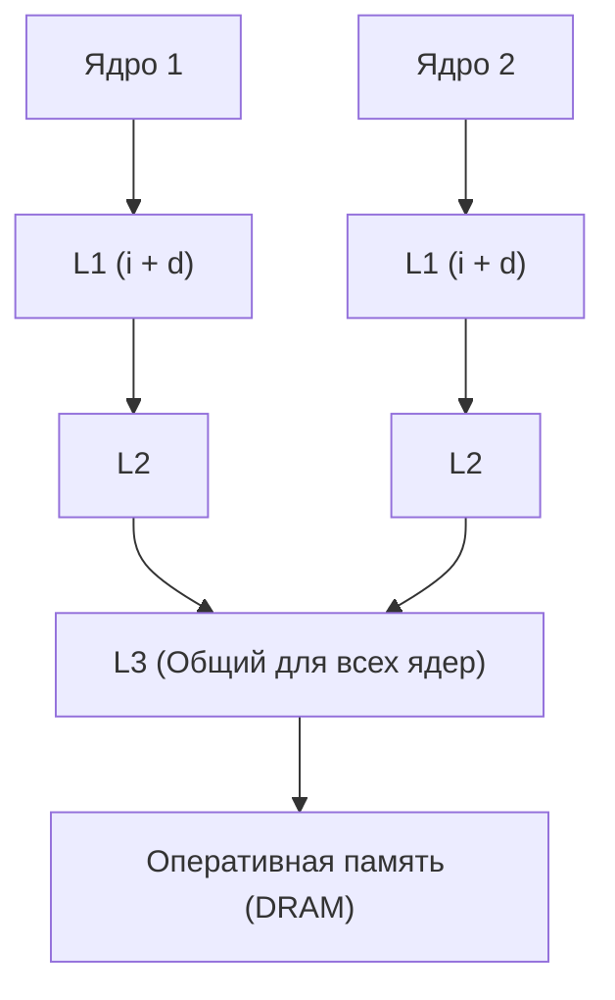

## Секреты L1, L2 и L3: Как работает «умная» память

В статье [[11. Пирамида памяти. SRAM, DRAM и цена доступа]] мы узнали, что разрыв между скоростью CPU и RAM огромен. Чтобы процессор не простаивал, используются кэши. Но кэш — это не просто «маленькая быстрая копия памяти». Это сложнейшая система управления данными, работа которой основана на двух принципах: **временной** и **пространственной локальности**.

## Кэш-линия (Cache Line): Фундаментальная единица

Это самое важное понятие для понимания производительности. 

Процессор **никогда** не читает из оперативной памяти один байт или одно число. Даже если вам нужно всего одно поле `bool` из структуры, процессор заберет из RAM целый блок данных. Этот блок называется **кэш-линией (Cache Line)**.

В подавляющем большинстве современных процессоров (x86-64, ARM64) размер кэш-линии составляет **64 байта**.

**Как это работает:**
Когда CPU запрашивает данные по адресу `0x...100`, контроллер памяти берет всё содержимое от `0x...0C0` до `0x...0FF` (ровно 64 байта) и копирует эту линию в кэш.

> [!info] Под капотом
> Это реализует принцип **пространственной локальности (Spatial Locality)**. Железо «предполагает», что если вам понадобился один байт данных, то с огромной вероятностью в ближайшее время вам понадобятся и соседние байты. Именно поэтому итерация по слайсу в Go настолько быстрее итерации по связному списку: за одним походом в RAM процессор забирает сразу несколько элементов вашего слайса.

## Анатомия уровней кэширования

Кэши организованы иерархически. Каждый следующий уровень больше по объему, но медленнее.

### L1: Личный и разделенный
L1 — самый быстрый кэш, он находится физически внутри ядра CPU. Он разделен на две части:
1. **L1i (Instruction Cache)**: Хранит только машинные инструкции.
2. **L1d (Data Cache)**: Хранит только данные (переменные, структуры).

Такое разделение позволяет процессору одновременно забирать следующую инструкцию (Fetch) и читать данные для текущей инструкции, не создавая конфликтов на шине.

### L2: Быстрый буфер
L2 больше, чем L1, и служит «прослойкой». В современных архитектурах L2 обычно всё еще индивидуален для каждого ядра.

### L3: Общий склад (LLC — Last Level Cache)
L3 — самый большой кэш. В отличие от L1 и L2, он является **общим (shared)** для всех ядер процессора. 
Если Ядро №1 записало данные в L3, Ядро №2 может прочитать их оттуда, не обращаясь к медленной RAM. L3 играет роль главного синхронизатора данных между ядрами.



## Промахи и Попадания (Cache Hit & Miss)

Когда процессору нужны данные, он проходит по цепочке: **L1 $\rightarrow$ L2 $\rightarrow$ L3 $\rightarrow$ RAM**.

*   **Cache Hit (Попадание)**: Данные найдены в кэше. Процессор продолжает работу почти мгновенно.
*   **Cache Miss (Промах)**: Данных в текущем уровне нет. Процессор замирает и ждет, пока данные поднимутся с более низкого (медленного) уровня.

> [!warning] Ловушка / Gotcha
> «Холодный старт» (Cold Start) — это когда программа только запустилась и кэши пусты. Первые итерации цикла всегда будут медленнее последующих, так как процессор будет постоянно ловить `Cache Miss` и наполнять кэш-линии данными из RAM.

## Mechanical Sympathy: Выравнивание структур в Go

Размер кэш-линии (64 байта) и способ упаковки данных в памяти напрямую влияют на то, сколько «походов» в память сделает ваш CPU. 

В Go размер структуры в памяти зависит от порядка полей из-за **выравнивания (Alignment)**. Процессор эффективнее читает данные, если они выровнены по их размеру (например, `int64` должен начинаться с адреса, кратного 8).

Рассмотрим две структуры с одинаковыми полями, но разным порядком:

```go
package main

import (
	"fmt"
	"unsafe"
)

// Плохая упаковка: много «дырок» (padding)
type BadStruct struct {
	A bool  // 1 байт
	B int64 // 8 байт (требует выравнивания, добавит 7 байт пустоты после A)
	C bool  // 1 байт
} // Итого: 1 + 7 + 8 + 1 + 7(padding) = 24 байта

// Хорошая упаковка: поля сгруппированы по размеру
type GoodStruct struct {
	B int64 // 8 байт
	A bool  // 1 байт
	C bool  // 1 байт
} // Итого: 8 + 1 + 1 + 6(padding) = 16 байт
```

**Почему это важно для кэша?**
Если `BadStruct` занимает 24 байта, то в одну кэш-линию (64 байта) поместится всего 2 таких структуры ($64 / 24 \approx 2.6$). 
Если `GoodStruct` занимает 16 байт, в ту же кэш-линию поместится ровно 4 структуры ($64 / 16 = 4$).

**Результат:** при итерации по слайсу `[]GoodStruct` процессор будет совершать в 2 раза меньше походов в RAM, чем при итерации по `[]BadStruct`. 

> [!tip] Собеседование
> **Вопрос:** Как оптимизировать использование памяти в больших массивах структур в Go?
> **Ответ:** Применять правило «от больших к меньшим». Располагать поля структуры в порядке убывания их размера (сначала `int64`, затем `int32`, потом `bool`). Это минимизирует внутренние отступы (padding), уменьшает общий размер структуры и увеличивает плотность данных в кэш-линиях CPU, что снижает количество `Cache Miss`.

## Итог

1. **Кэш-линия (64 байта)** — это минимальный «пакет», которым обмениваются RAM и CPU.
2. **Пространственная локальность** позволяет читать данные пачками. Если данные лежат подряд (слайсы), CPU работает максимально быстро.
3. **L1 $\rightarrow$ L2 $\rightarrow$ L3** — иерархия от самого быстрого/маленького до самого медленного/большого.
4. **Выравнивание полей в структурах** влияет на плотность данных. Чем меньше структура, тем больше её копий помещается в одну кэш-линию, и тем реже процессор «ходит» в медленную RAM.

Мы разобрали, как данные попадают в кэш одного ядра. Но что происходит, когда у нас многоядерный процессор и несколько ядер пытаются изменить одну и ту же кэш-линию? Как CPU понимает, что данные в кэше Ядра №1 устарели, потому что Ядро №2 их изменило?

Это ведет нас к одной из самых сложных и важных тем в системном программировании — **Когерентности кэшей и проблеме False Sharing**. Об этом в следующей статье: [[13. Многоядерные процессоры и Когерентность кэшей]].