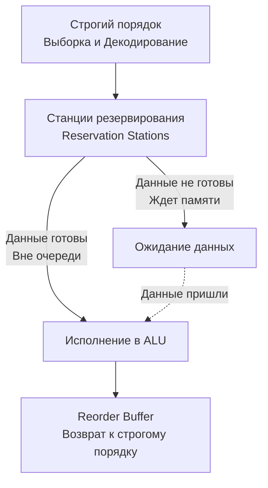

В статье [[11. Конвейеризация. Почему CPU исполняет несколько инструкций одновременно]] мы выяснили, как конвейер увеличил пропускную способность процессора до одной инструкции за такт (IPC = 1). 

Но если вы посмотрите на характеристики современных процессоров (Apple M-серии, Intel Core или AMD Ryzen), вы увидите, что их пиковый IPC может достигать 6, 8 или даже 12 инструкций за один единственный такт! 

Как это возможно, если конвейер выдает только один результат в конце? Ответ кроется в трех сложнейших микроархитектурных концепциях: **Суперскалярности**, **Out-of-Order Execution** и **Register Renaming**. Это магия, благодаря которой ваш код на Go работает в разы быстрее, чем написано в скомпилированном бинарнике.

---

## 1. Суперскалярность: Расширение шоссе

Классический конвейер можно сравнить с однополосной дорогой. Даже если машины едут бампер к бамперу (идеальный конвейер), через контрольно-пропускной пункт может проехать только одна машина в секунду.

**Суперскалярный процессор (Superscalar Processor)** — это многополосное шоссе. Инженеры продублировали "мускулы" процессора (Datapath). Внутри одного ядра современного процессора находится не одно ALU, а целая батарея вычислительных блоков:
*   3-4 ALU для простых целочисленных операций.
*   2 блока для математики с плавающей точкой (FPU) и векторизации (SIMD).
*   2 блока для вычисления адресов памяти (AGU - Address Generation Unit).
*   Несколько портов для загрузки/сохранения в кэш (Load/Store).

Теперь на стадии *Decode* декодер процессора берет из памяти не одну, а сразу, например, 4 или 6 инструкций. Он параллельно их декодирует и отправляет (Dispatch) на разные вычислительные блоки. Если инструкции независимы (одна складывает `A` и `B`, другая умножает `C` и `D`), они выполнятся **строго одновременно в один и тот же такт**.

> [!info] Под капотом: VLIW против Суперскалярности
> В 90-х годах Intel попыталась переложить задачу распараллеливания инструкций на компиляторы (архитектура Itanium / VLIW). Идея была в том, чтобы компилятор сам склеивал независимые инструкции в длинные пачки. Это с треском провалилось: компилятор не знает, произойдет ли промах в кэш в рантайме. 
> Поэтому суперскалярность — это чисто **аппаратная** фича. Компилятор Go генерирует обычный плоский список команд, а процессор уже на лету ищет среди них независимые и раскидывает по параллельным ALU.

## 2. Out of Order Execution: Бунт против порядка

Суперскалярность работает отлично, пока инструкции независимы. Но в реальном коде данные постоянно переплетены:

```go
a := readFromMemory(ptr) // Инструкция 1: Долгая загрузка из RAM
b := a + 10              // Инструкция 2: Ждет 'a'
c := 100 * 5             // Инструкция 3: Полностью независима!
d := c - 2               // Инструкция 4: Ждет 'c'
```

В строгом (In-Order) конвейере Инструкция 1 вызовет промах в кэше и заблокирует весь процессор на 200 тактов. Все 4 ALU будут простаивать, хотя Инструкции 3 и 4 могли бы выполниться прямо сейчас — им ничего не мешает!

Здесь на сцену выходит **Out of Order Execution (OoOE — Внеочередное исполнение)**.
Современный процессор ведет себя не как тупой исполнитель, а как умная операционная система с динамическим планировщиком.

1.  **Выборка и декодирование** происходят строго по порядку.
2.  Затем инструкции помещаются в специальную очередь — **Станции резервирования (Reservation Stations)**.
3.  Там они сидят и ждут, когда их данные станут готовы.
4.  Как только данные для какой-то инструкции появляются (например, для Инструкции 3 данные `100` и `5` уже зашиты в коде), она **мгновенно, вне очереди, отправляется на свободное ALU**.
5.  Пока Инструкции 1 и 2 ждут данные из медленной RAM, Инструкции 3 и 4 уже давно вычислены.

Процессор превращается в **Dataflow Engine** (машину потока данных). Порядок в исходном коде больше не имеет значения — инструкции выполняются тогда, когда к ним готовы данные.



## 3. Register Renaming: Иллюзия аппаратных регистров

Внеочередное исполнение сталкивается с фундаментальной преградой — **Ложными зависимостями (False Dependencies)**.

Вспомним [[8. ISA. Интерфейс между железом и софтом]]. В x86-64 у программиста есть всего 16 регистров общего назначения. Компилятору Go приходится постоянно их переиспользовать.

Посмотрим на этот ассемблерный код:
```asm
MOVQ AX, 10      // (1) AX = 10
ADDQ BX, AX      // (2) BX = BX + AX (Ждет 1)
MOVQ AX, 20      // (3) AX = 20
SUBQ CX, AX      // (4) CX = CX - AX (Ждет 3)
```

С точки зрения логики, блоки (1-2) и (3-4) **абсолютно независимы**. Вторая пара использует `AX` просто потому, что у компилятора не было свободного места.
Но для процессора Инструкция 3 совершает **WAW-конфликт (Write-After-Write)**: она не может записать `20` в `AX`, пока Инструкция 2 не прочитает из него `10`. Внеочередное выполнение ломается!

Чтобы разорвать эту зависимость, железо использует **Переименование регистров (Register Renaming)**.

Те 16 регистров (`AX`, `BX`), которые вы видите в ассемблере — это иллюзия, *Архитектурные регистры*. 
Физически внутри кристалла процессора находится огромный массив из сотен скрытых ячеек — **Physical Register File (PRF)**.

Когда процессор декодирует инструкции, специальная таблица маппинга на лету подменяет архитектурные регистры на свободные физические:

*   (1) `MOVQ P1, 10`    (P1 — это первый физический AX)
*   (2) `ADDQ BX, P1`
*   (3) `MOVQ P2, 20`    (P2 — это второй физический AX, переименование!)
*   (4) `SUBQ CX, P2`

Магия! Ложная зависимость уничтожена аппаратно. Теперь пары (1-2) и (3-4) могут выполняться параллельно в разных ALU. Компилятор Go может переиспользовать `AX` сколько угодно раз, а процессор будет раскидывать эти значения по сотням физических регистров.

## 4. Reorder Buffer (ROB): Восстановление порядка

Если процессор выполняет всё в случайном порядке (как только готовы данные), что произойдет при панике `panic()` или аппаратном прерывании (syscall)? Как операционная система поймет, на какой строчке кода всё сломалось, если половина будущих инструкций уже выполнена, а текущая еще висит?

Процессор **обязан** скрыть свой хаос от внешнего мира. 

Для этого перед сохранением результатов процессор отправляет их в **Буфер переупорядочивания (Reorder Buffer - ROB)**.
1. Инструкции покидают ROB и записывают результат в реальную память строго в том же порядке, в котором они стояли в бинарном файле (In-Order Retirement).
2. Если процессор угадал, результаты тихо сливаются в память.
3. Если произошло исключение или прерывание, процессор просто очищает ROB. Все результаты "будущих" внеочередных вычислений испаряются, как будто их никогда и не было. Состояние регистров остается консистентным.

> [!tip] Собеседование
> **Вопрос:** Что ограничивает возможности процессора заглядывать вперед и находить независимые инструкции? Почему мы не можем сделать "окно" OoOE размером в 10 000 инструкций?
> **Ответ:** Размер буфера ROB и количество физических регистров. Поддержание ROB требует колоссального количества транзисторов и энергии для постоянного сканирования зависимостей (матричная логика). В современных ядрах (Apple M-серии, Intel Golden Cove) размер ROB достигает 300-600 инструкций. Это предел видимости (OoO Window), дальше которого процессор заглянуть не может.

## Mechanical Sympathy: Data-Oriented Design в Go

Как это знание помогает писать код на Go? Оно объясняет, почему массивы и слайсы почти всегда уничтожают связные списки и деревья в бенчмарках, даже если алгоритмическая сложность одинаковая (O(n)).

Посмотрим на обход связного списка:
```go
type Node struct {
	Val  int
	Next *Node
}

func sumList(head *Node) int {
	sum := 0
	for curr := head; curr != nil; curr = curr.Next {
		sum += curr.Val
	}
	return sum
}
```

Проблема связного списка в том, что это **идеальная цепь зависимостей по данным**. 
Вы не знаете адрес следующего узла, пока не прочитаете поле `Next` текущего. Процессор физически не может загрузить следующую итерацию в Станции резервирования. Его огромное Окно Внеочередного Выполнения (ROB на 500 инструкций) пустует. Процессор исполняет код строго последовательно, ожидая RAM на каждом шаге (IPC падает до 0.1).

А теперь обход слайса:
```go
func sumSlice(nums[]int) int {
	sum := 0
	for i := 0; i < len(nums); i++ {
		sum += nums[i]
	}
	return sum
}
```

Адреса всех элементов в слайсе предсказуемы (это `ptr + i*8`). 
Процессор видит это и использует OoOE: он закидывает в Станции резервирования сразу 50-100 следующих итераций цикла. Его AGU (Address Generation Units) параллельно отправляют десятки независимых запросов в память. Это называется **Memory Level Parallelism (MLP)**. Пока вы ждете первый элемент, процессор уже в фоновом режиме загрузил в кэши следующие 64 байта (Cache Line) и вычислил будущие суммы на свободных ALU.

Слайс быстрее связного списка не только из-за кэшей. Он быстрее, потому что позволяет суперскалярному Out-of-Order процессору делать то, для чего он был спроектирован — **выполнять работу параллельно**.

## Итог

1. **Суперскалярность** позволяет процессору декодировать и выполнять несколько инструкций за один такт, раскидывая их по разным физическим блокам ALU, FPU и AGU.
2. **Out of Order Execution** разбивает последовательное исполнение. Инструкции выполняются сразу, как только готовы их входные данные, не дожидаясь завершения предыдущих, медленных команд.
3. **Register Renaming** аппаратно переназначает 16 архитектурных регистров на сотни физических, устраняя ложные конфликты записи (WAW) и раскрывая потенциал параллелизма.
4. **Reorder Buffer (ROB)** собирает хаотичные результаты обратно в строгий порядок, обеспечивая консистентность состояния для операционной системы.
5. Связные списки и графы убивают Out-of-Order окно, так как создают жесткие зависимости по указателям. Слайсы (плоские массивы) позволяют процессору заглянуть вперед и распараллелить работу.

Окно внеочередного выполнения (ROB) позволяет процессору заглядывать на сотни инструкций вперед. Но что происходит, если на пути встречается условный оператор `if`? Процессор не может выполнить инструкции внутри блока `if`, пока не вычислит условие. Или может? 
В следующей статье мы разберем самый безумный и опасный механизм современных CPU: [[13. Предсказание ветвлений и Спекулятивное исполнение]].