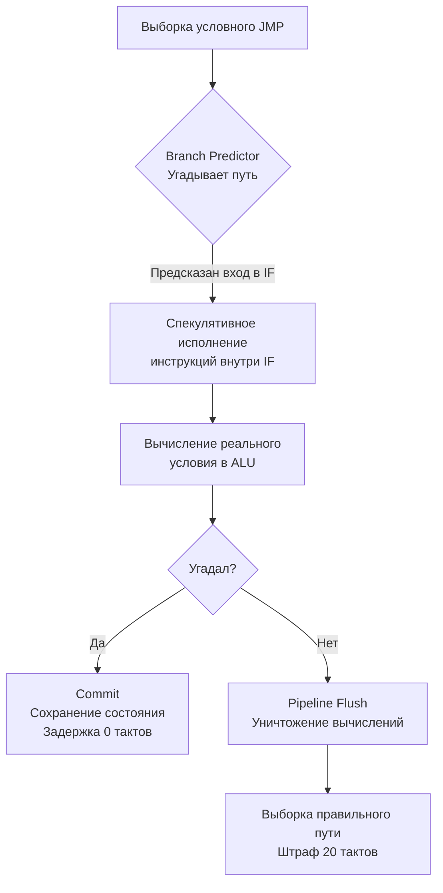

В статье [[12. Суперскалярность, Out Of Order Execution и Register Renaming]] мы узнали, что современный процессор — это жадный зверь. Его конвейер, расширенный за счет Out-of-Order исполнения и сотен физических регистров, требует постоянного притока новых инструкций. Процессор способен заглядывать на сотни шагов вперед, чтобы выполнять их параллельно.

Но на пути этого локомотива есть фундаментальная преграда — **ветвления (Branches)**. 

Любой `if`, `switch` или `for` в вашем Go-коде транслируется в ассемблерную инструкцию условного перехода (например, `JEQ` — Jump if Equal). Когда декодер процессора встречает такую инструкцию, он сталкивается с проблемой: **он не знает, какую инструкцию грузить следующей**. 

Нужно ли идти внутрь блока `if` или перепрыгнуть его? Чтобы это узнать, нужно дождаться, пока ALU вычислит условие (а данные для условия могут прямо сейчас медленно ехать из оперативной памяти). Если процессор остановится и будет ждать, конвейер опустеет. 

Чтобы не простаивать, инженеры наделили процессор способностью предвидеть будущее.

## Предсказатель ветвлений (Branch Predictor)

Вместо того чтобы ждать, процессор бросает монетку. Но это не слепая случайность. Внутри CPU встроен сложнейший аппаратный модуль — **Branch Predictor**. По сути, это микроскопическая нейросеть (исторически — конечные автоматы и перцептроны), реализованная прямо в кремнии.

Ее задача — на основе прошлой истории угадать, выполнится ли условие в этот раз.

Для этого процессор использует несколько структур:
1. **BHT (Branch History Table):** Массив счетчиков. Если переход по определенному адресу произошел, счетчик увеличивается. Если нет — уменьшается. Процессор смотрит на счетчик и решает: "Последние 5 раз мы заходили в этот `for`, значит, зайдем и сейчас".
2. **BTB (Branch Target Buffer):** Кэш, который хранит не только факт перехода, но и *адрес*, куда именно нужно прыгнуть. Это критически важно для интерфейсов и виртуальных вызовов.

## Спекулятивное исполнение (Speculative Execution)

Предсказать путь — это половина дела. Настоящая магия (и ужас) начинается дальше.

Сделав предсказание, процессор не просто подготавливает инструкции. Он начинает их **реально выполнять в ALU** до того, как узнает, было ли предсказание верным! Это называется **Спекулятивным исполнением**.

Процессор запрашивает память, складывает числа, сдвигает биты — всё это происходит внутри Out-of-Order движка в теневом режиме. Результаты этих спекулятивных вычислений складываются во временный буфер (ROB), но пока не применяются к реальным архитектурным регистрам.

Когда реальное условие наконец-то вычисляется, возможны два сценария:

**1. Процессор угадал (Hit):**
Результаты спекулятивных вычислений мгновенно "коммитятся" (Commit) в реальные регистры и память. Процессор не потерял ни одного такта. Для вашей программы ветвление прошло с нулевой задержкой.

**2. Процессор ошибся (Mispredict):**
Происходит катастрофа. Процессор понимает, что выполнил сотни инструкций из неправильной ветки `if`. Он вынужден:
1. Уничтожить все спекулятивные результаты (Сброс ROB).
2. Стереть весь конвейер (**Pipeline Flush**).
3. Запросить правильные инструкции из кэша.
4. Начать всё заново.

Этот сброс стоит **от 15 до 20 тактов процессора**. Если ваш код постоянно заставляет процессор ошибаться, производительность упадет в десятки раз.



## Mechanical Sympathy: Отсортированные данные быстрее

Классический пример, демонстрирующий влияние предсказателя ветвлений на код, — это фильтрация массива. 
Давайте напишем код на Go, который суммирует только числа больше 128.

```go
package main

import (
	"fmt"
	"math/rand"
	"sort"
	"time"
)

func main() {
	// Генерируем миллион случайных чисел от 0 до 255
	data := make([]int, 1000000)
	for i := range data {
		data[i] = rand.Intn(256)
	}

	// Раскомментируйте эту строку для магии:
	// sort.Ints(data) 

	start := time.Now()
	sum := 0
	// Горячий цикл с ветвлением внутри
	for _, v := range data {
		if v > 128 {
			sum += v
		}
	}
	fmt.Printf("Sum: %d, Time: %v\n", sum, time.Since(start))
}
```

Если вы запустите этот код с **неотсортированным** массивом, условие `v > 128` будет вести себя как случайный шум (True, False, False, True, True). Branch Predictor физически не может найти здесь паттерн. Его точность будет около 50%. На каждой второй итерации процессор будет делать сброс конвейера, теряя по 20 тактов.

Если вы **отсортируете** массив перед циклом, данные примут вид `0, 1, 2... 128, 129, 200...`. 
Теперь условие будет выдавать `False` первые 500 000 раз, а затем `True` следующие 500 000 раз. Предсказатель быстро уловит этот паттерн. Он ошибется ровно один раз (на границе перехода 128), и точность составит 99.99%. 

Один и тот же цикл, одинаковое количество данных, одинаковая алгоритмическая сложность O(N), но отсортированный вариант отработает **в 3-5 раз быстрее** исключительно из-за железа!

> [!warning] Ловушка / Gotcha: Интерфейсы и Косвенные вызовы
> В Go часто используются интерфейсы (`io.Reader`, `http.Handler`). Вызов метода интерфейса — это **Косвенное ветвление (Indirect Branch)**. Процессор должен предсказать не просто "прыгнем или нет", а *конкретный адрес в памяти*, по которому лежит функция реализации.
> Если у вас есть цикл, который вызывает метод `.Process()` у слайса интерфейсов, и все элементы в слайсе — это разные структуры (megamorphic call site), Branch Target Buffer процессора сойдет с ума. Он не сможет предсказать адрес следующего прыжка, конвейер будет постоянно простаивать, ожидая загрузки указателя из itab интерфейса. В критически горячих путях (hot paths) замена интерфейсов на конкретные типы (девиртуализация) дает ощутимый буст производительности.

## Branchless Programming (Программирование без ветвлений)

Как Senior-разработчик, вы должны знать, как помочь железу. Лучший способ избежать штрафов за неверное предсказание — **вообще избавиться от ветвления**.

Процессоры имеют специальные инструкции (например, `CMOV` в x86-64 — Conditional Move), которые позволяют делать условное присваивание без прыжков по памяти. Кроме того, можно использовать побитовые операции.

Рассмотрим вычисление модуля числа (Absolute value).
Наивный подход с ветвлением:
```go
func absBranch(x int32) int32 {
    if x < 0 {
        return -x // Branch Predictor может ошибиться здесь
    }
    return x
}
```

Branchless подход (используется под капотом в высокопроизводительных библиотеках):
```go
func absBranchless(x int32) int32 {
    // Вычисляем маску: если x < 0, то mask = -1 (все биты 1), иначе mask = 0
    mask := x >> 31
    // Используем XOR и сложение. Никаких IF!
    return (x ^ mask) - mask
}
```
Branchless-код всегда выполняется за фиксированное, предсказуемое количество тактов (O(1) на уровне железа). Процессор никогда не сбрасывает конвейер, потому что здесь нечего предсказывать — это просто линейная последовательность арифметики.

> [!info] Под капотом: Spectre и Meltdown
> Механизм спекулятивного исполнения породил самую масштабную уязвимость в истории CPU — **Spectre**. 
> Представьте код: `if (index < len(array)) { val = array[index]; }`.
> Злоумышленник передает гигантский `index`, выходящий за пределы памяти. Процессор *спекулятивно* заходит в блок `if`, читает чужую память (например, пароли ядра ОС) и загружает их в кэш L1. Затем процессор понимает, что условие ложно, и отменяет операции (очищает ROB). 
> Проблема в том, что процессор **забывает очистить кэш L1**. Злоумышленник, измеряя скорость доступа к своему кэшу, может по битам прочитать секретные данные, которые процессор спекулятивно потрогал. Исправление этих уязвимостей на уровне ОС (KPTI) и микрокода стоило индустрии потери 10-30% производительности на старых процессорах.

## Итог

1. **Контроль ветвлений (Control Hazard)** — главная проблема глубоких конвейеров. Остановка для вычисления условия `if` убьет производительность.
2. **Branch Predictor** — аппаратный модуль, угадывающий путь выполнения кода на основе паттернов из прошлого.
3. **Спекулятивное исполнение** — выполнение угаданного пути заранее. Успех дает 0 задержек. Ошибка (Mispredict) требует сброса конвейера и стоит 15-20 тактов.
4. Отсортированные данные и однородные типы под интерфейсами радикально повышают точность предсказателя.
5. **Branchless programming** (замена логики на математику) — хардкорный инструмент для критических участков, где предсказатель стабильно ошибается.

Мы разобрались, как процессор пытается извлечь максимум параллелизма из обычных, последовательных инструкций (ILP). Но инженеры пошли еще дальше. Если нам нужно применить одну и ту же операцию к огромному массиву данных (например, сложить два слайса), зачем процессору тратить ресурсы на декодирование миллионов одинаковых инструкций? 
В следующей статье мы откроем дверь в мир обработки целых массивов за один такт: [[14. SIMD. Single Instruction Multiple Data]].