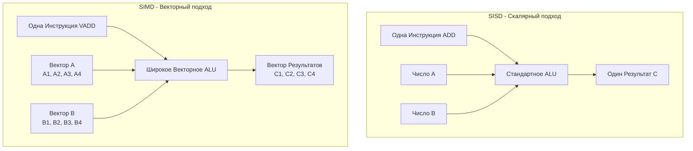

В статьях про конвейеризацию, Out-of-Order и [[13. Предсказание ветвлений и Спекулятивное исполнение]] мы видели, как инженеры выжимают максимум производительности из последовательного кода. Этот подход называется **ILP (Instruction-Level Parallelism)** — параллелизм на уровне инструкций.

Но у ILP есть предел. Декодер процессора — это невероятно сложный и энергозатратный блок. Представьте, что вы пишете типичный код для обработки изображений или суммирования слайса:

```go
for i := 0; i < 1000; i++ {
    c[i] = a[i] + b[i]
}
```

Для процессора это означает необходимость выбрать из кэша, декодировать и запустить в ALU минимум 3000 инструкций (чтение `a`, чтение `b`, сложение, запись `c`, инкремент счетчика, проверка условия цикла). Повторять одно и то же действие тысячу раз — это чудовищная трата ресурсов декодера.

Что если мы скажем процессору: *"Вот тебе одна инструкция 'Сложение'. А вот тебе не два числа, а сразу два массива чисел. Сложи их все разом за один такт!"*

Эта парадигма называется **DLP (Data-Level Parallelism)**. А ее аппаратная реализация в современных процессорах — **SIMD**.

## Что такое SIMD?

**SIMD (Single Instruction, Multiple Data — Одна инструкция, множество данных)** — это класс процессорных архитектур, где одна микрокоманда применяется к большому вектору независимых данных аппаратно и строго параллельно.

До сих пор мы рассматривали классический подход:
*   **SISD (Single Instruction, Single Data):** Обычная инструкция `ADD RAX, RBX` берет одно 64-битное число, складывает его с другим 64-битным числом и выдает один результат. Такие операции называют *скалярными*.
*   **SIMD:** Векторная инструкция (например, `VPADDQ`) берет *вектор* из четырех 64-битных чисел, складывает его с другим вектором из четырех 64-битных чисел и за один такт выдает вектор из четырех ответов.



## Под капотом: Векторные регистры

Как процессору удается переварить столько данных за один раз? В статье [[6. Анатомия CPU. Datapath, Control Unit и Register File]] мы упоминали регистры общего назначения (GPR), такие как `RAX` или `RSP`. Их ширина ограничена 64 битами.

Но помимо них, внутри современного ядра процессора находится совершенно отдельный блок — **Векторный файл регистров (Vector Register File)** и сверхширокие векторные ALU.

На архитектуре x86-64 эти регистры эволюционировали в ширину:
1. **XMM регистры:** ширина 128 бит (16 байт). Их 16 штук (`X0` - `X15`). В один регистр влезает два `int64` или четыре `int32` или шестнадцать `byte`.
2. **YMM регистры:** ширина 256 бит (32 байта). 
3. **ZMM регистры:** ширина 512 бит (64 байта). В один регистр за один такт можно "запихнуть" 64 байта данных (размер стандартной кэш-линии)!

## SIMD в Go: Механическая симпатия

В языках вроде C, C++ или Rust компиляторы оснащены мощными автовекторизаторами. Вы пишете обычный `for`, а компилятор на этапе оптимизации `-O3` сам заменяет скалярные операции на векторные SIMD-инструкции.

> [!warning] Ловушка / Gotcha
> Если вы надеетесь, что компилятор Go сам векторизует ваши математические циклы — вы ошибаетесь. **Компилятор Go исторически имеет очень слабый автовекторизатор.** 
> В подавляющем большинстве случаев (кроме простых операций вроде копирования памяти или зануления массива) ваш цикл `for` в Go скомпилируется в медленные SISD-инструкции по одному элементу за итерацию. Мы подробно разберем архитектурные причины этого решения в [[16. Почему Go почти не использует SIMD автоматически]].

Однако это не значит, что Go не использует SIMD. Вся стандартная библиотека критически зависит от векторных инструкций. Пакеты `bytes` (`bytes.Equal`, `bytes.Index`), `crypto` (AES-NI, SHA), `strings`, хэш-таблицы (расчет хэшей мапы) — все они работают со скоростью света именно благодаря SIMD.

Но как это реализовано, если компилятор не умеет это делать сам? **Через ручной ассемблер (Plan 9 Assembly).**

Если заглянуть в исходники функции `bytes.Equal` на архитектуре `amd64`, мы увидим не Go-код, а прямой вызов аппаратных векторных блоков процессора. 

Пример того, как выглядит SIMD-магия на ассемблере Go для сравнения 16 байт за один такт:
```asm
// Загружаем 16 байт (128 бит) невыровненных данных из слайса A в регистр X0
MOVOU (AX), X0    
// Загружаем 16 байт из слайса B в регистр X1
MOVOU (BX), X1    
// Векторное сравнение (SIMD Compare)
// PCMPEQB сравнивает 16 пар байт одновременно. 
// Если байты равны, в ответе будут все единицы (0xFF), иначе 0x00.
PCMPEQB X1, X0    
```

Здесь нет циклов. Нет предсказаний ветвления. Нет зависимостей по данным. Вместо того чтобы сделать 16 итераций скалярного цикла (потратив десятки тактов на `JMP` и `CMP`), процессор делает всё за **один-два такта**, загружая широкую магистраль своего векторного ALU.

## Использование SIMD в высоконагруженном бэкенде

Если вы пишете систему, которая фильтрует терабайты JSON, выполняет агрегации в In-Memory базе данных или парсит логи, классического Go будет недостаточно.

В экосистеме Go существуют мощные библиотеки, написанные с использованием CGO или ручного ассемблера, которые эксплуатируют SIMD:
*   **`simdjson-go`**: Порт знаменитой C++ библиотеки simdjson. Позволяет парсить гигабайты JSON в секунду за счет загрузки чанков текста прямо в векторные регистры и поиска символов `"` или `{` параллельно на 64 байтах текста.
*   **БД на Go**: СУБД вроде VictoriaMetrics активно используют оптимизированные ассемблерные вставки для быстрого поиска и компрессии временных рядов (Time Series Data).

> [!tip] Собеседование
> **Вопрос:** Вы написали критичный участок бэкенда с использованием ассемблерных вставок и AVX-512 (широчайший SIMD на 512 бит). Код ускорился в 10 раз. Но после деплоя вы заметили, что *остальные* горутины, которые вообще не используют SIMD, стали работать медленнее, а задержки планировщика ОС выросли. Почему?
> **Ответ:** Это классическая проблема переключения контекста (Context Switch Penalty). 
> Когда планировщик ОС или рантайм Go (при системном вызове) прерывает поток выполнения, он обязан сохранить состояние всех регистров в память, чтобы потом восстановить их. 
> Сохранение обычных 64-битных регистров требует записи около 128 байт. Но если ваша программа "испачкала" (dirty) широкие регистры ZMM (512 бит), контекст одного потока раздувается до **2-3 Килобайт**. Если горутины постоянно переключаются, ОС тратит огромное количество времени просто на копирование этих гигантских векторов в память и обратно. В высококонкурентных системах бездумное использование сверхширокого SIMD может нанести больше вреда, чем пользы.

## Итог

1. **SIMD (Single Instruction, Multiple Data)** решает проблему накладных расходов на декодирование: одна инструкция заставляет широкое векторное ALU параллельно обработать целый массив данных (вектор).
2. Это радикально ускоряет криптографию, парсинг (JSON/XML), обработку строк и агрегацию массивов, работая в 4, 8 или 16 раз быстрее скалярного кода.
3. Процессоры имеют специальные широкие регистры (`XMM`, `YMM`, `ZMM`) от 128 до 512 бит.
4. Компилятор Go почти не генерирует SIMD-инструкции автоматически. Вся скорость стандартной библиотеки достигается за счет ручных ассемблерных вставок.

Ширина регистров выглядит впечатляюще. Кажется логичным: давайте просто сделаем регистры шириной в 1024 или 2048 бит и будем обрабатывать всё мгновенно! Однако у физики кремния есть свои законы, и рост ширины SIMD привел к неожиданным проблемам с энергопотреблением и частотой процессоров. 
В следующей статье мы разберем эволюцию наборов векторных команд и поймем, почему широкие векторы иногда заставляют ваш процессор "тормозить": [[15. AVX, AVX2, AVX-512 и ограничения SIMD]].