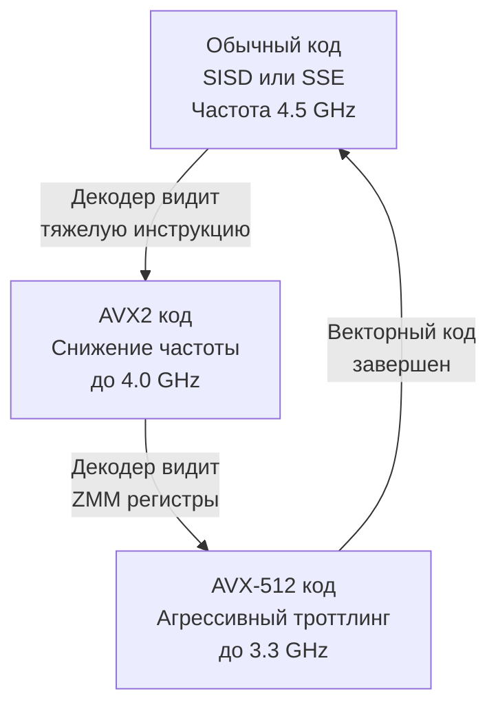

В статье [[14. SIMD. Single Instruction Multiple Data]] мы восхищались концепцией векторизации: возможностью за один такт процессора обработать не одно число, а целый массив (вектор). 

Кажется, что решение проблемы производительности очевидно. Если регистры шириной 128 бит делают код в 4 раза быстрее, почему бы не сделать регистры шириной 1024, 2048 или 8192 бита? Почему мы не можем обработать килобайт данных за один такт?

На этом этапе программисты сталкиваются с суровой физикой кремния и архитектурными ограничениями. Векторные вычисления — это не бесплатная магия. У них есть своя, порой разрушительная, цена.

## Эволюция SIMD в архитектуре x86-64

Набор векторных команд (SIMD ISA) расширялся исторически, по мере того как инженеры находили способы уместить больше транзисторов на кристалле:

1. **SSE (Streaming SIMD Extensions):**
   Базовый стандарт из начала 2000-х. Ширина регистров — **128 бит** (16 байт). Эти регистры называются `XMM` (от `X0` до `X15`). Это "прожиточный минимум", который поддерживают 100% современных 64-битных x86 процессоров.

2. **AVX и AVX2 (Advanced Vector Extensions):**
   Регистры расширили вдвое — до **256 бит** (32 байта). Они получили название `YMM`. В AVX2 добавились мощнейшие инструкции, такие как FMA (Fused Multiply-Add) — возможность за один такт умножить два числа и прибавить к ним третье. На сегодняшний день AVX2 — это золотой стандарт (Sweet Spot) для высоконагруженного серверного бэкенда.

3. **AVX-512:**
   Ширина регистров достигла **512 бит** (64 байта). Регистры называются `ZMM`. За один такт процессор может обработать целую кэш-линию L1! Но именно здесь индустрия столкнулась с физическим потолком.

## Mechanical Sympathy: Нагрев и AVX Offset

Чтобы понять главную проблему широких SIMD, нужно вспомнить [[2. Транзисторы, биты и логические вентили]]. При каждом изменении состояния (с 0 на 1 или обратно) транзистор потребляет энергию и выделяет тепло.

Скалярная операция `ADD RAX, RBX` задействует 64-битное ALU. Векторная операция AVX-512 (512 бит) включает в 8 раз больше транзисторов. Более того, эти транзисторы работают параллельно и невероятно плотно упакованы на кристалле.
Когда вы запускаете плотный цикл с AVX-512 инструкциями, ядро процессора испытывает колоссальный скачок тока. Оно начинает стремительно нагреваться (Thermal Spike) и потреблять больше энергии, чем позволяет тепловой пакет (TDP).

Чтобы кристалл буквально не расплавился, инженеры придумали костыль — **AVX Offset (или Frequency Scaling)**.
Когда процессор замечает, что вы подаете на декодер "тяжелые" AVX2 или AVX-512 инструкции, он аппаратно и мгновенно **снижает тактовую частоту всего ядра** (а иногда и соседних ядер). 



> [!warning] Ловушка / Gotcha: Эффект шумного соседа
> Снижение частоты из-за AVX-512 влияет на **весь код**, выполняющийся на этом физическом ядре! 
> Представьте, что у вас есть две горутины. Первая обрабатывает HTTP-запросы (скалярный код с кучей ветвлений). Вторая горутина сжимает логи алгоритмом zstd с использованием AVX-512.
> Планировщик ОС сажает их на одно ядро (например, используя Hyper-Threading). Вторая горутина "прогревает" векторное ALU, процессор сбрасывает частоту с 4.5 ГГц до 3.3 ГГц. В результате ваша первая горутина, обрабатывающая HTTP-запросы, **начинает работать на 30% медленнее**, хотя она вообще не использует SIMD!

*Примечание: В современных поколениях (например, AMD Zen 4) инженеры значительно сгладили эффект AVX Offset, но базовые законы физики никуда не делись: обработка 512 бит всегда требует больше энергии.*

## Стена Памяти (Memory Wall)

Второе критическое ограничение SIMD — это оперативная память.
В статье про конвейеризацию мы обсуждали, что современный CPU — это "голодный зверь". SIMD превращает этого зверя в черную дыру для данных.

Если процессор способен переваривать по 64 байта за один такт (AVX-512), работая на частоте 4 ГГц, ему требуется пропускная способность данных в **256 Гигабайт в секунду** на одно ядро! 
Современная оперативная память DDR5 выдает около 60-80 ГБ/с на *всю систему*.

**SIMD-инструкции абсолютно бесполезны (и даже вредны), если ваши данные лежат в оперативной памяти (RAM).** 
Вся магия 512-битных регистров разобьется о кэш-промахи. Процессор будет простаивать сотни тактов в ожидании данных, и ширина регистров никак не ускорит этот процесс. Векторизация имеет смысл только тогда, когда вы крутитесь в сверхбыстрых кэшах L1 и L2 (подробнее мы разберем это в [[17. Пирамида памяти. Регистры, SRAM, DRAM и цена доступа]]).

## Фрагментация ISA: Пишем код под зоопарк процессоров

В отличие от стандартного x86-64, наличие поддержки AVX2 или AVX-512 не гарантируется. Старые серверы, дешевые VPS или процессоры Intel Atom/Celeron могут поддерживать только SSE4.

Если ваш компилятор (или вы в ассемблере) сгенерирует инструкцию AVX-512 (`VPADDQ ZMM0...`), а процессор ее не поддерживает, ОС выбросит исключение `SIGILL` (Illegal Instruction), и ваш Go-бэкенд упадет с паникой (Core Dump) при старте.

Чтобы использовать современные SIMD, программистам (и авторам библиотек на Go) приходится использовать **Динамическую диспетчеризацию (Dynamic Dispatch) и инструкцию `CPUID`**.

Один и тот же алгоритм (например, расчет хэша SHA-256) пишется в исходниках 3-4 раза: на чистом Go, на ассемблере SSE, на ассемблере AVX2.
При старте приложения рантайм опрашивает процессор, узнает его фичи и переключает глобальный указатель функции на самую оптимальную реализацию.

В Go для этого есть стандартный пакет `golang.org/x/sys/cpu`:

```go
package main

import (
	"fmt"
	"golang.org/x/sys/cpu"
)

// Абстрактный интерфейс функции (указатель)
var hashFunc func(data []byte)[]byte

func init() {
	// Динамический выбор лучшей реализации в рантайме
	if cpu.X86.HasAVX512 {
		fmt.Println("Используем экстремальный AVX-512")
		hashFunc = hashAVX512
	} else if cpu.X86.HasAVX2 {
		fmt.Println("Используем балансный AVX2")
		hashFunc = hashAVX2
	} else {
		fmt.Println("Фолбэк на чистый Go (SISD / базовый SSE)")
		hashFunc = hashGeneric
	}
}

// Заглушки функций, которые в реальности написаны на Plan 9 Assembly
func hashAVX512(data []byte) []byte { return data }
func hashAVX2(data[]byte) []byte   { return data }
func hashGeneric(data []byte)[]byte {
	// Медленная побайтовая реализация
	return data
}

func main() {
	_ = hashFunc([]byte("secret_data"))
}
```

> [!tip] Собеседование
> **Вопрос:** В чем архитектурная опасность использования ассемблерных AVX2/AVX-512 вставок для функций, которые делают очень мало работы (например, складывают всего 16 байт)?
> **Ответ:** Затраты на инфраструктуру вызова. Вызов ассемблерной функции из Go требует создания стекового фрейма, соблюдения ABI (о котором мы говорили в [[10. ABI, Calling Convention и стек вызовов]]) и, возможно, динамической диспетчеризации (через указатель на функцию). Если сами вычисления занимают 2 такта (благодаря SIMD), а накладные расходы на вызов функции (CALL, RET, чтение указателя из памяти) занимают 10 тактов, то векторизация сделает код **медленнее**, чем простой цикл `for` внутри функции на чистом Go, который компилятор смог бы заинлайнить (Inlining).

## Итог

1. **SSE (128 бит), AVX2 (256 бит), AVX-512 (512 бит)** — это эволюция ширины векторных регистров и ALU.
2. Широкие векторы потребляют огромную мощность. Чтобы не перегреться, процессоры применяют **AVX Offset (сброс частоты)**. Использование AVX-512 может замедлить соседние процессы на ядре.
3. Векторизация упирается в **Стену Памяти (Memory Wall)**: широкие инструкции требуют гигантской пропускной способности от кэшей и RAM.
4. В реальных проектах на Go вы не можете полагаться только на AVX-512. Приходится писать несколько реализаций алгоритма и выбирать их в рантайме на основе возможностей процессора (`CPUID`).

Возникает резонный вопрос: если компиляторы C++ и Rust умеют сами генерировать AVX-инструкции для простых циклов, почему авторы Go намеренно сделали свой компилятор в этом плане "глупым"? Зачем они заставляют разработчиков криптографии и JSON-парсеров писать на ассемблере вручную? Разгадка кроется в самой философии языка и устройстве рантайма. Переходим к статье: [[16. Почему Go почти не использует SIMD автоматически]].