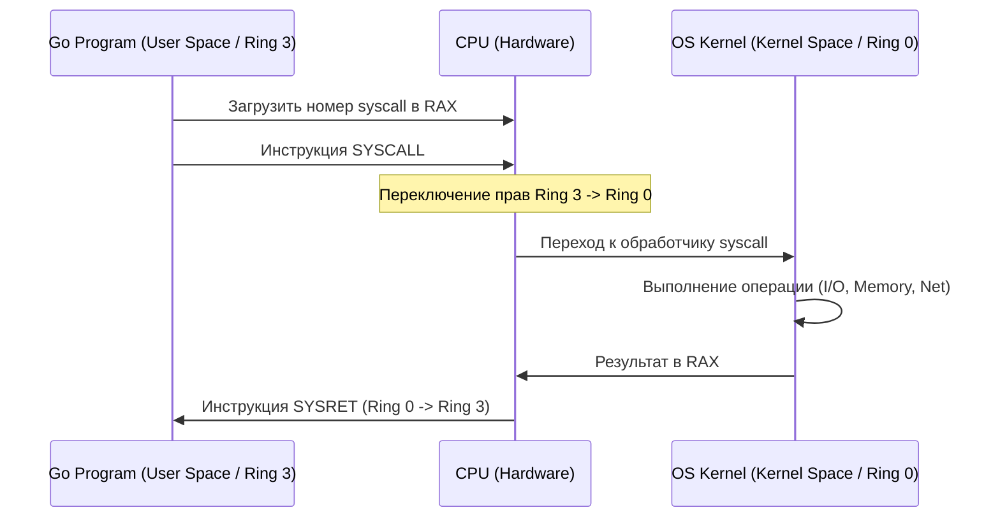

## Прерывая покой процессора

В предыдущих статьях мы видели процессор как замкнутую систему: он берет инструкцию, исполняет её и переходит к следующей. Но в реальном мире компьютер не может просто «выполнять код» — он должен взаимодействовать с внешним миром.

Что происходит, когда вы нажимаете клавишу на клавиатуре? Когда сетевая карта получает пакет из интернета? Или когда таймер говорит, что пора переключить одну горутину на другую? 

Процессор не может постоянно проверять («опрашивать») все устройства в системе — это бы отняло всё время. Вместо этого используется механизм **Прерываний (Interrupts)**.

## Что такое прерывание?

**Прерывание** — это аппаратный или программный сигнал, который приказывает процессору немедленно остановить выполнение текущей программы, сохранить её состояние и переключиться на выполнение специального кода — **Обработчика прерываний (Interrupt Service Routine, ISR)**.

Представьте это как дверной звонок. Вы читаете книгу (выполняете программу), но когда звонит звонок (приходит прерывание), вы закладываете страницу (сохраняете регистры), идете открывать дверь (выполняете ISR), а затем возвращаетесь к книге ровно с того места, где остановились.

### 1. Аппаратные прерывания (Hardware Interrupts)
Генерируются физическими устройствами через специальные провода (линии IRQ — Interrupt Request).
*   **Таймер**: Самое важное прерывание. Каждые несколько миллисекунд таймер «будит» процессор. Именно это позволяет ОС реализовать многозадачность: таймер прерывает текущую программу, и ядро ОС решает, кому отдать CPU дальше.
*   **Сетевая карта**: «Пришел пакет данных, заберите его из моего буфера в RAM».
*   **Диск/SSD**: «Я закончил читать файл, который вы просили, данные готовы».

### 2. Программные прерывания (Software Interrupts / Traps)
Генерируются самим процессором при выполнении кода:
*   **Исключения (Exceptions)**: Ошибка деления на ноль или `Page Fault` (из статьи [[14. Виртуальная память. Взгляд со стороны железа]]), когда MMU не нашел страницу в памяти.
*   **Системные вызовы (Syscalls)**: Особый вид прерывания, когда программа *намеренно* просит ОС выполнить привилегированную операцию.

---

## Системные вызовы (Syscalls): Граница двух миров

Ваша программа на Go работает в **User Space** (пространстве пользователя). В этом режиме процессор находится в состоянии с ограниченными правами (**Ring 3** в архитектуре x86). В этом режиме программе *запрещено* напрямую обращаться к железу: она не может сама отправить пакет в сеть или записать байт на диск. 

Если бы любая программа могла писать в любой сектор диска, одна ошибка в коде или один вирус уничтожили бы всю систему.

Для выполнения таких операций программа должна использовать **Системный вызов (System Call)**. Это контролируемый переход из User Space в **Kernel Space** (пространство ядра, **Ring 0**), где у процессора есть неограниченные права.

### Как работает Syscall (пошагово)

Когда вы вызываете в Go функцию `os.ReadFile()` или `fmt.Println()`, происходит следующее:

1. **Подготовка**: Go-рантайм помещает номер системного вызова (например, `write` — это номер 1 в Linux x64) и аргументы (адрес буфера, размер данных) в определенные регистры CPU (RAX, RDI, RSI).
2. **Переключение**: Вызывается специальная инструкция процессора `SYSCALL` (в x86-64) или `SVC` (в ARM).
3. **Смена режима**: Процессор мгновенно:
    *   Переключает привилегию с Ring 3 на Ring 0.
    *   Переключает стек с пользовательского на стек ядра.
    *   Прыгает по адресу, указанному в **Таблице дескрипторов прерываний (IDT)**.
4. **Выполнение в ядре**: Ядро ОС проверяет права доступа, выполняет операцию (например, отправляет данные в драйвер диска) и помещает результат в регистр RAX.
5. **Возврат**: Инструкция `SYSRET` возвращает процессор в Ring 3 и возвращает управление в вашу программу.



## Mechanical Sympathy: Цена системного вызова

Для бэкенд-разработчика понимание Syscalls — это ключ к оптимизации производительности. 

**Системный вызов — это очень дорогая операция.** 
Переключение контекста с User Space на Kernel Space занимает тысячи тактов CPU. Нужно сохранить все регистры, сменить стек, проверить права, очистить некоторые кэши TLB и выполнить код ядра.

Если вы будете делать syscall на каждое маленькое действие, ваше приложение будет тормозить, даже если CPU загружен всего на 10%.

> [!warning] Ловушка / Gotcha
> Пример из жизни: запись в файл.
> Если вы будете писать в файл по одному байту:
> ```go
> for _, b := range data {
>     file.Write([]byte{b}) // Каждый раз вызывает syscall 'write'
> }
> ```
> Ваша программа будет работать бесконечно медленно, потому что 99% времени процессор будет тратить не на запись, а на переключение между Ring 3 и Ring 0.

**Как это лечится? Буферизацией.**
В Go для этого есть пакет `bufio`. Он создает в памяти (в User Space) большой буфер (например, 4 КБ). Вы записываете данные в этот буфер (простая операция с памятью, очень быстро), и только когда буфер заполняется, Go делает **один** системный вызов `write`, отправляя сразу все 4 КБ данных. Это сокращает количество переключений контекста в тысячи раз.

## Go и системные вызовы: Рантайм

В Go системные вызовы обрабатываются особенно интересно. Когда горутина делает syscall, она блокирует весь системный тред (M), на котором работает. 

Чтобы остальные горутины не простаивали, планировщик Go (`runtime.scheduler`) видит, что тред ушел в syscall, и создает (или берет из очереди) новый тред ОС, чтобы перенести туда остальные горутины. Это называется **Hand-off**. 

Когда syscall завершается, горутина возвращается в пул, а тред либо возвращается в работу, либо уничтожается, если их стало слишком много.

> [!tip] Собеседование
> **Вопрос:** Почему использование `sync.Mutex` может быть быстрее или медленнее, чем системный вызов?
> **Ответ:** Современные мьютексы в Go (и в других языках) используют «гибридный» подход. Сначала они пытаются захватить блокировку с помощью атомарной операции в User Space (CAS - Compare-And-Swap). Если это удалось — никакого системного вызова нет, всё прошло за несколько тактов CPU. И только если мьютекс занят и горутину нужно «усыпить», Go делает системный вызов (например, `futex` в Linux), чтобы передать управление ядру ОС и переключить контекст.

## Итог

1. **Прерывания** позволяют CPU реагировать на внешние события, не тратя время на постоянный опрос устройств.
2. **Системные вызовы** — это контролируемый способ запроса ресурсов у ядра ОС через смену привилегий с Ring 3 на Ring 0.
3. **Стоимость**: Syscall — дорогая операция из-за смены контекста и переключения стеков.
4. **Оптимизация**: Буферизация (`bufio`) и минимизация syscall-ов — базовый прием для написания высокопроизводительного бэкенда.

Мы закончили с тем, как железо взаимодействует с ОС. Теперь мы закрываем раздел по основам устройства компьютера и переходим к более высокоуровневым, но всё еще фундаментальным вещам. В следующей статье мы разберем: [[16. IO подсистема и DMA (Direct Memory Access)]], чтобы понять, как данные перемещаются между диском и памятью, не нагружая CPU.