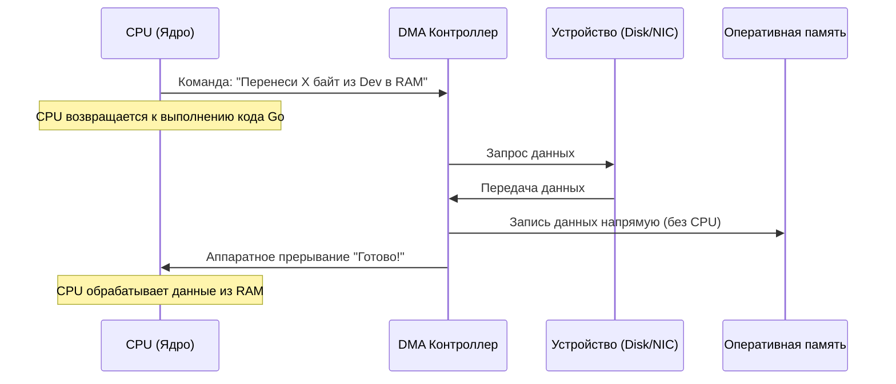

## Когда CPU перестает быть грузчиком

В статье [[15. Аппаратные прерывания и Системные вызовы]] мы разобрали, как процессор взаимодействует с ОС через системные вызовы. Но остался один важный вопрос: **как физически перемещаются данные** между внешними устройствами (SSD, сетевая карта) и оперативной памятью?

Если бы за каждый перенесенный байт отвечал процессор, он бы превратился из «мозга» системы в обычного грузчика. Для этого существует подсистема ввода-вывода (I/O) и механизм **DMA (Direct Memory Access)**.

## PIO: Метод «ручного переноса» (Programmed I/O)

В самых ранних компьютерах (и в некоторых простейших микроконтроллерах сейчас) использовался метод **PIO (Programmed I/O)**. 

При PIO процессор делает всё сам:
1. Процессор посылает команду диску: «Дай мне один байт данных».
2. Процессор ждет (простаивает), пока диск найдет этот байт.
3. Процессор считывает этот байт из порта устройства в свой регистр.
4. Процессор записывает этот байт из регистра в оперативную память.
5. Повторяет это миллионы раз.

**Проблема:** Процессор, способный выполнять миллиарды операций в секунду, вынужден ждать медленный диск или сеть. Это колоссальная трата ресурсов. CPU становится «бутылочным горлышком» при передаче данных.

## DMA: Прямой доступ к памяти

Чтобы освободить процессор от рутины, инженеры создали **DMA-контроллер (Direct Memory Access Controller)**. Это отдельное специализированное устройство, которое может управлять шиной данных независимо от CPU.

Теперь процесс передачи данных выглядит так:
1. **Подготовка**: CPU говорит DMA-контроллеру: «Слушай, в сетевой карте пришел пакет. Возьми из неё 1500 байт и положи их в оперативную память по адресу `0x...A100`. Когда закончишь — дай мне знать».
2. **Освобождение**: После этой команды CPU **полностью забывает о передаче данных**. Он возвращается к выполнению вашего Go-кода, вычисляет суммы, обрабатывает JSON или планирует горутины.
3. **Транспортировка**: DMA-контроллер сам управляет шиной. Он забирает данные из устройства и пишет их в RAM, не задействуя ядра процессора.
4. **Завершение**: Когда все 1500 байт перенесены, DMA-контроллер посылает процессору **аппаратное прерывание** (Interrupt), о котором мы говорили в статье [[15. Аппаратные прерывания и Системные вызовы]].
5. **Обработка**: CPU прерывает свою работу, видит, что данные уже лежат в RAM, и начинает с ними работать.



## Современный этап: Bus Mastering и PCIe

В современных системах отдельный «контроллер DMA» почти исчез. Вместо этого используется концепция **Bus Mastering**. 

Теперь каждое устройство (современная NVMe-дисковая система или 10-гигабитная сетевая карта) имеет свой собственный встроенный DMA-контроллер. Устройство само «владеет» шиной (Bus Master) и может самостоятельно закидывать данные в память сервера, даже не дожидаясь команды от центрального DMA-контроллера. Это происходит через высокоскоростную шину **PCIe (Peripheral Component Interconnect Express)**.

## Mechanical Sympathy: Zero-copy и производительность бэкенда

Для бэкенд-разработчика на Go понимание DMA ведет к одной из самых важных концепций оптимизации — **Zero-copy (Нулевое копирование)**.

В классическом подходе данные проходят долгий путь:
`Сетевая карта $\rightarrow$ (DMA) $\rightarrow$ Буфер ядра ОС $\rightarrow$ (Копирование CPU) $\rightarrow$ Буфер приложения Go $\rightarrow$ (Обработка)`.

Копирование данных из пространства ядра (Kernel Space) в пространство пользователя (User Space) — это дорого. Это нагружает CPU, забивает кэш-линии (L1/L2) и увеличивает latency.

**Как работает Zero-copy?**
Технологии Zero-copy позволяют приложению работать с данными прямо там, где их положил DMA-контроллер.

1. **`sendfile` (в Linux)**: Когда вы отдаете статический файл из Go-сервера клиенту, вы можете использовать системный вызов `sendfile`. Он приказывает ядру: «Возьми данные из кэша диска и отправь их сразу в сетевую карту». Данные вообще не заходят в User Space вашего приложения. CPU не касается этих байтов.
2. **`mmap` (Memory Mapping)**: Как мы разбирали в статье [[14. Виртуальная память. Взгляд со стороны железа]], `mmap` отображает файл прямо в виртуальное адресное пространство процесса. DMA-контроллер закидывает данные из файла в RAM, и ваше приложение видит их как обычный слайс байт, без лишнего копирования через `read()`.

> [!info] Под капотом
> В Go стандартная библиотека `os.ReadFile` делает классическое копирование (Read $\rightarrow$ Buffer). Если вам нужно отдавать огромные файлы с максимальной скоростью, стоит посмотреть в сторону `os.File.WriteTo` или специализированных системных вызовов через пакет `syscall`, которые реализуют Zero-copy.

## Практика в Go: Опасность лишних аллокаций

Когда вы создаете новый слайс `make([]byte, 1024)` для чтения из сети, вы создаете место, куда данные будут копироваться из буфера ядра. Если вы делаете это миллионы раз в секунду, вы создаете колоссальную нагрузку на Garbage Collector.

**Решение:** Использование **пулов буферов** (`sync.Pool`).

```go
package main

import (
	"sync"
)

// Используем пул, чтобы не аллоцировать новые буферы под каждый сетевой пакет.
// Это снижает нагрузку на GC и позволяет данным чаще оставаться в L1/L2 кэшах.
var bufferPool = sync.Pool{
	New: func() any {
		return make([]byte, 4096) // Размер страницы памяти (4КБ)
	},
}

func handleConnection(conn any) {
	buf := bufferPool.Get().([]byte)
	defer bufferPool.Put(buf)

	// Читаем данные. DMA-контроллер закинул их в RAM, 
	// а ОС копирует их в наш буфер из пула.
	// read(conn, buf)
}
```

> [!tip] Собеседование
> **Вопрос:** Что такое DMA и почему оно важно для высоконагруженных систем?
> **Ответ:** DMA (Direct Memory Access) позволяет периферийным устройствам обмениваться данными с оперативной памятью напрямую, минуя CPU. Это освобождает процессор от рутинного копирования байтов, позволяя ему заниматься вычислениями. Без DMA скорость работы с сетью и дисками была бы ограничена скоростью, с которой CPU может перекладывать байты из порта в память (PIO). В бэкенде это понимание ведет к оптимизациям типа Zero-copy, которые минимизируют перекладывание данных между ядром ОС и приложением.

## Итог

1. **PIO** — это медленный «ручной» перенос данных через CPU.
2. **DMA** — это «автоматический» перенос данных устройством напрямую в RAM.
3. **Bus Mastering** — современный стандарт, где каждое устройство (NVMe, NIC) само управляет своим DMA.
4. **Zero-copy** — техника оптимизации софта, которая исключает лишние этапы копирования данных между буферами ядра и приложения.

Мы разобрали, как данные физически попадают в компьютер. Но современные серверы — это не один процессор, а целые системы с несколькими сокетами и разными зонами доступа к памяти. В следующей статье мы разберем одну из самых сложных тем серверного железа: [[17. NUMA и Hyper-Threading]].