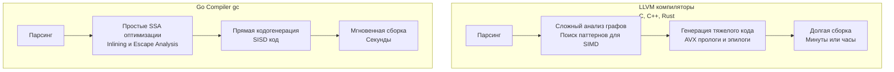

В статьях [[14. SIMD. Single Instruction Multiple Data]] и [[15. AVX, AVX2, AVX-512 и ограничения SIMD]] мы разобрали, как векторные инструкции позволяют процессору обрабатывать гигантские массивы данных за один такт. 

Если вы когда-либо писали на C, C++ или Rust, то знаете про «магию» флага `-O3`. Вы пишете обычный, наивный цикл `for`, компилятор (чаще всего на базе LLVM или GCC) анализирует его и автоматически заменяет скалярные операции на широкие векторные инструкции `AVX2` или `AVX-512`. Это называется **Автовекторизацией (Auto-vectorization)**.

Но если вы напишете тот же самый цикл в Go, стандартный компилятор `gc` (Go Compiler) сгенерирует медленный, последовательный код. Чтобы получить SIMD в Go, вам придется спуститься на уровень сырого ассемблера.

Почему авторы языка, которые сами являются легендами системного программирования (Кен Томпсон, Роб Пайк), не добавили в компилятор автовекторизатор? Это не недоработка. Это осознанный, фундаментальный архитектурный компромисс. 

Давайте разберем 4 главные причины, почему Go отвергает автоматический SIMD.

## 1. Скорость компиляции важнее микрооптимизаций

Главная киллер-фича Go — феноменальная скорость компиляции. Огромные микросервисы собираются за секунды. Это достигнуто за счет того, что компилятор Go делает ровно столько работы, сколько необходимо.

Автовекторизация в LLVM — это невероятно сложный и долгий процесс. Компилятору нужно построить граф зависимостей данных, доказать, что итерации цикла не влияют друг на друга (Polyhedral Model), развернуть цикл (Loop Unrolling) и сгенерировать сложный пролог и эпилог для обработки "хвостов" массива, которые не делятся нацело на ширину вектора.



Добавление автовекторизатора замедлило бы сборку Go-проектов в несколько раз, убив главный Developer Experience (DX) языка.

## 2. Проблема Aliasing и Bounds Checking

Даже если бы компилятор Go хотел векторизовать код, сама семантика языка ставит ему палки в колеса.

**Aliasing (Наложение памяти)**
В Go слайсы — это просто структуры, содержащие указатель на массив, длину и вместимость. Вы легко можете создать два слайса, которые указывают на один и тот же участок памяти:

```go
data :=[]int{1, 2, 3, 4, 5}
a := data[0:3]
b := data[1:4] // a и b пересекаются!

for i := 0; i < len(a); i++ {
    a[i] = a[i] + b[i]
}
```

Если компилятор применит SIMD и загрузит `a` и `b` в 256-битные регистры, он сломает логику программы. В последовательном (скалярном) коде изменение `a[0]` моментально отражается на `b` (так как они пересекаются), и на следующей итерации `b[1]` будет иметь уже обновленное значение. SIMD загружает старые значения разом, игнорируя эту зависимость. 
В C/C++ программист может использовать ключевое слово `__restrict__`, чтобы пообещать компилятору, что указатели не пересекаются. В Go таких "костылей" нет.

**Bounds Checking (Проверка границ)**
Как мы обсуждали в статьях про ассемблер, Go вставляет проверки границ массива (panic-инструкции) перед доступом к элементам слайса. Векторизовать код, в котором на каждой итерации может произойти внезапный `panic`, алгоритмически очень сложно.

## 3. Предсказуемость производительности (Performance Cliff)

Автовекторизация в C++ — это магия. А главная проблема магии — она хрупкая.
Вы можете написать цикл, и он магически ускорится в 8 раз. Затем, через год, другой разработчик добавляет внутрь цикла безобидный `if` или вызов внешней функции.

Сложный граф зависимостей LLVM ломается. Компилятор тихо (без предупреждений) отключает SIMD для этого цикла, и производительность вашей системы внезапно падает в 8 раз. Это явление называется **Performance Cliff (Обрыв производительности)**.

> [!tip] Собеседование
> **Вопрос:** Почему разработчики Go не добавят SIMD-интринсики (встроенные функции типа `avx2.Add(a, b)`), как это сделано в Rust или C#?
> **Ответ:** Это частый предмет дискуссий (Proposal #48538). Разработчики Go отказываются от интринсиков, потому что они привязывают исходный код к конкретной архитектуре (ISA). Код, написанный с `avx2.Add`, перестанет компилироваться под ARM (Apple Silicon) или RISC-V. Это нарушает главный принцип Go: "Написал один раз — компилируй везде" (GOARCH). Команда Go предпочитает скрывать архитектурные оптимизации внутри стандартной библиотеки.

Go выбирает **стабильную и предсказуемую производительность**. Пусть код работает на базовых SISD-инструкциях, но его скорость будет одинаковой и прозрачной, независимо от того, как вы поменяете соседние строчки. 

## 4. Mechanical Sympathy: Горутины и размер контекста

Это самая неочевидная, но критически важная причина для бэкенд-разработчика.
Go спроектирован для высококонкурентных сетевых приложений. Модель планировщика G-M-P предполагает, что у нас могут быть миллионы одновременно работающих горутин.

Горутина в Go невероятно "легкая" — она стартует всего с 2 КБ памяти. 
Но что происходит, когда ОС или планировщик Go прерывает выполнение потока (Context Switch)? Рантайм обязан сохранить все текущие регистры процессора в структуру `gobuf` (внутри структуры `g`), чтобы потом восстановить их и продолжить работу.

Если компилятор начнет агрессивно векторизовать код и использовать широкие `YMM` (256 бит) или `ZMM` (512 бит) регистры во всех функциях, планировщику придется сохранять и восстанавливать эти гигантские регистры при *каждом* переключении контекста. 

*   Сохранение стандартных регистров: ~128 байт.
*   Сохранение полного состояния AVX-512: **до 2.5 Килобайт!**

Если у вас 100 000 спящих горутин, и каждая из них "испачкала" AVX-регистры, ваш расход памяти на пустом месте увеличится на 250 Мегабайт, а переключения контекста станут занимать в разы больше тактов процессора. Go-рантайм бережет ваши ресурсы.

> [!info] Под капотом
> Чтобы избежать "раздувания" контекста, рантайм Go и операционные системы используют ленивое сохранение состояний (Lazy FPU/SIMD Context Save). ОС помечает векторные регистры специальным флагом. Если поток не использует SIMD, ОС не тратит время на их сохранение. Как только вы генерируете SIMD-код, вы заставляете ядро ОС выполнять полную тяжелую процедуру сохранения (xsave/xrstor).

## Как всё-таки заставить Go векторизовать код?

Если вы пишете математическую симуляцию, криптографию или обработку видео на Go, и вам жизненно необходим SIMD, у вас есть два пути:

1. **Писать на Plan 9 Assembly:** Именно так написаны пакеты `crypto/sha256` и `bytes`. Вы создаете файл `math_amd64.s` и вручную пишете векторные инструкции, а в Go-коде делаете только сигнатуры функций без тела.
2. **Использовать сторонние компиляторы:** Да, `gc` — не единственный компилятор Go. Существуют **TinyGo** и **gccgo/gollvm**. Они используют LLVM в качестве бэкенда! Если скомпилировать Go-код через TinyGo, он прогонит его через мощнейшие автовекторизаторы LLVM и выдаст роскошный SIMD-код. Однако вы потеряете стандартный Go-инструментарий и скорость сборки.

## Итог

1. **Скорость сборки:** Автовекторизация требует сложных и долгих алгоритмов анализа графов (LLVM), что противоречит философии мгновенной компиляции в Go.
2. **Безопасность:** Пересечение памяти (Aliasing) в слайсах и проверки границ (Bounds Checking) делают автовекторизацию в Go алгоритмически рискованной.
3. **Предсказуемость:** Go предпочитает понятный код, который работает одинаково предсказуемо, вместо "хрупкой" магии, которая может сломаться от одной измененной переменной.
4. **Тяжелый контекст:** Агрессивное использование SIMD раздуло бы сохраняемый контекст горутин (с 128 байт до 2-3 КБ), удорожая переключения и разрушая масштабируемость планировщика.

Мы закончили разбор "мускулов" процессора (ALU, конвейер, SIMD, Branch Prediction). Процессор невероятно быстр, но он абсолютно бесполезен, если ему нечего считать. Современные CPU могут складывать числа за доли наносекунды, но ждут данных из оперативной памяти сотни наносекунд. Проблема скорости сместилась из ядра процессора в подсистему памяти. 

В следующей статье мы перевернем наш взгляд на архитектуру и начнем изучать то, как железо и код пытаются обойти физические ограничения скорости света и емкости: [[17. Пирамида памяти. Регистры, SRAM, DRAM и цена доступа]].