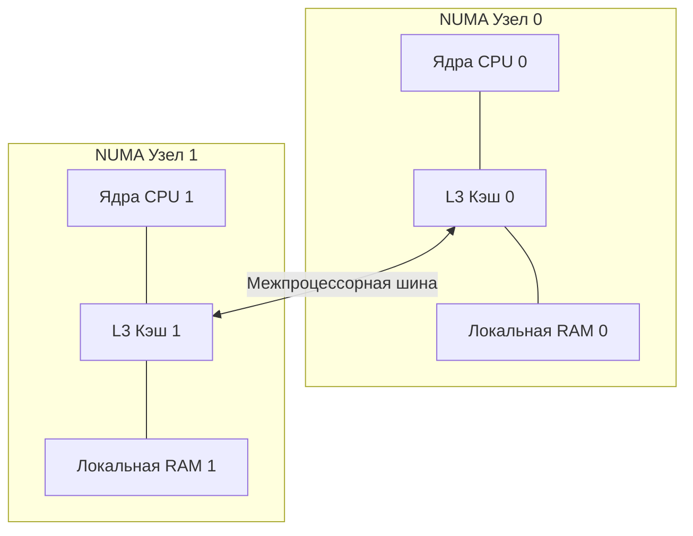

## Масштабирование внутри сервера

Когда мы говорим о производительности Go-приложения на сервере, мы часто оперируем понятием «количество ядер». Однако современный сервер — это не просто набор идентичных процессоров. Чтобы эффективно использовать железо, нужно понимать два фундаментальных механизма: как одно ядро может прикидываться двумя (**Hyper-Threading**) и почему доступ к разным плашкам оперативной памяти имеет разную цену (**NUMA**).

Эти знания — водораздел между Middle и Senior разработчиком при работе с высоконагруженными системами (Highload).

---

## Hyper-Threading (SMT: Simultaneous Multithreading)

Если вы посмотрите на вывод команды `lscpu` или `htop` на сервере, вы увидите «логические процессоры» (threads) и «физические ядра» (cores). Обычно их соотношение 2:1. Это результат технологии **Hyper-Threading** (термин Intel) или **SMT** (общий термин).

### Как это устроено внутри ядра
Физическое ядро CPU — это сложный конвейер с набором исполнительных блоков (АЛУ, блоки плавающей запятой, Load/Store блоки). В обычном режиме ядро выполняет один поток инструкций. Но, как мы знаем из статьи [[7. Ускорение CPU. Конвейеризация и Суперскалярность]], конвейер часто простаивает (например, из-за промаха по кэшу или ожидания данных из RAM).

**Hyper-Threading** дублирует на кристалле только «состояние» процессора:
1. Набор регистров общего назначения (RAX, RBX и т.д.).
2. Управляющие регистры (включая [[6. Цикл исполнения инструкции. Instruction Cycle|Program Counter]]).
3. Контроллер прерываний.

Однако **мускулы ядра** — АЛУ, FPU и кэши L1/L2 — остаются в единственном экземпляре и **разделяются** между двумя логическими потоками.

> [!info] Под капотом
> Процессор переключается между логическими потоками на аппаратном уровне почти мгновенно (за 0-1 такт). Если Поток А заблокирован в ожидании данных из памяти, ядро не простаивает, а немедленно начинает выполнять инструкции из Потока Б, используя свои свободные АЛУ.

> [!warning] Ловушка / Gotcha
> Hyper-Threading — это не бесплатное удвоение мощности. Он дает прирост производительности от 15% до 30% на задачах с частым ожиданием ввода-вывода или памяти. Но если ваша задача — это чистая математика (CPU-bound), два потока будут драться за одно АЛУ, что может привести к деградации производительности из-за накладных расходов на переключение.

---

## NUMA (Non-Uniform Memory Access)

В старых архитектурах (UMA) все процессоры были подключены к одной общей шине памяти. При росте количества ядер шина становилась «бутылочным горлышком». Решением стала архитектура **NUMA**.

### Топология системы
В NUMA-системе сервер делится на несколько **NUMA-узлов (Nodes)**. Каждый узел состоит из:
* Физического процессора (сокета).
* Набора локальных плашек оперативной памяти.
* Локальной шины ввода-вывода (PCIe).

Ядро из Узла 0 может обращаться к памяти в Узле 1, но для этого ему нужно пройти через специальную межпроцессорную шину (Intel UPI или AMD Infinity Fabric).

### Цена удаленного доступа
* **Local Access**: Обращение к RAM своего узла ($\approx$ 100 нс).
* **Remote Access**: Обращение к RAM чужого узла ($\approx$ 200-300 нс).

Разница в задержке (latency) может быть двукратной или трехкратной. Если ваш Go-сервис активно работает с памятью, «размазывание» данных по NUMA-узлам приведет к непредсказуемым тормозам.

---

## Mechanical Sympathy: Go и многоядерные серверы

Рантайм Go изначально проектировался как параллельный, но он не является полностью «NUMA-aware» из коробки. Вот что нужно знать:

### 1. GOMAXPROCS и логические ядра
По умолчанию переменная `GOMAXPROCS` равна количеству **логических** ядер. 
- Если ваше приложение делает много сетевых запросов и БД-вызовов, оставьте как есть (Hyper-Threading поможет скрыть задержки IO).
- Если вы пишете вычислительный сервис (например, сжатие видео или сложная математика), попробуйте установить `GOMAXPROCS` равным количеству **физических** ядер. Это исключит борьбу горутин за одни и те же АЛУ.

### 2. NUMA-эффект в Go
Go-рантайм выделяет память большими кусками (arenas). Если программа стартует на Ядре 0, большая часть кучи (heap) будет аллоцирована в локальной памяти Узла 0. 
Когда горутины перепрыгивают на Ядра из Узла 1 (а планировщик Go делает это постоянно ради балансировки нагрузки), они начинают работать с «удаленной» памятью.

> [!tip] Собеседование
> **Вопрос:** Как минимизировать влияние NUMA на производительность высоконагруженного Go-сервиса в Linux?
> **Ответ:** 
> 1. Использовать утилиту `numactl`. Например, `numactl --interleave=all` распределяет аллокации равномерно, что усредняет задержки и предотвращает переполнение одного узла.
> 2. В критических случаях применять **CPU Pinning** (привязку процесса к конкретному NUMA-узлу и его ядрам) через `numactl --cpunodebind=0 --membind=0`.
> 3. Использовать `GOMAXPROCS`, соответствующий размеру одного NUMA-узла, и запускать по одному экземпляру приложения на каждый узел.

### 3. Нагрузка на шину и Когерентность
Помните про [[13. Многоядерные процессоры и Когерентность кэшей|False Sharing]]? В NUMA-системе цена ложного разделения данных возрастает многократно. Инвалидация кэш-линии между ядрами разных сокетов вынуждена проходить через межпроцессорную шину, что может парализовать работу всей системы.

---

## Итог

1. **Hyper-Threading** — это эффективный способ заполнить простои конвейера, дублируя только «регистровое состояние» ядра.
2. **NUMA** — это способ масштабирования памяти, при котором расстояние от CPU до RAM становится физически разным.
3. **Для бэкенда**: на типичных веб-сервисах Hyper-Threading полезен. На тяжелых вычислительных задачах — может вредить.
4. **Для Highload**: всегда проверяйте топологию своих серверов (`lscpu`, `numactl -H`). Понимая, как распределены ядра и память, вы сможете выжать из железа максимум, избегая лишних походов через межпроцессорную шину.

В следующей статье мы разберем, как заставить процессор выполнять одну и ту же операцию над целым массивом данных одновременно: [[18. SIMD (Single Instruction, Multiple Data)]].