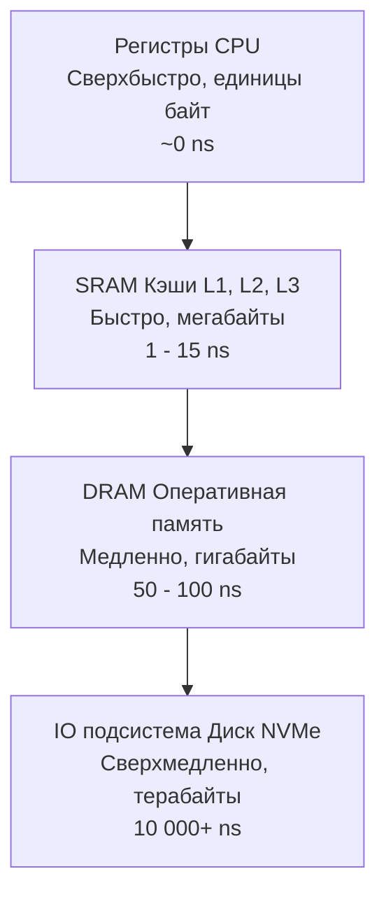

В предыдущих статьях мы восхищались вычислительной мощью процессора. Конвейеры, Out-of-Order движки и векторные SIMD-инструкции позволяют современному ядру выполнять десятки операций за один такт, перемалывая данные за доли наносекунды.

Но эта вычислительная мощь породила главный парадокс современной архитектуры, известный как **Стена памяти (Memory Wall)**.
Процессор может складывать числа в 100 раз быстрее, чем оперативная память способна их ему предоставить. Если процессор ждет данные, его конвейеры простаивают. До 80% времени работы типичного Go-бэкенда (например, парсинг JSON или обход мапы) процессор физически ничего не вычисляет — он просто ждет, пока нули и единицы доедут до него по проводам.

Почему нельзя сделать всю оперативную память такой же быстрой, как ядро CPU? Ответ кроется в физике и экономике.

## Ограничения физики: Скорость света и размер

Электрический сигнал в медном проводе распространяется со скоростью около 20 сантиметров за наносекунду.
Процессор, работающий на частоте 4 ГГц, выполняет один такт за **0.25 наносекунды**. За это время сигнал успевает пройти всего 5 сантиметров. 

Если планка вашей оперативной памяти (RAM) находится в 10 сантиметрах от процессора на материнской плате, сигналу потребуется несколько тактов процессора просто на то, чтобы физически дойти до чипа памяти, и еще столько же, чтобы вернуться обратно.

**Абсолютное правило железа:** Чем быстрее должна быть память, тем физически ближе она должна располагаться к вычислительному ядру ALU. Но площадь ядра (кристалла кремния) строго ограничена. Вы физически не можете разместить 64 Гигабайта памяти в миллиметре от транзисторов ALU.

Поэтому инженерам пришлось создать иерархию памяти — **Пирамиду**.



## SRAM против DRAM: Два архитектурных полюса

Чтобы построить пирамиду, инженеры используют фундаментально разные технологии производства памяти (о которых мы вскользь упоминали в [[4. Последовательностная логика. Учим кремний помнить]]).

### 1. SRAM (Static RAM) — Статическая память
Это память, построенная на базе сложных триггеров. Для хранения всего 1 бита требуется 6 транзисторов.
*   **Плюсы:** Работает со скоростью света. Не требует обновления. 
*   **Минусы:** Из-за 6 транзисторов на бит она занимает гигантскую физическую площадь на кристалле и стоит астрономических денег. 
*   **Где используется:** Встроена прямо в ядро процессора. Это ваши **Кэши L1, L2 и L3**. Максимальный объем в современных CPU — десятки мегабайт (иногда до сотен в серверных AMD EPYC с 3D V-Cache).

### 2. DRAM (Dynamic RAM) — Динамическая память
Использует всего 1 транзистор и 1 микроскопический конденсатор для хранения 1 бита.
*   **Плюсы:** Фантастическая плотность и низкая цена. На одной планке можно уместить 128 Гигабайт.
*   **Минусы:** Конденсаторы теряют заряд. Чтобы данные не исчезли, контроллер памяти должен считывать и перезаписывать (refresh) каждый бит тысячи раз в секунду. Это блокирует доступ к памяти и делает ее невероятно медленной. 
*   **Где используется:** Ваша основная **Оперативная память (RAM)**.

## Цена доступа (Latency)

Чтобы бэкенд-разработчик осознал масштаб проблемы, мы должны перевести наносекунды в "человеческое" время. Представьте, что 1 такт процессора (0.25 нс) — это **1 секунда** вашей жизни.

*   **Регистры:** 0-1 секунда. Данные прямо в ваших руках. Вы берете и вычисляете.
*   **Кэш L1 (SRAM):** 4 секунды. Данные лежат на столе перед вами.
*   **Кэш L2 (SRAM):** 14 секунд. Нужно встать и взять книгу с полки в этой же комнате.
*   **Кэш L3 (SRAM):** 60 секунд. Нужно сходить в соседний кабинет.
*   **Оперативная память (DRAM):** 5-7 минут! Вам нужно выйти из офиса, спуститься на лифте в архив, найти папку и вернуться.

Пока данные едут из оперативной памяти (DRAM), процессор мог бы выполнить **сотни** полезных инструкций (ILP/SIMD). Но вместо этого конвейер простаивает (Memory Stall).

> [!info] Под капотом: Аппаратная предвыборка (Prefetching)
> Процессоры не могут позволить себе ждать. Внутри кэшей работают аппаратные предсказатели (Prefetchers). Они наблюдают за тем, какие адреса вы запрашиваете. Если вы читаете массив: адрес 100, затем 104, затем 108 — Prefetcher понимает паттерн и отправляет запросы в медленную DRAM заранее, фоном подгружая адреса 112, 116 и далее прямо в L1. Когда ваш цикл дойдет до них, они уже будут лежать "на столе" с задержкой 1 нс. 

## Mechanical Sympathy: Как Пирамида управляет Go-кодом

Для программиста на Go пирамида памяти — это не просто абстракция железа. Это то, что объясняет работу Garbage Collector, Escape Analysis и правила написания идиоматичного кода.

### Стек против Кучи (Stack vs Heap)

В Go у каждой горутины есть свой **Стек (Stack)**. Он имеет фиксированный начальный размер (обычно 2 КБ) и хранит локальные переменные функции.
Также есть **Куча (Heap)** — глобальная область памяти для долгоживущих объектов, которой управляет Garbage Collector.

Почему все наставники по Go твердят: *"Избегайте аллокаций в куче, используйте стек"*? Думаете, только из-за сборщика мусора? Нет.

Стек горутины — это непрерывный, крошечный участок памяти. Поскольку процессор постоянно обращается к вершине стека (читая и записывая локальные переменные), этот кусок памяти **практически всегда аппаратно живет в сверхбыстром кэше L1 или L2 (SRAM)**.
Доступ к переменной на стеке стоит 1 наносекунду.

Когда переменная "убегает" в кучу (Escape Analysis перемещает её туда), аллокатор Go ищет для нее свободное место в глобальной памяти. Это место почти гарантированно отсутствует в кэше L1. При первом обращении к объекту в куче процессор получит Cache Miss и будет вынужден лезть в медленную **DRAM**, потратив 100 наносекунд.

Разница в скорости доступа к переменной на стеке и в куче может достигать 100 раз чисто физически!

### Указатели — враги производительности

Вторая фундаментальная проблема — **Погоня за указателями (Pointer Chasing)**.

> [!tip] Собеседование
> **Вопрос:** Вы передаете большую структуру `User` (128 байт) в функцию. Что быстрее: передать по значению `func Process(u User)` или по указателю `func Process(u *User)`?
> **Ответ:** Зависит от контекста, но очень часто **по значению быстрее**.
> Если вы передаете указатель, вы передаете всего 8 байт (через регистр, благодаря ABIInternal из [[10. ABI, Calling Convention и стек вызовов]]). Но когда функция попытается прочитать поле `u.Age`, процессор возьмет этот указатель и пойдет в медленную DRAM (штраф 100 нс). 
> Если вы передаете по значению, структура копируется аппаратно (часто с использованием SIMD). Копия ложится на стек функции, который гарантированно находится в кэше L1. Все дальнейшие обращения к полям `User` будут происходить молниеносно. 
> Кроме того, передача по указателю часто провоцирует Escape Analysis отправить исходную структуру в кучу.

Массив объектов (слайс значений) `[]User` — это сплошной блок памяти. Аппаратный Prefetcher процессора видит, как вы его читаете, и идеально загружает данные из DRAM в SRAM заранее.

Слайс указателей `[]*User` — это катастрофа для кэша. В массиве лежат только адреса. Сами структуры раскиданы по всей куче в случайных местах. Когда вы обходите такой слайс, Prefetcher сходит с ума — он не может предсказать, какой адрес будет следующим. Вы получаете промах в кэш и штраф в 100 нс на **каждой** итерации цикла.

```go
type Item struct { val int }

// Идеально для железа. Prefetcher работает. Данные в SRAM.
func processValues(items[]Item) {
    for _, item := range items {
        _ = item.val // Скорость ~1 ns
    }
}

// Кошмар для железа (Pointer Chasing). 
func processPointers(items[]*Item) {
    for _, item := range items {
        // item указывает на случайную область в DRAM. 
        // CPU простаивает, ожидая данные из оперативки.
        _ = item.val // Скорость ~100 ns
    }
}
```

## Итог

1. **Стена памяти** — физическое ограничение архитектуры. Процессор считает быстрее, чем получает данные из оперативной памяти.
2. Для обхода проблемы используется пирамида: от быстрых и маленьких **SRAM (Кэши L1/L2)** до больших и медленных **DRAM (ОЗУ)**.
3. Доступ к DRAM занимает в 100 раз больше времени (до 100 нс), чем доступ к L1 кэшу (1 нс).
4. Локальные переменные на стеке работают феноменально быстро, потому что они оседают в L1 кэше. Убегание в кучу (Heap) переносит данные в медленную DRAM.
5. Идиоматичный Go поощряет **Data Locality** — хранение данных в виде непрерывных массивов значений, а не указателей. Это позволяет железу (Prefetcher) скрывать задержки DRAM.

В этой статье мы часто использовали термин "Кэш", подразумевая его как волшебный мост между регистрами и RAM. Но как именно процессор понимает, какие байты из 64 Гигабайт оперативки нужно положить в 32 Килобайта L1 кэша? И почему неаккуратное выравнивание структур в Go может уничтожить эту магию? 
Ответы ждут нас в следующей статье: [[18. Кэши CPU. L1, L2, L3 и Cache Line]].