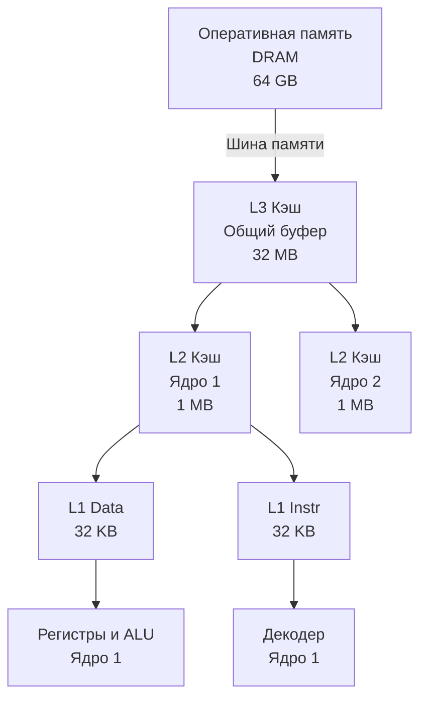

В статье [[17. Пирамида памяти. Регистры, SRAM, DRAM и цена доступа]] мы выяснили, что процессор физически не может быстро читать данные из гигантской оперативной памяти. Ему нужны промежуточные буферы — кэши, построенные на сверхбыстрой, но дорогой памяти SRAM.

Теперь мы заглянем внутрь этой кэш-иерархии. Для бэкенд-разработчика понимание того, как данные перемещаются между RAM и кэшем, — это грань между кодом, который "просто работает", и кодом, который выжимает 100% из железа.

## Анатомия кэш-иерархии

Современный многоядерный процессор имеет три уровня кэша. Чем ближе к вычислительному ядру (ALU), тем кэш меньше, но быстрее.

1. **L1 (Level 1):** Самый быстрый и самый маленький. Встраивается непосредственно в конвейер каждого физического ядра.
   *   Разделен на две части: **L1i** (для инструкций) и **L1d** (для данных). Такое разделение позволяет процессору одновременно читать машинный код на фазе Fetch и читать переменные на фазе Execute, не создавая конфликтов на шине.
   *   Размер: обычно 32–64 КБ на каждую часть.
   *   Задержка (Latency): ~1 наносекунда (3-4 такта).
2. **L2 (Level 2):** Универсальный буфер ядра.
   *   Хранит и данные, и инструкции вперемешку. Чаще всего он локальный для конкретного ядра, но в некоторых архитектурах может делиться между парой ядер.
   *   Размер: от 256 КБ до 1–2 МБ.
   *   Задержка: ~3–10 наносекунд (10-15 тактов).
3. **L3 (Level 3 / Last Level Cache, LLC):** Глобальный резервуар.
   *   Общий для **всех** ядер на кристалле (или для группы ядер в архитектуре Chiplet). Если одно ядро вычислило данные, а ОС перекинула горутину на другое ядро, горутина найдет свои данные в L3.
   *   Размер: от 16 МБ до гигантских объемов (до 768 МБ в серверных AMD EPYC 3D V-Cache).
   *   Задержка: ~10–20 наносекунд (40-60 тактов).



## Кэш-линия (Cache Line): Атомарная единица памяти

Здесь начинается самое важное для программиста.
Когда вы пишете в Go `b := a[0]` (где `a` — массив типа `byte`), процессор не идет в оперативную память за одним байтом. 

Процессоры вообще не умеют читать данные из оперативной памяти побайтово. Это было бы слишком накладно для контроллера памяти. Вместо этого процессор всегда запрашивает из RAM фиксированный блок памяти, который называется **Кэш-линия (Cache Line)**.

В 99% современных процессоров размер кэш-линии составляет **64 байта**.

Если вы запрашиваете 1 байт, процессор загружает этот байт и **еще 63 соседних байта** в кэш L1 одной транзакцией.
Это похоже на покупку яиц в магазине. Вам нужно одно яйцо для яичницы, но вы не можете купить его отдельно — вы покупаете целую упаковку из 10 штук и кладете в холодильник (кэш). Когда вам понадобится второе яйцо, вам больше не нужно идти в магазин — оно уже в холодильнике.

> [!info] Под капотом
> Кэш-линии всегда выровнены в памяти аппаратно. Оперативная память разбита на блоки по 64 байта: адреса `0x00` - `0x3F`, затем `0x40` - `0x7F` и так далее. Вы не можете загрузить кэш-линию, которая начинается, например, с адреса `0x08` и заканчивается на `0x47`. Процессор всегда загружает весь выровненный блок целиком.

Это явление называется **Пространственной локальностью (Spatial Locality)**. Железо исходит из предположения: если программист читает переменную, с вероятностью 99% следующей инструкцией он захочет прочитать данные, лежащие рядом с ней.

## Mechanical Sympathy: Пишем код с уважением к Cache Line

Размер кэш-линии в 64 байта означает, что она вмещает ровно **8 чисел типа `int64` или `float64`**.

Посмотрим, как это физическое ограничение влияет на скорость алгоритмов. Классическая задача на хардовых секциях собеседований — суммирование двумерной матрицы.

Чтобы избежать накладных расходов на указатели слайсов в Go (`[][]int`), высокопроизводительный код всегда "расплющивает" двумерную матрицу в одномерный слайс.

```go
package main

import (
	"testing"
)

const size = 4096

// Инициализация плоской матрицы
var matrix = make([]int64, size*size)

// Пример 1: Идиоматичный обход (по строкам)
func BenchmarkMatrixRow(b *testing.B) {
	for i := 0; i < b.N; i++ {
		var sum int64
		for y := 0; y < size; y++ {
			for x := 0; x < size; x++ {
				// Читаем элементы последовательно
				sum += matrix[y*size+x]
			}
		}
	}
}

// Пример 2: Плохой обход (по столбцам)
func BenchmarkMatrixColumn(b *testing.B) {
	for i := 0; i < b.N; i++ {
		var sum int64
		for x := 0; x < size; x++ {
			for y := 0; y < size; y++ {
				// Прыгаем по памяти
				sum += matrix[y*size+x]
			}
		}
	}
}
```

Если вы запустите этот бенчмарк, вы увидите, что **`BenchmarkMatrixRow` работает в 5-10 раз быстрее**, чем `BenchmarkMatrixColumn`. Алгоритмическая сложность абсолютно одинаковая — O(N²). Почему такая разница?

**Разбор `BenchmarkMatrixRow` (По строкам):**
1. Процессор читает `matrix[0]`. Происходит промах кэша (Cache Miss). 
2. Процессор запрашивает из RAM кэш-линию в 64 байта. Штраф ~100 наносекунд.
3. Кэш-линия содержит элементы от `matrix[0]` до `matrix[7]`.
4. Следующие 7 итераций внутреннего цикла (`matrix[1]`, `matrix[2]`...) отрабатывают со скоростью кэша L1 (~1 наносекунда), потому что данные уже там!
5. Эффективность использования памяти: 100%. Мы загрузили 64 байта и использовали все 64 байта.

**Разбор `BenchmarkMatrixColumn` (По столбцам):**
1. Процессор читает `matrix[0]`. Получаем Cache Miss.
2. Грузим из RAM кэш-линию с элементами `[0]`...`[7]`.
3. На следующей итерации внутреннего цикла `y` увеличивается на 1. Мы запрашиваем элемент `matrix[1 * 4096 + 0]` (индекс 4096).
4. Элемент с индексом 4096 лежит далеко за пределами нашей текущей кэш-линии. Снова получаем Cache Miss! Снова ждем 100 наносекунд.
5. Эффективность использования памяти: ~1.5%. Мы загнали по шине 64 байта, использовали только 8 из них, и тут же выбросили линию, чтобы загрузить новую. Мы заспамили шину памяти мусором.

> [!tip] Собеседование
> **Вопрос:** У нас есть слайс структур `[]User{ID int64, Age int64}` и мы хотим найти средний возраст всех пользователей. Будет ли этот код оптимально использовать кэш процессора?
> **Ответ:** Он будет использовать кэш-линии наполовину (50% полезной нагрузки). Каждая структура занимает 16 байт. В 64-байтную кэш-линию влезает 4 структуры `User`.
> Когда процессор читает `Age` первого пользователя, он загружает всю структуру (включая `ID`, который нам для расчета среднего не нужен). Половина пропускной способности шины тратится на загрузку ненужных `ID`. 
> В высоконагруженных системах (в СУБД вроде ClickHouse или игровых движках ECS) применяют паттерн **SoA (Struct of Arrays)**: вместо `[]User` делают `type Users struct { IDs []int64; Ages[]int64 }`. Тогда при итерировании по `Ages` процессор загрузит в кэш-линию 8 возрастов без лишнего мусора, утилизируя память на 100%.

## Ловушки выравнивания (Alignment)

Кэш-линия влияет и на то, как вы проектируете структуры. 
Представьте, что у вас есть структура `sync.Mutex`, которая защищает некие данные. Мьютекс внутри содержит счетчики и флаги (обычно занимает 8 байт). 

Если вы расположите два часто изменяемых, но логически независимых счетчика разных горутин в одной структуре рядом, они могут попасть в одну 64-байтную кэш-линию. Это вызовет катастрофу в многопоточной среде — **False Sharing** (мы подробно разберем этот хардкорный эффект и методы борьбы с ним в [[21. False Sharing и Cache Line Contention]]).

> [!warning] Ловушка / Gotcha: Интерфейсы и Cache Lines
> В Go часто используют слайс пустых интерфейсов `[]any` для хранения разнородных данных. 
> Внутри интерфейс — это два указателя (16 байт). В одну кэш-линию помещается 4 интерфейса.
> Но когда вы пытаетесь прочитать *значение*, лежащее за интерфейсом, процессор берет указатель и лезет в кучу. Сами значения раскиданы по памяти хаотично. 
> Даже если вы загрузили интерфейс за 1 наносекунду из L1, дереференсинг указателя в 99% случаев приведет к L3/DRAM Cache Miss. Использование интерфейсов в "горячих" циклах вычислений убивает пространственную локальность аппаратно.

## Итог

1. Кэш разбит на уровни: **L1** (сверхбыстрый, локальный), **L2** (быстрый буфер ядра), **L3** (большой, общий для всех ядер).
2. Процессор никогда не читает отдельные байты. Минимальная транзакция памяти — **Кэш-линия (Cache Line)** размером 64 байта.
3. **Пространственная локальность:** если вы прочитали байт, соседние 63 байта достанутся вам "бесплатно", со скоростью L1 кэша.
4. Случайные прыжки по памяти (чтение двумерных массивов по столбцам или обход указателей) уничтожают эффективность кэша, заставляя процессор простаивать в ожидании RAM.
5. Плоские слайсы простых значений — любимая структура данных современного процессора.

Но в этой статье осталась одна недосказанность. Если кэш L1 имеет размер 32 КБ (всего 512 кэш-линий), а оперативная память — 64 Гигабайта, как именно процессор понимает, в какую из 512 ячеек L1 положить линию из ОЗУ? Как происходит поиск? Эту важнейшую аппаратную концепцию, влияющую на микрооптимизации, мы изучим в следующей статье: [[19. Ассоциативность кэша, Prefetching и Cache Miss]].