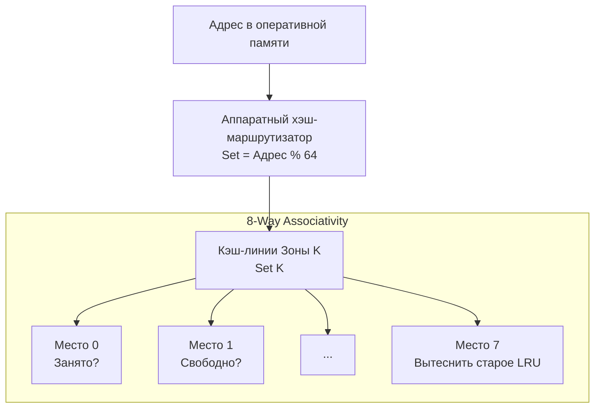

В статье [[18. Кэши CPU. L1, L2, L3 и Cache Line]] мы оставили один важный вопрос открытым. Размер L1 кэша составляет жалкие 32 КБ. Размер оперативной памяти — например, 64 ГБ. Минимальная единица обмена — кэш-линия на 64 байта.

Если процессор запрашивает блок памяти из гигантской RAM, как он понимает, в какую именно из 512 ячеек (32 КБ / 64 байта = 512 линий) кэша L1 нужно положить эти данные? А когда данные понадобятся снова, как он быстро найдет их среди этих 512 линий, не перебирая все по очереди?

Эта фундаментальная проблема поиска называется **Архитектурой маппинга кэша**.

## Ассоциативность кэша: Проблема парковки

Представьте, что кэш L1 — это парковка на 512 мест для машин (кэш-линий), приезжающих из огромного города (RAM). У нас есть три способа организовать правила парковки.

### 1. Direct-Mapped (Кэш прямого отображения)
Самый простой способ. Место на парковке жестко привязано к номеру дома (физическому адресу в RAM). Формула: `Место = Адрес % 512`.
*   **Плюс:** Молниеносный поиск (O(1) на уровне логических вентилей).
*   **Минус:** Ужасные коллизии. Если ваша Go-программа читает адрес `0` и адрес `32768` (которые дают одинаковый остаток от деления), они оба претендуют на Место №0. Процессор будет бесконечно вытеснять одну линию другой (это называется **Thrashing**), и скорость упадет до уровня медленной DRAM, даже если остальные 511 мест на парковке пустуют!

### 2. Fully Associative (Полностью ассоциативный кэш)
Машина может встать на *любое* свободное место. 
*   **Плюс:** Нет коллизий, место используется на 100%.
*   **Минус:** Чтобы найти машину, охраннику (аппаратному компаратору) нужно проверить номера на всех 512 местах одновременно. Сделать 512 параллельных проверок за 1 наносекунду требует огромного количества транзисторов и сильно греет процессор. В L1 кэше это физически невозможно.

### 3. N-Way Set Associative (N-канальный множественно-ассоциативный)
Современный компромисс. Инженеры разбили парковку на "зоны" (Sets). Например, 8-way кэш означает, что у нас есть 64 зоны (512 мест / 8).
Машина привязывается к зоне по формуле `Зона = Адрес % 64`, но внутри этой зоны она может занять *любое из 8 мест* (Ways).

Сегодня 99% процессоров используют **N-way Set Associative** кэши. L1 кэш обычно 8-way. Большой L3 кэш может быть 16-way.



## Правило Трех C: Анатомия Cache Miss

Когда процессор ищет данные в кэше и не находит их, происходит **Cache Miss** (Промах кэша). Архитекторы делят промахи на три категории (The 3 C's):

1. **Compulsory (Неизбежный/Холодный промах):** Процессор запрашивает данные в самый первый раз. Их физически никогда не было в кэше. Этого промаха избежать невозможно.
2. **Capacity (Промах вместимости):** Ваша программа (например, хэш-таблица на миллион элементов) просто слишком большая. Она физически не влезает в 32 КБ L1 кэша. Данные постоянно вытесняются, так как нет места.
3. **Conflict (Конфликтный промах):** Самый обидный промах. Место в кэше есть (например, занято только 10%), но алгоритм постоянно обращается к адресам, которые маппятся в один и тот же Set, переполняя его 8 мест и вытесняя полезные данные.

>[!warning] Ловушка / Gotcha: Проклятие степеней двойки
> Конфликтные промахи породили одну из самых коварных аппаратных ловушек в программировании.
> Если вы создадите в Go двумерную матрицу, размерность которой является точной степенью двойки (например, `[4096][4096]byte`), и начнете итерироваться по ней по столбцам, вы убьете производительность в 10 раз.
> Почему? Потому что элементы `matrix[0][0]`, `matrix[1][0]` и `matrix[2][0]` находятся в памяти с шагом ровно 4096 байт. Для N-way кэша адреса, кратные размеру кэша, маппятся в **один и тот же Set**. Вы моментально переполните 8 свободных мест (Ways) этого конкретного сета, вытесняя свои же данные, в то время как 63 остальных сета кэша останутся пустыми!
> *Решение (Padding):* Добавьте фиктивные элементы к строке `[4096][4160]byte`. Сдвиг адресов разрушит кратность, данные лягут в разные сеты кэша, и скорость восстановится. Мы детальнее коснемся выравнивания в [[25. Выравнивание данных, Padding и Struct Layout]].

## Prefetching: Железо предсказывает будущее

Мы сказали, что Compulsory Miss (холодный старт) неизбежен. Но современные процессоры научились обманывать и его.
Внутри контроллера кэша живет отдельный аппаратный блок — **Hardware Prefetcher (Аппаратный предвыборщик)**.

Prefetcher работает как молчаливый наблюдатель. Он анализирует адреса, которые ваша Go-программа запрашивает из памяти.

Если он видит, что вы запросили:
*   Кэш-линию `0x1000`
*   Затем кэш-линию `0x1040` (+64 байта)
*   Затем кэш-линию `0x1080` (+64 байта)

Prefetcher понимает: *"Ага! Программист итерируется по массиву вперед с шагом в 1 кэш-линию (Stride = 1)"*. 
Не дожидаясь, пока ваша программа дойдет до адреса `0x10C0` и получит Cache Miss, Prefetcher в фоновом режиме, пока процессор занят другой работой, **самостоятельно скачивает эту кэш-линию из RAM в L1**.

Когда ваша программа реально запрашивает этот адрес, данные уже ждут ее в L1 с задержкой 1 наносекунда. Штраф DRAM (100 нс) полностью скрыт!

> [!info] Под капотом: Границы страниц и Prefetcher
> Аппаратный Prefetcher достаточно умен, чтобы не сломать вашу ОС. Он **никогда** не переступает границу страницы памяти (обычно 4 КБ). Если массив заканчивается около границы страницы (например, `0x1FFF`), предвыборщик остановится. Если бы он шагнул дальше (на адрес `0x2000`), и эта страница не была бы выделена вашей программе, процессор вызвал бы исключение `Page Fault`, и программа бы упала. Это важнейший механизм изоляции, который мы изучим в [[27. Виртуальная память. Взгляд со стороны железа]].

## Mechanical Sympathy: Помогаем Prefetcher'у на Go

С точки зрения железа, код идеален, когда Prefetcher всегда угадывает следующий адрес памяти.
В Go для этого нужно соблюдать простое правило: **максимально использовать плоские слайсы значений**.

Но давайте посмотрим, когда Prefetcher сдается.

### 1. Pointer Chasing (Погоня за указателями)
В предыдущей статье мы упоминали эту проблему в контексте `[]*User`.
Когда вы итерируетесь по слайсу указателей:
1. Вы читаете адрес `0x9000` из слайса.
2. Процессор лезет в кучу по адресу `0x9000` за данными структуры.
3. На следующей итерации вы читаете адрес `0x7500` из слайса.
4. Процессор лезет по адресу `0x7500`.

Для Prefetcher'а это случайный шум. Шаг (Stride) непредсказуем. Предвыборка отключается. Вы собираете каждый Cache Miss за 100 наносекунд. Связные списки (`container/list`), деревья и графы — злейшие враги Prefetcher'а.

### 2. Шаг итерации больше размера кэш-линии
Даже плоский массив может обмануть Prefetcher, если вы итерируетесь по нему неправильно.

```go
type BigStruct struct {
	UsefulData int64 // 8 байт
	Padding    [248]byte // Мусор для раздутия размера (чтобы структура была 256 байт)
}

func sumUsefulData(items[]BigStruct) int64 {
	var sum int64
	for i := range items {
		sum += items[i].UsefulData
	}
	return sum
}
```

Здесь `items` — плоский непрерывный кусок памяти. Но каждая итерация прыгает на **256 байт вперед**. 
В некоторых процессорах (особенно старых) Prefetcher настроен на распознавание шагов только до +1 или +2 кэш-линий (64-128 байт). Гигантские прыжки могут сбить его с толку, и он решит, что вы делаете случайные чтения. Это приведет к тому, что он отключится, а пропускная способность шины (которая будет качать по 256 байт ради 8 полезных) рухнет.

> [!tip] Собеседование
> **Вопрос:** Если мы знаем, что Prefetcher не работает со связными списками, но бизнес-логика требует использования именно графов или деревьев с огромным количеством узлов-указателей, как ускорить код на Go?
> **Ответ:** Использовать **Arena Allocation** (или пулы памяти на базе плоских слайсов). 
> Вместо того чтобы создавать узлы через `new(Node)` (что раскидывает их по всей куче случайным образом), мы выделяем гигантский плоский массив: `arena := make([]Node, 10000)`.
> Новые узлы берутся из этой арены последовательно. Указатели `*Node` внутри графа теперь будут указывать на соседние адреса внутри плоского массива арены. При обходе графа (особенно в глубину, если узлы создавались последовательно) шансы, что данные окажутся в одной кэш-линии или будут пойманы Prefetcher'ом, кардинально возрастают.

## Итог

1. Чтобы отобразить гигантскую RAM на крошечный кэш, используется **N-Way Set Associativity**. Кэш бьется на наборы (Sets), в каждом из которых есть несколько мест (Ways). Это баланс между скоростью поиска и минимизацией коллизий.
2. Итерация по многомерным массивам с размерностью "степень двойки" вызывает **Conflict Miss**. Данные вытесняют сами себя из одного сета, пока остальные пустуют.
3. Процессор пытается угадать, какие данные вам понадобятся через мгновение с помощью **Prefetching**. 
4. Prefetcher работает только с предсказуемыми шагами по памяти. Плоские слайсы `[]struct` (где шаг постоянен) работают идеально. Разбросанные по куче интерфейсы и указатели отключают предвыборку и убивают производительность.

Мы изучили устройство памяти в рамках одного ядра процессора. Кэши, префетчинг, кэш-линии — всё это работает прозрачно и красиво. 
Но что произойдет, когда горутина на Ядре 1 запишет новые данные в свой локальный кэш L1, а горутина на Ядре 2 попытается прочитать эти же данные в ту же наносекунду? Чей кэш прав? 
Добро пожаловать в ад многопоточности на уровне железа. В следующей статье мы разберем механизм, который гарантирует целостность памяти в современном мире: [[20. Многоядерные процессоры и Cache Coherence]].