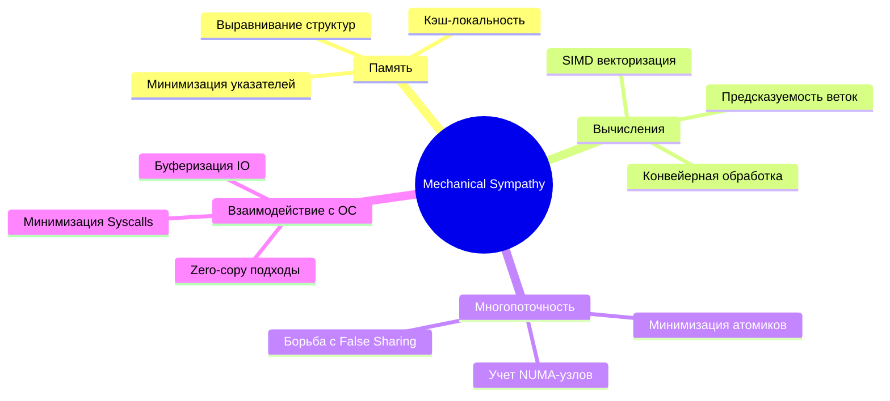

Это финальная статья первого раздела. Здесь мы объединяем все разрозненные знания о транзисторах, кэшах, конвейерах и NUMA-узлах в единую философию разработки, которая отличает выдающегося инженера от посредственного кодера.

---

## Что такое Mechanical Sympathy?

Термин **Mechanical Sympathy** (Механическая симпатия) ввел в ИТ-контекст Мартин Томпсон (создатель LMAX Disruptor). Он позаимствовал его у легендарного гонщика Формулы-1 Джеки Стюарта, который говорил: 

> «Вам не обязательно быть инженером, чтобы стать гонщиком, но вы должны понимать, как работает двигатель, коробка передач и подвеска, чтобы чувствовать машину и не сломать её на первом же круге».

В мире бэкенда на Go это означает: мы пишем код на языке с Garbage Collector и горутинами, но мы **чувствуем**, как этот код ложится на регистры, кэш-линии и системные вызовы.

## Три столпа «симпатии» в Go

На основе пройденного материала мы можем выделить три критические зоны, где знание архитектуры компьютера напрямую влияет на ваш код.

### 1. Память: Локальность важнее алгоритмов
Вы узнали про [[11. Пирамида памяти. SRAM, DRAM и цена доступа|Memory Wall]] и [[12. Кэши CPU (L1, L2, L3) и Кэш-линии|кэш-линии]]. 
*   **Вывод:** В 90% случаев в Go `slice` будет быстрее `map` или `linked list` при итерации, даже если теоретическая сложность $O(n)$ против $O(1)$.
*   **Действие:** Группируйте данные, которые используются вместе, в компактные структуры. Избегайте «указательной болезни» (pointer chasing).

### 2. CPU: Предсказуемость и Параллелизм
Вы изучили [[8. Предсказание ветвлений. Branch Prediction и Спекулятивное исполнение|предсказание ветвлений]] и [[13. Многоядерные процессоры и Когерентность кэшей|False Sharing]].
*   **Вывод:** Код с минимальным количеством `if/else` в горячих циклах работает быстрее не потому, что инструкций меньше, а потому, что конвейер CPU не сбрасывается.
*   **Действие:** В высоконагруженных многопоточных счетчиках используйте паддинг или шардирование, чтобы избежать «пинг-понга» кэш-линий между ядрами.

### 3. ОС и Железо: Цена абстракции
Вы поняли стоимость [[15. Аппаратные прерывания и Системные вызовы|системных вызовов]] и мощь [[16. IO подсистема и DMA (Direct Memory Access)|DMA]].
*   **Вывод:** Каждый `fmt.Println` или запись в файл без буфера — это поход в ядро ОС (Ring 0), который стоит тысячи тактов.
*   **Действие:** Используйте `bufio` и пакет `sync.Pool`. Относитесь к аллокациям памяти и системным вызовам как к самым дорогим операциям в вашей системе.

---

## Чек-лист Senior-инженера: Когда включать Mechanical Sympathy?

Не нужно оптимизировать каждый `Hello World`. Это приведет к **преждевременной оптимизации**. Используйте эти знания, когда:
1. Вы пишете **Hot Path** (участок кода, который выполняется миллионы раз в секунду).
2. Вы проектируете **инфраструктурный компонент** (библиотека логирования, драйвер БД, прокси-сервер).
3. Вы сталкиваетесь с **необъяснимыми задержками** (latency spikes), которые не видны в обычном профилировщике.



> [!info] Под капотом: Go и дизайн для железа
> Дизайн Go во многом способствует механической симпатии. В отличие от Java или Python, где почти всё — это указатель на объект в куче, Go дает вам **User-Defined Value Types**. Вы можете создать массив структур, который будет лежать в памяти одним плотным куском. Это дает Go колоссальное преимущество в производительности «из коробки», так как процессор обожает плотные массивы.

## Пример «Симпатичного» кода

Давайте сравним два подхода к обработке данных. Задача: просуммировать значения полей в большом массиве структур.

```go
package main

type Transaction struct {
	ID      int64
	Amount  int64
	Status  int32
	IsBlack bool
	// Кэш-линия 64 байта. Здесь еще много места для padding, 
	// если мы захотим избежать False Sharing в будущем.
}

// Подход 1: "Наивный"
func SumAmounts(txs []Transaction) int64 {
	var total int64
	for i := 0; i < len(txs); i++ {
		total += txs[i].Amount
	}
	return total
}

// Подход 2: "Симпатичный" (Loop Unrolling + Независимые аккумуляторы)
// Позволяет CPU использовать суперскалярность (выполнять сложения параллельно).
func SumAmountsSympathetic(txs []Transaction) int64 {
	var t1, t2, t3, t4 int64
	n := len(txs)
	for i := 0; i < n-3; i += 4 {
		t1 += txs[i].Amount
		t2 += txs[i+1].Amount
		t3 += txs[i+2].Amount
		t4 += txs[i+3].Amount
	}
	return t1 + t2 + t3 + t4
}
```

> [!tip] Собеседование
> **Вопрос:** Зачем понимать устройство CPU, если мы пишем на языке высокого уровня?
> **Ответ:** Язык дает абстракцию, но исполняет код железо. Знание архитектуры позволяет писать код, который «не спорит» с процессором. Например, знание о кэш-линиях позволяет проектировать структуры данных так, чтобы минимизировать промахи кэша, что может ускорить программу в 10-50 раз без изменения алгоритмической сложности $O(n)$.

---

## Итог раздела

Раздел «Архитектура компьютера» был фундаментом. Мы заложили понимание того, как работает «сцена», на которой разворачивается действие вашей программы. 

1. Мы поняли, что **память — это медленно**, а **CPU — это очень быстро**, и вся индустрия борется за то, чтобы сократить этот разрыв.
2. Мы узнали, что **параллелизм не бесплатен** (когерентность кэша, шина, NUMA).
3. Мы научились видеть за кодом на Go **реальные физические процессы**.

В следующем разделе **[[2. Устройство и работа ОС]]** мы поднимемся на уровень выше. Мы изучим «директора стадиона» — Операционную Систему. Мы разберем, как Linux управляет процессами, как работает виртуальная файловая система, и как именно ОС распределяет ресурсы между вашими горутинами.