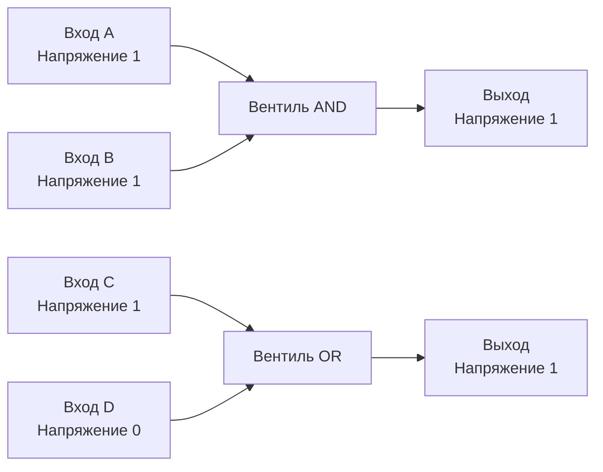

В предыдущей статье мы увидели путь программы от исходного текста до физического движения электронов. Теперь мы вооружимся микроскопом и спустимся на самый нижний, фундаментальный уровень железа.

Чтобы стать по-настоящему сильным инженером, который понимает, как работают атомарные операции, почему битовые маски такие быстрые и как проектируются высокопроизводительные системы, нужно забыть о строках, мапах и горутинах. На этом уровне существует только физика.

## Транзистор: Электрический кран

Вся современная вычислительная техника строится на **транзисторах**. 
Для нас, как инженеров-программистов, достаточно понимать транзистор как миниатюрный электрический переключатель. У него есть три главных контакта:
1. **Исток (Source)** — откуда приходит ток.
2. **Сток (Drain)** — куда ток должен уйти.
3. **Затвор (Gate)** — управляющий контакт.

Если мы подаем напряжение на *Затвор*, транзистор открывается, и ток течет от *Истока* к *Стоку*. Если убираем напряжение — транзистор закрывается, и цепь разрывается. Никакой магии, это просто микроскопический кран для электронов.

Современные процессоры (включая те, на которых работает ваш Go-код) состоят из миллиардов таких транзисторов (технология CMOS), переключающихся миллиарды раз в секунду.

## Биты: Абстракция над напряжением

Процессор не оперирует концепцией чисел "ноль" и "один". Внутри железа есть только **уровни напряжения**.

Чтобы кремний мог обрабатывать информацию, инженеры договорились о порогах:
*   Например, напряжение от `0V` до `0.4V` считается нулем (Low).
*   Напряжение от `0.8V` до `1.2V` считается единицей (High).

**Бит** — это минимальная единица информации, отражающая наличие (1) или отсутствие (0) нужного уровня напряжения на определенном проводе в конкретный момент времени.

## Логические вентили (Logic Gates)

Сам по себе транзистор не может ничего вычислить. Но если соединить несколько транзисторов вместе особым образом, они образуют **логические вентили** — базовые кирпичики, которые реализуют булеву логику аппаратно.

### 1. Вентиль NOT (Инвертор)
Принимает на вход `1` (высокое напряжение), а выдает `0` (низкое напряжение), и наоборот. Состоит всего из пары транзисторов.

### 2. Вентили AND (И) и OR (ИЛИ)
*   **AND:** Выдает `1` на выходе, только если на *обоих* входах `1`. Физически это транзисторы, соединенные последовательно (ток пройдет, только если оба открыты).
*   **OR:** Выдает `1`, если хотя бы на одном входе `1`. Транзисторы соединены параллельно.



> [!info] Под капотом
> На самом деле инженерам-схемотехникам проще и дешевле создавать вентили **NAND** (NOT AND) и **NOR** (NOT OR), так как они требуют меньше транзисторов. Вентиль NAND обладает свойством *функциональной полноты*: используя только миллионы элементов NAND, можно собрать процессор любой сложности, включая вентили AND, OR, XOR и даже ячейки памяти.

### 3. Вентиль XOR (Исключающее ИЛИ)
Выдает `1`, только если входы **разные** (один `0`, другой `1`).
Это важнейший вентиль для программистов. На нем держится криптография, алгоритмы хеширования и вся арифметика процессора (XOR — это базовый элемент сумматора, который мы рассмотрим в следующей статье).

## Mechanical Sympathy: Побитовые операции в Go

Зачем бэкендеру знать про вентили? Потому что логические вентили напрямую доступны вам в языке Go через **побитовые операторы**.

Когда вы пишете `a + b` или `a * b`, процессор прогоняет данные через сложные схемы сумматоров и умножителей. Но когда вы используете побитовые операции, данные фактически проходят через один слой базовых логических вентилей. Это **самые быстрые операции**, которые в принципе способен выполнить процессор (обычно выполняются за 1 такт).

### Побитовые операторы в Go и их отличия от C/C++

В Go есть стандартный набор операторов: `&` (AND), `|` (OR), `^` (XOR), `<<` (сдвиг влево), `>>` (сдвиг вправо).

> [!warning] Ловушка / Gotcha
> Если вы пришли из C, C++ или Java, будьте внимательны: в Go **нет** оператора `~` для побитового отрицания (NOT).
> Вместо этого в Go оператор `^` выполняет две роли:
> 1. Бинарный `a ^ b` — это XOR.
> 2. Унарный `^a` — это побитовое отрицание (NOT).
> 
> Кроме того, в Go есть уникальный оператор `&^` — "AND NOT" или сброс бита. Выражение `a &^ b` сбросит в нуле все биты переменной `a`, которые равны единице в переменной `b`.

### Практическое применение: Битовые маски (Bitmasks)

Битовые маски — это классический паттерн системного программирования. Вместо того чтобы хранить набор boolean-флагов в структуре (где каждый `bool` занимает 1 байт из-за ограничений выравнивания памяти), мы можем упаковать до 64 флагов в один `uint64`.

Go предоставляет элегантный механизм `iota` для создания масок:

```go
package main

import "fmt"

type Role uint8

const (
	RoleRead   Role = 1 << iota // 0001 (1)
	RoleWrite                   // 0010 (2)
	RoleDelete                  // 0100 (4)
	RoleAdmin                   // 1000 (8)
)

func main() {
	// Комбинируем права через побитовое ИЛИ (OR)
	var myRole = RoleRead | RoleWrite // 0011 (3)

	// Проверяем наличие права через побитовое И (AND)
	if myRole&RoleWrite != 0 {
		fmt.Println("Есть права на запись") // Выполнится
	}

	// Сбрасываем право через AND NOT (&^)
	myRole = myRole &^ RoleWrite // Останется только 0001 (RoleRead)

	// Переключаем право (Toggle) через XOR (^)
	myRole = myRole ^ RoleAdmin // Добавили Admin (1001)
	myRole = myRole ^ RoleAdmin // Убрали Admin (0001)
}
```

Это не просто микрооптимизация памяти. Битовые маски позволяют изменять состояние объекта атомарно с помощью инструкции процессора `CAS` (Compare-And-Swap), что является основой неблокирующей (lock-free) синхронизации.

> [!info] Под капотом
> Великолепный пример Mechanical Sympathy в исходниках Go — это структура `sync.Mutex`.
> Внутри мьютекса нет сложных объектов. Его состояние хранится в одной переменной `state int32`.
> Младший бит указывает, заблокирован ли мьютекс (`mutexLocked = 1 << iota`).
> Второй бит указывает, проснулась ли горутина (`mutexWoken`).
> Третий — находится ли мьютекс в режиме голодания (`mutexStarving`).
> Остальные 29 бит хранят количество горутин, ожидающих в очереди.
> 
> Управление всем этим сложным состоянием происходит исключительно через побитовые сдвиги `<<`, логические вентили `|`, `&^` и атомарные процессорные инструкции!

> [!tip] Собеседование
> **Вопрос:** Дан массив целых чисел, где все числа встречаются ровно дважды, кроме одного уникального. Как найти это число за O(n) времени и O(1) памяти?
> **Ответ:** Использовать вентиль XOR.
> Свойства XOR: 
> 1. `A ^ A = 0` (любое число XOR само себя равно нулю).
> 2. `A ^ 0 = A`.
> 3. Порядок операций не важен (коммутативность).
> Если применить XOR ко всем элементам массива последовательно, все парные числа уничтожат друг друга (превратятся в 0), и в результате останется только уникальное число.
> 
> Кстати, на уровне ассемблера компиляторы Go очищают регистры именно через XOR: `XOR EAX, EAX`. Это быстрее, чем инструкция `MOV EAX, 0`, так как не требует чтения нуля из памяти инструкций и не использует шину данных.

## Итог

1. **Транзисторы** — это физические переключатели, реагирующие на наличие или отсутствие напряжения.
2. **Логические вентили (AND, OR, XOR, NOT)** — это комбинации транзисторов, реализующие базовые правила булевой логики прямо в кремнии.
3. Побитовые операции в Go (`&`, `|`, `^`, `&^`, `<<`) — это прямой, неабстрагированный доступ к логическим вентилям процессора. Они обладают феноменальной скоростью.
4. Умение упаковывать состояния в битовые маски критически важно для написания lock-free кода и высокопроизводительных систем, подобных самому рантайму Go.

Теперь мы знаем, как кремний может применять логику к одному или нескольким битам. Но как заставить эту логику складывать числа? В следующей статье мы объединим вентили в сложные архитектуры и разберем: [[3. Комбинационная логика. Учим кремний считать]].