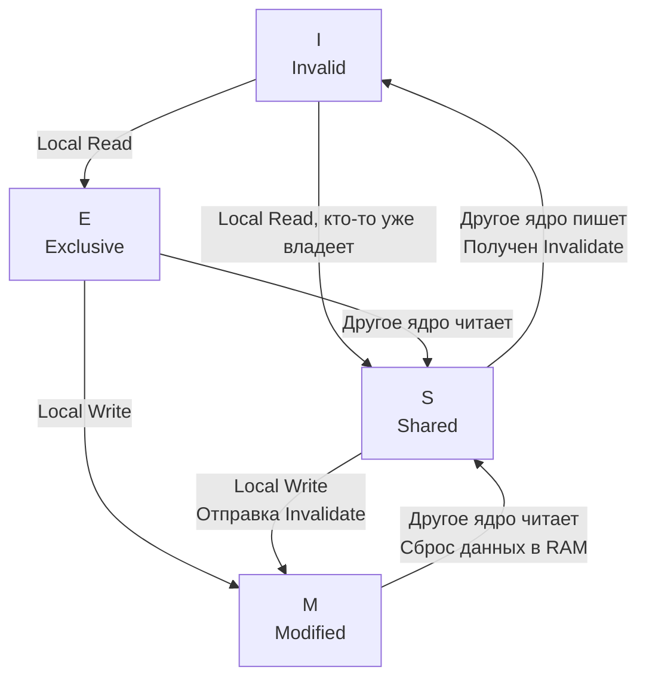

В статье [[18. Кэши CPU. L1, L2, L3 и Cache Line]] мы разобрали, как ядро процессора использует свой локальный кэш L1 для молниеносного доступа к данным. Для одноядерного процессора этой модели было бы достаточно. 

Но современные серверы, на которых крутятся наши Go-бэкенды, имеют 16, 32, 64 и больше физических ядер. В Go модель планировщика (M-P-G) распределяет ваши горутины по всем доступным аппаратным потокам.

Представьте ситуацию:
1. Горутина `A` работает на Ядре 1. Она читает глобальную переменную `Counter` (равную 0) из оперативной памяти в свой локальный кэш L1.
2. Горутина `B` работает на Ядре 2. Она тоже читает `Counter` в свой кэш L1.
3. Горутина `A` увеличивает `Counter` до 1. Изменение сохраняется в L1 кэше Ядра 1.

Что теперь находится в L1 кэше Ядра 2? Там остался старый 0. Данные рассинхронизировались. Если Ядро 2 попытается прочитать `Counter`, оно получит устаревший мусор. 

Чтобы этот хаос не разрушил всю логику многопоточного программирования, создатели железа внедрили механизм, который делает синхронизацию кэшей полностью прозрачной для программиста. Этот механизм называется **Когерентностью кэшей (Cache Coherence)**.

## Аппаратная магия: Протокол MESI

Процессор не позволяет кэшам жить своей жизнью. Все кэши L1 и L2 всех ядер постоянно общаются друг с другом через специальную внутреннюю сеть (Ring Bus или Mesh-сеть). 

Они используют протоколы когерентности, золотым стандартом которых является **MESI**. Название протокола — это аббревиатура из четырех состояний, в которых может находиться каждая отдельная кэш-линия (те самые 64 байта):

*   **M (Modified - Изменена):** Линия находится *только в этом* кэше L1. Ядро изменило её, и теперь она отличается от данных в медленной оперативной памяти (DRAM). Это ядро — единоличный владелец свежих данных.
*   **E (Exclusive - Эксклюзивна):** Линия находится *только в этом* кэше L1, но она чистая (полностью совпадает с DRAM). Ядро может мгновенно менять её без спроса у остальных.
*   **S (Shared - Общая):** Линия находится в кэшах нескольких ядер. Она чистая (совпадает с RAM). Ядра могут читать её сколько угодно, но **ни одно ядро не имеет права её изменять**.
*   **I (Invalid - Недействительна):** В этой кэш-линии лежит мусор. Другое ядро изменило эти данные, и текущему ядру запрещено их читать. Если данные понадобятся, их придется запрашивать заново.

### Как это работает в динамике

Давайте проследим за жизненным циклом переменной в нашем примере с двумя ядрами:

1. **Чтение Ядром 1:** Ядро 1 читает `Counter`. Ни у кого больше его нет. Линия получает статус **E (Exclusive)**.
2. **Чтение Ядром 2:** Ядро 2 тоже запрашивает `Counter`. Ядро 1 слышит этот запрос (Snooping) по шине процессора. Оно отвечает: "У меня есть эта линия, давай читать вместе". У обоих ядер статус линии меняется на **S (Shared)**.
3. **Запись Ядром 1:** Ядро 1 хочет сделать `Counter++`. Оно видит, что линия в статусе **S**. Просто так писать нельзя! 
   * Ядро 1 отправляет по шине широковещательный сигнал: *"Всем Внимание! Invalidate Counter!"*.
   * Ядро 2 получает сигнал и послушно помечает свою кэш-линию как **I (Invalid)**. 
   * Ядро 2 отправляет подтверждение (ACK) обратно Ядру 1.
   * Дождавшись ответа, Ядро 1 переводит свою линию в статус **M (Modified)** и записывает туда `1`.

> [!info] Под капотом: Snooping vs Directory
> В процессорах Intel Core до 10-го поколения использовался механизм **Snooping (Прослушивание)**. Все ядра были подключены к одной кольцевой шине (Ring Bus). Каждое ядро буквально "слушало" все запросы, летающие по кольцу. 
> В современных серверных процессорах (AMD EPYC, Intel Xeon Scalable) ядер слишком много — кольцо стало бы узким местом. Там используется **Directory-based Coherence**. Создается специальный аппаратный справочник (Каталог), который знает, у какого ядра в статусе M, S или E находится каждая кэш-линия. Вместо того чтобы кричать всем, ядро отправляет точечный Invalidate-сигнал только тем ядрам, которые указаны в каталоге.

## Mechanical Sympathy: Цена Invalidate-шторма

Мы подошли к критическому моменту для бэкенд-разработчика. 
Насколько "бесплатно" работают мьютексы (`sync.Mutex`) или атомики (`atomic.AddInt64`) в Go?

**Чтение общих данных (Shared) абсолютно бесплатно.** Если 100 горутин на 100 ядрах читают один и тот же конфиг, все 100 кэшей L1 имеют статус **S**. Процессор работает на максимальной скорости.

**Запись общих данных — это катастрофа для производительности.**
Когда вы делаете `atomic.AddInt64(&counter, 1)`, аппаратно происходит отправка Invalidate-сигнала. Электрическому сигналу нужно добежать до других ядер и получить от них ACK. 
Эта процедура занимает около **40-60 наносекунд**. На это время конвейер процессора полностью останавливается (Stall).

Если две горутины на разных ядрах пытаются в цикле инкрементировать один и тот же счетчик, возникает **Cache Line Ping-Pong (Пинг-Понг кэш-линий)**. Кэш-линия бесконечно переходит из статуса M на Ядре 1 в статус M на Ядре 2, пролетая по шине туда-сюда. Ядра тратят 99% времени на общение друг с другом по протоколу MESI, а не на полезные вычисления. Производительность падает в десятки раз.

> [!tip] Собеседование
> **Вопрос:** В коде есть `sync.RWMutex`. У нас 100 горутин, которые только читают данные, вызывая метод `RLock()`. Писателей нет вообще. Будет ли этот код масштабироваться по ядрам?
> **Ответ:** Нет, он будет деградировать при добавлении новых ядер! 
> Под капотом метод `RLock()` использует атомарный инкремент счетчика читателей (`atomic.AddInt32`). Атомарный инкремент — это **запись** в память. 
> Каждая из 100 горутин на своем ядре пытается записать новое значение счетчика в `RWMutex`. Протокол MESI сходит с ума, генерируя Invalidate-шторм для этой кэш-линии. Мьютекс будет летать между кэшами ядер (Ping-Pong). Для сверхнагруженных read-only сценариев классический `RWMutex` в Go — это антипаттерн (в таких случаях используют copy-on-write структуры, партиционирование или `atomic.Pointer`).

## Когерентность vs Консистентность (Память не багует)

Важно не путать две концепции.
*   **Когерентность (Cache Coherence)** — гарантирует, что для *одной конкретной переменной* (одного адреса) все ядра видят одинаковое, актуальное значение. Протокол MESI решает эту задачу аппаратно на 100%. Вы никогда не прочитаете из L1 устаревший мусор, если другое ядро уже перезаписало этот байт.
*   **Консистентность / Модель памяти (Memory Consistency)** — описывает, в каком порядке ядра видят изменения в *разных* переменных (мы разберем это в [[22. Memory Ordering и Memory Model CPU]]).

## Итог

1. **Когерентность кэшей** — аппаратный механизм, делающий многоядерность невидимой для прикладного программиста. Он гарантирует, что кэши разных ядер не рассинхронизируются.
2. **Протокол MESI** — классический алгоритм когерентности. Кэш-линия может быть Modified (Изменена), Exclusive (Эксклюзивна), Shared (Общая) или Invalid (Недействительна).
3. **Чтение данных** (Shared) невероятно масштабируется. Все ядра работают из своих L1.
4. **Запись данных** обходится дорого. Ядру приходится рассылать Invalidate-сигналы по шине, заставляя другие кэши сбрасывать свои линии. Это занимает десятки наносекунд.
5. Атомики и мьютексы в Go под капотом неизбежно вызывают переходы состояний MESI и Invalidate-штормы, если за них идет конкуренция.

Но MESI таит в себе одну из самых страшных и неочевидных ловушек параллельного программирования. 
Протокол оперирует не переменными `int32` или `bool`, а целыми 64-байтными кэш-линиями! Что произойдет, если Ядро 1 пишет в переменную `A`, а Ядро 2 пишет в переменную `B`, и они логически никак не связаны, но случайно оказались рядом в памяти? Железо начнет беспощадно тормозить ваш код на ровном месте. 
Этот эффект называется Ложным разделением, и мы научимся его побеждать в следующей статье: [[21. False Sharing и Cache Line Contention]].