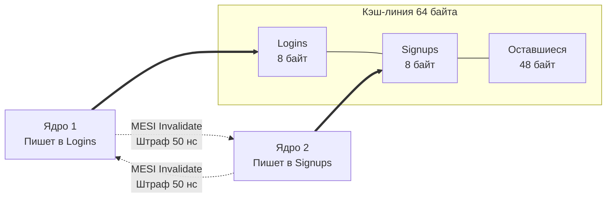

В статье [[20. Многоядерные процессоры и Cache Coherence]] мы выяснили, что кэши разных ядер процессора общаются между собой по протоколу MESI, чтобы поддерживать консистентность памяти. Когда одно ядро изменяет данные, оно рассылает Invalidate-сигнал, заставляя другие ядра сбросить свои локальные копии и простаивать в ожидании свежих данных из RAM или L3.

Проблема в том, что протокол MESI оперирует не отдельными переменными, а **целиком кэш-линиями по 64 байта**. 

Из-за этого архитектурного компромисса возникает один из самых коварных багов производительности в многопоточном программировании — **Ложное разделение (False Sharing)**.

## Что такое False Sharing?

Представьте структуру в Go, которая хранит метрики вашего бэкенда:

```go
type Metrics struct {
	Logins  uint64 // 8 байт
	Signups uint64 // 8 байт
}
```

Размер этой структуры — 16 байт. Она идеально помещается в одну 64-байтную кэш-линию. 

У нас есть два физических ядра:
*   Горутина на **Ядре 1** постоянно инкрементирует `Logins` (например, обрабатывает поток авторизаций).
*   Горутина на **Ядре 2** постоянно инкрементирует `Signups` (обрабатывает поток регистраций).

С точки зрения логики приложения (софта), эти две горутины **абсолютно независимы**. Они пишут в разные переменные. Им не нужны мьютексы. Race Detector в Go скажет, что гонок данных нет. Код выглядит идеально параллельным.

Но с точки зрения железа происходит катастрофа:
1. Ядро 1 читает `Logins` и загружает **всю кэш-линию** в свой L1 в статусе Exclusive (E).
2. Ядро 2 хочет инкрементировать `Signups`. Оно запрашивает ту же самую кэш-линию. Обе линии переходят в статус Shared (S).
3. Ядро 1 делает `Logins++`. Оно отправляет Invalidate-сигнал Ядру 2, уничтожая его кэш-линию, переводит свою линию в Modified (M) и выполняет сложение.
4. В следующую наносекунду Ядро 2 хочет сделать `Signups++`. Оно получает Cache Miss (так как Ядро 1 инвалидировало его кэш), вытягивает линию у Ядра 1 обратно к себе, отправляя Invalidate-сигнал Ядру 1!



Этот процесс называется **Cache Line Ping-Pong (Пинг-понг кэш-линии)**. Горутины не имеют общей логики, но они дерутся за один и тот же физический кусок кремния. 
Процессоры будут тратить 99% времени на пересылку MESI-сообщений по шине данных. Скорость упадет до уровня медленной оперативной памяти (а иногда и хуже), убивая всю идею многоядерности.

## Разрушители кэша: Слайсы метрик

Вторая классическая ошибка, с которой сталкиваются Middle+ разработчики, — попытка оптимизировать конкурентность через создание "персональных" счетчиков для каждого ядра (или воркера).

```go
// Массив счетчиков, по одному на каждого воркера
// Предполагаем, что GOMAXPROCS = 8
counters := make([]int64, 8) 

for i := 0; i < 8; i++ {
	go func(workerID int) {
		for {
			// Воркер пишет ТОЛЬКО в свой личный индекс.
			// Никаких мьютексов!
			counters[workerID]++ 
		}
	}(i)
}
```

Разработчик думает: *"Я разнес данные! Каждый воркер пишет только в свой элемент массива, они независимы!"*
А теперь считаем байты: `int64` занимает 8 байт. Массив из восьми `int64` занимает ровно **64 байта**. 
**Все 8 счетчиков лежат в одной кэш-линии!**

Когда 8 ядер одновременно пытаются инкрементировать свои личные счетчики, они генерируют непрерывный шторм Invalidate-сигналов (Cache Line Contention) на всю шину процессора. Производительность этого кода на 8 ядрах будет **хуже**, чем если бы этот код выполнялся на одном ядре!

> [!info] Под капотом
> Аппаратные профилировщики (например, `perf c2c` в Linux) умеют находить False Sharing. Они анализируют счетчики процессора на события HITM (Hit Modified) — это ситуация, когда ядро запрашивает кэш-линию, а она находится в измененном (Modified) состоянии в другом ядре. Если вы видите высокий процент HITM на адресах структуры, которая логически не должна расшариваться, вы поймали False Sharing.

## Mechanical Sympathy: Решение через Padding

Чтобы победить Ложное разделение, нужно физически растащить переменные по разным кэш-линиям. Для этого в структуру вставляют "мусорные" байты — этот прием называется **Padding (Дополнение)**.

### Способ 1: Ручной паддинг

```go
type PaddedMetrics struct {
	Logins  uint64
	// Вставляем 56 пустых байт (64 - 8). 
	// Теперь следующая переменная гарантированно начнется в новой кэш-линии.
	_       [56]byte 
	Signups uint64
}
```

### Способ 2: Идиоматичный Go (sys/cpu)

В Go есть стандартный, элегантный способ делать паддинг. В пакете `golang.org/x/sys/cpu` существует специальный тип `CacheLinePad`. Под капотом это просто структура `struct{ _ [64]byte }`.

```go
import "golang.org/x/sys/cpu"

type Metrics struct {
	Logins  uint64
	_       cpu.CacheLinePad // Жесткий барьер между кэш-линиями
	Signups uint64
}
```

Теперь `Logins` занимает первые 8 байт кэш-линии №1 (остальные 56 байт остаются пустыми). `CacheLinePad` занимает 64 байта. `Signups` начинается в кэш-линии №3. 
Ядро 1 и Ядро 2 больше не пересекаются аппаратно. MESI-шторм прекращается, и код ускоряется в 5–10 раз.

> [!tip] Собеседование
> **Вопрос:** Если паддинг так сильно ускоряет независимые переменные, почему компилятор Go не вставляет `[64]byte` между всеми полями структур автоматически?
> **Ответ:** Это уничтожит пространственную локальность (Spatial Locality) и приведет к фрагментации памяти!
> Помните статью [[18. Кэши CPU. L1, L2, L3 и Cache Line]]? В 99% случаев мы, наоборот, хотим, чтобы поля одной структуры лежали максимально плотно. Если горутина читает `User.Name` и `User.Age`, мы хотим получить оба поля за один Cache Miss. Паддинг нужен **исключительно** для разделения горячих счетчиков (Hot Variables), которые постоянно и конкурентно перезаписываются разными ядрами. Использовать его везде — значит убить L1 кэш раздутыми пустыми структурами.

## Как False Sharing решен в исходниках Go

Стандартная библиотека Go изобилует примерами Mechanical Sympathy. Авторы рантайма прекрасно понимают законы работы MESI.

Отличный пример — структура `sync.Pool`.
Под капотом `sync.Pool` использует отдельные локальные пулы для каждого логического процессора `P` (из модели G-M-P). Массив этих локальных пулов выглядит так:

```go
// Упрощенный код из src/sync/pool.go
type poolLocal struct {
	poolLocalInternal

	// Дополняем до 128 байт, чтобы предотвратить False Sharing.
	// Используем 128 байт, потому что аппаратные предвыборщики (Prefetchers)
	// часто тянут по две кэш-линии (64 + 64) за раз!
	pad[128 - unsafe.Sizeof(poolLocalInternal{})%128]byte
}
```

Обратите внимание на цифру **128 байт**. В предыдущей статье мы говорили, что Prefetcher пытается угадать следующий шаг и грузит данные заранее. Если он ошибется, он может случайно затянуть соседнюю кэш-линию, спровоцировав ложное разделение даже через границу 64 байт! Поэтому разработчики Go используют двойной размер (128 байт), чтобы гарантированно изолировать пулы друг от друга даже от самых агрессивных префетчеров.

Другой пример — генератор случайных чисел `math/rand/v2`. В новой версии разработчики Go встроили отдельное глобальное состояние для каждого процессора `P`, щедро сдобрив его паддингами, чтобы конкурентные вызовы `rand.Int()` на разных ядрах больше не лочились на одном мьютексе и не боролись за кэш-линии.

## Итог

1. **False Sharing (Ложное разделение)** — ситуация, когда два ядра конкурентно изменяют независимые переменные, случайно оказавшиеся в одной 64-байтной кэш-линии.
2. Протокол MESI слепо инвалидирует кэш-линии целиком, вызывая "Ping-Pong" между ядрами и снижая производительность до уровня оперативной памяти.
3. Массив счетчиков (например, слайс `[]int64`), обновляемый конкурентно, — это классическая ловушка ложного разделения.
4. **Решение (Padding):** Вставка пустых байт `_ [64]byte` или `cpu.CacheLinePad`, чтобы физически разнести горячие переменные по разным кэш-линиям.
5. Применять паддинг нужно точечно. Бездумное раздутие структур убьет полезную пространственную локальность и забьет L1 кэш мусором (подробнее о правильной упаковке обычных данных мы поговорим в [[25. Выравнивание данных, Padding и Struct Layout]]).

Мы разобрались, почему кэши должны быть когерентными, и к чему приводят ссоры ядер на аппаратном уровне. Но MESI-протокол гарантирует лишь то, что значения не "прокиснут".
Однако он **не гарантирует**, в каком порядке ядра увидят эти изменения! Процессор может переставлять ваши записи и чтения местами. О том, почему железо ломает логику выполнения, и как с этим борются механизмы языка, — в следующей статье: [[22. Memory Ordering и Memory Model CPU]].