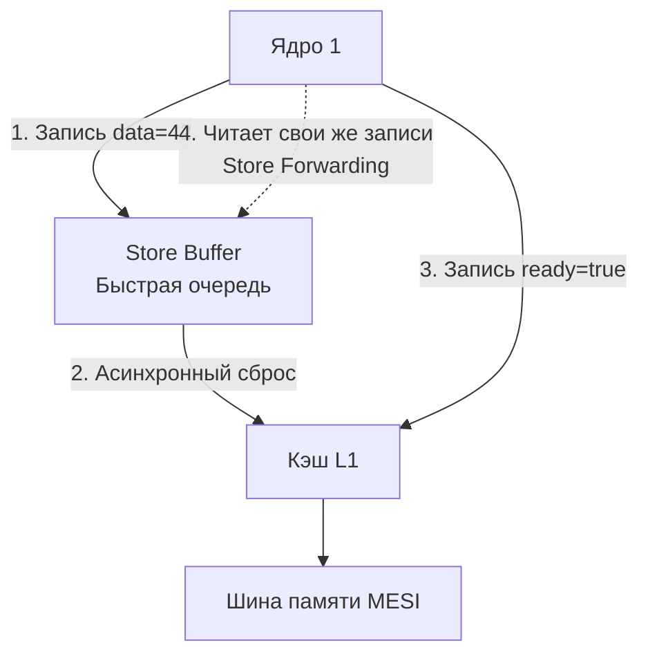

В статье [[21. False Sharing и Cache Line Contention]] мы разобрали протокол MESI, который гарантирует когерентность (согласованность) кэшей. Если Ядро 1 изменило значение переменной, MESI гарантирует, что Ядро 2 в конечном итоге увидит это новое значение, а не устаревший мусор.

Но здесь кроется гигантская иллюзия, на которой спотыкаются 90% разработчиков при переходе к lock-free программированию. 

MESI гарантирует, что значение обновится. **Но он ничего не говорит о том, в каком ПОРЯДКЕ другие ядра увидят изменения нескольких независимых переменных.**

Процессор, компилятор и подсистема памяти имеют полное право переставлять ваши инструкции местами. Эта концепция называется **Memory Ordering (Порядок доступа к памяти)**.

## Иллюзия последовательного исполнения

Посмотрим на классический пример передачи данных между двумя горутинами без мьютексов (Message Passing):

```go
var data int
var ready bool

// Горутина 1 (Писатель - Ядро 1)
func producer() {
	data = 42       // Операция A
	ready = true    // Операция B
}

// Горутина 2 (Читатель - Ядро 2)
func consumer() {
	for !ready {    // Операция C: крутимся (spin), пока ready != true
		// ждем
	}
	fmt.Println(data) // Операция D: читаем data
}
```

С точки зрения программиста, алгоритм железобетонный:
1. Мы пишем `42` в `data`.
2. Мы поднимаем флаг `ready = true`.
3. Читатель видит флаг и выводит `42`.

Может ли этот код вывести **0**? 
Да. И это не баг железа или компилятора. Это спецификация.

## Почему происходит Reordering (Переупорядочивание)?

Перестановка операций (Reordering) происходит на двух уровнях.

### 1. Оптимизация компилятора
Компилятор Go видит `producer()`. Он анализирует переменные `data` и `ready`. Они никак не зависят друг от друга (это не `data = 42; data = data + 1`). Для оптимизации времени выполнения (например, для лучшей утилизации регистров) компилятор имеет полное право поменять их местами и сгенерировать машинный код, где сначала `ready = true`, а уже потом `data = 42`.

### 2. Аппаратная перестановка (Hardware Reordering) и Store Buffer
Но даже если мы заставим компилятор не трогать код (или напишем его на чистом ассемблере), код всё равно сломается на уровне железа. 

Вспомним цену записи. Чтобы записать `data = 42`, Ядро 1 должно разослать Invalidate-сигнал по шине MESI и дождаться ответа. Это 50 наносекунд. Процессор не будет ждать! 
Вместо этого он помещает операцию записи в специальную аппаратную очередь — **Store Buffer (Буфер записи)**, и мгновенно переходит к следующей инструкции.



**Сценарий катастрофы:**
1. Ядро 1 хочет записать `data = 42`. Кэш-линия с `data` занята другим ядром. Запись откладывается в **Store Buffer**.
2. Ядро 1 хочет записать `ready = true`. Кэш-линия с `ready` уже находится в L1 этого ядра в статусе Exclusive. Запись в L1 происходит **мгновенно**.
3. Ядро 2 читает `ready`. По шине MESI оно получает свежее значение `true`.
4. Ядро 2 выходит из цикла и читает `data`.
5. Значение `42` всё еще лежит в Store Buffer Ядра 1! Оно еще не доехало до кэша.
6. Ядро 2 читает старое значение `data` из RAM, получает **0** и выводит его на экран.

Ваш код выполнился задом наперед.

## Memory Models: x86-64 против ARM64

Способность процессора аппаратно переставлять инструкции описывается его **Моделью памяти (CPU Memory Model)**. 
Это контракт между создателями железа и программистами. Разные архитектуры (ISA) имеют разные контракты.

> [!tip] Собеседование
> **Вопрос:** Мы перенесли наш старый монолит на Go с серверов Intel на новые инстансы AWS Graviton (или запускаем локально на Apple M3). Код компилируется без ошибок, но в продакшене начали сыпаться странные плавающие баги с гонками данных, которых никогда не было на Intel. В чем причина?
> **Ответ:** Причина в смене аппаратной модели памяти с "Сильной" на "Слабую". Ваш код всегда был с багами (содержал Data Races), но архитектура x86 прощала эти ошибки, а ARM64 их обнажила.

### 1. Сильная модель (Strong Memory Model) — x86-64 (Intel / AMD)
Эта модель называется **TSO (Total Store Order)**. 
Процессоры x86 очень консервативны. Им **ЗАПРЕЩЕНО** переставлять две записи (Store-Store) или два чтения (Load-Load) местами. 
Единственная перестановка, которую позволяет x86, — это **Store-Load** (положить запись в Store Buffer и выполнить следующее чтение из кэша вне очереди).
В нашем примере с `producer / consumer` на процессорах x86 код сработает *почти* всегда корректно, потому что железо не переставит записи `data` и `ready`.

### 2. Слабая модель (Weak Memory Model) — ARM64 (Apple Silicon, Graviton)
ARM-процессоры создавались для энергоэффективности и скорости. Они полагаются на максимальный Out-of-Order Execution. 
В ARM64 разрешены **ЛЮБЫЕ** перестановки: Load-Load, Store-Store, Load-Store, Store-Load. 
Если между инструкциями нет явной зависимости по данным (как в `producer`), ARM64 с радостью выполнит их в случайном порядке. На Макбуке с процессором M-серии код из начала статьи гарантированно выдаст 0.

## Go Memory Model (Модель памяти Go)

Как программировать в таких условиях? Неужели нужно знать наизусть спецификации всех процессоров?
Нет. В языках высокого уровня (Go, Java, C++) есть своя абстракция — **Модель памяти языка**.

Вы, как Go-разработчик, должны забыть о том, как работает x86 или ARM. Вы пишете код под "виртуальный процессор Go". А компилятор Go сам позаботится о том, чтобы на x86 сгенерировать одни инструкции, а на ARM — вставить нужные барьеры, чтобы усмирить агрессивное железо.

Модель памяти Go определяет формальное правило: **Happens-Before (Происходит-До)**.

Если операция A *Happens-Before* операции B, это значит, что компилятору и процессору **запрещено** переставлять их местами, и операция B гарантированно увидит результаты операции A.

Если между чтением и записью одной переменной нет связи *Happens-Before*, они выполняются **Конкурентно**, и результат чтения непредсказуем. В Go это называется **Data Race (Гонка данных)**.

### Как создать связь Happens-Before в Go?

Стандартная библиотека предоставляет строгие гарантии. Вот базовые примеры из официальной спецификации:

1. **Инициализация:** Функция `init()` пакета *Happens-Before* начала функции `main.main()`.
2. **Создание горутины:** Инструкция `go f()` *Happens-Before* начала выполнения тела функции `f()`.
3. **Каналы (Channels):** Отправка данных в канал *Happens-Before* завершения приема этих данных из канала.
4. **Мьютексы:** Вызов `Unlock()` на `sync.Mutex` *Happens-Before* возврата из следующего вызова `Lock()` на этом же мьютексе.

Исправим наш алгоритм "по-гошному":

```go
var data int
var ready = make(chan struct{}) // Используем канал вместо флага

func producer() {
	data = 42           // Операция A
	ready <- struct{}{} // Операция B (отправка в канал)
}

func consumer() {
	<-ready             // Операция C (чтение из канала)
	fmt.Println(data)   // Операция D
}
```

Здесь вступает в силу магия Go Memory Model:
* `data = 42` находится до `ready <-` в рамках одной горутины (Sequential Consistency).
* `ready <-` *Happens-Before* `<-ready` по гарантиям каналов.
* `<-ready` находится до `fmt.Println(data)`.
* Транзитивность: Значит, `data = 42` *Happens-Before* чтения `data`! Перестановки исключены, мы всегда выведем 42.

> [!warning] Ловушка / Gotcha: Ложное чувство безопасности
> Многие разработчики используют флаг `go run -race` и думают: "У меня нет гонок данных". 
> Race Detector работает на уровне виртуальной машины. Он ловит нарушения *Go Memory Model*. Но он не видит аппаратных задержек в Store Buffer. Если вы попытаетесь обойти мьютексы и написать свою lock-free структуру данных, вы вступите на территорию, где компилятор больше не дает вам гарантий Happens-Before. Вы останетесь один на один со злым Store Buffer процессора.

## Итог

1. **Memory Ordering** описывает, в каком порядке процессоры и компиляторы имеют право переставлять инструкции записи и чтения ради производительности.
2. **Store Buffer** — аппаратная очередь, скрывающая задержки кэша L1, которая является главной причиной, почему другие ядра видят ваши записи с опозданием.
3. Процессоры имеют разные **Модели памяти**: x86-64 строгий (TSO), ARM64 невероятно слабый и переставляет всё подряд.
4. Чтобы скрыть аппаратный хаос, в Go есть своя **Go Memory Model**. Она основана на правиле *Happens-Before*.
5. Использование каналов, `sync.Mutex` и `sync.WaitGroup` автоматически инструктирует компилятор сгенерировать правильные аппаратные блокировки для любого процессора, чтобы запретить перестановки.

Но что именно генерирует компилятор Go, когда вы используете мьютекс или канал? Как компилятору удается "ударить по рукам" процессор ARM и сказать: *"Остановись, сбрось Store Buffer и не переставляй инструкции!"*? 
Для этого железо предоставляет нам атомарные операции и барьеры. В следующей статье мы спустимся на уровень `sync/atomic` и разберем: [[23. Атомарные операции. CAS, Compare And Swap, Fetch And Add]].