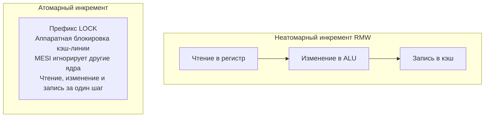

В статье [[22. Memory Ordering и Memory Model CPU]] мы увидели, как процессоры и компиляторы переставляют инструкции, превращая конкурентный код в хаос. Мы упомянули, что спасением выступает строгая Модель памяти Go (Happens-Before), которая под капотом использует примитивы синхронизации: мьютексы и каналы.

Но если мы спустимся на самое дно, в исходный код языка (`src/sync/mutex.go` или `src/runtime/chan.go`), мы не найдем там никаких "магических мьютексов". В самом низу всё построено на **Атомарных операциях (Atomic Operations)**.

Атомики — это фундамент, на котором держится весь lock-free и wait-free мир бэкенда.

## Почему `counter++` не работает?

Вспомним школьный пример гонки данных (Data Race). У нас есть глобальная переменная `counter := 0` и тысяча горутин, делающих `counter++`. В итоге мы получаем случайное число вроде `942` вместо `1000`.

С точки зрения программиста, `counter++` — это одна строчка. 
Но для процессора (как мы разбирали в [[7. Цикл исполнения инструкции. Fetch, Decode, Execute]]) это классический цикл **RMW (Read-Modify-Write)**, состоящий из трех отдельных микроинструкций:
1. **Чтение (Load):** Загрузить текущее значение `counter` из кэша L1 в регистр (например, `RAX`).
2. **Модификация (Add):** Прибавить 1 к `RAX` внутри ALU.
3. **Запись (Store):** Сохранить `RAX` обратно в кэш L1.

В многоядерной системе, пока Ядро 1 выполняет шаг 2 (внутри своего ALU), Ядро 2 может выполнить шаг 1 и прочитать старое значение. Они оба запишут одну и ту же цифру, "затерев" инкремент друг друга.

## Атомарность на уровне железа

**Атомарная операция** — это гарантия того, что цикл Read-Modify-Write будет выполнен аппаратно как единая, неделимая транзакция. Никакое другое ядро процессора не сможет вмешаться в этот процесс, прочитать промежуточное значение или записать свое.

Как это реализовано аппаратно?
В архитектуре x86-64 для этого используется специальный префикс инструкции — **`LOCK`** (например, `LOCK XADD` или `LOCK CMPXCHG`).

> [!info] Под капотом: Эволюция префикса LOCK
> В старых процессорах (до эпохи Pentium Pro) префикс `LOCK` работал буквально — он посылал электрический сигнал на пин процессора, который физически **блокировал всю системную шину памяти** (Bus Lock). Ни одно другое ядро не могло обратиться к оперативной памяти, пока инструкция не завершится. Это было невероятно медленно.
> В современных процессорах используется **Блокировка кэш-линии (Cache Line Locking)**, тесно завязанная на протокол MESI (из [[20. Многоядерные процессоры и Cache Coherence]]). 
> Когда ядро выполняет `LOCK XADD`, оно запрашивает кэш-линию в эксклюзивное владение (статус M). Пока атомарная инструкция не завершит фазу Store, контроллер кэша этого ядра будет игнорировать любые входящие Invalidate-сигналы и запросы на чтение от других ядер. Шина памяти остается свободной для других адресов, блокируются только конкретные 64 байта!



## Базовые атомарные операции в Go

В Go атомики живут в стандартном пакете `sync/atomic`. С версии Go 1.19 появились удобные дженерик-типы (`atomic.Int64`, `atomic.Pointer`), которые прячут указатели и защищают от ошибок типизации.

### 1. Fetch And Add (FAA)
Самая частая операция для счетчиков метрик.
```go
var counter atomic.Int64

// Безопасный инкремент
counter.Add(1)
```
Под капотом компилятор транслирует этот метод в одну-единственную ассемблерную инструкцию: `LOCK XADDQ`. Операция гарантированно выполнится, но в высоконагруженных системах вызовет Cache Line Contention (мы обсуждали это в [[21. False Sharing и Cache Line Contention]]).

### 2. Compare And Swap (CAS)
Это абсолютный Святой Грааль конкурентного программирования. Без него не было бы ни мьютексов, ни планировщика Go.

Функция `CompareAndSwap` принимает три аргумента: указатель на переменную, ожидаемое старое значение (old) и новое значение (new).
Логика аппаратно выполняет следующее:
*"Посмотри в память. Если там лежит значение 'old', то замени его на 'new' и верни true. Если там лежит что-то другое (значит, кто-то успел изменить данные быстрее меня) — ничего не трогай и верни false."*

В x86-64 это превращается в инструкцию `LOCK CMPXCHG`.

CAS — это основа оптимистичных блокировок. Мы не останавливаем другие потоки (как при мьютексе). Мы *пробуем* выполнить действие, и если не вышло — повторяем. Этот паттерн называется **CAS Loop (Цикл CAS)**.

Пример реализации своей lock-free логики:
```go
type Config struct {
	Timeout int
}

var currentConfig atomic.Pointer[Config]

func updateConfigTimeout(newTimeout int) {
	for {
		// 1. Читаем текущее состояние
		oldConfig := currentConfig.Load()
		
		// 2. Создаем новую копию (изменяем данные)
		newConfig := &Config{Timeout: newTimeout}
		
		// 3. Пытаемся подменить указатель.
		// Если за время шага 2 другая горутина успела обновить currentConfig,
		// CAS вернет false, и мы уйдем на новый круг цикла.
		if currentConfig.CompareAndSwap(oldConfig, newConfig) {
			return // Успех!
		}
	}
}
```

> [!tip] Собеседование
> **Вопрос:** В чем фундаментальная разница между `sync.Mutex` (мьютексом) и Spinlock (блокировкой вращения), построенном на пустом цикле с CAS? Что когда применять?
> **Ответ:** 
> *Spinlock (CAS-цикл)* крутится в `for {}` и непрерывно жжет такты процессора (CPU Time). Если ресурс занят, он будет 100% времени грузить ядро. Это выгодно, если критическая секция сверхкороткая (пару наносекунд) — мы экономим на переключении контекста.
> *`sync.Mutex`* в Go — умный (гибридный). Сначала он делает короткий Spinlock через CAS. Но если мьютекс занят долго, он обращается к планировщику (через `runtime.Semacquire`). Планировщик "усыпляет" горутину, убирает её с ядра ОС и ставит на её место другую полезную работу. Мьютекс не жжет CPU вхолостую.
> **Вывод:** В бизнес-логике всегда используйте `sync.Mutex`. CAS-циклы оставьте разработчикам рантайма и систем очередей реального времени.

## Проблема ABA (The ABA Problem)

Там, где есть CAS, всегда есть угроза столкнуться с классическим багом алгоритмов без блокировок — проблемой ABA.

Она возникает в структурах данных, основанных на указателях (например, в lock-free стеках).
Сценарий катастрофы:
1. Горутина 1 читает адрес вершины стека — узел `A`. Она готовится сделать CAS с `A` на следующий узел `B`.
2. Планировщик ОС прерывает Горутину 1.
3. Горутина 2 достает из стека `A`, затем достает `B`.
4. Горутина 2 выделяет новую память под элемент, но аллокатор ОС переиспользует старый адрес памяти узла `A`! Горутина 2 кладет новый "фейковый" узел `A` обратно на вершину стека.
5. Горутина 1 просыпается. Выполняет `CAS(ожидали A, ставим B)`.
6. Аппаратный CAS проверяет память. Там лежит адрес `A` (но это уже совершенно другой, новый узел `A`). CAS радостно возвращает `true` и подменяет вершину на узел `B` (который был удален на шаге 3 и чья память уже может содержать мусор).
Стек сломан, программа падает с Segmentation Fault.

>[!warning] Ловушка / Gotcha: Сборщик мусора как спасение
> Проблема ABA — это настоящий кошмар для C/C++ разработчиков, пишущих lock-free код. Им приходится изобретать Hazard Pointers или тегированные указатели (добавлять версию к каждому указателю).
> Но в Go проблема ABA встречается крайне редко! Почему? Потому что у нас есть **Garbage Collector (GC)**.
> В шаге 4 аллокатор Go физически **не сможет** переиспользовать адрес узла `A`, потому что Горутина 1 (уснувшая на шаге 2) всё еще держит указатель на `A` в своем локальном стеке (в переменной `old`). GC видит этот указатель и не удаляет объект `A`. Пока кто-то пытается сделать CAS на `A`, этот адрес памяти уникален и не может быть переиспользован для новых данных. GC делает написание lock-free в Go значительно безопаснее.

## Экспоненциальная задержка (Exponential Backoff)

Напоследок, важное правило Mechanical Sympathy при работе с CAS.
Если вы пишете CAS-цикл, и за ресурс дерутся много горутин (High Contention), постоянные промахи CAS вызовут Invalidate-шторм на шине процессора. Тысячи горутин будут крутить пустой цикл `for`, пытаясь выполнить `LOCK CMPXCHG`, убивая производительность всего сервера.

Если CAS не удался, идиоматично добавить небольшую паузу перед следующей попыткой (в Go для этого используется вызов `runtime.Gosched()`, чтобы отдать квант времени, или небольшая аппаратная пауза в ассемблере — инструкция `PAUSE` на x86).

## Итог

1. Атомарные операции решают проблему цикла Read-Modify-Write, делая его неделимым на аппаратном уровне через блокировку кэш-линии (префикс `LOCK` в x86-64).
2. **Fetch And Add** — самый быстрый способ счетчика.
3. **Compare And Swap (CAS)** — основа lock-free программирования. Читаем, копируем, меняем, пытаемся атомарно подменить. Если не вышло — повторяем цикл.
4. Проблема ABA заключается в подмене значения "туда-обратно", пока поток спал. В Go она редко стреляет благодаря Сборщику Мусора (который не переиспользует память, пока на нее смотрят).
5. Начиная с Go 1.19, используйте строгие типы `atomic.Int64`, `atomic.Bool`, `atomic.Pointer` вместо старых функций пакета `sync/atomic`.

Мы разобрали, как сделать операцию неделимой (Atomicity). 
Но атомарность — это лишь половина правды о `sync/atomic`. В официальной документации сказано: *"Атомарные операции также гарантируют последовательность видимости памяти (Memory Ordering)"*. 
Оказывается, когда вы делаете атомарный инкремент, компилятор и процессор вставляют не только блокировку, но и невидимые "стены", запрещающие переставлять инструкции. Эти стены называются барьерами. О них мы поговорим в следующей статье: [[24. Барьеры памяти. Memory Fence, Acquire, Release]].