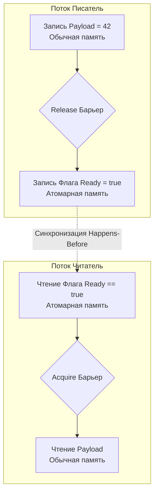

В статьях [[22. Memory Ordering и Memory Model CPU]] и [[23. Атомарные операции. CAS, Compare And Swap, Fetch And Add]] мы собрали два важнейших пазла конкурентного программирования. Мы знаем, что процессор любит переставлять инструкции ради скорости (Store Buffer), и мы знаем, что атомарные инструкции (с префиксом `LOCK`) делают операции неделимыми.

Но здесь возникает тончайший нюанс, который отличает Senior-инженера от Middle. 
Атомарность защищает *саму переменную*. Но как атомарная операция защищает *другие* переменные вокруг себя? 

Если мы делаем `atomic.Store`, откуда мы знаем, что процессор не переставит обычные, неатомарные записи, которые мы сделали до этого, так, что они выполнятся *после* атомарной операции?

Чтобы усмирить хаос переупорядочивания, процессоры предоставляют специальный инструмент — **Барьеры памяти (Memory Fences / Memory Barriers)**.

## Что такое Барьер памяти?

Барьер памяти — это аппаратная инструкция (или директива компилятора), которая запрещает перестановку операций чтения и записи до и после себя. Это "бетонная стена" в конвейере процессора.

Чтобы понять, как она работает физически, вспомним про Store Buffer (Буфер записи). 
Когда процессор встречает инструкцию **Memory Fence** (например, `MFENCE` в архитектуре x86-64), он делает следующее:
1. Останавливает выполнение всех последующих инструкций, обращающихся к памяти.
2. Ждет, пока все записи, скопившиеся в Store Buffer, не будут физически "слиты" (flushed) в кэш L1, и пока другие ядра не подтвердят инвалидацию своих кэш-линий (по протоколу MESI).
3. Только после этого разрешает конвейеру работать дальше.

Это очень дорогая операция. Она убивает Out-of-Order Execution и заставляет процессор простаивать (Stall).

## Семантика Acquire и Release

В современном системном программировании (начиная со стандарта C++11, который де-факто стал эталоном для всех языков, включая Go) барьеры описываются через элегантную концепцию **Acquire** и **Release** (Захват и Освобождение).

Представьте классический паттерн передачи данных: Поток А подготавливает данные и выставляет флаг `ready = true`. Поток Б ждет флага и читает данные.

### 1. Release (Освобождение/Публикация)
Применяется при **записи** флага.
Барьер Release гарантирует, что *любые операции чтения и записи, идущие до него в коде, будут завершены и видны другим ядрам до того, как выполнится сама Release-запись*.
Говоря простым языком: "Сначала выгрузи в память все подготовленные данные, и только потом поднимай флаг".

### 2. Acquire (Захват/Чтение)
Применяется при **чтении** флага.
Барьер Acquire гарантирует, что *никакие операции чтения и записи, идущие после него в коде, не начнут выполняться до того, как флаг будет прочитан*.
Говоря простым языком: "Сначала убедись, что флаг поднят, и только потом читай сами данные, не пытайся прочитать их спекулятивно заранее".



Именно эта пара барьеров и формирует ту самую гарантию **Happens-Before**, на которую мы опирались в Модели памяти Go. 

## Философия Go: Sequential Consistency по умолчанию

В языках вроде C++ или Rust у программиста есть выбор. Когда вы вызываете атомарную операцию, вы обязаны передать флаг барьера:
`atomic.store(ready, true, std::memory_order_release)`
`atomic.load(ready, std::memory_order_acquire)`
Вы можете выбрать более слабые или более строгие барьеры ради микрооптимизаций на ARM-архитектуре.

**В Go такого выбора нет.** 
Создатели языка (Расс Кокс) приняли фундаментальное решение: все операции в пакете `sync/atomic` (такие как `Store`, `Load`, `CompareAndSwap`) по умолчанию используют самую строгую модель памяти — **Sequential Consistency (SeqCst)**. 

Это значит, что:
* Любой `atomic.Store` в Go неявно работает как **Release** барьер.
* Любой `atomic.Load` в Go неявно работает как **Acquire** барьер.
* Более того, они обеспечивают глобальный тотальный порядок (все ядра видят атомарные операции в абсолютно одинаковой последовательности).

Вам не нужно ломать голову над тем, какой барьер поставить. Пакет `sync/atomic` гарантирует, что ваши данные вокруг атомика не перепутаются.

> [!info] Под капотом: x86 против ARM
> На уровне машинного кода компилятор Go генерирует барьеры по-разному в зависимости от архитектуры (переменная `GOARCH`).
> **x86-64 (Intel/AMD):** Благодаря строгой модели TSO, на x86 барьеры `Acquire`/`Release` практически бесплатны! Железо само не переставляет нужные инструкции. Обычный ассемблерный `MOV` при записи уже имеет семантику Release. Барьеры вставляются компилятором только виртуально, запрещая перестановки на этапе SSA-оптимизаций, но в бинарнике физической инструкции `MFENCE` для обычного `atomic.Load` вы не увидите.
> **ARM64 (Apple Silicon):** Здесь всё иначе. Железо слабое и переставляет всё подряд. Для `atomic.Store` компилятор Go генерирует специальную ARM-инструкцию `STLR` (Store-Release Register), а для `atomic.Load` — инструкцию `LDAR` (Load-Acquire Register). Эти аппаратные барьеры на ARM стоят реальных тактов процессора, заставляя его сбрасывать очереди.

## Мьютексы — это просто красивый фасад

Теперь мы можем понять, как на самом деле работает `sync.Mutex` в Go. Мьютекс — это структура с полем `state int32`.

1. Когда вы вызываете `mu.Lock()`, под капотом происходит `atomic.CompareAndSwapInt32`. Эта операция содержит **Acquire-барьер**. Она говорит процессору: "Не читай переменные внутри критической секции, пока не захватишь мьютекс".
2. Когда вы вызываете `mu.Unlock()`, под капотом происходит `atomic.AddInt32` (вычитание). Эта операция содержит **Release-барьер**. Она говорит процессору: "Закончи запись всех переменных в критической секции, сбрось их в кэш, и только потом отпускай мьютекс".

Любой примитив синхронизации в Go (мьютексы, RWMutex, WaitGroup, каналы) построен поверх этой комбинации атомарности и барьеров памяти.

## Double-Checked Locking: Классическая ловушка

Понимание барьеров критически важно на собеседованиях при обсуждении паттерна Singleton (ленивая инициализация).

Наивный код на Go без пакета `sync`:
```go
var instance *Singleton

// ПЛОХОЙ КОД - СОДЕРЖИТ ГОНКУ ДАННЫХ
func GetInstance() *Singleton {
	if instance == nil {               // 1. Первая проверка
		mu.Lock()
		if instance == nil {           // 2. Вторая проверка
			instance = new(Singleton)  // 3. Создание и присваивание
		}
		mu.Unlock()
	}
	return instance
}
```

Почему этот код не работает аппаратно?
Операция `new(Singleton)` состоит из двух этапов:
А) Выделение памяти и инициализация полей структуры нулями.
Б) Присвоение адреса этой памяти указателю `instance`.

Внутри критической секции (шаг 3) нет барьеров памяти. Компилятор или процессор (особенно ARM64) имеет право **переставить эти этапы местами** (Out-of-Order Execution)!

Что произойдет:
1. Поток 1 захватывает мьютекс.
2. Процессор сначала записывает адрес памяти в `instance` (Этап Б).
3. В эту наносекунду Поток 2 заходит в функцию.
4. Поток 2 выполняет первую проверку `if instance == nil`.
5. Указатель **уже не равен nil**! Поток 2 не ждет мьютекс и сразу возвращает `instance`.
6. Поток 2 пытается вызвать метод у объекта `instance`. Но Поток 1 еще не успел инициализировать его поля (Этап А)! Поток 2 читает мусор, программа падает.

> [!tip] Собеседование
> **Вопрос:** Как правильно реализовать Singleton в Go и почему это решает аппаратную проблему?
> **Ответ:** Использовать `sync.Once` (или `sync.OnceValues` в Go 1.21+). 
> Под капотом `sync.Once` использует атомарную переменную (флаг `done`). При первом выполнении `Once` захватывает мьютекс, выполняет функцию инициализации, а затем делает `atomic.StoreUint32(&done, 1)`. 
> Как мы теперь знаем, `atomic.Store` несет в себе **Release-барьер**. Он гарантирует, что вся память инициализированной структуры будет видна другим ядрам до того, как флаг `done` станет равен 1. Перестановка аппаратно невозможна.

## Итог

1. **Барьеры памяти (Memory Fences)** запрещают процессору и компилятору переставлять инструкции, наводя порядок в агрессивном Out-of-Order конвейере.
2. **Release (Освобождение)** гарантирует, что все предыдущие записи завершены. Используется при публикации данных.
3. **Acquire (Захват)** гарантирует, что последующие чтения не начнутся раньше времени. Используется при проверке готовности данных.
4. В Go пакет `sync/atomic` обеспечивает самую строгую семантику — Sequential Consistency. Любая атомарная операция работает как полноценный барьер. Это делает код безопаснее, скрывая от нас архитектурные различия между x86 и ARM.
5. Отсутствие барьеров приводит к чтению полу-инициализированных объектов (классический баг сломанного Double-Checked Locking).

Мы разобрались, как железо читает, кэширует, пишет и синхронизирует данные. Но всё это время мы говорили об абстрактных "переменных". В реальном коде данные группируются в структуры `struct`. И то, в каком порядке вы объявляете поля внутри структуры в Go, способно изменить размер потребляемой памяти на десятки процентов и повлиять на скорость загрузки в кэш! 
Почему `struct { a byte; b int64; c byte }` — это преступление против железа, мы разберем в следующей статье: [[25. Выравнивание данных, Padding и Struct Layout]].