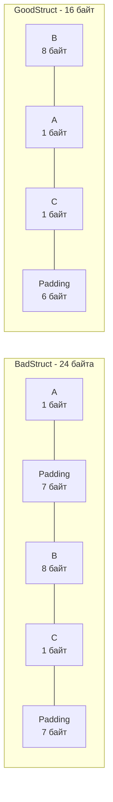

В предыдущих статьях (особенно в [[24. Барьеры памяти. Memory Fence, Acquire, Release]]) мы рассматривали данные как абстрактные переменные, за которыми следит процессор и компилятор. Но в реальном коде на Go переменные редко живут поодиночке. Они объединяются в структуры `struct`.

Кажется, что структура — это просто контейнер, и ее размер равен сумме размеров ее полей. Но если вы напишете структуру `struct { a bool; b int64; c bool }`, вы с удивлением обнаружите, что вместо ожидаемых 10 байт она занимает **24 байта** в оперативной памяти! 

Компилятор намеренно раздул вашу структуру мусором. Чтобы понять, почему он это сделал и как неправильный порядок полей может снизить производительность вашего бэкенда в два раза, нам нужно разобраться с концепцией **Аппаратного выравнивания (Hardware Alignment)**.

## Механика железа: Почему процессоры ненавидят невыровненные данные

Оперативная память (RAM) для программиста выглядит как бесконечный массив байтов, где у каждого байта есть свой адрес (0, 1, 2, 3...). 
Но контроллер памяти процессора не читает память побайтово. Физическая шина данных имеет ширину (обычно 64 бита, то есть 8 байт). Процессор запрашивает данные "машинными словами" строго по адресам, кратным 8 (адреса `0x00`, `0x08`, `0x10` и т.д.).

Представьте, что вы сохранили 8-байтный `int64` по невыровненному адресу, например, начиная с адреса `0x03`. 
Этот `int64` физически пересечет границу двух машинных слов (или, что еще хуже, двух 64-байтных кэш-линий, о которых мы говорили в [[18. Кэши CPU. L1, L2, L3 и Cache Line]]).

Чтобы прочитать такое число, процессору придется:
1. Прочитать первое слово по выровненному адресу `0x00`.
2. Прочитать второе слово по адресу `0x08`.
3. Отрезать мусор (сдвиги и маски).
4. Склеить два куска в один регистр.

На архитектуре x86-64 железо берет эту грязную работу на себя, но вы получаете **штраф производительности (Unaligned Access Penalty)**. А вот на многих ARM-процессорах железо просто откажется это делать и выбросит аппаратное исключение (Bus Error), которое мгновенно уронит вашу программу (Segmentation Fault).

## Padding (Заполнение): Компромисс компилятора

Чтобы не допустить невыровненных обращений и спасти производительность, компилятор Go соблюдает **Правила выравнивания (Alignment Rules)**:
*   Тип `byte` или `bool` (1 байт) может лежать по любому адресу.
*   Тип `int16` (2 байта) обязан лежать по адресам, кратным 2.
*   Тип `int32` (4 байта) — кратным 4.
*   Тип `int64` или указатель (8 байт) обязан лежать по адресам, кратным 8.

Когда вы объявляете структуру, компилятор размещает поля последовательно. Но если следующее поле не попадает на свой кратный адрес, компилятор молча вставляет между ними пустые "мусорные" байты — **Padding**.

```go
package main

import (
	"fmt"
	"unsafe"
)

type BadStruct struct {
	A bool  // 1 байт. Текущее смещение: 1.
	        // Для следующего int64 нужен адрес, кратный 8!
	        // Компилятор добавляет 7 байт мусора (Padding).
	B int64 // 8 байт. Текущее смещение: 16.
	C bool  // 1 байт. Текущее смещение: 17.
}

func main() {
	fmt.Printf("Размер BadStruct: %d байт\n", unsafe.Sizeof(BadStruct{})) 
	// Выведет: 24 байта!
}
```

> [!tip] Собеседование
> **Вопрос:** В `BadStruct` последнее поле `C` занимает 1 байт. Суммарный размер перед концом структуры — 17 байт. Зачем компилятор добавляет еще 7 байт мусора в самом конце структуры, чтобы размер стал 24 байта? Разве после `C` есть еще поля?
> **Ответ:** Это необходимо для выравнивания в массивах (слайсах). Размер структуры (Size) обязан быть кратен ее **максимальному выравниванию** (Alignment). В нашей структуре максимальное поле — `int64` (выравнивание 8). Если мы создадим `[]BadStruct`, второй элемент массива должен начаться с адреса, кратного 8. Если бы структура занимала 17 байт, второй элемент начался бы с адреса 17, и его поле `B` (int64) оказалось бы невыровненным! Поэтому хвост всегда добивается паддингом.

## Struct Layout: Как писать правильно

Зная правила паддинга, мы можем оптимизировать потребление памяти просто переставив поля местами! Золотое правило: **сортируйте поля структуры по убыванию их размера**.

```go
type GoodStruct struct {
	B int64 // 8 байт. Смещение: 8
	A bool  // 1 байт. Смещение: 9
	C bool  // 1 байт. Смещение: 10
	        // 6 байт хвостового паддинга для массива.
} // Итого: 16 байт вместо 24!
```



### Mechanical Sympathy: Плотность кэша L1
Разница между 16 и 24 байтами кажется смешной. Но если вы загружаете из базы данных 1 миллион записей в слайс `[]User`, разница составит 8 Мегабайт оперативной памяти.

Но самое страшное происходит в кэше L1.
Кэш-линия имеет размер 64 байта.
* В одну кэш-линию поместится **4** объекта `GoodStruct` (4 * 16 = 64). Процессор загрузит 4 объекта за один Cache Miss.
* В ту же кэш-линию поместится только **2** объекта `BadStruct` (24 + 24 = 48, остаток 16 байт пустует). 

Плохой Struct Layout означает, что ваш процессор будет генерировать в два раза больше Cache Misses (промахов кэша) при итерации по массиву, простаивая в ожидании медленной RAM в два раза дольше!

## Ловушки и корнер-кейсы в Go

Go имеет несколько уникальных "пасхалок", связанных с Layout-ом, о которых нужно знать.

### 1. Пустая структура (Empty Struct) в конце

Пустая структура `struct{}` (размер 0 байт) — любимый инструмент Go-разработчиков для реализации Set (`map[string]struct{}`) или каналов сигнализации (`chan struct{}`).

Но если `struct{}` является **последним** полем в структуре, она магически приобретает размер 1 байт!

```go
type User struct {
	Age int64
	Set struct{} // Если это поле последнее, структура займет 16 байт!
}
```

> [!warning] Ловушка / Gotcha: Спасение Garbage Collector'а
> Почему пустое поле раздувает структуру на 8 байт (1 + 7 паддинга)?
> В Go работает Сборщик мусора (GC). Если бы `struct{}` имела размер 0 байт в конце `User`, указатель на поле `Set` (например, `&user.Set`) указывал бы на адрес памяти *сразу за* структурой `User`. 
> А что если там лежит совершенно другой объект в куче? Получится, что указатель на `user.Set` формально ссылается на другой объект, и GC никогда не удалит этот другой объект, полагая, что он еще жив!
> Чтобы предотвратить эту страшную утечку памяти, компилятор добавляет паддинг, гарантируя, что указатель на любое поле структуры всегда указывает строго *внутрь* этой структуры. (Если `struct{}` стоит первой или в середине — паддинг не добавляется, так как указатель и так внутри).

### 2. Выравнивание 64-битных атомиков на 32-битных системах

До Go 1.19 использование `int64` счетчиков с пакетом `sync/atomic` на 32-битных архитектурах (например, ARMv7 в старых смартфонах или Raspberry Pi) приводило к случайным паникам в рантайме: `panic: unaligned 64-bit atomic operation`.

Причина: на 32-битной архитектуре машинное слово равно 4 байтам. Выравнивание для `int64` там тоже равно 4 байтам, а не 8! 
Обычный код работал нормально (собирая 8 байт из двух чтений), но **атомарные процессорные инструкции** аппаратно требовали строгой выровненности по 8 байт. Если поле `int64` случайно ложилось на адрес, кратный 4, но не кратный 8, аппаратный `LOCK CMPXCHG8B` вызывал сбой.

Именно поэтому в старом Go-коде можно встретить жуткие конструкции и специальные массивы `[15]byte` для ручного выравнивания указателей на атомики.
**Современное решение:** Начиная с Go 1.19, используйте `atomic.Int64`. Внутри этого типа разработчики рантайма используют директивы `unsafe.Alignof` и хитрый паддинг, чтобы аппаратно гарантировать 8-байтное выравнивание на любой платформе.

## Автоматизация проверки (fieldalignment)

Вам не нужно сидеть с калькулятором и высчитывать байты вручную для каждой DTO-модели. В официальном наборе инструментов Go есть анализатор `fieldalignment`.

Он встроен в `golangci-lint` (ранее как отдельный линтер `maligned`, теперь внутри `govet`).
Если вы натравите его на свой код:
```bash
go install golang.org/x/tools/go/analysis/passes/fieldalignment/cmd/fieldalignment@latest
fieldalignment -fix ./...
```
Он не только найдет неоптимальные структуры, но и (с флагом `-fix`) **автоматически переставит поля** в ваших `.go` файлах для достижения идеального выравнивания.

## Итог

1. **Аппаратное выравнивание (Alignment)** требует, чтобы переменные располагались по адресам памяти, кратным их размеру. Иначе процессор тратит лишние такты на чтение разорванных машинных слов (а на ARM вообще падает).
2. Компилятор вставляет пустые байты (**Padding**), чтобы гарантировать выравнивание полей и самой структуры для массивов.
3. Неправильный порядок полей (когда `bool` чередуется с `int64`) раздувает потребление RAM и **снижает эффективность L1 кэша в 2-3 раза** из-за мусора в кэш-линиях.
4. Сортируйте поля от бóльших к меньшим (8 байт, 4 байта, 1 байт), или используйте линтер `fieldalignment`.
5. Помните про корнер-кейсы: `struct{}` в конце раздувает структуру ради сборщика мусора, а атомики требуют особых оберток вроде `atomic.Int64`.

Мы разобрали, как данные физически располагаются и выравниваются в памяти. Но есть еще одна низкоуровневая деталь, связанная с "машинным словом". 
Если вы берете число `0x11223344` (4 байта) и кладете его в память, какой байт будет записан по первому адресу: `0x11` (старший) или `0x44` (младший)? Это фундаментальное отличие архитектур мы разберем в следующей статье: [[26. Endianness. Little Endian vs Big Endian]].