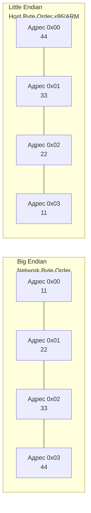

В статье [[25. Выравнивание данных, Padding и Struct Layout]] мы разобрались с тем, по каким адресам памяти компилятор размещает наши переменные. Но мы воспринимали сами многобайтовые числа как единое целое. 

Теперь пришло время заглянуть внутрь самого машинного слова.
Оперативная память адресуется побайтово. Каждая ячейка памяти хранит ровно 1 байт. Если в нашем Go-коде есть переменная `uint32` (которая занимает 4 байта), она займет 4 последовательных адреса — например, от `0x00` до `0x03`.

Представим число в шестнадцатеричном формате: `0x11223344`. 
Здесь `11` — это самый **старший байт (Most Significant Byte, MSB)**, а `44` — самый **младший байт (Least Significant Byte, LSB)**.

Возникает фундаментальный архитектурный вопрос: какой из этих байтов должен лежать по первому адресу `0x00`?
Ответ на этот вопрос делит весь компьютерный мир на два лагеря: **Big Endian** и **Little Endian**.

## Big Endian: Человеческий подход

**Big Endian (От старшего к младшему)** — порядок, при котором старший байт записывается по самому младшему (первому) адресу памяти.

Как мы пишем числа на бумаге слева направо (от тысяч к единицам), так же они ложатся в память:
*   `0x00`: `11` (MSB)
*   `0x01`: `22`
*   `0x02`: `33`
*   `0x03`: `44` (LSB)

> [!info] Под капотом
> Этот формат исторически использовался в процессорах Motorola, IBM и SPARC. Но главное для бэкенд-разработчика: **Big Endian — это абсолютный стандарт сетевых протоколов (Network Byte Order)**. 
> Все заголовки TCP/IP, длина фреймов в HTTP/2, поля в протоколе gRPC и данные в Kafka кодируются и передаются по проводам исключительно в формате Big Endian.

## Little Endian: Подход для железа

**Little Endian (От младшего к старшему)** — порядок, при котором младший байт (LSB) записывается по первому адресу.
В памяти наше число `0x11223344` будет выглядеть "задом наперед":
*   `0x00`: `44` (LSB)
*   `0x01`: `33`
*   `0x02`: `22`
*   `0x03`: `11` (MSB)

Этот формат является стандартом для процессоров **x86-64 (Intel/AMD)**. Архитектура ARM64 (Apple Silicon) аппаратно поддерживает оба режима (Bi-Endian), но операционные системы (Linux, macOS, Android) почти всегда настраивают ядро на работу в режиме Little Endian. Поэтому компилятор Go для `GOARCH=amd64` и `GOARCH=arm64` генерирует код, опирающийся на Little Endian.

### Mechanical Sympathy: Почему Intel выбрала "неудобный" формат?

Кажется нелогичным хранить числа задом наперед. Но для транзисторов ALU это дает огромные преимущества:

1. **Скорость сложения:** Вспомните, как вы складываете числа в столбик (и как мы собирали сумматор в [[3. Комбинационная логика. Учим кремний считать]]). Вы всегда начинаете с *младших* разрядов и переносите единицу в старшие. В Little Endian младший байт лежит по первому адресу. Процессор может начать математическую операцию над первым байтом мгновенно, параллельно подгружая следующие байты из кэша.
2. **Бесплатное приведение типов (Type Casting):** Если у вас есть переменная `int64` (8 байт), и вы хотите привести ее к `int32` (4 байта), в архитектуре Little Endian вам вообще не нужно менять данные или сдвигать указатель! Вы берете тот же самый базовый адрес памяти и просто читаете из него 4 байта вместо 8. Значение останется математически корректным. В Big Endian вам пришлось бы прибавлять `+4` к указателю, чтобы прочитать младшую половину числа.



## Работа с Endianness в Go

Как бэкендеры, мы постоянно сталкиваемся с конвертацией: мы читаем Big Endian байты из TCP-сокета или файла, а обрабатываем их на Little Endian процессоре.

В Go за это отвечает стандартный пакет `encoding/binary`.

```go
package main

import (
	"encoding/binary"
	"fmt"
)

func main() {
	// Представим, что мы прочитали 4 байта длины сообщения из заголовка TCP
	networkData :=[]byte{0x00, 0x00, 0x00, 0x05} // Длина = 5

	// Конвертируем из сети (Big Endian) в родной формат процессора (uint32)
	length := binary.BigEndian.Uint32(networkData)
	fmt.Printf("Длина сообщения: %d\n", length)

	// Записываем наш ответ обратно в буфер для отправки по сети
	responseBuf := make([]byte, 4)
	binary.BigEndian.PutUint32(responseBuf, 1024)
}
```

### Магия компилятора и BSWAP

Когда вы смотрите на исходный код `binary.BigEndian.Uint32`, вы видите там побайтовые сдвиги:
```go
func (bigEndian) Uint32(b []byte) uint32 {
	_ = b[3] // Bounds check elimination
	return uint32(b[3]) | uint32(b[2])<<8 | uint32(b[1])<<16 | uint32(b[0])<<24
}
```

Кажется, что это чудовищно медленно: 4 чтения из памяти, 3 побитовых сдвига и 3 логических ИЛИ. 

Но здесь вступает в дело магия оптимизатора компилятора Go (SSA). Компилятор распознает этот конкретный паттерн кода и **не генерирует эти сдвиги**. Вместо этого он превращает весь этот код в **одну единственную аппаратную инструкцию**.

На архитектуре x86-64 он подставляет инструкцию `BSWAP` (Byte Swap), а на ARM64 — инструкцию `REV`.
Эти инструкции переворачивают байты в регистре процессора за **1 такт**. Поэтому использование пакета `encoding/binary` в Go является не только идиоматичным, но и аппаратно бесплатным (Zero-Cost Abstraction).

>[!warning] Ловушка / Gotcha: Проклятие пакета unsafe
> Разработчики, переходящие в Go из C/C++, часто пытаются "соптимизировать" парсинг бинарных сетевых протоколов, прибегая к `unsafe.Pointer`.
> ```go
> // ПЛОХОЙ КОД: Парсинг заголовка пакета напрямую из байтов сети
> header := *(*uint32)(unsafe.Pointer(&networkBuffer[0]))
> ```
> Они берут байты из сети (Network Byte Order = Big Endian) и говорят компилятору: *"Смотри на эти байты так, как будто это число `uint32`"*.
> Проблема в том, что процессор прочитает эти байты в своем родном формате (Little Endian). 
> Если по сети пришла длина `0x00000005` (5 байт), то процессор x86-64, прочитав их через `unsafe`, перевернет их и положит в регистр как `0x05000000`. Ваша программа подумает, что длина входящего сообщения — **83 миллиона байт**, попытается выделить под них слайс и упадет с ООМ (Out Of Memory)!
> **Правило:** Никогда не кастуйте сырые сетевые (или файловые) байты напрямую в структуры или числа через `unsafe`. Всегда используйте `encoding/binary`.

## Маркер порядка байт (BOM) в файлах

С сетью все однозначно (всегда Big Endian). А как быть с бинарными файлами или текстами в кодировке UTF-16?
Для этого в начале файла помещают специальный маркер **BOM (Byte Order Mark)**. 
Это магическое число `0xFEFF`.

*   Если программа читает первые два байта файла и видит `FE FF`, значит файл сохранен в **Big Endian**.
*   Если программа видит `FF FE` (число перевернуто), значит файл сохранен в **Little Endian**, и нашей программе нужно переворачивать байты при чтении каждой буквы.

Если вы пишете парсер бинарных форматов (например, картинок TIFF или аудио WAV), в заголовке всегда есть поле, указывающее, в какой эндианности закодированы данные дальше.

## Итог

1. **Big Endian (Сетевой порядок)** хранит старший байт по первому адресу. Это стандарт для всех сетевых протоколов интернета.
2. **Little Endian (Порядок хоста)** хранит младший байт по первому адресу. Это стандарт архитектур x86-64 и ARM64, оптимизированный для работы транзисторов ALU.
3. В Go конвертация производится через `binary.BigEndian` и `binary.LittleEndian`. 
4. Благодаря компилятору, стандартные функции `encoding/binary` транслируются в молниеносные процессорные инструкции (`BSWAP`), работающие за 1 такт.
5. Использование `unsafe` для кастинга байтов из сети в числа гарантированно приведет к багам из-за разницы между Network и Host byte order.

Мы закончили погружение в устройство памяти в рамках самого процесса и железа. Мы знаем, как байты лежат в структурах, как они выровнены, закэшированы и синхронизированы между ядрами. 
Но откуда наш Go-процесс вообще берет свои адреса памяти? Как так получается, что каждая программа думает, будто у нее есть монопольный доступ к 256 Терабайтам памяти, даже если на сервере установлено всего 2 ГБ физической RAM? 
Пора покинуть границы физического железа и перейти к главной иллюзии операционных систем: [[27. Виртуальная память. Взгляд со стороны железа]].