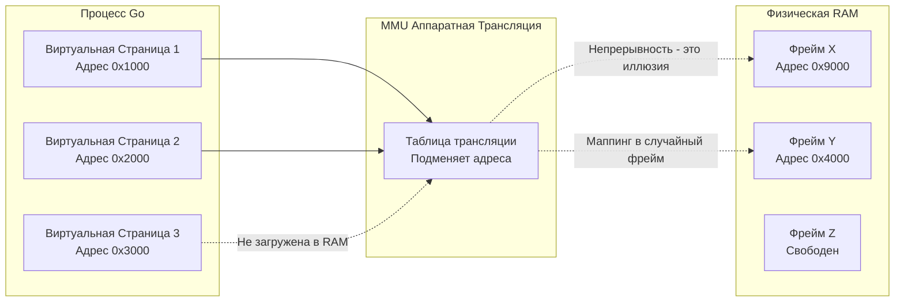

В предыдущих статьях (вплоть до [[26. Endianness. Little Endian vs Big Endian]]) мы досконально разобрали, как процессор читает, пишет и кэширует данные по конкретным адресам памяти.

Но задавались ли вы когда-нибудь вопросом: когда в Go вы выводите адрес переменной через `fmt.Printf("%p\n", &variable)`, и получаете что-то вроде `0xc0000a4000` — что это за адрес? Указывает ли он на конкретный физический транзистор в планке вашей оперативной памяти?

Нет. Это иллюзия. Матрица, заботливо выстроенная операционной системой и железом. Ваш Go-процесс живет в вымышленном мире, и этот мир называется **Виртуальной памятью**.

## Кризис физической памяти

На заре вычислительной техники программы работали с физической памятью напрямую. Если программа хотела записать данные по адресу `0x1000`, ток буквально шел на адрес `0x1000` в RAM. 

Это породило три катастрофические проблемы:
1. **Отсутствие изоляции (Безопасность):** Ваша программа могла случайно (или намеренно, если это вирус) записать данные по адресу, где лежали пароли другой программы или ядро ОС. Система падала.
2. **Фрагментация:** Программы запускались и завершались, оставляя "дыры" в памяти. Если новой программе требовалось 10 МБ непрерывной памяти, а в системе было 10 кусков по 1 МБ, запуск завершался ошибкой `Out of Memory`, хотя физической памяти хватало.
3. **Коллизии адресов:** Компилятор должен был жестко знать, по какому адресу будет загружена программа. Запустить две одинаковые программы одновременно было невозможно — они обе попытались бы занять одни и те же жестко зашитые адреса.

## Иллюзия: Каждому процессу по вселенной

Для решения этих проблем инженеры придумали механизм виртуальной памяти. 
Смысл гениально прост: **Процессор больше не отправляет адреса из вашей программы напрямую в оперативную память.**

Когда вы запускаете бинарник Go, ОС создает для него отдельное, изолированное **Виртуальное адресное пространство**. На 64-битной архитектуре (x86-64/ARM64) операционная система "внушает" процессу, что в его монопольном распоряжении находится гигантский массив памяти — обычно **256 Терабайт**! 

Программа может использовать любые адреса в этом диапазоне (от `0x0000000000000000` до `0x00007FFFFFFFFFFF`). Она думает, что она в системе одна. Она "видит" непрерывный, идеальный блок памяти.

А на уровне железа между ядром процессора и шиной физической RAM стоит специальный аппаратный блок — **MMU (Memory Management Unit)**. Его задача — "на лету" транслировать вымышленные (виртуальные) адреса в реальные (физические).

## Страницы памяти (Pages)

Транслировать каждый байт по отдельности невозможно — таблица трансляции занимала бы больше памяти, чем сама RAM. 

Поэтому и виртуальная, и физическая память нарезается на куски фиксированного размера. 
Эти куски называются **Страницами (Pages)**. В Linux и Windows стандартный размер страницы составляет **4 Килобайта (4096 байт)**.

*   В виртуальной памяти эти блоки называются **Virtual Pages**.
*   В физической RAM они называются **Physical Frames (Кадры)**.

Задача MMU — маппить Виртуальную Страницу 1 на Физический Фрейм X.



Обратите внимание на магию: виртуальные страницы 1 и 2 лежат **непрерывно** друг за другом (адреса `0x1000` и `0x2000`). Но в физической памяти они разбросаны хаотично (`0x4000` и `0x9000`). Для вашего Go-кода массив, лежащий на этих страницах, будет выглядеть как идеальный, плоский, непрерывный кусок памяти. Проблема фрагментации RAM решена навсегда!

> [!info] Под капотом: Общая память (Shared Memory)
> Виртуальная память позволяет двум разным процессам маппить свои разные виртуальные страницы на **один и тот же физический фрейм**. 
> Именно так работают разделяемые библиотеки (`.so` / `.dll`). Код стандартной библиотеки `libc` загружается в физическую RAM ровно один раз, но маппится в виртуальное пространство тысяч запущенных процессов. Это экономит гигабайты памяти. В Go это используется реже, так как Go-бинарники обычно статически слинкованы, но этот механизм активно применяется при использовании пакета `plugin` или вызовов `mmap`.

## Mechanical Sympathy: Виртуальная память и Go

Понимание виртуальной памяти дает бэкендеру ключи к ответам на самые каверзные вопросы о поведении Go в продакшене.

### 1. Как работает выделение памяти (Memory Arena)
В старых языках (типа C) при вызове `malloc()` программа часто делает системный вызов `brk` или `mmap`, прося у ОС память. Системный вызов — это медленно.
Аллокатор Go делает иначе. При старте программы он просит у ОС через `mmap` огромный кусок **виртуальной** памяти (Memory Arena), часто десятки или сотни гигабайт!
ОС с радостью отдает этот кусок, потому что резервирование *виртуальной* памяти не стоит ей ни одного физического байта RAM. Позже, когда ваш код создает слайс или структуру, Go просто выдает адрес из этой заранее заготовленной арены, не обращаясь к ядру ОС. 

> [!tip] Собеседование
> **Вопрос:** Что выведет этот код и почему? Упадет ли он с `Out Of Memory`, если на сервере всего 2 ГБ оперативной памяти?
> ```go
> func main() {
>     // Выделяем слайс размером 1 Терабайт!
>     s := make([]byte, 1 << 40)
>     fmt.Println("Слайс создан!", len(s))
>     time.Sleep(time.Hour)
> }
> ```
> **Ответ:** Код успешно выведет "Слайс создан!" и не упадет с OOM. 
> Функция `make` просто попросит ОС зарезервировать 1 ТБ *виртуального* адресного пространства. Физическая память (RAM) при этом не аллоцируется (механизм Overcommit). 
> Физическая память начнет выделяться только в тот момент, когда мы попытаемся **записать** данные в этот слайс (`s[0] = 1`). Процессор обнаружит, что страница еще не привязана к фрейму, вызовет аппаратное прерывание **Page Fault**, ОС перехватит его, найдет свободные 4 КБ в RAM, привяжет их к виртуальному адресу и вернет управление. Этот процесс называется **Lazy Allocation (Ленивое выделение)**.

### 2. Почему возникает Panic: nil pointer dereference?
Что на уровне железа означает `nil`? В Go указатель `nil` равен числовому адресу `0x0`.
Но операционная система намеренно **запрещает маппить** самую первую виртуальную страницу (адреса от `0x0000` до `0x0FFF`) на физическую память. Эта страница помечена специальным флагом "Нет доступа".

Когда вы разыменовываете nil-указатель (`*ptr = 5`), процессор отправляет в MMU виртуальный адрес `0x0`. MMU видит, что страница защищена, и бросает аппаратное исключение процессора — **Page Fault (Access Violation)**. 
Ядро ОС получает это прерывание, смотрит, кто его вызвал, и отправляет этому процессу сигнал `SIGSEGV` (Segmentation Fault). Рантайм Go перехватывает этот сигнал и превращает его в красивый стек-трейс с паникой: `panic: runtime error: invalid memory address or nil pointer dereference`.

### 3. Механизм горутин и стеки
В языках вроде Java или C++ каждый поток ОС (Thread) при рождении жестко выделяет себе в памяти фиксированный стек (обычно 2–8 МБ). Это дорого.
Go использует горутины, которые стартуют с микро-стеком в 2 КБ. Но если вы уходите в глубокую рекурсию, стек должен расти.
Виртуальная память позволяет рантайму Go делать **Continuous Stacks (Непрерывные стеки)**. Рантайм выделяет новый, вдвое больший блок виртуальной памяти, копирует туда текущие данные стека и переключает указатель. Иллюзия непрерывности сохраняется, а фрагментация физической памяти процессору не страшна.

## Итог

1. **Виртуальная память** — это абстракция. Каждая программа думает, что работает одна и владеет гигантским массивом адресов памяти.
2. И виртуальная, и физическая память разбита на **Страницы (Pages)** по 4 КБ.
3. **MMU (Memory Management Unit)** аппаратно транслирует виртуальные адреса в физические "на лету" при каждом обращении к памяти.
4. **Ленивое выделение:** Когда вы аллоцируете гигабайты в Go, вы получаете лишь виртуальные адреса. Физическая RAM выделяется ОС (через обработку Page Faults) по 4 КБ ровно в тот момент, когда вы пытаетесь прочитать или записать туда реальные байты.
5. Адрес `nil` (0x0) защищен на уровне таблиц страниц. Попытка его прочитать вызывает аппаратное прерывание и убивает процесс.

Но как именно MMU осуществляет эту трансляцию? Если у процесса сотни тысяч страниц, мы не можем проверять массив размером в мегабайты при *каждой* инструкции (иначе процессор будет работать медленнее черепахи). Железу нужен хитрый и безумно быстрый алгоритм поиска маппингов. 
О том, как устроена структура данных, описывающая виртуальный мир вашей программы, мы поговорим в следующей статье: [[28. Page Table, MMU и трансляция адресов]].