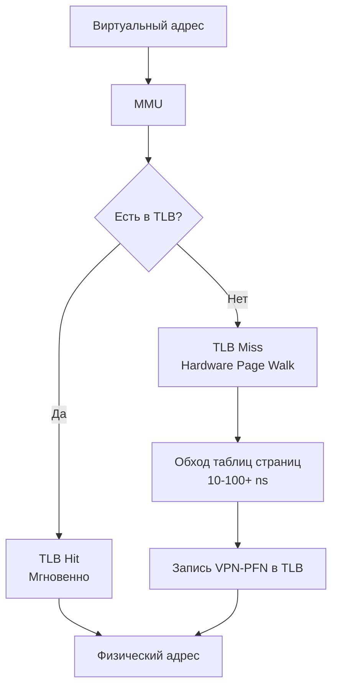

В прошлой статье [[28. Page Table, MMU и трансляция адресов]] мы столкнулись с фундаментальной архитектурной проблемой: многоуровневые таблицы страниц (Page Tables) спасают нас от нехватки памяти, но убивают производительность. 

Если каждый виртуальный адрес требует четырех обращений к оперативной памяти (для обхода уровней PML4, PDP, PD и PT), то чтение одной переменной в Go занимало бы не 10 наносекунд, а все 400. Центральный процессор превратился бы в невероятно быструю машину, которая 99% времени просто ждет данных.

Чтобы спасти ситуацию, инженеры применили свой любимый трюк — кэширование. Для обхода «налога на трансляцию» в MMU встроили специализированный кэш: **TLB (Translation Lookaside Buffer)**.

---

## Что такое TLB?

**TLB (Буфер ассоциативной трансляции)** — это крошечный, но невероятно быстрый аппаратный кэш внутри процессора (часть MMU). Он хранит результаты последних переводов виртуальных адресов страниц (VPN) в физические фреймы (PFN).

Его можно представить как `map[uintptr]uintptr` на стероидах, реализованный прямо в кремнии.

Когда ваша Go-программа обращается к памяти, MMU работает по следующему алгоритму:
1. Извлекает виртуальный номер страницы (VPN) из адреса.
2. Параллельно опрашивает все ячейки TLB.
3. **TLB Hit (Попадание)**: Если адрес найден, MMU мгновенно (за 0.5–1 такт CPU) получает физический адрес. Никаких обращений к Page Table не происходит!
4. **TLB Miss (Промах)**: Если адреса нет, процессор вынужден делать **Hardware Page Walk** — мучительный проход по дереву страниц в памяти. Найдя адрес, он записывает его в TLB и только потом отдает данные.

### Анатомия TLB

Подобно кэшам данных (о которых мы говорили в [[18. Кэши CPU. L1, L2, L3 и Cache Line]]), TLB иерархичен:
* **L1 TLB (ITLB для инструкций и DTLB для данных)**: Очень быстрый, но вмещает всего около 64–128 записей.
* **L2 TLB (Общий)**: Более медленный, но вмещает 1024–4096 записей.

В чем главная проблема? Размер. 1024 записи * 4 КБ (размер одной страницы) = **всего ~4 Мегабайта** адресного пространства, которое процессор может «помнить» одновременно. 

> [!info] Под капотом
> При переключении контекста (Context Switch) между процессами ОС меняет адрес корневой таблицы страниц (регистр CR3). Раньше это приводило к **TLB Flush** — полному сбросу всего кэша трансляций, так как виртуальные адреса старого процесса недействительны для нового. Это делало переключение контекста катастрофически дорогим. 
> Современные CPU используют **PCID (Process-Context Identifiers)** или **ASID (Address Space ID)**. К каждой записи в TLB добавляется ID процесса. Это позволяет не сбрасывать TLB при смене контекста, что особенно критично в облачных средах и при частых системных вызовах.

---

## Mechanical Sympathy: TLB Thrashing в Go

Понимание размеров TLB объясняет, почему некоторые структуры данных в Go работают на порядки быстрее других, даже если их алгоритмическая сложность ($O$) одинакова.

Представьте, что вы обходите массив (слайс) структур.
Слайс гарантирует **непрерывность** в памяти. Когда вы читаете первый элемент, происходит TLB Miss. Страница 4 КБ (содержащая этот элемент и сотни следующих) загружается в TLB. Следующие сотни итераций цикла будут попадать в кэш — у вас будет 100% TLB Hit Rate, пока вы не пересечете границу в 4 КБ.

А теперь представьте, что вы обходите связный список (`container/list`) или дерево, где узлы разбросаны по куче (Heap) в результате аллокаций в разное время.
Каждый переход по указателю `node.next` с высокой вероятностью отправляет вас в совершенно новую 4-килобайтную страницу. 

Если ваш граф объектов занимает 50 МБ, а TLB покрывает только 4 МБ, вы начинаете вытеснять старые записи из TLB быстрее, чем успеваете ими воспользоваться. Это состояние называется **TLB Thrashing**. 

В этот момент CPU тратит больше времени на Hardware Page Walk (обход таблиц трансляции), чем на выполнение вашего Go-кода.

> [!tip] Собеседование
> **Вопрос:** Почему при итерации слайс всегда выигрывает по скорости у `map` или связного списка, даже если данных немного?
> **Ответ:** Причины три, и они идут каскадом:
> 1. Отсутствие оверхеда на хэширование (как в мапах).
> 2. Аппаратный Prefetching данных в L1-кэш CPU.
> 3. **Минимум TLB Misses**. Слайс — это непрерывный блок. Доступ к тысяче элементов подряд потребует загрузки всего одной или двух записей в TLB. Указатели же заставят MMU постоянно бегать в оперативную память за Page Tables.

### Garbage Collector и TLB

Сборщик мусора Go — это фанатичный сканер памяти. На фазе Mark (пометка) он должен обойти весь граф живых объектов. Если у вас огромная куча (Heap) на десятки гигабайт с миллионами мелких объектов, соединенных указателями, GC будет скакать по страницам памяти как безумный.

Это вызывает лавину промахов в TLB. Именно поэтому профилирование часто показывает, что во время работы GC падает производительность самих рабочих горутин (Mutators). GC не просто отнимает такты CPU, он "загрязняет" кэши (TLB и L1/L2/L3), вымывая оттуда данные, нужные вашему бизнес-коду.

Использование `sync.Pool` и оптимизация аллокаций в Go — это не только снижение нагрузки на сам GC, но и **борьба за локальность данных**. Объекты, переиспользуемые из пула, с большей вероятностью остаются на "горячих" страницах памяти, которые уже прописаны в TLB.

---

## Итог

1. **TLB** — это кэш трансляций адресов внутри MMU.
2. Промах мимо TLB — это **штраф в 10-100+ наносекунд**, так как MMU вынужден обходить 4-уровневое дерево страниц в памяти.
3. Емкость TLB ничтожна (покрывает мегабайты памяти).
4. Разбросанные по куче аллокации (обилие указателей, деревья, мелкие интерфейсы) убивают производительность бэкенда не только кэш-промахами процессора, но и TLB-промахами.

Мы подошли к интересному парадоксу. Серверы баз данных (PostgreSQL, Clickhouse) и высоконагруженные кэши (Redis) работают с сотнями гигабайт памяти. TLB, вмещающий 4096 страниц по 4 КБ (всего 16 МБ), для них — капля в море. TLB Thrashing убил бы любую базу данных.

Как разработчики баз данных и операционных систем решили эту проблему без увеличения физических размеров TLB в процессоре? Об этом мы поговорим в следующей статье: [[30. Huge Pages и Transparent Huge Pages]].