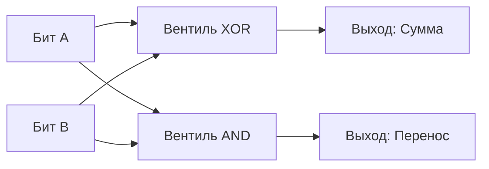
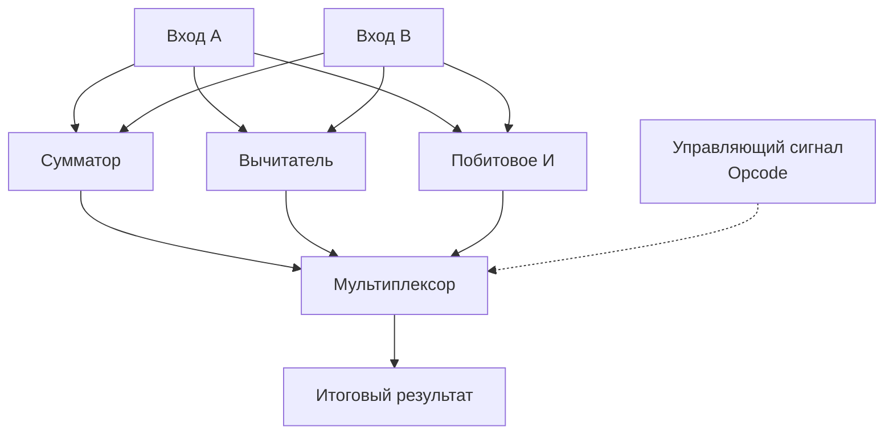

В прошлой статье мы остановились на логических вентилях — микроскопических схемах, которые аппаратно реализуют булеву логику (AND, OR, XOR). Но процессор должен не просто сравнивать биты, он должен выполнять арифметические операции, вычислять адреса в памяти и управлять потоком команд.

Чтобы кремний начал выполнять полезную работу, вентили нужно объединить в более сложные схемы. Этот класс схем называется **Комбинационной логикой (Combinational Logic)**.

Главное свойство комбинационной логики: **ее выходной сигнал зависит исключительно от текущей комбинации входных сигналов**. В ней нет понятия времени, состояния или памяти. Если провести аналогию с Go, комбинационная схема — это чистая функция (pure function): при одних и тех же аргументах она всегда мгновенно (с поправкой на скорость электронов) возвращает один и тот же результат, не опираясь на глобальные переменные.

Давайте научим кремний считать.

## Полусумматор: Сложение двух битов

Сложение в двоичной системе работает так же, как в десятичной, только у нас есть всего две цифры — 0 и 1.
*   0 + 0 = 0
*   0 + 1 = 1
*   1 + 0 = 1
*   1 + 1 = 10 (в десятичной это 2)

Обратите внимание на последний случай. При сложении двух единиц результат не помещается в один бит. Нам нужен второй бит — **бит переноса (Carry)**. Таким образом, у нашей схемы должно быть два входа (бит A и бит B) и два выхода (Сумма и Перенос).

Если мы посмотрим на таблицу истинности, то увидим магию:
1. Выход "Сумма" в точности повторяет логику вентиля **XOR** (равен 1, только если входы разные).
2. Выход "Перенос" в точности повторяет логику вентиля **AND** (равен 1, только если оба входа равны 1).

Мы только что спроектировали **Полусумматор (Half Adder)**. На Go (как программная модель железа) это выглядело бы так:

```go
func HalfAdder(a, b uint8) (sum, carry uint8) {
	// Аппаратная реализация на уровне вентилей
	sum = a ^ b   // Вентиль XOR
	carry = a & b // Вентиль AND
	return sum, carry
}
```



## Полный сумматор: Учитываем перенос

Полусумматор прекрасен, но он может сложить только два младших бита числа. При сложении следующих битов нам нужно учитывать перенос из предыдущего разряда. Значит, нам нужна схема с **тремя** входами: Бит A, Бит B и Входящий перенос (Carry In).

Такая схема называется **Полным сумматором (Full Adder)**. Под капотом она состоит из двух полусумматоров и одного вентиля OR.

```go
func FullAdder(a, b, carryIn uint8) (sum, carryOut uint8) {
	// Первый полусумматор складывает a и b
	sum1, carry1 := HalfAdder(a, b)
	
	// Второй полусумматор складывает результат и входящий перенос
	sum, carry2 := HalfAdder(sum1, carryIn)
	
	// Если любой из полусумматоров сгенерировал перенос - передаем его дальше
	carryOut = carry1 | carry2 // Вентиль OR
	
	return sum, carryOut
}
```

## Как складываются 64-битные числа

Теперь у нас есть строительный блок. Чтобы процессор мог сложить два 64-битных числа (`uint64`), инженеры ставят 64 полных сумматора в ряд. Бит переноса (`carryOut`) от первого сумматора проводом соединяется со входом `carryIn` второго сумматора, и так далее по цепочке. 

Эта схема называется **Ripple-Carry Adder (Сумматор с последовательным переносом)**.

> [!info] Под капотом: Проблема Ripple-Carry
> Хотя такая схема работает, у нее есть фатальный недостаток в контексте железа — **задержка распространения сигнала (Propagation Delay)**.
> 64-й сумматор не может выдать правильный ответ, пока не получит сигнал переноса от 63-го, который ждет 62-го и так до самого начала. Электрическому сигналу нужно физическое время, чтобы пройти через сотни транзисторов. 
> Если бы современные CPU использовали Ripple-Carry Adder, они не смогли бы работать на частоте 5 ГГц (где на один такт отводится всего 0.2 наносекунды). 
> **Решение:** Современные ALU используют архитектуру **Carry-Lookahead Adder (Сумматор с ускоренным переносом)**. Она использует дополнительную сложную комбинационную логику, чтобы вычислить биты переноса для старших разрядов параллельно, предсказывая их на основе младших битов. Это требует больше транзисторов и площади на кристалле кремния, но выполняет сложение за 1 такт CPU.

## Рождение ALU и Мультиплексоров

Мы научили схему складывать. Но процессору нужно уметь и вычитать, и умножать, и делать побитовые сдвиги. Для каждой операции на кристалле создается отдельная аппаратная комбинационная схема. Все они объединяются в **ALU (Арифметико-логическое устройство)**.

Как ALU понимает, какую операцию выполнить прямо сейчас? Через инструкцию, которую подает Control Unit процессора (об этом в [[6. Анатомия CPU. Datapath, Control Unit и Register File]]). 

Внутри ALU данные подаются одновременно на **все** блоки (и на сумматор, и на умножитель, и на XOR-блок). Все они параллельно вычисляют результат. Но наружу выходит только один правильный ответ. Как? С помощью **Мультиплексора (MUX)**.

Мультиплексор — это комбинационная схема, которая работает как аппаратный оператор `switch`. Он принимает несколько потоков данных и специальный управляющий сигнал (Opcode). В зависимости от Opcode, мультиплексор подключает к выходу ALU только тот провод, который содержит нужный результат, игнорируя остальные.



## Mechanical Sympathy: Пакет math/bits и переполнение

Понимание работы сумматора критически важно для Go-разработчика при работе с битовыми операциями и криптографией. 

Что происходит при **целочисленном переполнении (Integer Overflow)**?
Если мы складываем два `uint64` числа, и результат не помещается в 64 бита, самый старший сумматор генерирует `carryOut = 1`. Но 65-го сумматора нет! Этот провод физически никуда не подключен в шине данных. Бит просто теряется (отбрасывается), а число "оборачивается" через ноль.

Однако этот 65-й бит переноса не исчезает бесследно. ALU отправляет его в специальный **Регистр флагов (FLAGS register)** процессора, устанавливая **Carry Flag (CF)**. 

В стандартном Go при сложении `a + b` переполнение игнорируется (флаг CF процессора не проверяется ради производительности). Но если вы пишете криптографические алгоритмы или работаете с числами больше 64 бит (например, `uint128` или `uint256`), вам нужно знать, был ли перенос.

Для этого в стандартной библиотеке Go есть пакет `math/bits`.

```go
package main

import (
	"fmt"
	"math"
	"math/bits"
)

func main() {
	var a uint64 = math.MaxUint64 // Все биты равны 1
	var b uint64 = 5

	// Обычное сложение (переполнение игнорируется)
	regularSum := a + b
	fmt.Printf("Обычная сумма: %d\n", regularSum) // Выведет 4

	// Использование bits.Add64
	sum, carryOut := bits.Add64(a, b, 0)
	fmt.Printf("Сумма: %d, Бит переноса: %d\n", sum, carryOut) // Сумма 4, Перенос 1
}
```

> [!tip] Собеседование
> **Вопрос:** Функция `bits.Add64` возвращает два значения. Насколько она медленнее обычного сложения `a + b`, ведь ей нужно вернуть дополнительную переменную, что увеличивает нагрузку на память/регистры?
> **Ответ:** Она **не медленнее**. Пакет `math/bits` в Go — это магия компилятора. Если вы заглянете в исходный код пакета, вы не увидите реализации этой функции на Go. Компилятор Go распознает вызов `bits.Add64` и напрямую заменяет его на **одну-две ассемблерные инструкции** (например, `ADD` и чтение флага CF через инструкцию `ADC` или `SETC` на amd64). Никаких накладных расходов на вызов функции (overhead) не происходит — это называется *Intrinsic функция*.

## Итог

1. **Комбинационная логика** строит схемы без памяти, где выход — это чистая функция входов.
2. **Сумматор** физически собирается из логических вентилей (XOR и AND).
3. **Ripple-Carry** последователен и медленен, поэтому железо использует параллельный **Carry-Lookahead**, меняя площадь кристалла на скорость O(1).
4. **ALU и Мультиплексор** вычисляют все возможные операции разом, но на выход выдают только запрошенную.
5. Инструкции пакета `math/bits` в Go не являются обычными функциями — они напрямую маппятся на аппаратные флаги переноса (Carry Flag) вашего ALU через intrinsic-оптимизации компилятора.

Мы научили кремний принимать решения и считать. Но наша машина всё ещё страдает тяжелейшей формой амнезии — как только сигнал (ток) пропадает, схема моментально забывает результат. Чтобы построить процессор и оперативную память, нам нужно научить кремний хранить состояние. Этим мы займемся в следующей статье: [[4. Последовательностная логика. Учим кремний помнить]].