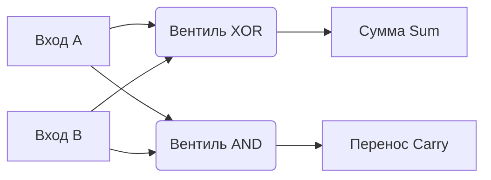

## От логики к арифметике

В прошлой статье мы выяснили, что транзисторы можно объединить в логические вентили (AND, OR, XOR), которые выполняют простейшие булевы операции. Но процессор должен уметь выполнять математику. 

Как с помощью логики заставить кремний складывать числа? Для этого используется **комбинационная логика** — цифровые схемы, в которых выходной сигнал зависит *только* от текущей комбинации входных сигналов. В этих схемах нет памяти, они не знают, что происходило миллисекунду назад.

Давайте научим компьютер складывать числа, начав с самых азов — сложения двух битов.

## Полусумматор (Half Adder)

Вспомним правила двоичного сложения для двух битов (A и B):
- `0 + 0 = 0`
- `0 + 1 = 1`
- `1 + 0 = 1`
- `1 + 1 = 10` (в двоичной системе это 2. Ноль пишем, единицу "держим в уме" — переносим в следующий разряд).

Если мы посмотрим на результат сложения (Sum), то увидим, что он в точности повторяет таблицу истинности вентиля **XOR** (Исключающее ИЛИ).
А бит переноса "в уме" (Carry) равен единице только тогда, когда оба входа равны 1. Это в точности вентиль **AND** (Логическое И).

Объединив эти два вентиля, инженеры создали схему, которая называется **Полусумматор**.



Почему он "полу-"? Потому что он умеет складывать только два бита. Но при сложении столбиком многоразрядных чисел нам нужно складывать *три* бита: бит A, бит B и бит переноса от предыдущего сложения.

## Полный сумматор (Full Adder)

Чтобы сложить три бита, нам нужно объединить два полусумматора и добавить вентиль **OR** для обработки итогового переноса. Эта схема называется **Полным сумматором**.

1. Первый полусумматор складывает входы `A` и `B`.
2. Второй полусумматор берет результат первого и складывает его со входом `Carry-In` (перенос от предыдущего разряда).
3. Вентиль `OR` собирает биты переноса от обоих полусумматоров и выдает итоговый `Carry-Out` для следующего разряда.

Именно этот микроскопический блок (состоящий примерно из 15-20 транзисторов) является сердцем АЛУ (Арифметико-логического устройства) в любом процессоре.

## Многоразрядный сумматор и каскадирование

Имея полный сумматор (который обрабатывает один разряд), мы можем соединить их в цепочку! 
Выход переноса (`Carry-Out`) нулевого бита подключается ко входу переноса (`Carry-In`) первого бита, и так далее. 

Чтобы сложить два 64-битных числа, процессору нужно выстроить в каскад 64 полных сумматора. Такая схема называется **Ripple-Carry Adder** (Сумматор со сквозным переносом).

> [!info] Под капотом
> Электрическому сигналу нужно время, чтобы пройти через физический кремний вентилей (Propagation Delay). В Ripple-Carry сумматоре 63-й бит не может вычислить сумму, пока перенос не "докатится" до него от 0-го бита. В современных CPU, работающих на частотах 4-5 ГГц, ждать так долго нельзя. Поэтому там используют сложнейшие схемы **Carry-Lookahead Adder (Сумматор с ускоренным переносом)**, которые вычисляют все биты переноса параллельно за счет огромного усложнения схемы (используя тысячи дополнительных транзисторов). В этом и состоит плата за высокую производительность — процессор занимает больше площади и сильнее греется.

## Мультиплексоры (Hardware `switch-case`)

Кроме сложения, АЛУ должно уметь вычитать, делать побитовые сдвиги и логические операции. Как процессор "понимает", какую именно операцию мы от него хотим?

Для этого используются **Мультиплексоры (MUX)** — комбинационные схемы, которые работают как стрелочники на железной дороге или как оператор `switch` в Go. 
Мультиплексор принимает несколько потоков данных и специальный управляющий сигнал (OpCode инструкции из машинного кода). В зависимости от управляющего сигнала, он пропускает на выход только один нужный результат.

## Практика на Go. Пишем софтовый кремний

Концепция [[Механическая симпатия|Mechanical Sympathy]] означает, что мы можем переложить принципы работы железа на наш код. Давайте напишем симуляцию полного сумматора на Go, используя только побитовые операции, которые один-в-один повторяют аппаратные вентили.

```go
package main

import "fmt"

// FullAdder симулирует аппаратный полный сумматор с помощью побитовых вентилей.
// В качестве входов используем 0 или 1 (uint8).
func FullAdder(a, b, carryIn uint8) (sum, carryOut uint8) {
	// --- Полусумматор 1 ---
	sum1 := a ^ b    // Вентиль XOR
	carry1 := a & b  // Вентиль AND

	// --- Полусумматор 2 ---
	sum = sum1 ^ carryIn         // Вентиль XOR (Итоговая сумма текущего разряда)
	carry2 := sum1 & carryIn     // Вентиль AND

	// --- Итоговый перенос ---
	carryOut = carry1 | carry2   // Вентиль OR (Перенос в следующий разряд)

	return sum, carryOut
}

func main() {
	// Сложим два бита (1 + 1) и входящий перенос (1).
	// В десятичной системе это 1 + 1 + 1 = 3.
	// В двоичной системе это 11 (сумма 1, перенос 1).
	
	s, c := FullAdder(1, 1, 1)
	fmt.Printf("Сумма: %d, Перенос: %d\n", s, c) 
	// Вывод: Сумма: 1, Перенос: 1
}
```
Этот код — не просто абстракция. Именно так компилятор и процессор физически вычислят выражение `result := a + b` в вашем реальном проекте, только сделают это аппаратно и сразу для 64 бит.

> [!tip] Собеседование
> **Вопрос:** В чём принципиальная разница между 32-битным и 64-битным процессором (и почему 64-битная архитектура работает быстрее с большими числами)?
> **Ответ:** Разрядность (bitness) процессора определяет ширину его регистров и размер АЛУ. В 64-битном процессоре физически реализовано 64 полных сумматора. Если вы складываете два 64-битных числа типа `int64` (или `int` в Go на 64-битной ОС), процессор делает это за **1 такт**. 
> На 32-битном процессоре для сложения двух `int64` придется задействовать АЛУ дважды (сначала сложить младшие 32 бита, сохранить перенос `Carry-Out`, затем сложить старшие 32 бита с этим переносом), что потребует дополнительных тактов и замедлит выполнение.

## Итог

Мы научили кремний принимать данные и мгновенно (со скоростью света в полупроводнике) пропускать их через лабиринт из транзисторов, превращая `ADD A, B` в результат. 

Но у комбинационной логики есть критический изъян: **у нее нет памяти**. Как только мы отключим входной сигнал `A` или `B`, наш сумматор мгновенно потеряет результат сложения. Чтобы компьютер мог выполнять программы, ему нужно сохранять результаты шагов в регистры или оперативную память.

Для этого нам потребуется создать замкнутую петлю, где кремний начнет "кусать себя за хвост". Об этом мы поговорим в следующей статье: [[4. Последовательностная логика. Учим кремний помнить]].