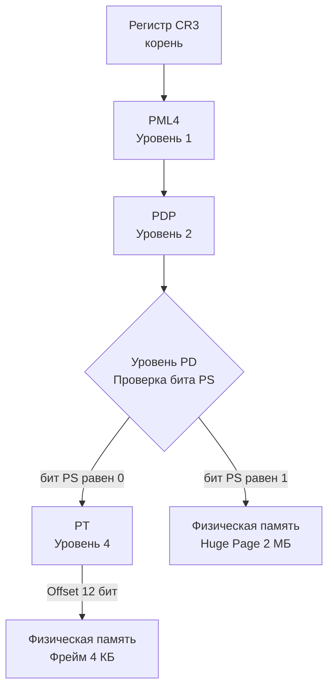

## Математика промахов: Почему 4 КБ — это слишком мало?

В статье [[29. TLB. Translation Lookaside Buffer и стоимость промаха]] мы остановились на фундаментальной проблеме: кэш трансляций адресов (TLB) катастрофически мал. 

Давайте посчитаем. Типичный L1 DTLB (Data TLB) современного процессора вмещает 64 записи. Если каждая запись покрывает стандартную страницу в 4 КБ, то процессор может быстро адресовать всего:
$64 \times 4096 = 256$ Килобайт памяти.

L2 TLB больше, около 1536 записей. $1536 \times 4096 \approx 6$ Мегабайт.

А теперь представьте ваш типичный Go-бэкенд. В памяти висят кэши на пару гигабайт, горутины жонглируют структурами, сборщик мусора (GC) сканирует кучу. Рабочий набор данных (Working Set) исчисляется гигабайтами. При 4 КБ страницах TLB-промахи становятся неизбежным узким местом, и процессор тратит до 15-20% процессорного времени просто на "Hardware Page Walk" — обход таблиц страниц.

Ответ инженеров на эту проблему был прямолинеен: если мы не можем увеличить количество записей в TLB аппаратно (это дорого и делает кэш медленным), давайте **увеличим размер самой страницы**.

---

## Huge Pages: Большие страницы

**Huge Pages (Огромные страницы)** — это механизм ОС и процессора, позволяющий использовать страницы памяти большего размера. В архитектуре x86_64 аппаратно поддерживаются два дополнительных размера: **2 МБ** и **1 ГБ**.

Вернемся к нашему L2 TLB на 1536 записей. Если страницы весят 2 МБ, то один и тот же кэш TLB покроет уже:
$1536 \times 2$ Мегабайта = **3 Гигабайта памяти!**

TLB-промахи для типичного приложения практически исчезают.

### Как это выглядит "под капотом" MMU?

В статье [[28. Page Table, MMU и трансляция адресов]] мы разбирали 4-уровневую иерархию таблиц страниц: `PML4 -> PDP -> PD -> PT`.

Для поддержки Huge Pages инженеры не стали придумывать новую структуру. Они добавили специальный бит **PS (Page Size)** в записи таблиц уровня PD (Page Directory) и PDP (Page Directory Pointer).

Когда MMU выполняет трансляцию адреса и доходит до уровня PD (3-й уровень), он проверяет бит PS. 
* Если `PS == 0`, то MMU идет дальше, на уровень PT, чтобы найти 4 КБ фрейм.
* Если `PS == 1`, MMU **останавливает обход (short-circuit)**. Он понимает, что запись в PD уже указывает на начало физического фрейма размером 2 МБ. Оставшиеся 21 бит виртуального адреса становятся Offset-ом внутри этой гигантской страницы.



> [!info] Под капотом
> Для использования 1 ГБ страниц бит `PS` устанавливается еще раньше — на уровне PDP (2-й уровень). Смещение (Offset) в таком случае занимает 30 бит виртуального адреса. 1 ГБ страницы используются редко, в основном для гигантских in-memory баз данных или виртуалок.

---

## Проблема Explicit Huge Pages

Исторически, чтобы использовать Huge Pages, администратор должен был:
1. Выделить их на уровне ядра при загрузке системы (параметр `hugepages=X`).
2. Смонтировать специальную файловую систему `hugetlbfs`.
3. Приложение должно было явно использовать `mmap` с флагом `MAP_HUGETLB`.

Это было крайне неудобно для разработчиков прикладного софта. Вы не могли просто запустить бинарник и получить ускорение — требовалась сложная настройка серверов инфраструктуры.

Чтобы демократизировать Huge Pages, разработчики ядра Linux придумали **THP**.

---

## Transparent Huge Pages (THP)

**THP (Прозрачные огромные страницы)** — это механизм ядра Linux, который пытается дать приложениям преимущества Huge Pages автоматически, без изменения кода программ.

Как это работает:
1. Вы запускаете Go-приложение. Оно делает стандартные аллокации, ОС выдает ему обычные 4 КБ страницы.
2. В фоне работает ядерный поток **`khugepaged`**.
3. Он сканирует память процессов. Если он находит 512 смежных виртуальных страниц по 4 КБ (и они лежат в непрерывном куске физической памяти), он незаметно для приложения «схлопывает» их (collapsing) в одну 2 МБ Huge Page, обновляя Page Table и TLB.

Звучит идеально? Да, но именно из-за THP вы прочитаете десятки статей с заголовком "Why we disabled THP on our database".

> [!warning] Ловушка / Gotcha
> У THP есть три режима работы, контролируемые файлом `/sys/kernel/mm/transparent_hugepage/enabled`:
> 1. `always` — ОС пытается использовать THP для любой памяти.
> 2. `madvise` — ОС использует THP только для тех блоков памяти, где приложение явно попросило об этом (через syscall `madvise`).
> 3. `never` — Полностью выключено.
> 
> По умолчанию в Ubuntu/Debian долгое время стоял `always`.

### Тёмная сторона THP: Синхронная компактизация и Latency Spikes

Если система работает давно, физическая память фрагментируется. Свободные 4 КБ страницы разбросаны повсюду, и найти непрерывный кусок в 2 МБ становится невозможно.

При режиме `always`, когда ваше приложение делает аллокацию (например, Go-рантайм расширяет кучу), ядро может сказать: "Я хочу выдать 2 МБ страницу, но куска нет. Я сейчас остановлю процесс и выполню **дефрагментацию физической памяти**". 

Начинается синхронная компактизация (Direct Compaction). Ядро копирует страницы памяти туда-сюда, чтобы освободить непрерывные 2 МБ. В этот момент ваша Go-программа "зависает" в системном вызове. И этот спайк latency может достигать сотен миллисекунд! 

Для высоконагруженного бэкенда на Go с жесткими SLA по таймингам (например, ответ за 50 мс) — это катастрофа.

> [!tip] Собеседование
> **Вопрос:** Почему Redis, MongoDB и PostgreSQL в документации умоляют отключить THP (перевести в `never` или `madvise`)?
> **Ответ:** > 1. **Задержки (Latency Spikes)**: Из-за синхронной компактизации памяти ядром.
> 2. **Memory Bloat**: Если базе нужно выделить 10 КБ, THP в режиме always может "насильно" выделить 2 МБ.
> 3. **Copy-on-Write (CoW) амплификация**: Базы данных часто делают снимки (snapshots) в фоне с помощью системного вызова `fork()`. При `fork()` страницы шарятся между процессами. Если дочерний процесс меняет 1 байт в странице, ОС должна скопировать всю страницу. Без THP копируется 4 КБ. С THP копируется 2 МБ ради одного байта. Память улетает в OOM мгновенно.

---

## Рантайм Go и Huge Pages

Как ко всему этому относится Go?

Аллокатор памяти Go (`mheap`) управляет памятью крупными блоками — **аренами (Arenas)**. В современных версиях Go (на 64-битных системах) размер одной арены составляет **64 МБ**. Более того, Go специально выравнивает эти арены по адресам, кратным 2 МБ.

То есть структура кучи Go изначально **идеально спроектирована под Huge Pages**.

Начиная с Go 1.21, рантайм официально и прозрачно поддерживает THP, но делает это по-умному. Go не полагается на режим ОС `always`. Вместо этого, при выделении больших кусков памяти для GC или крупных структур, Go делает системный вызов `madvise` с флагом `MADV_HUGEPAGE`.

```c
// Логика работы рантайма Go (псевдокод на C-подобном синтаксисе)
void* mem = mmap(NULL, 64 * 1024 * 1024, PROT_READ|PROT_WRITE, MAP_PRIVATE|MAP_ANONYMOUS, -1, 0);
madvise(mem, 64 * 1024 * 1024, MADV_HUGEPAGE); // Go просит ядро: "Пожалуйста, используй THP для этой арены"
```

Если в ОС включен режим `/sys/kernel/mm/transparent_hugepage/enabled = madvise` (что является best-practice сегодня), ядро Linux будет использовать Huge Pages **только для арен Go**, не трогая мелкие аллокации и не устраивая глобальную компактизацию всего подряд.

### Когда отключать THP для Go?

Даже при правильном использовании `madvise` рантаймом, на сильно фрагментированных серверах (например, если на одном железе крутится много разных сервисов) процесс `khugepaged` может потреблять слишком много CPU в фоне. 

В Go есть скрытый механизм отключения этой фичи. Если вы видите необъяснимые микро-фризы, вы можете запустить приложение с переменной окружения:
```bash
GODEBUG=disablethp=1 go run main.go
```
Это заставит рантайм Go не использовать вызовы `madvise` для Huge Pages. Если спайки пропали — значит, проблема была в дефрагментации памяти на уровне ОС.

---

## Итоги

1. **Huge Pages (2 МБ / 1 ГБ)** спасают от TLB Thrashing, резко сокращая размер таблиц страниц и увеличивая эффективность кэшей CPU.
2. **Бит PS** в структурах Page Table позволяет аппаратно "срезать путь" при трансляции адресов.
3. **THP** — автоматизирует использование Huge Pages, но может убить latency из-за синхронной компактизации.
4. **Рантайм Go** дружит с Huge Pages: выделяет память кусками по 64 МБ и явно подсказывает ОС использовать для них `MADV_HUGEPAGE`.
5. Best Practice для серверов под базы данных и бэкенд — переводить THP в режим `madvise`.

Теперь, когда мы разобрались, как CPU транслирует адреса и кэширует их с помощью TLB и Huge Pages, нам нужно взглянуть на сервер в целом. Современный сервер — это не один процессор с одной плашкой памяти. Это несколько физических сокетов, где память распределена неравномерно. Об этом — в следующей статье: [[31. NUMA. Non Uniform Memory Access]].