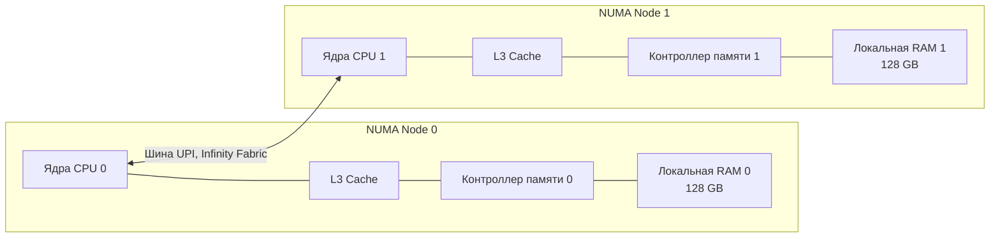

## Иллюзия единого пула памяти

В предыдущей статье [[30. Huge Pages и Transparent Huge Pages]] мы победили промахи в TLB, увеличив размер страниц. Нам кажется, что теперь CPU может эффективно адресовать терабайты оперативной памяти. Мы пишем код, создаем слайсы на гигабайты и думаем, что физическая RAM — это один большой, однородный массив байтов, доступный процессору с одинаковой скоростью.

На вашем рабочем ноутбуке так оно и есть. Эта архитектура называется **UMA (Uniform Memory Access — Однородный доступ к памяти)**. Все ядра процессора подключены к одному контроллеру памяти, и доступ к любой ячейке занимает одинаковое время.

Но когда ваш Go-код деплоится на production-сервер с 2 или 4 физическими процессорами (сокетами) или на современные многочиповые процессоры (AMD EPYC), правила игры кардинально меняются. UMA перестает работать: одна шина памяти просто физически не способна пропустить трафик от 128 ядер.

На сцену выходит **NUMA (Non-Uniform Memory Access — Неоднородный доступ к памяти)**.

---

## Архитектура NUMA: Разделяй и властвуй

Чтобы снять "бутылочное горлышко" единой шины памяти, инженеры архитектур x86_64 и ARM перенесли контроллеры памяти прямо внутрь процессора и разделили физическую RAM между ними.

В NUMA-системе сервер логически разбивается на **NUMA-узлы (NUMA Nodes)**. 
Обычно один физический процессор (сокет) = один NUMA-узел (хотя в современных AMD EPYC и Intel Xeon один сокет может содержать несколько узлов).

* Каждый узел имеет свои собственные вычислительные ядра, свои кэши L1/L2/L3 и **свою локальную оперативную память**.
* Узлы соединены между собой сверхбыстрой шиной-интерконнектом (UPI у Intel, Infinity Fabric у AMD).



### Локальная vs Удаленная память

Слово "Неоднородный" в аббревиатуре NUMA означает разницу в цене доступа:
1. **Local Access (Локальный доступ)**: Ядро на Node 0 читает память, подключенную к Node 0. Это быстро (около 80-100 наносекунд).
2. **Remote Access (Удаленный доступ)**: Ядро на Node 0 пытается прочитать память, подключенную к Node 1. Запрос идет через ядро, выходит на межпроцессорную шину (UPI), стучится в контроллер памяти Node 1, забирает данные и идет обратно. 

Удаленный доступ добавляет **от 50% до 100% задержки** (latency возрастает до 130-180+ нс). Но что еще хуже — он забивает пропускную способность (bandwidth) интерконнекта. Если все ядра начнут читать чужую память, шина "встанет", и сервер, несмотря на сотни ядер, начнет жестоко тормозить.

---

## Linux и политика First-Touch

Как ОС понимает, в какую плашку памяти положить вашу переменную из Go?
Linux использует политику **First-Touch Allocation (Аллокация по первому касанию)**.

Когда вы делаете `make([]byte, 1<<30)` (выделяете 1 ГБ), как мы знаем из статьи про Page Table, реальная физическая память еще не выделяется.
Выделение физического фрейма происходит только в момент первой записи (когда летит Page Fault). 

Linux смотрит: "Ага, процесс вызвал Page Fault, исполняясь на ядре из Node 0. Значит, я выделю ему физическую страницу из локальной памяти Node 0".

> [!warning] Ловушка / Gotcha
> Это порождает классическую проблему инициализации. Если при запуске сервера один "главный" тред инициализирует гигантский in-memory кэш (читает из БД и пишет в мапу), вся эта память физически осядет на одной NUMA-ноде (где работал этот тред).
> Когда к кэшу начнут обращаться 1000 воркеров, раскиданных планировщиком ОС по всем ядрам сервера, половина из них будет ходить в память через медленный удаленный доступ (Remote Access), убивая производительность интерконнекта.

> [!tip] Собеседование
> **Вопрос:** Мы арендовали сервер на 256 ГБ RAM (два сокета по 128 ГБ). Наше приложение потребляет 150 ГБ. Внезапно мы видим, что сервер начал активно использовать Swap (своппинг), жестко тормозит, хотя `free -m` показывает, что свободно еще больше 100 ГБ памяти! Как такое возможно?
> **Ответ:** Это классический NUMA-дисбаланс (NUMA Imbalance). Ваше приложение запустилось на Node 0. Оно начало "съедать" память. Когда 128 ГБ на Node 0 закончились, ядро Linux (в зависимости от настройки `vm.zone_reclaim_mode`) решило не выделять удаленную память на Node 1, а начало скидывать старые страницы Node 0 в медленный своп на диске. Чтобы исправить это, приложение нужно запускать через `numactl --interleave=all`, что заставит ОС "размазывать" страницы памяти равномерно по всем нодам.

---

## Mechanical Sympathy: Go-рантайм и NUMA

Как к NUMA относится наш любимый Go?
Исторически — **никак**. В отличие от Java (где JVM умеет делать NUMA-aware GC и аллокации) или C++ (где вы можете использовать библиотеку `libnuma` для ручного пиннинга тредов и памяти), планировщик Go не знает о NUMA.

### Проблема планировщика (G-M-P)

В модели планировщика Go есть структуры `M` (треды ОС) и `P` (логические процессоры).
1. Рантайм Go не привязывает (не пинит) треды ОС (`M`) к конкретным ядрам или NUMA-узлам. Планировщик Linux волен перекидывать `M` с Node 0 на Node 1.
2. Когда горутина выделяет память под объект, он оказывается в памяти той ноды, где горутина исполнялась *в этот момент*.
3. Если ОС перекинет тред с горутиной на другой процессор, вся её "горячая" локальная память внезапно станет "холодной" удаленной памятью.

### Проблема сборщика мусора (GC)

Это самый страшный кошмар для latency в Go на многосокетных серверах.
Сборщик мусора Go — конкурентный. Во время фазы Mark (пометка живых объектов) Go будит 25% всех доступных процессоров (`P`), чтобы они сканировали кучу. 

Эти треды просыпаются на всех доступных NUMA-нодах. Тред GC, работающий на Node 1, начинает жадно сканировать указатели в памяти, которая была выделена на Node 0. Это генерирует **гигантский шторм перекрестного трафика на шине UPI**. Бизнес-логика в этот момент замирает, так как интерконнект заблокирован трафиком сборщика мусора.

### Решения для Senior/Lead Go Engineers

Поскольку Go-рантайм пока не умеет управлять NUMA сам, на высоконагруженных серверах (High Frequency Trading, AdTech, Real-Time Streaming) инженеры используют архитектурный паттерн **Share-Nothing Architecture** на уровне развертывания.

Вместо того чтобы запускать один бинарник Go, который "сожрет" все 128 ядер на двух сокетах, мы делаем следующее:
1. Запускаем **два независимых экземпляра** нашего Go-микросервиса на одном сервере.
2. Используем утилиту Linux `numactl`, чтобы жестко привязать (pin) каждый экземпляр к своей ноде:
   ```bash
   # Запускаем первый инстанс строго на Node 0
   numactl --cpunodebind=0 --membind=0 ./my-go-service -port 8080
   
   # Запускаем второй инстанс строго на Node 1
   numactl --cpunodebind=1 --membind=1 ./my-go-service -port 8081
   ```
3. Ставим перед ними балансировщик (например, локальный Nginx или HAProxy), который раскидывает запросы.

В таком сетапе каждый Go-процесс живет в своем идеальном мире UMA. Планировщик Go тасует треды только внутри локального процессора, GC сканирует только локальную память, а межпроцессорная шина (UPI) полностью свободна, снижая p99 latency в разы.

---

## Итоги

1. **NUMA** — это реальность любых современных многосокетных серверов. Память разделена на локальную (быструю) и удаленную (медленную, идущую через общую шину).
2. **First-Touch** — ОС кладет страницы памяти туда, где они были впервые записаны.
3. Рантайм Go **NUMA-agnostic**. На машинах с >64 ядрами и множеством сокетов это приводит к серьезным просадкам из-за переброски горутин и работы GC через межпроцессорную шину.
4. Высший пилотаж инженерии на Go — запускать по одному независимому инстансу приложения на каждый NUMA-узел с помощью `numactl`.

Теперь мы знаем, как распределяются ядра и память на уровне дата-центра. Но если мы заглянем внутрь самого физического ядра CPU, мы обнаружим, что ОС видит в два раза больше "ядер", чем есть на самом деле. Как одно физическое ядро притворяется двумя? Об этом в следующей статье: [[32. Hyper Threading и SMT]].