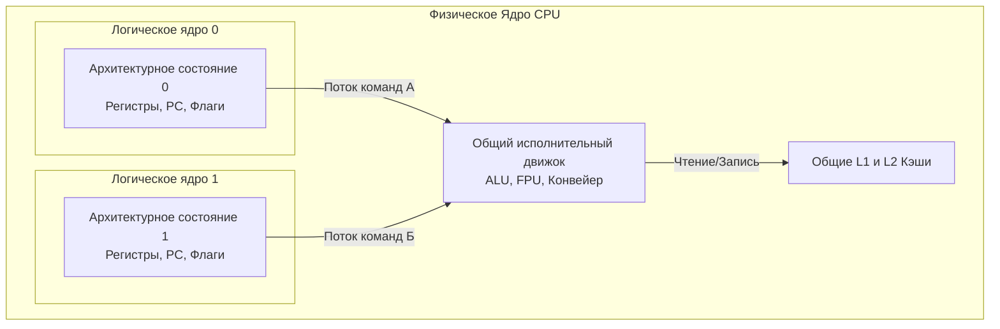

## Иллюзия ядер в htop

Вы арендуете сервер, провайдер заявляет: «8 ядер». Вы заходите по SSH, запускаете `htop` или вызываете в Go `runtime.NumCPU()`, и система радостно сообщает, что у вас **16 ядер**. Операционная система видит 16 независимых вычислительных единиц, на которые она может планировать потоки.

Но если вы снимете крышку сервера и посмотрите в спецификацию процессора, то увидите только 8 физических ядер. Откуда взялись еще 8? 

Это магия **SMT (Simultaneous Multithreading — Одновременная многопоточность)**. В мире процессоров Intel эта технология маркетологами была названа **Hyper-Threading (HT)**, но суть от этого не меняется. Чтобы понять, почему это не «бесплатные ядра» и как это влияет на ваши Go-приложения, нам придется вспомнить, из чего состоит процессор.

---

## Проблема простаивающего кремния

В статье [[12. Суперскалярность, Out Of Order Execution и Register Renaming]] мы говорили, что ядро современного процессора — это невероятно широкий конвейер. У него есть множество исполнительных устройств (Execution Units): несколько ALU для целочисленной математики, несколько FPU для чисел с плавающей точкой, блоки загрузки/сохранения (Load/Store).

Но в реальных программах на Go этот могучий конвейер постоянно **простаивает (Pipeline Stalls)**. 

Почему?
1. **Cache Miss**: Программа запросила данные, их не оказалось в L1/L2 (см. [[18. Кэши CPU. L1, L2, L3 и Cache Line]]). Процессор ждет сотни тактов, пока данные придут из RAM.
2. **Branch Misprediction**: Процессор не угадал ветвление `if err != nil`, и ему нужно сбросить весь конвейер.
3. **Data Dependency**: Инструкция Б ждет результата инструкции А, и не может выполниться раньше.

Пока физическое ядро ждет данные из памяти, его ALU и FPU просто простаивают, потребляя электричество. Инженеры задумались: если конвейер настолько широк, а один поток команд не может его загрузить полностью, почему бы не "скормить" ему сразу **два потока команд одновременно**?

---

## Как работает SMT под капотом

Чтобы выполнить программу, процессору не нужно дублировать *всё* ядро. Ему нужно продублировать только **Архитектурное состояние (Architectural State)**.

Архитектурное состояние — это то, что отличает один поток от другого:
* **Register File (Регистры)**: RAX, RBX, RDI и т.д.
* **Program Counter (PC/RIP)**: Указатель на текущую инструкцию.
* **Флаги состояний и регистры управления**.

В кремнии всё это архитектурное состояние занимает крошечную площадь (менее 5% от площади ядра). 

Но самое «мясо» ядра — **Исполнительный движок (Execution Engine, ALU, FPU) и Кэши (L1, L2)** — остаются **ОБЩИМИ**.

Когда планировщик ОС назначает два разных потока (например, две ваши горутины) на Логическое ядро 0 и Логическое ядро 1, физическое ядро начинает смешивать их инструкции в один большой котел.

Если поток А сделал `a = *ptr` и ушел в ожидание RAM (Cache Miss), процессор не останавливается. Он мгновенно, за 0 тактов (Zero Cycle Context Switch), начинает закидывать в ALU инструкции из потока Б. 

**SMT — это заполнение "пузырей" простоя в конвейере одного потока инструкциями из другого потока.**

---

## Mechanical Sympathy: Hyper-Threading и Go

Как только ваше Go-приложение стартует, рантайм смотрит на количество доступных ядер через системные вызовы ОС. ОС рапортует о наличии логических ядер (vCPU).

По умолчанию Go устанавливает переменную `GOMAXPROCS` равной количеству **логических ядер**. На нашем 8-ядерном сервере с SMT рантайм создаст 16 процессоров `P` в своей модели `G-M-P`. 

Это кажется правильным, но здесь кроются неочевидные архитектурные компромиссы.

> [!warning] Ловушка / Gotcha
> Многие разработчики ошибочно полагают, что 16 vCPU дадут производительность 16 физических ядер. Это иллюзия. 
> В зависимости от специфики кода SMT дает прирост производительности всего на **15% – 30%**. 
> Логические ядра не добавляют вычислительной мощности, они лишь утилизируют простой физических мощностей.

### 1. Когда SMT работает идеально (Web-backend)

Типичный микросервис на Go — это сплошной I/O, маршалинг JSON, обращения к БД и работа со строками. Это код, который генерирует огромное количество кэш-промахов (чтение из разных участков памяти, аллокации в куче) и ветвлений. 

Для такого профиля нагрузки SMT — это спасение. Пока одна горутина парсит JSON и ждет подгрузки данных в L1 кэш, вторая горутина на этом же физическом ядре активно считает хэш-сумму. Рантайм Go извлекает максимум пользы из `GOMAXPROCS = 16`.

### 2. Когда SMT вредит (Math & Cache Contention)

Представьте, что вы пишете на Go тяжелый математический код (например, перемножение больших матриц, криптография, сжатие видео), где код идеально оптимизирован:
* Нет промахов кэша (данные идут ровно).
* SIMD инструкции утилизируют FPU на 100%.

> [!tip] Собеседование
> **Вопрос:** Если мы запустим 16 горутин с тяжелой математикой (number crunching) на 8 физических ядрах с HT, будет ли это быстрее, чем 8 горутин?
> **Ответ:** Это может быть даже **медленнее**. 
> Обе логические горутины будут яростно конкурировать за общие ресурсы (ALU и FPU), которых у физического ядра фиксированное количество. Они будут мешать друг другу на уровне аппаратного планировщика ядра, создавая "пробки".

**Cache Thrashing (Разрушение кэша)**
Еще страшнее конкуренция за L1 кэш. Логическое ядро 0 и логическое ядро 1 используют один и тот же крошечный (обычно 32 КБ) кэш данных L1. 
Если ОС поместит на них два потока, которые агрессивно сканируют совершенно разные куски памяти, они начнут вытеснять данные друг друга из L1 кэша. Количество `Cache Misses` улетит в небеса, и производительность упадет в 2-3 раза.

---

## "Шумные соседи" и Безопасность в Облаке

Если вы арендуете виртуалку AWS EC2 (например, 2 vCPU), вы почти всегда получаете 2 **логических** ядра, которые могут делить одно **физическое** ядро с совершенно чужой виртуалкой (другим клиентом AWS).

Из-за того, что логические ядра делят L1/L2 кэши и предсказатель ветвлений, возник целый класс атак (Side-Channel Attacks), таких как **Spectre, Meltdown, L1TF**. Злоумышленник на Логическом ядре 1 может по таймингам доступа к кэшу угадать, какие криптографические ключи обрабатываются в вашем Go-сервисе на Логическом ядре 0.

Для борьбы с этим гипервизоры облачных провайдеров внедряют сложные изоляции, а в High-End энтерпрайзе (и особенно в HFT - High Frequency Trading) **Hyper-Threading часто отключают в BIOS**. Там стабильность задержек (Latency) и безопасность важнее, чем 20% прироста пропускной способности.

## Итог

1. **SMT (Hyper-Threading)** — дублирование архитектурного состояния процессора при сохранении общих вычислительных ресурсов и кэшей.
2. Операционная система и Go-рантайм (через `runtime.NumCPU()`) видят SMT как отдельные полноценные ядра.
3. Максимальный профит достигается на коде с высокой долей кэш-промахов (типичный бэкенд), но на "молотилках чисел" это может привести к деградации из-за конкуренции за ресурсы (Resource Contention).
4. Логические ядра на одном физическом ядре делят L1/L2 кэши, что может вызывать жестокий Cache Thrashing.

Мы рассмотрели, как одно ядро притворяется двумя. Но современные процессоры — это не просто набор ядер. Это сложнейшие сети, склеенные из отдельных кусков кремния. Чтобы понять, почему ядра в новых процессорах общаются с разной скоростью, в следующей статье мы разберем: [[33. Архитектура современных CPU. Chiplet, CCX, CCD, Ring Bus, Mesh]].