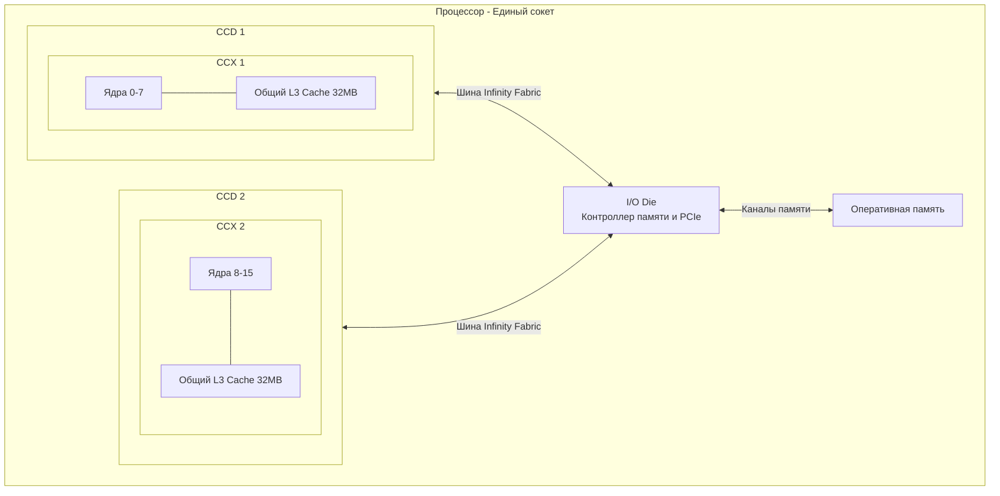

## Конец эпохи монолитов

Долгое время процессоры развивались по простому пути: транзисторы становились меньше, и инженеры упаковывали всё больше ядер на один большой кусок кремния. Такая архитектура называется **Монолитной (Monolithic Die)**. 

Но закон Мура начал давать сбой. Когда вы пытаетесь напечатать 64 ядра на одном кристалле, его площадь становится огромной. Из-за микроскопических дефектов кремниевых пластин (Yields) производство таких гигантов становится экономически невыгодным: одна пылинка убивает весь сверхдорогой чип.

Решение, которое перевернуло индустрию (и было популяризировано архитектурой AMD Zen), — это **Чиплеты (Chiplets)**. Процессор перестали делать единым куском кремния. Вместо этого его собирают как конструктор Lego из нескольких маленьких, дешевых в производстве кристаллов, склеенных на одной подложке.

Для нас, разработчиков высоконагруженных бэкендов на Go, это означает одно: **внутри одного процессора ядра больше не равны друг другу**.

---

## Архитектура AMD: CCX, CCD и Infinity Fabric

Чтобы понимать, как работает код на серверах с процессорами AMD EPYC или Ryzen, нужно выучить их анатомию.

1. **CCX (Core Complex)**: Базовый строительный блок. Это группа ядер (обычно 4 или 8), которые имеют **общий L3-кэш**. Если две горутины работают на ядрах внутри одного CCX, они делят данные через сверхбыстрый L3-кэш.
2. **CCD (Core Chiplet Die)**: Физический кусок кремния (чиплет), на котором располагаются CCX. В современных архитектурах (Zen 3 и новее) один CCD состоит ровно из одного CCX на 8 ядер и 32 МБ L3-кэша.
3. **cIOD (I/O Die)**: Отдельный кристалл в центре процессора. Он не выполняет вычислений. Его задача — работа с оперативной памятью (контроллеры памяти), шиной PCIe и связь всех CCD между собой.
4. **Infinity Fabric (IF)**: Внутрипроцессорная шина данных, которая соединяет CCD и cIOD в единую сеть.

> [!info] Под капотом
> В архитектуре Zen 2 (серверы EPYC Rome) внутри одного CCD было *два* независимых CCX по 4 ядра, каждый со своим куском L3-кэша. Это создавало чудовищные проблемы с маршрутизацией данных. Начиная с Zen 3 инженеры объединили 8 ядер в единый CCX с общим кэшем 32 МБ, что резко снизило задержки (latency) и дало буст в производительности баз данных и микросервисов.

---

## Архитектура Intel: Ring Bus и Mesh

Intel исторически придерживалась монолитного дизайна дольше конкурента (до поколения Meteor Lake/Sapphire Rapids). Но даже внутри монолита ядрам нужно как-то общаться друг с другом и с L3-кэшем.

### Ring Bus (Кольцевая шина)
Используется в десктопных процессорах (Core i5, i7, i9). Ядра, куски L3-кэша и контроллер памяти нанизаны на двухстороннее кольцо. 
* **Плюсы**: Идеальная, минимальная задержка (latency) для небольшого количества ядер (до 8-10).
* **Минусы**: Плохо масштабируется. Если насадить на кольцо 28 ядер, путь от ядра 1 до ядра 28 займет слишком много тактов.

### Mesh Architecture (Сетка)
Когда Intel понадобилось сделать серверные Xeon на 28+ ядер, они перешли на **Mesh**. Ядра и кэши расположены в виде двумерной сетки с маршрутизаторами на каждом пересечении (как улицы на Манхэттене).
* **Плюсы**: Отличная пропускная способность, легко добавлять ядра.
* **Минусы**: Базовая задержка между соседними ядрами выше, чем в Ring Bus.

---

## Mechanical Sympathy: Micro-NUMA внутри одного сокета

В статье [[31. NUMA. Non Uniform Memory Access]] мы разбирали проблемы многосокетных серверов. Чиплетная архитектура привела к тому, что **теперь даже один физический процессор является скрытой NUMA-системой**.

Представьте классический Go-паттерн: `worker pool`. 
У вас есть канал, в который пишет продюсер, а 10 воркеров читают из него. Под капотом канал — это структура с `sync.Mutex` и кольцевым буфером.

1. **Идеальный сценарий:** Планировщик ОС поместил поток продюсера и потоки консьюмеров на логические процессоры внутри **одного CCX** (например, ядра с 0 по 7). Они мгновенно обмениваются состоянием мьютекса и указателями через общий L3-кэш. Задержка доступа — **~10 наносекунд**.
2. **Кошмарный сценарий:** Планировщик разбросал горутины по разным CCD. Продюсер на CCD 1 обновляет канал. Консьюмер на CCD 2 хочет его прочитать. 
   У CCD 2 нет этих данных в кэше. Процессору нужно отправить запрос по шине Infinity Fabric в cIOD, оттуда в CCD 1, инвалидировать кэш-линию в CCD 1, переслать данные обратно по IF в CCD 2. Задержка возрастает до **30-50+ наносекунд**. 

Если ваш код страдает от интенсивного обмена данными между горутинами (False Sharing, о котором мы говорили в [[21. False Sharing и Cache Line Contention]], или просто горячий мьютекс), на чиплетном процессоре производительность может рухнуть при добавлении новых ядер!

> [!warning] Ловушка / Gotcha
> Вы увеличиваете `GOMAXPROCS` с 8 до 16, ожидая двукратного ускорения, а сервис начинает работать на 20% медленнее и потреблять больше CPU. 
> Причина: на 8 ядрах все горутины умещались в один CCD и общались через быстрый L3. Когда вы задействовали 16 ядер, планировщик закинул горутины на второй CCD, и шина Infinity Fabric стала бутылочным горлышком, захлебнувшись в трафике когерентности кэшей.

### Как с этим жить бэкендеру на Go?

Планировщик Go (`runtime.scheduler`) пытается быть умным. Он старается удерживать горутину (`G`) на одном и том же логическом процессоре (`P`) и потоке ОС (`M`), чтобы не терять "разогретый" L1 кэш (см. [[18. Кэши CPU. L1, L2, L3 и Cache Line]]). 

Но он **ничего не знает о топологии CCX и CCD**. Поток ОС (`M`) контролируется ядром Linux.
Для экстремально нагруженных систем (HFT, базы данных, написанные на Go, такие как VictoriaMetrics) применяются суровые методы инфраструктурного уровня:

1. **CPU Pinning (Изоляция ядер)**: С помощью утилит `taskset` приложение или отдельный его инстанс жестко привязывается к набору ядер, принадлежащих одному CCX.
2. **Share Nothing**: Архитектура приложения строится так, чтобы горутины работали изолированно, обрабатывая свой кусок данных, и минимально обращались к разделяемой памяти и каналам. Состояние собирается только в самом конце.

> [!tip] Собеседование
> **Вопрос:** Мы пишем in-memory кэш на Go. На сервере AMD EPYC (64 ядра, 8 чиплетов) мы замечаем сильную деградацию при записи под нагрузкой. `pprof` показывает, что мы висим на `sync.RWMutex`. Что происходит на уровне железа?
> **Ответ:** Захват мьютекса — это атомарная операция записи (CAS). При попытке 64 ядер захватить одну блокировку, кэш-линия с состоянием мьютекса должна передаваться между всеми 8 чиплетами через Infinity Fabric. Шина не справляется с трафиком инвалидации кэшей (Cache Coherence Traffic). 
> **Решение:** Использовать шардирование блокировок (Lock Sharding) — разбить одну мапу на 64 или 256 мап, каждая со своим мьютексом, чтобы ядра реже пересекались по одним и тем же адресам памяти.

## Итоги раздела

Появление чиплетов (CCX/CCD), кольцевых шин и сеток окончательно уничтожило миф о том, что "все ядра процессора одинаково близки друг к другу". 
Процессор превратился в сложную распределенную сеть (Network-on-Chip). Передача данных между ядрами в разных чиплетах теперь стоит ощутимо дороже, чем внутри одного чиплета. Для написания по-настоящему быстрого кода на Go мы должны минимизировать разделение состояния (shared state) между горутинами.

На этом мы завершаем глубокое погружение во внутреннее устройство процессора и памяти. Железо подготовлено, кэши прогреты. Но как железо узнает, что пора перестать исполнять пользовательский код и передать управление операционной системе? Как ядро Linux управляет всем этим зоопарком? 

Об этом мы поговорим в следующей статье: [[34. Аппаратные прерывания и Системные вызовы]].