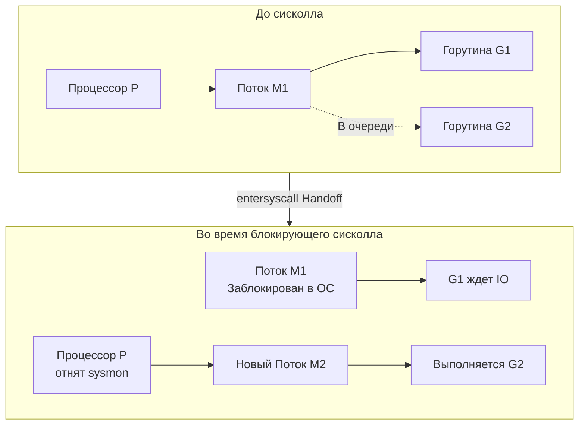

## Граница двух миров

В предыдущих статьях мы разобрали процессор до транзисторов, изучили его кэши, конвейеры и чиплеты. Мы поняли, как процессор перемалывает данные. Но сам по себе CPU — это вещь в себе, калькулятор в вакууме. Чтобы этот калькулятор стал сервером, он должен реагировать на сетевые пакеты, писать логи на диск и подчиняться командам операционной системы. 

Процессор не может постоянно «опрашивать» сетевую карту или диск — это бы съело 100% его времени (так называемый *busy wait*). Ему нужен механизм, который позволит отвлечься от текущей задачи только тогда, когда это действительно нужно. 

Этот механизм — **Прерывания (Interrupts)**. А обратная сторона этого механизма, позволяющая вашей Go-программе осознанно обратиться к железу — **Системные вызовы (Syscalls)**.

---

## Что такое прерывание?

**Прерывание** — это аппаратный или программный сигнал, который приказывает процессору немедленно бросить все текущие дела, сохранить свое состояние и выполнить специальный код операционной системы — **Обработчик прерываний (Interrupt Handler или ISR)**.

Это работает как дверной звонок. Вы читаете сложную книгу (выполняете Go-код). Звонит звонок (прерывание от сетевой карты). Вы закладываете страницу (сохраняете регистры в стек), идете к двери (выполняете код ядра ОС, забираете пакет), возвращаетесь и продолжаете чтение с того же места.

### 1. Аппаратные прерывания (Hardware Interrupts)

Генерируются физическими устройствами. В современных системах они проходят через контроллер прерываний (APIC) прямо в ядро CPU:
* **Таймер (Timer Interrupt)**: Сердце операционной системы. Каждые несколько миллисекунд таймер «бьет» по процессору. Именно так ядро Linux понимает, что пора забрать время у одного потока (M) и отдать другому. Без таймера зависший цикл `for {}` убил бы сервер навсегда.
* **Сетевая карта (NIC)**: Сообщает, что в буфер прибыл пакет и его нужно забрать в RAM.
* **Диск/NVMe**: Сообщает, что заказанные данные прочитаны с флэш-памяти и готовы к использованию.

### 2. Программные прерывания и Исключения (Exceptions)

Генерируются самим процессором в процессе выполнения кода:
* **Page Fault**: Как мы помним из статьи [[28. Page Table, MMU и трансляция адресов]], это прерывание возникает, когда адрес не найден в TLB и таблице страниц.
* **Деление на ноль или неверная инструкция**: Процессор аппаратно ловит ошибку, вызывает ядро ОС, а ядро отправляет вашему процессу сигнал `SIGFPE` или `SIGILL`, что приводит к панике в Go.
* **Syscall (Системный вызов)**: Это *намеренное* программное прерывание.

---

## Системные вызовы (Syscalls): Врата в Kernel Space

Ваш код на Go выполняется в пространстве пользователя (**User Space, Ring 3**). Процессор аппаратно запрещает вам читать произвольную память, работать с диском или сетевой картой напрямую. Это гарантия того, что баг в одной программе не обрушит весь сервер.

Для любого взаимодействия с внешним миром вы обязаны попросить ядро ОС сделать это за вас. Этот процесс называется **Системным вызовом**.

### Механика системного вызова (x86_64)

Когда вы делаете `fmt.Println("Hello")`, под капотом Go вызывает syscall `write`. На уровне процессора происходит следующее:

1. Рантайм кладет номер сисколла (1 для `write` в Linux) в регистр `RAX`.
2. Аргументы (файловый дескриптор stdout, адрес строки, длина) кладутся в регистры `RDI`, `RSI`, `RDX`.
3. Выполняется специальная ассемблерная инструкция `SYSCALL`.
4. Процессор мгновенно:
   * Переключает привилегии с Ring 3 на Ring 0 (Kernel Space).
   * Меняет указатель стека с пользовательского (вашей горутины) на безопасный стек ядра.
   * Прыгает на адрес обработчика сисколлов ОС (через регистр MSR).
5. Ядро проверяет права, выполняет запись и вызывает `SYSRET`, возвращая процессор в Ring 3.

> [!warning] Ловушка / Gotcha
> Системный вызов — это **чудовищно дорогая операция** с точки зрения Mechanical Sympathy. 
> Переключение контекста в Ring 0 сбрасывает конвейер процессора, инвалидирует часть кэшей и требует сотен тактов CPU. Именно поэтому пакет `bufio` в Go так важен. Запись по одному байту в файл убьет производительность сисколлами. Оборачивание в `bufio.Writer` накапливает данные в памяти (в User Space) и отправляет их одним большим куском через один сисколл.

---

## Go Runtime и магия Системных вызовов

Вот здесь начинается настоящая Senior/Lead инженерия. В классических языках (например, PHP или старый C++) системный вызов блокирует поток операционной системы (Thread). Если 1000 потоков вызовут чтение с диска, все 1000 потоков уснут, ядро ОС сойдет с ума от переключения контекстов (Context Switch), и сервер "ляжет".

В Go есть горутины (`G`), логические процессоры (`P`) и потоки ОС (`M`). Рантайм Go обрабатывает сисколлы так, чтобы блокировка горутины **не приводила к простою остальных**.

В Go сисколлы делятся на два типа: **Блокирующие** (файловый IO) и **Неблокирующие** (сетевой IO).

### 1. Блокирующие Syscalls (Файлы, CGO)

ОС Linux до сих пор не имеет идеального асинхронного API для работы с обычными файлами (io_uring только внедряется). Поэтому `os.ReadFile` блокирует поток ОС. 

Что делает планировщик Go:
1. Горутина `G1` хочет прочитать файл.
2. Рантайм вызывает внутреннюю функцию `entersyscall`. Состояние `G1` сохраняется.
3. Поток `M1`, на котором крутится `G1`, отправляется в ядро ОС делать сисколл. `M1` заблокирован (уснет).
4. **Handoff (Передача)**: В фоне работает системный поток Go — `sysmon` (System Monitor). Он видит, что `M1` завис в сисколле дольше 10 миллисекунд (или сразу для некоторых вызовов). `sysmon` отрывает логический процессор `P` от уснувшего `M1` и передает его свободному потоку `M2` (или создает новый поток).
5. `M2` продолжает выполнять другие горутины из очереди `P`. Простоя нет!

Когда диск отдает данные, `M1` просыпается, вызывает `exitsyscall`, пытается найти себе новый `P` (логический процессор). Если все `P` заняты, `G1` кладется в глобальную очередь (Global Run Queue), а `M1` уходит в пул спящих потоков.

> [!tip] Собеседование
> **Вопрос:** Вы написали код, который в 10 000 горутинах одновременно читает тяжелые файлы с диска. Что произойдет с рантаймом Go?
> **Ответ:** Произойдет взрывной рост потоков ОС (`M`). Из-за механизма Handoff, на каждую заблокированную горутину рантайм будет создавать новый поток ОС, чтобы спасти `P`. Если число потоков превысит лимит (по умолчанию 10 000), приложение упадет с ошибкой `fatal error - thread exhaustion`. 
> **Решение:** Для тяжелого файлового IO обязательно используйте паттерн Worker Pool (семафор), чтобы ограничить количество одновременных `os.Open`.

### 2. Неблокирующие Syscalls (Сеть и Netpoller)

С сетевыми сокетами ситуация совершенно иная. Серверы на Go держат миллионы открытых TCP-соединений. Если бы на каждое сетевое чтение создавался поток ОС, Go был бы таким же медленным, как Apache MPM Worker.

Для сети Go использует **Netpoller** — абстракцию над `epoll` (Linux) или `kqueue` (macOS).

Как работает чтение из TCP сокета в Go:
1. Вы пишете обычный синхронный код: `data := make([]byte, 1024); conn.Read(data)`.
2. Под капотом сокет настроен как неблокирующий (`O_NONBLOCK`). Сисколл `read` мгновенно возвращает ошибку `EAGAIN` (данных пока нет).
3. Рантайм Go не блокирует поток ОС (`M`). Вместо этого он регистрирует файловый дескриптор сокета в `epoll`.
4. Горутина переводится в состояние `waiting` (паркуется через `gopark`), освобождая поток `M` для других горутин. Никаких новых потоков не создается!
5. Когда сетевая карта получает пакет, она вызывает аппаратное прерывание. ОС кладет данные в буфер и отмечает сокет в `epoll` как готовый.
6. В фоне Go периодически опрашивает `epoll` (во время работы планировщика или через `sysmon`). Обнаружив готовый сокет, он "будит" припаркованную горутину, ставит её в очередь `P`, и она мгновенно дочитывает данные.

Это гениальная архитектура: вы пишете простой, линейный, блокирующийся с виду код, а под капотом рантайм превращает его в сверхэффективную асинхронную конечную машину состояний (State Machine), утилизируя процессор на 100%.

---

## Итоги

1. **Прерывания** позволяют процессору реагировать на асинхронные события железа (сеть, диск, таймер).
2. **Системный вызов (Syscall)** — это дорогой переход из User Space (Ring 3) в Kernel Space (Ring 0) для выполнения защищенных операций.
3. Рантайм Go скрывает от нас сложность сисколлов. 
4. При **файловом IO** рантайм блокирует поток ОС, но отвязывает логический процессор (`P`) с помощью `sysmon`, чтобы остальные горутины продолжали работать.
5. При **сетевом IO** рантайм использует `epoll/kqueue` (Netpoller), паркуя горутины без блокировки потоков ОС, что позволяет держать миллионы TCP-соединений с минимальными затратами RAM.

Итак, мы разобрали, как процессор взаимодействует с ОС и как рантайм Go жонглирует этими вызовами. Но как сами данные попадают от диска в оперативную память? Неужели процессор сам перекладывает каждый байт? Чтобы узнать, почему это не так, в следующей статье мы разберем: [[35. IO подсистема. Шины, Контроллеры и DMA]].