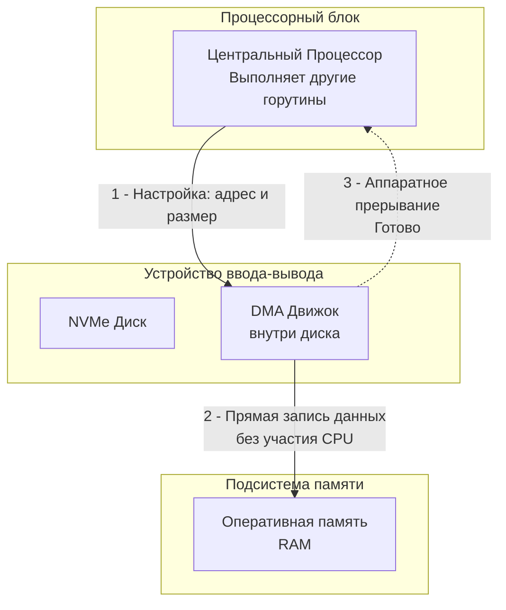

## Проблема: Процессор слишком дорогой грузчик

В статье [[34. Аппаратные прерывания и Системные вызовы]] мы остановились на гениальном механизме рантайма Go. Когда ваша горутина вызывает чтение по сети или с диска, она делает системный вызов. Рантайм переводит горутину в состояние ожидания (паркует), освобождая физическое ядро (тред ОС) для выполнения полезной бизнес-логики других горутин.

Затем происходит "магия": диск или сетевая карта находят данные, генерируют аппаратное прерывание, и горутина просыпается с готовым `[]byte`. 

Но подождите. Данные (скажем, 1 Гигабайт из файла) лежали на SSD-накопителе. Теперь они лежат в оперативной памяти (RAM) в вашем слайсе. **Кто физически перенес этот миллиард байт по материнской плате, если центральный процессор (CPU) в это время был занят выполнением других горутин?**

Ответ кроется в подсистеме ввода-вывода (IO) и механизме, который навсегда изменил архитектуру компьютеров.

---

## Наивный подход: Programmed IO (PIO)

На заре компьютеростроения процессоры делали всё сами. Этот режим назывался **PIO (Programmed Input/Output)**.

Если программе нужно было прочитать сектор с диска, процессор входил в жесткий цикл:
1. Запрашивал у контроллера диска 1 байт.
2. Ждал, пока диск его отдаст (а диски были невероятно медленными).
3. Читал этот байт в свой внутренний регистр (ALU).
4. Записывал этот байт из регистра в оперативную память.
5. Повторял операцию для следующего байта.

Процессор, самое дорогое, умное и быстрое устройство в системе, работал как примитивный грузчик-чернорабочий. При копировании файла на 1 ГБ конвейер процессора был на 100% заблокирован перекладыванием байтиков. Ни о какой реальной многозадачности речи не шло.

Нужно было делегировать эту черновую работу.

---

## DMA: Direct Memory Access

**DMA (Прямой доступ к памяти)** — это аппаратная технология, позволяющая периферийным устройствам (сетевым картам, дискам, видеокартам) читать и писать данные напрямую в оперативную память (RAM), **минуя центральный процессор**.

Изначально на материнской плате устанавливался отдельный чип — DMA-контроллер (DMAC). В современных системах функционал DMA встроен прямо в контроллеры самих устройств (это называется **Bus Mastering** — устройство само становится хозяином шины и управляет передачей).

### Как работает DMA под капотом

Давайте проследим путь вызова `os.ReadFile("data.txt")` в Go:

1. **Инициализация (CPU работает)**: Горутина делает сисколл. Ядро Linux формирует команду для контроллера диска. Но вместо того чтобы самому читать данные, ядро программирует DMA-движок диска. Оно передает ему три параметра:
   * Откуда читать (адрес сектора на диске).
   * Куда писать (физический адрес буфера в RAM).
   * Сколько байт нужно скопировать.
2. **Отключение (CPU свободен)**: Настроив DMA, ядро возвращает управление планировщику Go. Рантайм Go отдает процессорное время другой горутине.
3. **Передача (Работает DMA)**: Контроллер диска считывает данные со своих чипов памяти и по шине (например, PCIe) начинает "заталкивать" их прямо в контроллер оперативной памяти. Центральный процессор в этом процессе вообще не участвует!
4. **Завершение (Прерывание)**: Когда последний байт записан в RAM, DMA-контроллер отправляет сигнал по линии прерывания (IRQ) в центральный процессор.
5. **Пробуждение (CPU работает)**: Процессор на микросекунду отвлекается на прерывание, ОС видит, что чтение завершено, оповещает `epoll` или `sysmon` в Go, и наша исходная горутина просыпается.



> [!warning] Ловушка / Gotcha
> **Проблема когерентности кэшей (Cache Coherence)**
> Представьте: CPU закэшировал кусок памяти в свой L1-кэш. В этот момент сетевая карта через DMA записывает новые данные (новый HTTP-пакет) *прямо в физическую RAM* по этому же адресу. L1-кэш процессора теперь содержит невалидные (устаревшие) данные! 
> Чтобы этого избежать, контроллеры памяти и шины общаются по специальным протоколам (Snooping). Когда DMA пишет в RAM, контроллер памяти отправляет сигнал процессору инвалидировать соответствующие Cache Lines (о которых мы говорили в [[18. Кэши CPU. L1, L2, L3 и Cache Line]]). Это создает фоновый трафик на внутренних шинах CPU.

---

## Mechanical Sympathy: Zero-Copy и io.Copy

Понимание DMA критически важно для бэкенд-разработчика, когда дело касается проксирования трафика или раздачи статики (скачивание файлов).

Классическая задача: у вас есть Go-сервер, который отдает файл клиенту по TCP-сокету. 
Наивный код выглядит так:
```go
data, _ := os.ReadFile("video.mp4") // Читаем в память
conn.Write(data)                    // Пишем в сокет
```

С точки зрения железа и DMA здесь происходит архитектурная катастрофа (**4 копирования контекста и данных**):
1. DMA диска копирует `video.mp4` в буфер ядра ОС в памяти (**DMA Copy**).
2. CPU копирует данные из буфера ядра в ваш `[]byte` в User Space (**CPU Copy**).
3. При вызове `Write()` CPU копирует данные из вашего `[]byte` обратно в другой буфер ядра для сетевой карты (**CPU Copy**).
4. DMA сетевой карты копирует данные из буфера ядра в сеть (**DMA Copy**).

Процессор сделал две тяжелейшие работы по перекладыванию данных из одной области RAM в другую, убив свой L1-кэш и потратив драгоценные такты, которые могли бы пойти на парсинг JSON или сборку мусора!

### Спасение: syscall sendfile

Современные ОС предоставляют системный вызов `sendfile`, который реализует концепцию **Zero-Copy** (Нулевое копирование со стороны CPU).

В Go для этого нужно использовать функцию `io.Copy()`:
```go
file, _ := os.Open("video.mp4")
defer file.Close()
io.Copy(conn, file)
```

> [!tip] Собеседование
> **Вопрос:** Чем `io.Copy(conn, file)` отличается от ручного чтения в буфер и записи в цикле? Почему для файлов и TCP-сокетов это намного быстрее?
> **Ответ:** Когда вы передаете файловый дескриптор и TCP-сокет в `io.Copy`, стандартная библиотека Go распознает эти интерфейсы (`io.ReaderFrom` / `io.WriterTo`) и делает системный вызов `sendfile` (на Linux). 
> В режиме `sendfile` ядро ОС дает команду DMA диска прочитать данные в память ядра, а затем дает команду DMA сетевой карты отправить эти *же самые* данные в сеть.
> **CPU Copy полностью исключается.** Процессор вообще не прикасается к самим данным (payload), работают исключительно два аппаратных DMA-контроллера. Это снижает нагрузку на CPU на порядки и позволяет серверам вроде Nginx (или вашему Go-коду) раздавать гигабиты статики на слабом железе.

---

## Итог

1. Без **DMA** процессор был бы вечно заблокирован копированием байтов из внешних устройств в память (PIO).
2. **DMA** позволяет периферии писать напрямую в физическую память (RAM).
3. Задача CPU при вводе-выводе — только настроить DMA (указать адреса) и уйти спать или выполнять другие горутины, пока не придет аппаратное прерывание об успешном завершении.
4. Знание о том, как работает DMA, позволяет использовать паттерны **Zero-Copy** (через `io.Copy` в Go), исключая процессор из контура передачи больших объемов данных между диском и сетью.

Мы увидели, что устройства обмениваются данными напрямую с памятью. Но чтобы этот обмен мог происходить со скоростью десятков гигабайт в секунду, нужна невероятно мощная транспортная артерия. В современных серверах такой артерией выступает шина, к которой подключается всё: от NVMe-дисков до сетевых карт на 100 Гбит/с.

В следующей статье мы разберем эту шину под микроскопом: [[36. PCIe. Как устройства общаются с CPU]].