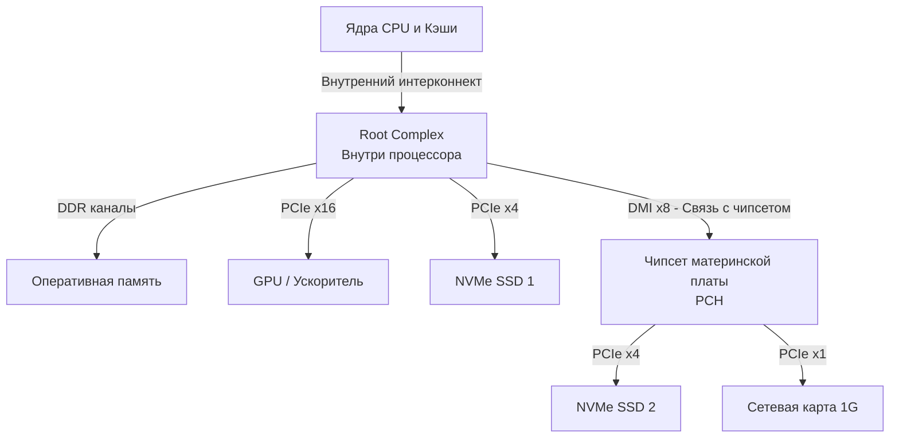

## Анатомия транспортной артерии

В статье [[35. IO подсистема. Шины, Контроллеры и DMA]] мы выяснили, что процессор не занимается ручным копированием файлов с диска в оперативную память. Эту работу выполняет DMA-контроллер. Но по каким физическим проводам «текут» эти данные? 

Если вы посмотрите на современную материнскую плату серверного узла, вы увидите, что к процессору подключены сетевые карты на 100 Гбит/с, массив из нескольких NVMe SSD-накопителей (каждый читает по 7 ГБ/с) и, возможно, пара видеокарт (GPU) для машинного обучения. 

Суммарный поток данных (Bandwidth) от этих устройств может превышать 100 Гигабайт в секунду. Чтобы пропустить такой объем сквозь материнскую плату прямо в оперативную память, была создана шина **PCIe (Peripheral Component Interconnect Express)**.

---

## От общей шины к коммутируемой сети

Исторически шины в компьютерах были **параллельными и разделяемыми (Shared Bus)**. Старый стандарт PCI представлял собой набор физических проводов, к которым были параллельно подключены *все* устройства. Это работало как старый сетевой хаб: если одно устройство передавало данные, остальные ждали. 

С ростом скоростей параллельные шины уперлись в законы физики: синхронизировать сигналы на 32 параллельных проводах при высокой частоте стало невозможно (возникал рассинхрон — Clock Skew).

Тогда инженеры приняли радикальное решение и спроектировали PCIe.
**PCIe — это не «шина» в классическом понимании. Это высокоскоростная, последовательная (Serial) компьютерная сеть внутри вашей материнской платы, построенная по топологии «точка-точка» (Point-to-Point).**

### Линии (Lanes) и масштабируемость

Основа PCIe — это **Линия (Lane)**. Каждая линия состоит всего из двух пар проводов: одна пара для передачи (TX), другая для приема (RX). Данные передаются последовательно, бит за битом, но на безумной частоте.

Вместо того чтобы делать шину шире, инженеры позволили устройствам объединять линии.
* **x1 (одна линия)**: Используется для простых сетевых карт (1 Гбит/с) или звуковых карт.
* **x4 (четыре линии)**: Стандарт для быстрых NVMe SSD-дисков.
* **x8 и x16**: Используются для GPU и серверных сетевых карт на 100/400 Гбит/с.

> [!info] Под капотом
> Каждое поколение PCIe удваивает пропускную способность одной линии.
> * **PCIe 3.0**: ~1 ГБ/с на одну линию. NVMe x4 выдает максимум 4 ГБ/с.
> * **PCIe 4.0**: ~2 ГБ/с на линию. Тот же NVMe x4 выдает уже 8 ГБ/с.
> * **PCIe 5.0**: ~4 ГБ/с на линию.

---

## Топология PCIe: Сеть под микроскопом

Поскольку PCIe — это сеть, у нее есть свои маршрутизаторы и конечные точки.

1. **Root Complex (RC)**: Главный маршрутизатор («Корневой комплекс»). Сегодня он физически встроен прямо в кристалл центрального процессора (тот самый cIOD, о котором мы говорили в [[33. Архитектура современных CPU. Chiplet, CCX, CCD, Ring Bus, Mesh]]). Он связывает устройства PCIe с контроллером оперативной памяти и ядрами CPU.
2. **Endpoint (EP)**: Конечные устройства. Ваша сетевая карта или SSD-накопитель.
3. **Switch (Коммутатор)**: Позволяет подключить больше устройств, чем есть физических линий у процессора, мультиплексируя трафик (прямо как сетевой свитч).

> [!warning] Ловушка / Gotcha
> Посмотрите на схему выше. Если вы купите два топовых NVMe диска по 7 ГБ/с и установите один в слот напрямую к CPU (`NVMe1`), а второй — в слот чипсета (`NVMe2`), вы получите разную производительность! 
> Трафик от `NVMe2` пойдет через чипсет (PCH) по узкой шине DMI, которая делит пропускную способность с USB-портами и сетью. В высоконагруженных серверах баз данных диски подключаются *только* к линиям, идущим напрямую в CPU.

---

## Пакеты и TLP (Transaction Layer Packet)

Поскольку PCIe — это сеть, данные по ней не льются сплошным потоком. Они нарезаются на пакеты, которые называются **TLP (Transaction Layer Packet)**.

Когда DMA-контроллер на сетевой карте хочет записать прибывший HTTP-запрос в оперативную память, он формирует TLP-пакет типа `Memory Write`. 
Этот пакет содержит:
1. **Заголовок (Header)**: Физический адрес оперативной памяти, куда нужно записать данные (до 64 бит).
2. **Полезная нагрузка (Payload)**: Сами данные (от 1 байта до 4 КБ).
3. **CRC (Контрольная сумма)**: Для проверки целостности на лету.

Root Complex (внутри процессора) получает этот пакет, маршрутизирует его в контроллер памяти, и данные оседают в RAM. CPU об этом даже не подозревает, пока устройство не пришлет специальный TLP-пакет прерывания (MSI-X).

---

## Mechanical Sympathy: Kernel Bypass и Go

А теперь перейдем к хардкорной инженерии. Как знания о PCIe применяются при написании ультра-быстрых сетевых сервисов или баз данных на Go?

Обычно, когда пакет приходит на сетевую карту, происходит следующее:
1. DMA пишет пакет в RAM.
2. Карта шлет аппаратное прерывание (см. [[34. Аппаратные прерывания и Системные вызовы]]).
3. Ядро Linux просыпается, копирует пакет из буфера драйвера в буфер сокета (User Space).
4. Ваша горутина читает пакет.

При скоростях 100 Гбит/с или миллионах IOPS на NVMe-дисках ядро Linux становится главным бутылочным горлышком. Обработка прерываний и переключение контекста сжигают все процессорное время.

### DPDK и SPDK (Обход ядра)

Чтобы выжать максимум из PCIe-устройств, инженеры используют технологии **Kernel Bypass** (Обход ядра): **DPDK** (для сети) и **SPDK** (для дисков).

Как это работает на уровне железа:
1. Вы "отбираете" PCIe-устройство у драйвера Linux.
2. С помощью механизма `VFIO` ОС маппит адресное пространство PCIe-устройства (его BAR - Base Address Registers) напрямую в виртуальную память вашего процесса (User Space) с использованием Huge Pages (см. [[30. Huge Pages и Transparent Huge Pages]]).
3. Ваша Go-программа (через CGO или ассемблер) получает прямые указатели на кольцевые буферы (Ring Buffers) самой сетевой карты.
4. **Никаких прерываний!** Вы выделяете одну или несколько горутин (жестко привязанных к ядрам CPU), которые крутятся в бесконечном цикле `for {}`, постоянно проверяя (polling) эти регистры памяти. 

Вместо ожидания прерываний, CPU постоянно опрашивает PCIe-устройство. Да, это загружает ядро процессора на 100%, но зато задержка (Latency) обработки пакета падает с 50 микросекунд до **1-2 микросекунд**.

> [!tip] Собеседование
> **Вопрос:** Мы пишем базу данных. Сервер двухсокетный (NUMA). Мы подключили топовый PCIe 4.0 NVMe диск. Бенчмарк `fio` показывает 7 ГБ/с, но наша Go-программа выжимает только 3 ГБ/с, а `pprof` не показывает проблем в самом коде. В чем дело?
> **Ответ:** Вы попали в ловушку NUMA (о которой мы говорили в [[31. NUMA. Non Uniform Memory Access]]). Линии PCIe физически припаяны к конкретному сокету CPU. Если ваш NVMe диск подключен к сокету 0 (Node 0), а ОС запустила вашу Go-программу на сокете 1 (Node 1), то все TLP-пакеты от диска проходят через Root Complex первого процессора, затем через медленную межпроцессорную шину (UPI) попадают во второй процессор, и только потом в память программы. 
> **Решение:** Использовать `numactl`, чтобы жестко привязать Go-процесс к тому же NUMA-узлу, к которому физически подключен PCIe-слот диска.

## Итог

1. **PCIe** — это не параллельная шина, а высокоскоростная пакетная сеть внутри компьютера с топологией точка-точка.
2. Пропускная способность легко масштабируется за счет объединения последовательных линий (**Lanes: x4, x8, x16**).
3. **Root Complex** встроен прямо в процессор и маршрутизирует **TLP-пакеты** между устройствами и оперативной памятью без участия вычислительных ядер CPU (с помощью DMA).
4. Для экстремальных нагрузок в Go-экосистеме применяются технологии **Kernel Bypass** (через CGO/AF_XDP/SPDK). Они маппят PCIe-память напрямую в User Space и заменяют дорогие прерывания ОС на постоянный опрос (polling) в горутинах.

Мы проложили путь от процессора до самого слота расширения на материнской плате. Теперь пришло время заглянуть внутрь устройства, которое совершило революцию в бэкенд-разработке и базах данных, заменив медленную механику на кремний. 

В следующей статье мы разберем: [[37. SSD, NVMe и почему современные диски такие быстрые]].