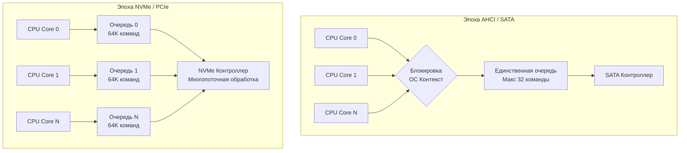

## Конец эпохи вращающихся блинов

В прошлой статье [[36. PCIe. Как устройства общаются с CPU]] мы увидели, что материнская плата — это высокоскоростная сеть, способная прокачивать десятки гигабайт в секунду. Процессор, оперативная память и шины готовы работать на космических скоростях. 

Но долгие десятилетия эта вычислительная мощь разбивалась о жестокую физику. Базы данных и бэкенды ждали, пока металлическая головка жесткого диска (HDD) физически переместится над вращающимся магнитным блином. Этот процесс (Seek Time) занимал миллисекунды. Типичный серверный HDD мог выдать максимум **150-200 IOPS** (операций ввода-вывода в секунду) на случайное чтение. 

Появление SSD (Solid State Drives) заменило механику на кремний. Но чтобы понять, почему современные NVMe-накопители выдают миллионы IOPS и как писать код, который их не «убьет», бэкенд-разработчику нужно заглянуть под капот флэш-памяти.

---

## Анатомия NAND Flash: Страницы и Блоки

В отличие от оперативной памяти (DRAM) или магнитных дисков, флэш-память NAND имеет уникальные и очень жесткие физические ограничения. Память организована иерархически: ячейки объединяются в **Страницы (Pages)**, а страницы — в **Блоки (Blocks)**.

* **Страница (Page)**: Минимальная единица чтения и записи. Обычно от 4 КБ до 16 КБ.
* **Блок (Block)**: Группа страниц (обычно от 128 до 256 страниц, размер блока — несколько Мегабайт).

И вот здесь кроется главный архитектурный нюанс SSD, который диктует правила проектирования всех современных баз данных:
1. **Вы можете ЧИТАТЬ по страницам (4 КБ).**
2. **Вы можете ПИСАТЬ по страницам (4 КБ), но только в ПУСТЫЕ страницы.**
3. **Вы НЕ МОЖЕТЕ перезаписать страницу.** Чтобы изменить хотя бы один байт в записанной странице, вы должны **СТЕРЕТЬ ВЕСЬ БЛОК (Мегабайты)**.

Это ограничение называется **Erase-Before-Write (Стирание перед записью)**. Операция стирания блока невероятно медленная (занимает миллисекунды) и физически разрушает ячейки памяти (у каждого блока есть лимит циклов перезаписи — P/E cycles).

### FTL: Flash Translation Layer

Если бы операционная система напрямую работала с этим ужасом, любой `update` в базе данных вешал бы сервер намертво. 

Чтобы скрыть эту физику от ОС, внутри каждого SSD работает собственный полноценный компьютер с многоядерным ARM-процессором и гигабайтами своей RAM. На нем крутится прошивка — **FTL (Уровень трансляции флэш-памяти)**.

FTL создает виртуальную иллюзию обычного блочного устройства. Когда ваша Go-программа перезаписывает один и тот же файл, FTL делает следующее:
1. Он не трогает старую страницу физически.
2. Он пишет новые данные в **новую, пустую страницу** в другом блоке.
3. В своей внутренней таблице (хранящейся в RAM контроллера SSD) он обновляет маппинг: виртуальный адрес `LBA 100` теперь указывает на новую физическую страницу.
4. Старая страница помечается как «Мусор» (Stale / Invalid).

> [!info] Под капотом
> Прямо как в Go, в контроллере SSD работает свой собственный **Сборщик мусора (Garbage Collector)**! В фоне (когда диск простаивает), GC диска находит блоки, в которых много "мусорных" страниц. Он копирует оставшиеся живые страницы в новый чистый блок, а старый блок полностью стирает (Erase), подготавливая его для будущих записей.

---

## Mechanical Sympathy: Write Amplification (Усиление записи)

Незнание архитектуры страниц и блоков приводит к феномену **Write Amplification (Усиление записи)**.

Представьте, что вы пишете лог-файл по 100 байт за раз без использования `bufio` (сразу делаете сисколл `write`). 
1. Вы просите записать 100 байт.
2. SSD не может записать 100 байт, минимальная единица записи — страница 4 КБ.
3. Диск пишет 4 КБ (изнашивая ячейки и тратя пропускную способность).
Вы получаете усиление записи в 40 раз!

А теперь представьте **Случайную запись (Random Write)** по всему диску мелкими кусками. FTL будет сходить с ума, постоянно разбрасывая данные по новым страницам. Дисковый Garbage Collector будет работать непрерывно, перетасовывая блоки. Производительность (IOPS) рухнет в десятки раз, а диск умрет от износа за полгода.

> [!warning] Ловушка / Gotcha
> Несмотря на то, что на SSD "случайное чтение" (Random Read) работает так же быстро, как последовательное (ведь нет физической головки), **случайная запись (Random Write) — это всё еще зло**. 
> Писать на SSD нужно большими, последовательными кусками (Sequential Write). Именно поэтому буферизация в User Space (тот самый `bufio` в Go) критически важна даже на самых дорогих NVMe-накопителях.

> [!tip] Собеседование
> **Вопрос:** Почему современные NoSQL базы данных (Cassandra, RocksDB, ClickHouse) используют LSM-деревья (Log-Structured Merge-Tree) вместо классических B-Tree (как в PostgreSQL)?
> **Ответ:** B-Tree постоянно обновляет данные на месте, что генерирует лавину мелких случайных записей (Random Writes), убивая SSD и вызывая Write Amplification. 
> LSM-Tree никогда не обновляет данные на месте. Оно накапливает изменения в оперативной памяти (MemTable) и затем скидывает их на диск большим последовательным файлом (SSTable - Append-Only). Это идеально совпадает с физикой NAND-флэш памяти, максимизируя скорость записи и срок службы SSD.

---

## От SATA к NVMe: Программная революция

С физикой самих чипов разобрались. Но почему старые SATA SSD выдавали 500 МБ/с и 100K IOPS, а современные NVMe выдают 14 ГБ/с и 2.5 Миллиона IOPS на тех же самых NAND-чипах?

Проблема была в **протоколе и программном интерфейсе**.
Долгие годы SSD подключались через интерфейс SATA и протокол AHCI. Этот протокол был придуман в 2004 году для *вращающихся дисков*.
У AHCI была **ровно одна очередь команд**, в которую помещалось максимум 32 команды. 

Если у вас 16-ядерный сервер, и 1000 горутин одновременно хотят прочитать данные, все они упирались в одну-единственную очередь в ядре ОС (вызывая жесткие блокировки — Lock Contention), а затем в лимит из 32 команд самого контроллера.

**NVMe (Non-Volatile Memory Express)** был создан с нуля специально для флэш-памяти и шины PCIe.

1. **64 Тысячи очередей**: NVMe поддерживает до 65535 очередей отправки (Submission Queues) и завершения (Completion Queues).
2. **64 Тысячи команд**: В каждой очереди может находиться до 65535 команд одновременно.
3. **Прямое подключение к PCIe**: Отсутствие медленных контроллеров-посредников.

### Архитектура Lockless (Без блокировок)

Драйвер NVMe в Linux работает гениально. Он создает ровно одну аппаратную очередь (Submission Queue) **на каждое логическое ядро процессора**.

Когда ваша горутина, выполняющаяся на `CPU Core 0`, делает системный вызов (см. [[34. Аппаратные прерывания и Системные вызовы]]), ОС помещает команду на чтение прямо в `Очередь 0`. 
**Никаких мьютексов! Никакого ожидания других ядер!** Каждое ядро процессора параллельно и независимо общается с контроллером NVMe-диска. Это позволило убрать бутылочное горлышко в ядре ОС и раскрыть весь потенциал многоканальной флэш-памяти.

---

## Итоги

1. **NAND Flash** не умеет перезаписывать данные. Пишем страницами (4 КБ), стираем блоками (Мегабайты).
2. **FTL (Flash Translation Layer)** — компьютер внутри диска, который маппит виртуальные адреса в физические и делает Garbage Collection для блоков.
3. **Случайная мелкая запись (Random Write)** — главный враг SSD. Она вызывает *Write Amplification*, снижает IOPS и убивает ресурс накопителя. Буферизация (`bufio`) и последовательная запись (Append-only) — наше всё.
4. **NVMe** совершил революцию не за счет новых чипов памяти, а за счет замены одной очереди AHCI на 64K параллельных очередей, привязанных к ядрам процессора (отказ от блокировок в ядре ОС).

Мы разобрали путь данных от электронов в транзисторах процессора до ячеек флэш-памяти на SSD. Чтобы вся эта архитектура улеглась в голове, нам нужно посмотреть на неё в масштабах времени. Насколько кэш L1 быстрее оперативной памяти? А насколько память быстрее диска? И как эти числа должны влиять на код, который мы пишем каждый день?

В следующей статье мы объединим всё изученное в единую шкалу времени: [[38. Latency Numbers Every Programmer Should Know]].