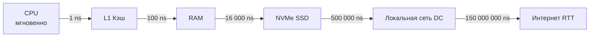

## Проблема человеческого восприятия

Наш мозг эволюционировал в макромире. Мы отлично понимаем разницу между одной секундой и одним часом, но мы физически не способны интуитивно осознать разницу между наносекундой и микросекундой. Для нас и то, и другое — это «мгновенно».

Именно эта когнитивная слепота заставляет разработчиков писать код, который делает 100 SQL-запросов в цикле или аллоцирует миллионы мелких объектов в куче. Нам кажется, что разница несущественна.

В 2012 году Питер Норвиг (Peter Norvig) и Джонас Бонер (Jonas Bonér) опубликовали знаменитую таблицу **«Latency Numbers Every Programmer Should Know»**. С тех пор железо стало быстрее (появились NVMe и 100G сети), но **соотношения** остались почти теми же, потому что мы уперлись в скорость света.

Чтобы писать высокопроизводительный бэкенд на Go, вы должны выжечь эти числа на подкорке.

---

## Масштабирование до «Человеческого времени»

Лучший способ понять задержки процессора — замедлить время так, чтобы **1 наносекунда (ns)** равнялась **1 секунде** человеческого времени. При таком масштабе тактовая частота процессора составит 1 Гц (одна операция в секунду).

Давайте посмотрим, как выглядит архитектура компьютера из статьи [[1. Обзор. Путь программы от go run main.go до движения электронов]] глазами процессора:

| Операция (Железо) | Реальное время | Человеческое время | Аналогия для CPU |
| :--- | :--- | :--- | :--- |
| **L1 кэш (чтение)** | 1 ns | **1 секунда** | Взять ручку с рабочего стола. |
| **Сброс конвейера (Branch Mispredict)** | 3 ns | **3 секунда** | Ошибиться в бланке и взять новый из ящика. |
| **L2 кэш (чтение)** | 4 ns | **4 секунды** | Достать папку из тумбочки. |
| **Мьютекс (захват/освобождение, CAS)** | 17 ns | **17 секунд** | Повесить замок на дверь кабинета. |
| **DRAM (чтение из RAM)** | 100 ns | **1.5 минуты** | Сходить в другой конец коридора к архиву. |
| **NVMe SSD (случайное чтение)** | ~16 000 ns (16 µs) | **4.5 часа** | Съездить на машине на склад в другом районе. |
| **Сеть (RTT внутри дата-центра)** | 500 000 ns (0.5 ms) | **5.5 дней** | Отправить письмо почтой в соседний город. |
| **SSD старого поколения (SATA)** | 1 000 000 ns (1 ms) | **11.5 дней** | Ждать курьера с другого конца страны. |
| **HDD (магнитный диск, seek)** | 10 000 000 ns (10 ms) | **4 месяца** | Заказать доставку груза кораблем из Китая. |
| **Сеть (Интернет, RTT Европа - США)** | 150 000 000 ns (150 ms) | **4.7 года** | Отправить научную экспедицию на Марс. |
| **Таймаут HTTP запроса (1 сек)** | 1 000 000 000 ns (1 s) | **31 год** | Прожить целую человеческую жизнь в ожидании. |

---

## Mechanical Sympathy в Go: Практические следствия

Как эти цифры должны изменить ваш подход к написанию кода на Go?

### 1. Цена указателя и аллокаций в Куче

Многие разработчики, приходящие в Go из Java или PHP, привыкли писать всё через указатели, считая, что передать указатель "легче", чем копировать структуру по значению (Value Semantics).

Посмотрим на таблицу. Чтение структуры из L1 кэша — это 1 секунда (в человеческом масштабе). 
Когда вы объявляете массив указателей `[]*User`, сами объекты разбросаны по куче (Heap) в произвольных местах. При итерации по такому слайсу процессор постоянно промахивается мимо кэша и обращается к RAM. 

Разница между доступом к L1 (1 ns) и RAM (100 ns) — **100-кратная**. 
Скопировать структуру размером 64 байта в регистрах процессора занимает пару наносекунд. А вот сходить по указателю в «холодную» память — это полторы минуты человеческого ожидания. 

> [!warning] Ловушка / Gotcha
> Интерфейсы в Go (`interface{}`) под капотом хранят указатель на данные. Слайс интерфейсов `[]interface{}` — это гарантированный Cache Miss на каждом элементе (см. [[18. Кэши CPU. L1, L2, L3 и Cache Line]]). Если вам нужна максимальная производительность парсинга или вычислений, используйте дженерики или слайсы конкретных структур по значению.

### 2. Иллюзия локального Redis (Парадокс кэширования)

Допустим, у вас есть тяжелая операция, и вы решили закэшировать ее результат в Redis. Ваш Redis развернут в том же дата-центре.

Разработчик часто думает: "Redis — это in-memory база, значит она работает со скоростью памяти". Это **фатальная ошибка**.

Обращение к локальной RAM (`map` в Go) = 100 ns.
Обращение к Redis по сети = 500 000 ns. 
**Redis медленнее локальной памяти в 5 000 раз.**

Если вы делаете тысячу запросов к Redis в цикле, вы генерируете сетевой Overhead на миллисекунды. В человеческом масштабе ваш процессор простаивает годами, дожидаясь ответа от сетевой карты.
**Решение:** Обязательное использование пайплайнов (Redis Pipelines) или локального in-memory кэша (например, `FreeCache` или `Ristretto`) перед сетевым.

### 3. Проблема N+1 запросов

Представьте классический баг ORM — проблему N+1. 
Вы загружаете 100 пользователей, а затем в цикле делаете `SELECT * FROM orders WHERE user_id = ?` для каждого. Итого 100 запросов к БД.

База данных может быть очень быстрой и отдавать ответ за 1 миллисекунду.
$100 \times 1 ms = 100 ms$. 
Для бизнес-логики 100 мс — это вроде бы немного. 

Но для CPU 1 мс — это **11 дней** простоя. Ваш процессор потратил эквивалент 3 лет (в человеческом масштабе) просто ожидая сеть 100 раз подряд, хотя мог сделать `WHERE user_id IN (...)` за один сетевой раунд-трип, сэкономив 99% времени на передачу пакетов. Пакетная обработка (Batching) — это фундамент распределенных систем.

> [!tip] Собеседование
> **Вопрос:** Мы проектируем микросервис корзины. У нас есть выбор: хранить корзины в локальной SQLite/BoltDB на диске (NVMe) сервера или в выделенном кластере Redis в соседней стойке. Что обеспечит минимальную задержку (Latency)?
> **Ответ:** Отталкиваемся от цифр. Локальный NVMe SSD дает ответ за ~16-20 микросекунд (за счет DMA и обхода ядра). Сетевой RTT до Redis — около 500 микросекунд, плюс парсинг TCP-пакетов в ядре ОС. Таким образом, чтение с локального диска NVMe будет в **25 раз быстрее**, чем чтение из "сверхбыстрой" in-memory базы по сети.

### 4. Почему Goroutines такие дешевые?

Мы знаем, что в Go системный вызов блокирует поток (см. [[34. Аппаратные прерывания и Системные вызовы]]).
Смена контекста между потоками ОС (Thread Context Switch) занимает около **1 000 - 2 000 ns** (в ядро и обратно).
Но смена контекста между горутинами в Go (Goroutine Context Switch) выполняется в User Space и занимает всего около **200 ns**.

Рантайм Go не творит магию с железом, он просто переключает несколько регистров (PC, SP) без сброса кэшей и вызова прерываний Ring 0, делая многозадачность дешевой операцией.

---

## Итог: Иерархия решений Архитектора

Запомнив эти порядки, вы автоматически начнете принимать правильные архитектурные решения. При проектировании любой фичи на Go задавайте себе алгоритм вопросов сверху вниз (по шкале времени):

1. **Могу ли я вообще не делать этот запрос по сети?** (Сетевой IO — самый медленный, 500us - 150ms).
2. **Если сеть неизбежна, могу ли я сгруппировать 100 запросов в 1 (Batching)?** (Экономия сотен сетевых RTT).
3. **Могу ли я читать последовательно, а не случайно?** (Случайное чтение с диска убивает IOPS, см. [[37. SSD, NVMe и почему современные диски такие быстрые]]).
4. **Могу ли я избежать аллокации в куче?** (Остаться в L1/L2 кэше и не нагружать сборщик мусора).
5. **Могу ли я убрать мьютекс?** (Избежать False Sharing и атомарных блокировок конвейера процессора, см. [[21. False Sharing и Cache Line Contention]]).

Мы увидели сухие цифры задержек. Но если мы умножим пропускную способность на количество ядер, почему сервер с 64 ядрами не всегда работает в 64 раза быстрее сервера с 1 ядром? Куда пропадает мощность? 

В следующей статье мы познакомимся с фундаментальными законами масштабирования: [[39. Почему производительность бывает нелинейной]].