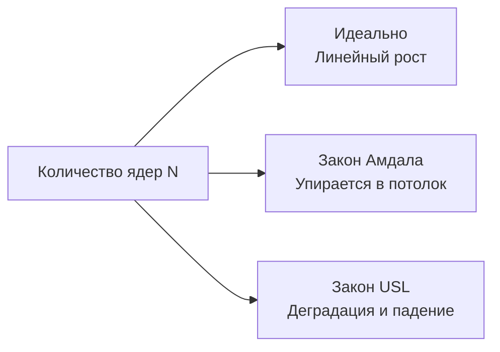

## Миф о бесплатном масштабировании

Сценарий, знакомый каждому Lead-разработчику: ваш микросервис на Go задыхается от нагрузки. Графики показывают 100% утилизацию CPU на 8-ядерном сервере. Вы выбиваете у бизнеса бюджет и переезжаете на мощную машину с 64 ядрами. Вы ожидаете, что пропускная способность (RPS) вырастет в 8 раз, а задержки (Latency) упадут.

Вы запускаете нагрузочный тест и видите страшное: RPS вырос всего в 2.5 раза, потребление памяти улетело в небеса, а 99-й перцентиль (p99 latency) стал даже хуже, чем на старом сервере. 

Что пошло не так? Почему железо не отработало вложенные в него деньги? 
Ответ кроется в математических законах, описывающих конкурентные вычисления. В мире высоконагруженного бэкенда производительность почти никогда не бывает линейной.

---

## 1. Закон Амдала (Amdahl's Law)

В 1967 году Джин Амдал сформулировал закон, который устанавливает жесткий математический предел ускорения любой программы при добавлении новых процессоров.

Закон гласит: **максимальное ускорение системы ограничено той долей кода, которая должна выполняться строго последовательно.**

Формула выглядит так:
$$S(N) = \frac{1}{(1 - P) + \frac{P}{N}}$$

Где:
* $S(N)$ — итоговое ускорение (Speedup).
* $N$ — количество потоков/ядер.
* $P$ — доля программы, которую можно распараллелить.
* $(1 - P)$ — последовательная часть (серийная).

### Как это выглядит в цифрах?

Допустим, вы написали блестящий Go-код. 95% времени он работает идеально параллельно (горутины парсят JSON, делают независимые запросы в БД). Но 5% времени код работает последовательно (например, горутины складывают результаты в общую мапу под мьютексом или пишут ответ в один сетевой сокет).

Здесь $P = 0.95$, а $(1 - P) = 0.05$.
Посмотрим на ускорение при разном количестве ядер $N$:
* 1 ядро: Ускорение 1x
* 10 ядер: ~6.8x (неплохо)
* 100 ядер: ~16.6x (хуже)
* 1000 ядер: ~19.6x
* $\infty$ ядер: **20x**

**Вывод Закона Амдала:** Как бы много ядер вы ни купили, если в вашем коде есть 5% последовательной работы, вы никогда не сделаете его быстрее, чем в 20 раз ($1 / 0.05$). Аппаратное масштабирование бессильно против алгоритмического дизайна.

---

## 2. Универсальный закон масштабируемости (USL)

Закон Амдала — это сферический конь в вакууме. Он предполагает, что параллельные потоки вообще ничего не стоят и не мешают друг другу. 

В 1993 году физик Нил Гюнтер расширил эту модель, создав **Универсальный закон масштабируемости (Universal Scalability Law)**. Это важнейший закон для понимания современных серверов. 

Гюнтер добавил в формулу Амдала два разрушительных фактора:
1. **Конкуренция (Contention - $\alpha$)**: Потоки вынуждены ждать в очереди к общим ресурсам (блокировки, мьютексы).
2. **Координация / Согласованность (Crosstalk/Coherency - $\beta$)**: Потоки тратят время на общение друг с другом для синхронизации состояния.

Формула USL:
$$C(N) = \frac{N}{1 + \alpha(N-1) + \beta N(N-1)}$$

Обратите внимание на компонент $\beta N(N-1)$. Это квадратичная зависимость ($N^2$). При росте числа потоков затраты на их координацию растут по параболе.

### Ретроградная масштабируемость

Главный вывод USL: при достижении определенного количества ядер добавление новых мощностей **снижает** общую производительность системы. График загибается вниз. Это называется ретроградным масштабированием (Retrograde Scalability).

> [!info] Под капотом
> Как координация ($\beta$) проявляется в железе и Go?
> 1. **Аппаратный уровень**: Трафик когерентности кэшей (Cache Coherence Traffic). Как мы обсуждали в [[33. Архитектура современных CPU. Chiplet, CCX, CCD, Ring Bus, Mesh]], когда 64 ядра пытаются обновить одну и ту же переменную (False Sharing из [[21. False Sharing и Cache Line Contention]]), шина процессора задыхается от пересылки кэш-линий между чиплетами.
> 2. **Уровень Рантайма Go**: Сборщик мусора (GC). Во время фазы *Mark* сборщик мусора задействует 25% всех ядер. Чем больше ядер, тем больше потоков ОС одновременно сканируют память, и тем больше работы уходит на координацию их действий (кто какой кусок кучи уже пометил).

> [!tip] Собеседование
> **Вопрос:** Мы увеличили `GOMAXPROCS` с 32 до 64 на 64-ядерной машине, и RPS нашего кэш-сервера упал на 15%. Что произошло?
> **Ответ:** Система перешла точку перегиба по закону USL. Из-за глобальных блокировок (`sync.RWMutex` над большой мапой) возросла Конкуренция ($\alpha$). А из-за того, что 64 потока постоянно инвалидируют друг другу кэши L1/L2, пытаясь захватить этот мьютекс (CAS-операции), затраты на Координацию ($\beta$) уничтожили всю выгоду от новых ядер. 
> **Решение:** Шардирование состояния (Lock Sharding) — разбить одну мапу на 256 независимых сегментов со своими мьютексами, чтобы свести $\alpha$ и $\beta$ к нулю.

---

## 3. Теория массового обслуживания и "Клюшка" (Queueing Theory)

Вторая причина нелинейности кроется в том, как ведут себя очереди при высокой загрузке.

Представьте супермаркет (Сервер). Кассир (CPU) обслуживает покупателя (Request) за 10 миллисекунд. Если клиенты приходят строго равномерно по одному раз в 10 мс, утилизация кассира будет 100%, а очереди не будет вообще.

Но в реальном бэкенде трафик стохастичен (распределение Пуассона). Запросы приходят пачками (Bursts). И здесь вступает в силу формула Кингмана для времени ожидания в очереди, где главный множитель это:

$$ \text{Множитель ожидания} \approx \frac{\rho}{1 - \rho} $$
*(Где $\rho$ — утилизация системы от 0 до 1).*

Постройте этот график в голове:
* При загрузке CPU $50\%$ ($\rho = 0.5$): Множитель = $0.5 / 0.5 = 1$. Очереди почти нет.
* При загрузке CPU $80\%$ ($\rho = 0.8$): Множитель = $0.8 / 0.2 = 4$. Очередь начала расти.
* При загрузке CPU $95\%$ ($\rho = 0.95$): Множитель = $0.95 / 0.05 = 19$. 
* При загрузке CPU $99\%$ ($\rho = 0.99$): Множитель = $0.99 / 0.01 = 99$.

Это так называемая **"Кривая-клюшка" (Hockey Stick Curve)**. До 70-80% загрузки процессора задержки вашего Go-приложения стабильны. Но как только утилизация переваливает за 85-90%, время ответа (Latency) улетает в стратосферу асимптотически вертикально вверх.

> [!warning] Ловушка / Gotcha
> Никогда не планируйте capacity кластера так, чтобы в штатном режиме серверы работали на 90%+ CPU. При малейшем всплеске трафика очередь горутин (`runq`) переполнится, и время ответа вырастет с 10 мс до 5 секунд. 
> Идеальная целевая утилизация для микросервисов, чувствительных к latency (Synchronous API) — **не более 60-70%**. Оставшиеся 30% — это буфер для поглощения дисперсии входящего трафика.

---

## 4. Оверхед планировщика и Thrashing

Четвертая причина нелинейности — издержки на само переключение контекста.

Go позволяет создавать миллионы горутин. Это провоцирует писать код в стиле: "На каждый элемент слайса из миллиона записей запустим `go process(item)`". 

Если у вас 16 ядер и 1 000 000 активных горутин (которые не спят в IO, а хотят выполнять математику), планировщику ОС и рантайму Go приходится непрерывно снимать одни задачи с ядер и ставить другие, чтобы соблюсти справедливость (Fairness).

Этот процесс (Context Switching) разрушает полезную работу:
1. Вымывается L1 кэш (новые данные перетирают старые).
2. Очищается TLB (о котором мы говорили в разделе памяти).
3. Процессор тратит миллионы тактов в секунду просто на выполнение кода планировщика `runtime.schedule()`.

Это состояние называется **Thrashing (Пробуксовка)**. Процессор загружен на 100%, но 80% этого времени он тратит на жонглирование задачами, а не на вашу бизнес-логику. 
Именно поэтому воркер-пулы (Worker Pools), ограниченные количеством ядер (или небольшим множителем от них), на тяжелых вычислительных задачах работают в десятки раз быстрее, чем неограниченный запуск горутин.

---

## Итог

Производительность нелинейна, потому что мы живем в мире физических ограничений и теории вероятностей:
1. **Закон Амдала**: Доля последовательного кода жестко лимитирует максимальное ускорение.
2. **USL**: Конкуренция за мьютексы и координация кэшей между ядрами заставляют производительность падать при добавлении новых мощностей.
3. **Теория очередей**: При утилизации CPU выше 85% задержки растут экспоненциально из-за дисперсии трафика.
4. **Thrashing**: Избыток параллельных задач убивает кэши процессора и тратит ресурсы на переключение контекста.

Мы прошли долгий путь от транзисторов и конвейеров до архитектуры памяти, шин и математических законов масштабирования. Вы знаете, как работает железо. 

Пришло время собрать все эти знания воедино и сформулировать инженерную философию, которая отличает выдающихся разработчиков от просто хороших. В финальной статье этого раздела мы разберем: [[40. Mechanical Sympathy. Как писать код с учетом устройства железа]].