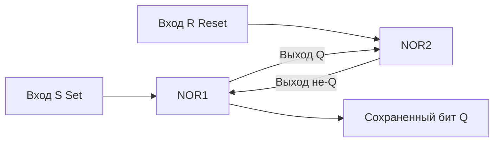

В предыдущей статье мы собрали АЛУ (Арифметико-логическое устройство), которое умеет мгновенно складывать числа. Но у нашей схемы есть критический недостаток: как только электрический сигнал на входах `A` или `B` пропадает, результат на выходе тоже исчезает. Комбинационная логика не имеет состояния (stateless).

Чтобы компьютер мог выполнять программы, ему нужно сохранять промежуточные результаты вычислений. Выражение `result := a + b` в Go требует не только сложить `a` и `b`, но и **запомнить** значение в ячейку `result`. 

Для этого инженеры придумали **последовательностную логику** (Sequential logic) — схемы, способные сохранять свое состояние во времени.

## Обратная связь: Кусая себя за хвост

Как заставить логические вентили (которые просто пропускают ток) запомнить информацию? Гениальное и простое решение — **обратная связь** (Feedback loop). 
Нужно взять выход вентиля и соединить его проводом с его же собственным входом.

### SR-триггер (Защелка / Latch)

Самая базовая ячейка памяти в электронике — это **SR-защелка** (Set-Reset Latch). Она строится из двух вентилей `NOR` (ИЛИ-НЕ), где выход первого подключен ко входу второго, а выход второго — ко входу первого.

У нее два входа:
- **S (Set)** — установить в `1`.
- **R (Reset)** — сбросить в `0`.



Если подать сигнал на вход `S`, схема перейдет в состояние `1`. И самое главное: когда мы уберем сигнал с `S`, напряжение продолжит циркулировать по кольцу обратной связи бесконечно (пока подается питание на процессор). **Схема запомнила 1 бит информации.** 
Чтобы стереть память, нужно подать сигнал на вход `R`.

> [!warning] Ловушка / Gotcha
> Что будет, если подать напряжение одновременно на Set и Reset? Возникнет аппаратное состояние гонки (Race Condition). Схема войдет в нестабильное состояние, и предсказать итоговое значение бита будет невозможно. В программировании мы решаем состояние гонки мьютексами, а на аппаратном уровне инженеры решили это добавлением синхронизации — **тактового генератора**.

## Тактовый генератор (Clock) и D-триггеры

В процессоре миллиарды транзисторов, и сигналы проходят через них с разной скоростью. Если память будет обновляться хаотично, процессор сойдет с ума. Компьютеру нужен дирижер.

Этот дирижер — **Тактовый генератор** (Clock). Кварцевый кристалл на материнской плате генерирует ритмичные импульсы напряжения. Когда вы покупаете процессор с частотой 3.5 ГГц (Gigahertz), это значит, что генератор "тикает" 3.5 миллиарда раз в секунду.

Чтобы память обновлялась синхронно, SR-защелку усложнили и превратили в **D-триггер (Data Flip-Flop)**. 
D-триггер имеет вход данных `D` и вход тактового сигнала `CLK`. Он читает значение со входа `D` и запоминает его **только в момент скачка напряжения** (фронта) на входе `CLK`. В остальное время он игнорирует любые изменения данных.

## Регистры CPU: Самая быстрая память в мире

Один D-триггер хранит 1 бит. Если мы поставим 64 таких триггера в ряд и подведем к ним один общий тактовый провод, мы получим **64-битный Регистр** (Register).

Регистры — это "руки" процессора. В архитектуре x86-64 их всего несколько десятков (RAX, RBX, RCX и т.д.). Именно в регистрах "живут" ваши локальные переменные в те самые наносекунды, когда процессор выполняет над ними математику. 

> [!info] Под капотом
> Память, построенная на таких триггерах, называется **SRAM (Static Random Access Memory)**. Для хранения всего 1 бита в SRAM требуется 6 транзисторов. Это делает такую память невероятно быстрой (работает на частоте процессора), но безумно дорогой и занимающей много физического места на кристалле кремния. Именно поэтому регистров так мало, а [[Кэши CPU]] (L1, L2, L3), которые тоже строятся на базе SRAM, исчисляются мегабайтами, а не гигабайтами.

## Механическая симпатия: Переключение контекста в Go

Как эта физика связана с бэкенд-разработкой на Go? Напрямую, через концепцию [[Goroutine Scheduler|Переключения контекста]] (Context Switching).

В Go мы пишем конкурентный код, создавая тысячи горутин. Каждая горутина — это независимый поток выполнения, который "думает", что владеет процессором единолично. Но физических регистров в CPU всего один набор.

Когда планировщик Go решает приостановить одну горутину и запустить другую, ему нужно **спасти состояние физических регистров CPU** (сохранить все те биты, которые сейчас крутятся в D-триггерах), чтобы позже горутина могла продолжить работу ровно с того же места.

Если мы заглянем в исходники рантайма Go (файл `src/runtime/runtime2.go`), мы увидим структуру `gobuf`, которая встроена в каждую горутину (структура `g`).

```go
package runtime

// gobuf описывает контекст горутины, который сохраняется 
// при ее приостановке.
type gobuf struct {
	// Указатель на стек (Stack Pointer) - регистр RSP
	sp   uintptr 
	// Счетчик команд (Program Counter) - регистр RIP 
	// (указывает на следующую ассемблерную инструкцию)
	pc   uintptr 
	// Указатель на структуру самой горутины
	g    guintptr 
	// Контекст (используется для замыканий и интерфейсов)
	ctxt unsafe.Pointer 
	// Возвращаемое значение
	ret  uintptr 
	// Смещение базы стека (для архитектур вроде ARM)
	lr   uintptr 
	bp   uintptr // Base Pointer
}
```

Когда горутина блокируется (например, делает `time.Sleep` или сетевой запрос), рантайм Go берет значения из аппаратных регистров процессора (D-триггеров) и переписывает их в оперативную память, в поля структуры `gobuf`. Когда горутина просыпается, значения из `gobuf` загружаются обратно в регистры CPU.

> [!tip] Собеседование
> **Вопрос:** Почему создание 10 000 горутин в Go — это нормально, а создание 10 000 потоков ОС (OS Threads) в Java/C++ приведет к краху или жутким тормозам?
> **Ответ:** Во-первых, размер стека (горутина стартует с 2 КБ, поток ОС требует 1-2 МБ). Во-вторых, цена **переключения контекста**. 
> Переключение потока ОС требует тяжелого системного вызова в ядро (Kernel Space) для сохранения огромного контекста (сотни регистров AVX/SSE, таблиц страниц памяти). Планировщик Go работает в User Space (пространстве пользователя) и сохраняет в память только минимально необходимый набор регистров (описанный в структуре `gobuf`). Переключение горутины занимает сотни наносекунд, а переключение потока ОС — микросекунды (на порядок дольше).

## Итог

1. **Комбинационная логика** (вентили, сумматоры) позволяет процессору *вычислять*.
2. **Последовательностная логика** (триггеры, регистры) позволяет процессору *запоминать*.
3. **Тактовый генератор** синхронизирует эти два мира, чтобы память обновлялась ровно в тот момент, когда вычисления завершены.

Теперь у нас есть всё необходимое: вычислитель и память. В следующей статье мы объединим их в единую систему и построим полноценное ядро процессора, чтобы понять, как оно читает и выполняет машинный код: [[5. Анатомия CPU. Datapath и Control Unit]].