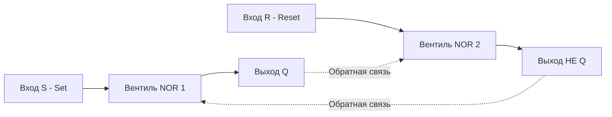
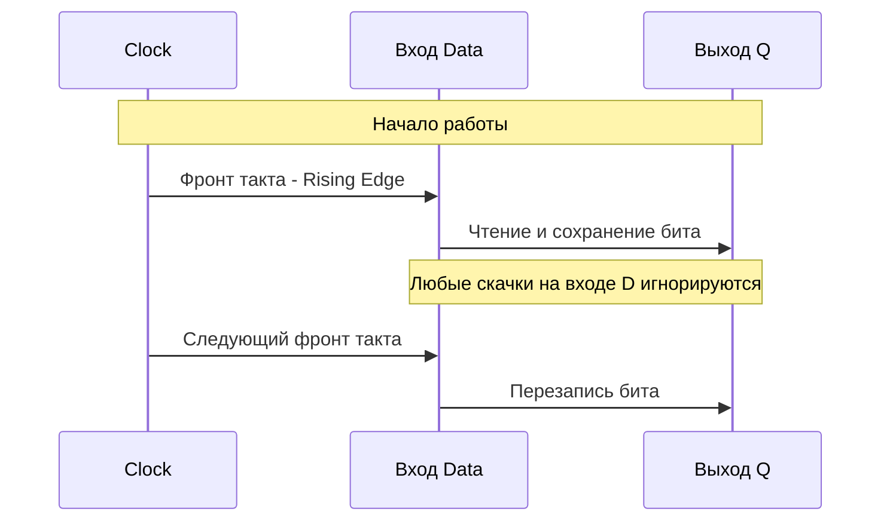

В [[3. Комбинационная логика. Учим кремний считать]] мы построили сумматор и ALU. Это мощные схемы, но они обладают одним критическим недостатком — у них нет памяти. Как только исчезает электрический сигнал на входе (например, вы перестали подавать биты), результат на выходе мгновенно испаряется.

Представьте, что вы пишете программу на Go, в которой можно использовать только чистые функции без переменных. Вы не можете написать `i++`, потому что для этого нужно прочитать предыдущее значение `i`, прибавить единицу и **сохранить** результат обратно. 

Чтобы построить процессор, способный исполнять последовательные инструкции, и оперативную память, в которой будут храниться наши переменные, нам нужно научить кремний запоминать состояние. Добро пожаловать в мир **Последовательностной логики (Sequential Logic)**.

## Обратная связь: Замыкание петли

Как заставить комбинацию логических вентилей хранить сигнал, даже если источник этого сигнала отключили? Ответ гениален и прост: нужно направить выход схемы обратно на ее вход. Это называется **Обратной связью (Feedback Loop)**.

Если мы возьмем два вентиля NOR (ИЛИ-НЕ) и соединим выход первого со входом второго, а выход второго — со входом первого, мы получим базовую ячейку памяти — **SR-триггер (Set-Reset Latch)**.

### SR-триггер: Рождение бита

У SR-триггера есть два входа и два выхода (обычно это выход `Q` и его инвертированная версия `Не Q`):
1. **S (Set / Установка):** Если подать сюда ток (`1`), триггер переключается в состояние `1` и *остается в нем навсегда*, даже если убрать ток с входа S.
2. **R (Reset / Сброс):** Если подать сюда ток (`1`), триггер сбрасывается в `0` и *запоминает* этот ноль.



> [!warning] Ловушка / Gotcha
> У SR-триггера есть "запрещенное" состояние. Если одновременно подать `1` на входы Set и Reset, схема окажется в нестабильном положении (состояние гонки аппаратуры). На логическом уровне она попытается выдать нули на обоих выходах, что нарушает ее собственную логику. Это классический пример неопределенного поведения (Undefined Behavior) на уровне физики!

## Тактовый сигнал: Пульс процессора

SR-триггер работает асинхронно. Как только меняется сигнал на входе, схема мгновенно (со скоростью движения электронов) меняет состояние. В масштабах сложного процессора с миллиардами транзисторов это катастрофа: сигналы идут по проводам разной длины, какие-то доходят быстрее, какие-то медленнее. Если память будет меняться хаотично, процессор выдаст мусор.

Чтобы упорядочить хаос, инженеры придумали **Тактовый сигнал (Clock)**.

Представьте себе электронный метроном, который бесконечно и с идеальной точностью тикает: `0-1-0-1-0-1`. Этот сигнал генерируется кварцевым резонатором на материнской плате и рассылается по всему процессору. 

Когда вы покупаете процессор с частотой 3.0 ГГц, это означает, что этот "метроном" тикает 3 миллиарда раз в секунду. Каждый такой тик называется **Тактом (Clock Cycle)**.

## D-триггер: Безопасная память

Чтобы синхронизировать память с пульсом процессора, SR-триггер усложняют, добавляя к нему вход для тактового сигнала и защиту от запрещенных состояний. Получается **D-триггер (Data Flip-Flop)**.

У него всего два главных входа:
1. **D (Data):** То, что мы хотим сохранить (`0` или `1`).
2. **CLK (Clock):** Вход для тактового сигнала.

**Магия D-триггера:** Он игнорирует любые изменения на входе `D`, пока не произойдет перепад тактового сигнала (фронт импульса, когда Clock меняется с `0` на `1`). Только в это крошечное мгновение он "захватывает" значение с входа `D` и сохраняет его на выходе `Q`. Весь оставшийся такт триггер держит это значение, как стальной сейф, что бы ни происходило на входе.



### Программная аналогия

Если комбинационная логика (из прошлой статьи) — это чистые функции, то D-триггер можно представить как структуру в Go с мьютексом, которая обновляется только по каналу-таймеру:

```go
package main

import "sync"

// Эмуляция D-триггера
type DFlipFlop struct {
	mu    sync.RWMutex
	state bool
}

// Tick эмулирует фронт тактового сигнала (Clock Edge)
func (d *DFlipFlop) Tick(data bool) {
	d.mu.Lock()
	d.state = data // Запоминаем значение только в момент "тика"
	d.mu.Unlock()
}

// Read аппаратно происходит мгновенно в любой момент времени
func (d *DFlipFlop) Read() bool {
	d.mu.RLock()
	defer d.mu.RUnlock()
	return d.state
}
```

## Mechanical Sympathy: SRAM vs DRAM

Для бэкенд-разработчика понимание триггеров открывает глаза на устройство подсистемы памяти. Существует два фундаментально разных способа хранить биты в железе:

1. **SRAM (Static RAM — Статическая память)**
   Это память, построенная на базе тех самых D-триггеров. Для хранения одного бита здесь используется от 4 до 6 транзисторов.
   *   **Плюсы:** Она невероятно быстрая. Состояние не нужно обновлять, оно держится стабильно, пока есть питание.
   *   **Минусы:** Из-за количества транзисторов она огромная физически, сильно греется и безумно дорогая.
   *   **Где используется:** Регистры CPU и **Кэши L1, L2, L3**. (Подробно обсудим в [[18. Кэши CPU. L1, L2, L3 и Cache Line]]).

2. **DRAM (Dynamic RAM — Динамическая память)**
   Вместо сложных триггеров инженеры используют всего один транзистор и один микроскопический конденсатор на 1 бит.
   *   **Плюсы:** Дешевая, компактная, позволяет уместить гигабайты памяти на одной планке.
   *   **Минусы:** Конденсаторы "протекают". Заряд исчезает за миллисекунды. Эту память нужно постоянно (тысячи раз в секунду) читать и переписывать заново (этот процесс называется регенерацией). Она на порядки медленнее SRAM.
   *   **Где используется:** Ваша основная оперативная память (RAM). (Разберем в [[17. Пирамида памяти. Регистры, SRAM, DRAM и цена доступа]]).

> [!info] Под капотом
> Каждый раз, когда в Go вы аллоцируете структуру, которая избегает Escape Analysis и остается на стеке, она, скорее всего, будет обрабатываться прямо в кэшах L1/L2 процессора, работающих на тех самых молниеносных D-триггерах. Когда структура улетает в кучу (Heap), вы с высокой вероятностью обращаетесь к медленным "протекающим" конденсаторам DRAM, заставляя процессор простаивать сотни тактов в ожидании данных.

## Итог

1. **Последовательностная логика** — это схемы с памятью, зависящие от истории входов (состояния).
2. Память в кремнии реализуется за счет **обратной связи** (выход подается на вход).
3. **SR-триггер** — базовый нестабильный элемент памяти.
4. **Тактовый сигнал (Clock)** — метроном, синхронизирующий хаос логических вентилей.
5. **D-триггер** захватывает бит данных строго по тактовому сигналу. На этих ячейках построена сверхбыстрая кэш-память процессора.

Мы научили кремний базовым математическим операциям и дали ему память. У нас есть все фундаментальные кубики. Теперь мы возьмем горсть D-триггеров, свяжем их вместе и построим первые управляемые хранилища для чисел, чтобы процессор мог начать исполнять код. Переходим к следующей статье: [[5. Регистры, счетчики и конечные автоматы]].