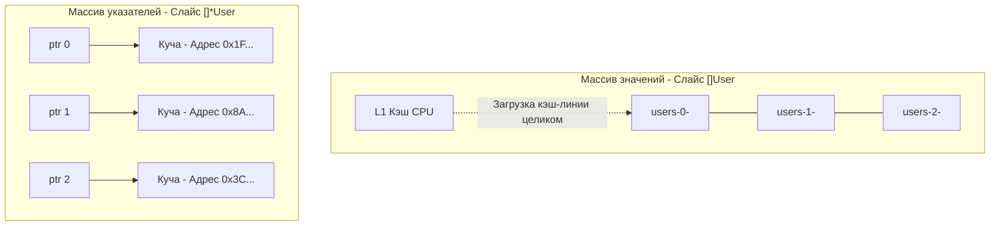

## Искусство дружить с железом

Термин **Mechanical Sympathy** (Механическая симпатия) популяризировал Мартин Томпсон, создатель сверхбыстрого кольцевого буфера LMAX Disruptor. Идея пришла из автоспорта: великий гонщик Джеки Стюарт говорил, что пилоту не обязательно уметь собирать двигатель с нуля, но он обязан понимать, как тот работает под капотом, чтобы выжать из машины максимум и не сжечь сцепление.

В разработке на Go принцип тот же. Рантайм Go — это роскошный автомобиль с автоматической коробкой передач (GC, планировщик). Но если вы начнете дергать ручник на скорости 200 км/ч (например, генерируя миллионы мелких аллокаций в куче), ваш бэкенд вылетит в кювет производительности.

Писать код с «механической симпатией» — значит проектировать структуры данных и алгоритмы так, чтобы они идеально ложились на физику процессора, кэшей и подсистемы памяти, которые мы изучили в предыдущих 39 статьях.

---

## 1. Value Semantics vs Pointer Chasing

Разработчики, приходящие в Go из Java, C# или PHP, несут с собой ООП-привычку: всё должно быть ссылкой. Там массивы объектов — это всегда массивы указателей.

В Go у нас есть выбор, и этот выбор — фундамент производительности. 

Представьте слайс структур `User`.
```go
// Антипаттерн из мира Java
users := make([]*User, 0, 1000)

// Idiomatic Go & Mechanical Sympathy
users := make([]User, 0, 1000)
```

С точки зрения бизнес-логики разницы почти нет. С точки зрения железа (изученного в [[18. Кэши CPU. L1, L2, L3 и Cache Line]] и [[29. TLB. Translation Lookaside Buffer и стоимость промаха]]) разница катастрофическая:

1. **Массив указателей (`[]*User`)**: Сам слайс — это непрерывный блок памяти, но в нем лежат только адреса. Сами структуры `User` разбросаны случайным образом по куче (Heap). При обходе цикла процессор читает адрес, отправляет запрос в RAM, получает **Cache Miss**, ждет 100 наносекунд. Переходит к следующему элементу — другой адрес, другой кусок RAM, снова промах. Это называется **Pointer Chasing (Погоня за указателями)**. Железо простаивает.
2. **Массив значений (`[]User`)**: Слайс содержит сами структуры, лежащие в памяти плотно друг к другу. Когда вы читаете `users[0]`, контроллер памяти загружает в L1-кэш целую кэш-линию (64 байта), попутно захватывая `users[1]` и `users[2]`. Аппаратный Prefetcher видит линейный паттерн и начинает заранее подтягивать следующие блоки из RAM. Утилизация CPU стремится к 100%, TLB-промахов почти нет.



> [!tip] Собеседование
> **Вопрос:** Если мы передаем большую структуру по значению (например, 128 байт) в функцию, это ведь медленнее, чем передать 8 байт указателя? Зачем тогда избегать указателей?
> **Ответ:** Передача по значению копирует данные. Процессор делает копирование внутри L1-кэша или регистров, что занимает 1-2 наносекунды. А передача указателя может заставить компилятор вынести структуру в кучу (Escape Analysis). Чтение из «холодной» кучи займет 100+ наносекунд, плюс это создаст работу для сборщика мусора (GC). Копирование 128 байт на стеке в десятки раз быстрее, чем одна аллокация в куче.

---

## 2. Escape Analysis и Стек

В C/C++ разработчик сам решает, где выделить память: `malloc` для кучи, или объявление локальной переменной для стека.
В Go это решает компилятор с помощью **Escape Analysis (Анализ побега)**.

Стек горутины (начальный размер 2 КБ) — это самая "горячая" память в системе. Она почти всегда находится в L1/L2 кэше физического ядра. Выделение памяти на стеке — это просто сдвиг регистра `SP` (Stack Pointer). Это стоит 0 тактов CPU. Удаление — обратный сдвиг. Никакого Garbage Collector!

Механическая симпатия требует писать код так, чтобы переменные не "убегали" в кучу без необходимости.

```go
// Плохо: функция возвращает указатель на локальную переменную.
// Компилятор видит, что 'cfg' будет жить после завершения функции,
// и вынужден перенести ее в кучу (Heap allocation).
func NewConfig() *Config {
    cfg := Config{Timeout: 10}
    return &cfg 
}

// Отлично: возврат по значению.
// Структура создается на стеке, копируется при возврате,
// куча чиста, GC отдыхает.
func NewConfig() Config {
    return Config{Timeout: 10}
}
```

Вы всегда можете проверить решения компилятора флагом `go build -gcflags="-m"`:
```bash
./main.go:4:9: &cfg escapes to heap
./main.go:3:2: moved to heap: cfg
```

> [!warning] Ловушка / Gotcha
> Любое использование `interface{}` или `any` (например, в `fmt.Println` или методах логирования `zap.Any()`) автоматически приводит к побегу переменной в кучу. Внутри рантайма (структура `eface`) интерфейс хранит указатель на реальные данные. Поэтому в высоконагруженных участках кода избегайте логгеров с интерфейсами, используйте строго типизированные поля.

---

## 3. Выравнивание данных (Padding) и False Sharing

Мы подробно разбирали феномен "Ложного разделения" в статье [[21. False Sharing и Cache Line Contention]]. Механическая симпатия заставляет нас думать о том, как переменные лежат в кэш-линии L1 (64 байта).

Представьте пул воркеров, которые обновляют метрики в глобальном массиве.
```go
type WorkerStat struct {
    Processed uint64 // 8 байт
    Errors    uint64 // 8 байт
}

var stats [8]WorkerStat // Массив для 8 воркеров
```

Под капотом этот массив займет $16 \times 8 = 128$ байт памяти. Это ровно 2 кэш-линии процессора.
Если Воркер 0 (на физическом ядре 0) инкрементирует `stats[0]`, а Воркер 1 (на физическом ядре 1) инкрементирует `stats[1]`, они будут яростно конкурировать за одну и ту же кэш-линию, постоянно инвалидируя её друг другу через шину Infinity Fabric / Ring Bus (см. [[33. Архитектура современных CPU. Chiplet, CCX, CCD, Ring Bus, Mesh]]).

Производительность упадет в сотни раз из-за аппаратных блокировок.

**Решение через Mechanical Sympathy (Padding):**
Мы знаем размер кэш-линии (64 байта) из статьи [[25. Выравнивание данных, Padding и Struct Layout]]. Мы должны «растолкать» данные воркеров так, чтобы они попали в разные кэш-линии.

```go
type WorkerStat struct {
    Processed uint64
    Errors    uint64
    // Добиваем до 64 байт (64 - 8 - 8 = 48)
    _ [48]byte // Padding - мусорные байты для выравнивания
}
```
Теперь каждый `WorkerStat` занимает ровно 64 байта. Физические ядра обновляют независимые кэш-линии. Конкуренция на шине (Contention) исчезает полностью.

---

## 4. Архитектура sync.Pool: Шедевр Mechanical Sympathy

В стандартной библиотеке Go есть пакет `sync`. Взглянем под капот `sync.Pool`. Его задача — переиспользовать уже выделенные в куче объекты (например, буферы `[]byte` для сети), чтобы снизить нагрузку на GC.

Почему `sync.Pool` работает так феноменально быстро? Потому что он написан с полным учетом архитектуры NUMA и кэшей CPU.

В исходниках рантайма (структура `poolLocal`) пул разбит на шарды — по одному массиву на каждый логический процессор (`P` в планировщике G-M-P). 

Когда горутина вызывает `pool.Get()`:
1. Рантайм закрепляет текущую горутину (`g`) за процессором (`p`), запрещая планировщику ОС вытеснить ее (операция `pin`).
2. Пул берет объект **только из локального массива для этого `p`**.
3. Поскольку этот массив доступен только одному `p` (и одному треду `m` в данный момент), чтение происходит **без атомарных операций (CAS) и без мьютексов**.
4. Объект с огромной вероятностью уже лежит в L1-кэше текущего физического ядра, так как этот же тред недавно положил его туда через `pool.Put()`.

Здесь Go-разработчики идеально соединили: изоляцию данных на ядро (уход от контеншена), избегание дорогих системных вызовов и работу в горячем кэше L1.

---

## 5. Буферизация и Системные вызовы (Batching)

Процессор способен выполнять миллиарды инструкций в секунду. Системный вызов (Syscall), как мы выяснили в [[34. Аппаратные прерывания и Системные вызовы]], стоит тысячи тактов на переключение из Ring 3 в Ring 0 и сброс кэшей TLB.

Механическая симпатия к подсистеме ввода-вывода (IO) диктует золотое правило: **Пакетная обработка (Batching)**.

Если вы пишете лог в файл или отправляете данные в TCP-сокет:
```go
// Антипаттерн: syscall write на каждые 10 байт
for _, data := range chunks {
    file.Write(data) 
}

// Mechanical Sympathy: буферизация в User Space
// Собираем 4 КБ в памяти (скорость L1/RAM), делаем ОДИН syscall write
writer := bufio.NewWriterSize(file, 4096)
for _, data := range chunks {
    writer.Write(data) 
}
writer.Flush() // Один дорогой вызов в ядро
```

Точно так же, опираясь на знания из [[35. IO подсистема. Шины, Контроллеры и DMA]], мы используем `io.Copy()` для передачи файлов в сеть, позволяя аппаратному DMA-контроллеру перемещать данные без участия CPU (техника Zero-Copy).

---

## Итог

Mechanical Sympathy — это не микрооптимизации ради оптимизаций. Это понимание того, что:
1. **CPU кэши** любят плотные массивы структур и предсказуемые циклы (нет указателям, да значениям).
2. **Многоядерность** ненавидит общее изменяемое состояние (Shared Mutable State). Если нужно шарить — выравнивайте структуры по размеру кэш-линии (Padding).
3. **Аллокатор и GC** — это тяжело. Используйте стек, помогая компилятору (Escape Analysis), или переиспользуйте кучу через `sync.Pool`.
4. **ОС и Шины** любят крупные блоки (Batching). Минимизируйте количество переходов в Kernel Space.

Вы прошли огромный путь, разобрав компьютер от кремниевого вентиля до высокоуровневых абстракций рантайма Go. Теперь у вас есть фундаментальная база для того, чтобы писать по-настоящему быстрый, надежный и архитектурно правильный бэкенд.

В следующей статье мы подведем итог первой большой главы нашей базы знаний и соберем всю картинку воедино: [[41. Итоги раздела. Полная картина архитектуры компьютера для Go-разработчика]].