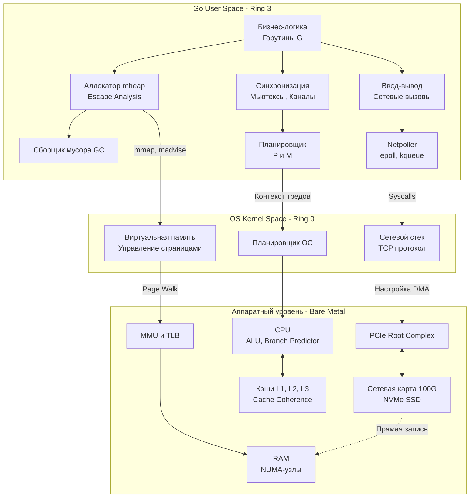

Вот мы и подошли к концу первого, самого низкоуровневого, но фундаментально важного раздела нашей базы знаний. Мы начали с того, как транзисторы складываются в логические вентили, и закончили математическими законами, объясняющими, почему 64-ядерный сервер может работать медленнее 8-ядерного.

Для многих разработчиков железо — это "черный ящик", который просто выполняет инструкции. Но для Senior/Lead Backend Engineer этот ящик прозрачен. Выбор между `[]*User` и `[]User` для вас — это не вопрос вкуса, а выбор между TLB-промахом и эффективной утилизацией L1-кэша. 

Давайте соберем всю изученную архитектуру в единую картину мира сквозь призму языка Go.

---

## Полная архитектурная карта бэкенда

Ваш Go-сервис никогда не работает в изоляции. Каждый `if err != nil`, каждое выделение памяти и каждый сетевой запрос пробивают все слои абстракции, опускаясь на самый физический уровень.

---

## 4 Столпа Производительности (Mechanical Sympathy)

Подводя итог статьям раздела (особенно [[40. Mechanical Sympathy. Как писать код с учетом устройства железа]]), можно выделить четыре главных вектора оптимизации системного дизайна.

### 1. Процессор и Вычисления: Предсказуемость
Современный процессор (из [[13. Предсказание ветвлений и Спекулятивное исполнение]]) — это машина, которая ненавидит сюрпризы. Ветвления, которые невозможно предсказать, сбрасывают огромный конвейер. Вызовы методов через интерфейсы (`interface{}`) заставляют процессор гадать, куда прыгнет указатель инструкций (Virtual Method Table).
* **Идиома Go:** Пишите простой, прямолинейный код. Избегайте глубоких иерархий интерфейсов в критических путях (Hot paths). Используйте конкретные типы или дженерики, чтобы дать компилятору и Branch Predictor-у сделать их работу.

### 2. Память и Кэши: Локальность
Память — это самое узкое место современного компьютера. Из [[18. Кэши CPU. L1, L2, L3 и Cache Line]] и [[29. TLB. Translation Lookaside Buffer и стоимость промаха]] мы знаем, что железо пересылает данные блоками по 64 байта и страницами по 4 КБ/2 МБ.
* **Идиома Go:** Value Semantics. Храните данные в плоских массивах (`[]Struct`, а не `[]*Struct`). Помогайте компилятору оставлять переменные на стеке (Escape Analysis). Избегайте ложного разделения (False Sharing) глобальных счетчиков, применяя Padding, как мы обсуждали в [[21. False Sharing и Cache Line Contention]].

### 3. Многоядерность: Изоляция (Share Nothing)
Закон USL из [[39. Почему производительность бывает нелинейной]] и топология из [[33. Архитектура современных CPU. Chiplet, CCX, CCD, Ring Bus, Mesh]] доказали нам: чем больше потоков координируются между собой, тем медленнее работает система. Трафик когерентности кэшей убивает пропускную способность шины Infinity Fabric / Ring Bus.
* **Идиома Go:** "Не общайтесь, разделяя память; разделяйте память, общаясь". Каналы отлично подходят для передачи владения, но на экстремальных нагрузках шардируйте блокировки (Lock Sharding), используйте массивы локальные для горутин или `sync.Pool`, минимизируя глобальный `sync.RWMutex`. Учитывайте NUMA-архитектуру серверов ([[31. NUMA. Non Uniform Memory Access]]).

### 4. Ввод-Вывод: Делегирование
Процессор не должен перекладывать байты. Из статей [[34. Аппаратные прерывания и Системные вызовы]] и [[35. IO подсистема. Шины, Контроллеры и DMA]] мы поняли стоимость перехода в Kernel Space.
* **Идиома Go:** Обязательная буферизация (`bufio`). Для проксирования данных используйте `io.Copy`, чтобы задействовать системный `sendfile` и аппаратный DMA. Доверяйте Netpoller-у рантайма: пишите простой блокирующий код, а Go сам переведет его в асинхронный опрос `epoll` без создания тысяч тредов ОС.

---

> [!tip] Собеседование
> **Вопрос:** Если вы претендуете на позицию Lead Go Engineer, вас могут спросить: "Представьте, что мы отключаем Hyper-Threading (SMT), включаем Huge Pages и привязываем процесс к одному NUMA-узлу через numactl. Какой профиль приложения (I/O bound или CPU bound) получит от этого наибольший выигрыш и почему?"
> **Ответ:** Это идеальный сетап для жесткого **CPU/Memory bound** приложения (например, In-memory базы данных, HFT-алгоритма или сборщика тяжелой аналитики). 
> 1. Отключение SMT убирает конкуренцию за L1 кэш между логическими ядрами.
> 2. Huge Pages кардинально снижают TLB-промахи при обходе гигантских `map` или `slice`.
> 3. Привязка к NUMA-узлу исключает задержки от удаленного доступа к RAM через межпроцессорную шину UPI. 
> Для обычного микросервиса (I/O bound), который 90% времени ждет ответа от базы данных или сети, такие тюнинги не дадут ощутимого прироста, а отключение SMT даже снизит общую пропускную способность, так как логические ядра отлично утилизируют простои процессора во время сетевых ожиданий.

---

## Переход на новый уровень

Вы больше не пишете код вслепую. Вы обладаете "механической симпатией". Вы знаете, что происходит под капотом, когда вы запускаете бинарник, выделяете слайс или делаете запрос в базу данных. 

Но до сих пор мы рассматривали железо как нечто, что отдано нам в безраздельное пользование. В реальности на сервере работают сотни других процессов. Кто-то должен справедливо делить между ними процессорное время, оперативную память, доступ к файлам и сетевым портам. Кто-то должен обеспечивать безопасность, чтобы один процесс не прочитал память другого.

Этот "кто-то" — Операционная Система. И чтобы понимать, как рантайм Go (со своим планировщиком `sysmon`, аллокатором `mheap` и Netpoller-ом) взаимодействует с ядром Linux, мы переходим ко второму фундаментальному разделу нашей базы знаний.

**Раздел 1: "Архитектура компьютера" — Завершен.**
**Добро пожаловать в Раздел 2: "Устройство и работа ОС".**