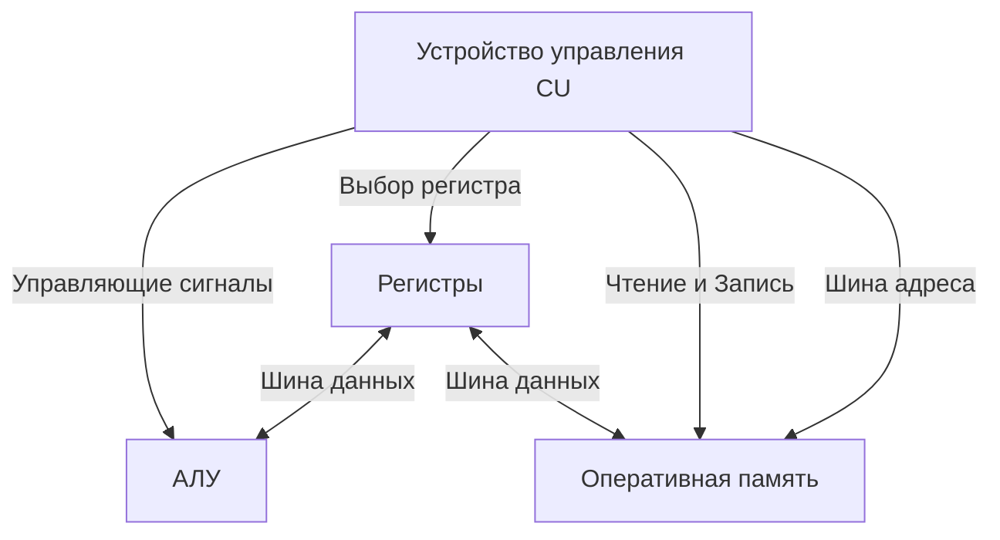

## Объединяя мозг и мускулы

В предыдущих статьях мы создали АЛУ для математических вычислений (комбинационная логика) и регистры для хранения данных (последовательностная логика). Но сами по себе они мертвы. АЛУ не знает, *когда* и *какую* операцию выполнять (сложить или вычесть?), а регистры не знают, *когда* сохранять результат.

Чтобы оживить эту систему, процессор разделяют на две фундаментальные части: **Datapath** (Тракт данных — "мускулы") и **Control Unit** (Устройство управления — "мозг").

Вместе они образуют архитектуру фон Неймана, на которой работают абсолютно все современные серверные процессоры, исполняющие ваш Go-код.

## Тракт данных (Datapath)

Datapath — это сеть автомагистралей внутри процессора. Он включает в себя АЛУ, регистры (RAX, RBX и т.д.) и пути, по которым данные перетекают между ними. 

Чтобы данные не сталкивались, пути оборудованы переключателями — **мультиплексорами**, о которых мы говорили ранее. Мультиплексор решает, пойдет ли в АЛУ значение из регистра `A` или из регистра `B`.

Но кто переключает эти мультиплексоры? Кто подает сигнал на вход АЛУ, чтобы оно переключилось со сложения на логическое И (AND)? 

## Устройство управления (Control Unit)

Устройство управления (CU) — это дирижер оркестра. Его единственная задача — читать машинный код вашей программы (инструкции) и превращать каждую инструкцию в набор электрических сигналов, которые управляют Трактом данных.

Инструкция машинного кода (например, сложение) состоит из **OpCode** (кода операции) и **Операндов** (над чем совершается операция).

Когда CU получает OpCode сложения, он буквально включает нужные провода:
1. Посылает напряжение на регистр `A`, разрешая ему выдать свое значение на шину данных.
2. Посылает напряжение на мультиплексор, направляя данные из регистра `A` в левый вход АЛУ.
3. То же самое делает для регистра `B` и правого входа АЛУ.
4. Посылает управляющий сигнал `ADD` (сложить) в само АЛУ.
5. Посылает сигнал `Write Enable` (разрешение на запись) в целевой регистр `C`, чтобы он запомнил результат с выхода АЛУ при следующем тике тактового генератора.



> [!info] Под капотом
> Как именно CU понимает сложный OpCode? В архитектуре x86-64 (Intel/AMD) используется **Микрокод** (Microcode). Это крошечные программы, зашитые глубоко в сам процессор (в специальную ROM-память). Когда CU встречает сложную ассемблерную инструкцию, он переводит её в серию примитивных микроопераций. Именно микрокод позволяет Intel выпускать патчи для процессоров (микрокодовые обновления), исправляя уязвимости на аппаратном уровне уже после продажи чипа.

## Шины (Buses): Общение с внешним миром

Регистров очень мало (сотни байт). Основные данные вашей программы (например, огромные слайсы или структуры) хранятся в медленной оперативной памяти (RAM) или в [[Кэши CPU|Кэшах]].

Для связи процессора с RAM используются три набора параллельных проводов, называемых **системной шиной**:

1. **Шина адреса (Address Bus)**: Процессор выставляет на эту шину номер ячейки памяти, к которой хочет обратиться. Ширина этой шины определяет максимальный объем RAM. В 64-битном процессоре шина адреса может адресовать до 16 эксабайт памяти.
2. **Шина данных (Data Bus)**: По этой шине сами данные (байты) летят из RAM в регистры CPU (при чтении) или обратно (при записи).
3. **Шина управления (Control Bus)**: CU процессора подает сюда сигнал `Read` или `Write`, чтобы чипы памяти поняли, что от них хотят.

## Указатели в Go и Шина адреса (Mechanical Sympathy)

Понимание архитектуры Control Unit и шин напрямую объясняет работу указателей в Go.
Указатель (pointer) — это пугающая абстракция для многих новичков, но на уровне железа это самая простая вещь. **Указатель — это просто число, которое Control Unit выставляет на Шину адреса.**

Посмотрим на код:

```go
package main

//go:noinline
func updateValue(p *int) {
	*p = 42 // Разыменование указателя и запись
}

func main() {
	x := 10
	updateValue(&x)
}
```

Когда мы пишем `*p = 42` (разыменование указателя `p`), компилятор Go генерирует инструкцию, которая приказывает Control Unit сделать следующее:
1. Взять значение из регистра, где лежит переменная `p` (например, число `0xc00001a0a8`).
2. Выставить это число на **Шину адреса**.
3. Выставить число `42` на **Шину данных**.
4. Послать сигнал `Write` по **Шине управления**.

> [!warning] Ловушка / Gotcha
> Чрезмерное использование указателей в Go (например, передача `&MyStruct` везде подряд "ради оптимизации") может замедлить программу. Когда вы передаете значение по указателю, процессор вынужден делать запросы по Шине адреса в оперативную память (дереференсинг). Память работает в 100-200 раз медленнее регистров. Часто выгоднее скопировать небольшую структуру (до 100-200 байт) по значению (pass-by-value) — компилятор разместит ее прямо в регистрах CPU, и Control Unit отработает молниеносно, не трогая медленные шины. Подробнее это будет разобрано в разделе про [[Escape Analysis]].

## CISC против RISC (Важность для кросс-компиляции)

Архитектура Control Unit — это то, что отличает ваш домашний MacBook M1 от серверов AWS или Yandex Cloud.

> [!tip] Собеседование
> **Вопрос:** В чем разница между архитектурами `amd64` (CISC) и `arm64` (RISC), под которые мы собираем бинарники Go?
> **Ответ:** Разница в устройстве Control Unit. 
> 
> **CISC (Complex Instruction Set Computer) — x86, amd64:** Устройство управления очень сложное. Одна ассемблерная команда может делать сразу много вещей (например, умножить число в регистре на число в памяти и записать результат обратно в память). CU активно использует скрытый микрокод для расшифровки.
> 
> **RISC (Reduced Instruction Set Computer) — ARM, Apple Silicon (M1/M2):** Устройство управления максимально упрощено (hardwired, без сложного микрокода). Инструкции примитивны и выполняются за 1 такт. Чтобы сделать то же самое умножение, нужно три инструкции: прочитать из памяти, умножить в регистрах, записать в память. За счет простоты CU процессоры ARM потребляют в разы меньше энергии и почти не греются.

Именно из-за этих различий машинный код для `amd64` будет абсолютно непонятен Control Unit процессора `arm64`. В Go эта проблема изящно решается тулингом:

```bash
# Собираем бинарник с инструкциями для сложного CU (Intel/AMD серверов)
GOOS=linux GOARCH=amd64 go build -o app_amd64 main.go

# Собираем бинарник с инструкциями для простого CU (AWS Graviton / Apple)
GOOS=linux GOARCH=arm64 go build -o app_arm64 main.go
```

## Итог

1. **Datapath** выполняет грязную работу (математику и хранение).
2. **Control Unit** руководит парадом, преобразуя машинный код в электрические сигналы для Datapath.
3. **Шины** связывают процессор с внешним миром (RAM).

Но как именно Control Unit шаг за шагом читает и выполняет инструкции, пока работает программа? Как он понимает, какую строку кода выполнять следующей, и что происходит, когда в коде встречается оператор `if` или вызов функции? 
Это мы разберем в следующей статье: [[6. Цикл исполнения инструкции. Instruction Cycle]].