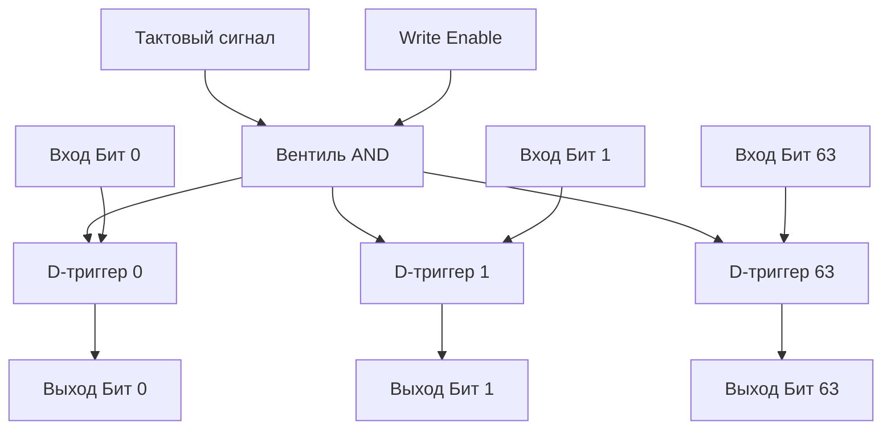
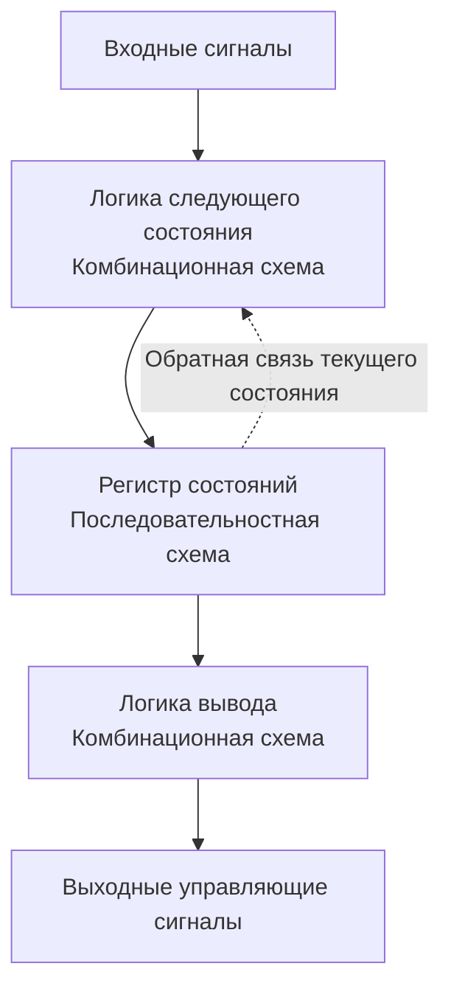

В статье [[4. Последовательностная логика. Учим кремний помнить]] мы создали D-триггер — крошечную ячейку, способную хранить ровно один бит информации и обновлять его синхронно с тактовым сигналом процессора. 

Но программа на Go не оперирует отдельными битами. Типичная переменная `int` или указатель на 64-битной архитектуре занимает 64 бита. Чтобы хранить такие объемы данных, нам нужно масштабировать наши схемы. 

## Регистры: Массив из триггеров

Если мы возьмем 64 D-триггера, поставим их в ряд и подключим их входы `CLK` (Clock) к одному и тому же тактовому генератору, мы получим **Регистр (Register)**.

Регистр — это простейшая и самая быстрая память в компьютере. Он может сохранить 64-битное число (машинное слово) за один-единственный такт процессора.

Чтобы регистр не перезаписывал свои данные на каждом такте (ведь метроном тикает постоянно), к нему добавляют специальный управляющий провод — **Write Enable (Разрешение записи)**. Через логический вентиль AND он блокирует тактовый сигнал, пока мы явно не подадим команду на сохранение новых данных.



> [!info] Под капотом
> Регистры физически встроены в ядро процессора. Сигналу не нужно идти по длинным шинам до планок RAM или кэшей L1/L2. Доступ к регистру требует **0 дополнительных тактов** задержки ( latency = 0). Это абсолютный идеал памяти. Компилятор Go на этапе SSA-оптимизаций изо всех сил старается разместить как можно больше ваших локальных переменных в регистрах, а не в оперативной памяти (стеке).

## Счетчики: Регистр + Сумматор

Теперь давайте объединим комбинационную логику из статьи [[3. Комбинационная логика. Учим кремний считать]] с последовательностной. 

Что будет, если мы возьмем 64-битный регистр, подключим его выход ко входу сумматора, на второй вход сумматора жестко подадим число `1`, а выход сумматора заведем обратно на вход регистра?

Мы получим **Счетчик (Counter)**. С каждым тактом процессора, если подан сигнал "Считать", значение в регистре будет автоматически увеличиваться на единицу.

### Program Counter (Instruction Pointer)

Зачем процессору счетчики? Без них выполнение программы невозможно. Самый важный счетчик в архитектуре компьютера — это **Счетчик команд (Program Counter, PC)**, который в архитектуре x86-64 называется регистром `RIP` (Instruction Pointer).

Он хранит адрес инструкции, которая должна быть выполнена следующей. Как только процессор считывает инструкцию из памяти, комбинационная логика подает сигнал на этот счетчик, и `RIP` инкрементируется, указывая на следующую строчку скомпилированного машинного кода. 

Если в вашем Go-коде встречается оператор `if` или вызов функции, компилятор генерирует инструкцию `JMP` (Jump) или `CALL`. Эта инструкция подает сигнал "Записать" (Write Enable) на счетчик `RIP` и насильно перезаписывает его новым адресом в памяти, нарушая последовательное инкрементирование. Так работают ветвления!

> [!tip] Собеседование
> **Вопрос:** Что такое аппаратные счетчики производительности (Hardware Performance Counters / PMCs)?
> **Ответ:** Это специальные физические счетчики внутри процессора, которые инкрементируются при наступлении определенных событий на уровне железа: промах в кэш (Cache Miss), неверное предсказание ветвления (Branch Misprediction) или выполнение инструкции. Инструменты профилирования, такие как `perf` в Linux или `go tool ptrace`, читают эти счетчики, чтобы показать бэкенд-разработчику, почему его программа тормозит на микроархитектурном уровне.

## Конечные автоматы (Finite State Machines)

Мы подошли к вершине эволюции цифровой логики. У нас есть комбинационные схемы для вычислений (ALU) и последовательностные схемы для хранения состояний (регистры). Если их объединить в замкнутую систему, мы получим **Конечный автомат (FSM)**.

Конечный автомат аппаратно состоит из трех блоков:
1. **Регистр состояний:** хранит текущее состояние системы.
2. **Логика следующего состояния:** комбинационная схема (вентили), которая анализирует входные сигналы и текущее состояние, чтобы вычислить, в какое состояние перейти на следующем такте.
3. **Логика вывода:** комбинационная схема, которая генерирует полезные сигналы наружу на основе текущего состояния.



Почему это так важно? Потому что **Control Unit (Устройство управления)** — мозг любого процессора — это гигантский аппаратный конечный автомат. На каждом такте он читает инструкцию, смотрит на свое текущее состояние и "дергает" нужные провода (включает ALU, открывает запись в регистр, переключает мультиплексор), чтобы шаг за шагом выполнить вашу команду.

## Mechanical Sympathy: FSM в программном коде

Паттерн "Конечный автомат" перекочевал из железа прямо в архитектуру программного обеспечения. Это один из самых надежных способов моделировать сложные бизнес-процессы, сетевые протоколы и парсеры в Go.

Любое TCP-соединение под капотом (в ядре ОС) работает как строгий FSM. Вы не можете отправить данные, пока автомат не перейдет из состояния `LISTEN` в `SYN_RCVD` и затем в `ESTABLISHED`.

Если бизнес-логика вашего бэкенда подразумевает переходы (например, статус заказа: `New -> Paid -> Shipped -> Delivered`), использование паттерна FSM избавит вас от лапши из `if/else` и недопустимых переходов (например, из `New` сразу в `Delivered`).

### Пример реализации FSM на Go

Идиоматичная реализация простого конечного автомата (вдохновленная сетевым стеком) в Go выглядит так:

```go
package main

import (
	"errors"
	"fmt"
)

// State — это состояние нашего регистра (текущее состояние)
type State int

const (
	StateClosed State = iota
	StateListen
	StateEstablished
)

// Event — это входные сигналы для нашего автомата
type Event int

const (
	EventPassiveOpen Event = iota
	EventReceiveSYNACK
	EventClose
)

var ErrInvalidTransition = errors.New("invalid state transition")

// TCPMachine — наш программный FSM
type TCPMachine struct {
	state State // Выполняет роль Регистра
}

// Transition — это наша "Логика следующего состояния"
func (m *TCPMachine) Transition(event Event) error {
	switch m.state {
	case StateClosed:
		if event == EventPassiveOpen {
			m.state = StateListen
			return nil
		}
	case StateListen:
		if event == EventReceiveSYNACK {
			m.state = StateEstablished
			return nil
		}
	case StateEstablished:
		if event == EventClose {
			m.state = StateClosed
			return nil
		}
	}
	
	// Блокируем любые непредусмотренные переходы
	return fmt.Errorf("%w: state %v, event %v", ErrInvalidTransition, m.state, event)
}

func main() {
	machine := &TCPMachine{state: StateClosed}

	err := machine.Transition(EventPassiveOpen)
	if err == nil {
		fmt.Println("Переход успешен. Текущее состояние:", machine.state)
	}

	// Попытка невалидного перехода (поломка логики)
	err = machine.Transition(EventClose)
	if err != nil {
		fmt.Println("Ошибка:", err) // Нельзя закрыть то, что только слушает
	}
}
```

В высоконагруженных системах FSM часто реализуют через map, где ключом выступает пара `(Текущее состояние, Событие)`, а значением — функция-обработчик и `Следующее состояние`. Это обеспечивает O(1) поиск нужного перехода, полностью имитируя аппаратные комбинационные схемы.

## Итог

1. **Регистры** — это массивы D-триггеров, способные мгновенно сохранять многобитные машинные слова. Это самая быстрая память из всех существующих.
2. **Счетчики** — регистры, замкнутые на сумматор. Главный счетчик процессора (`RIP`) указывает на следующую инструкцию, позволяя программе выполняться шаг за шагом.
3. Ветвления в коде (`if`, `for`, `func()`) — это просто сигналы, насильно перезаписывающие значение счетчика команд.
4. **Конечный автомат (FSM)** — комбинация памяти и логики, принимающая решения на основе истории. Это фундаментальный принцип работы управляющего блока CPU и мощнейший архитектурный паттерн для программирования на Go.

Все базовые компоненты электроники изучены. У нас есть вычислители, память, счетчики и автоматы. Настало время собрать из них полноценный процессор. В следующей статье мы объединим всё это в единую архитектуру и посмотрим на внутренности CPU глазами программиста: [[6. Анатомия CPU. Datapath, Control Unit и Register File]].