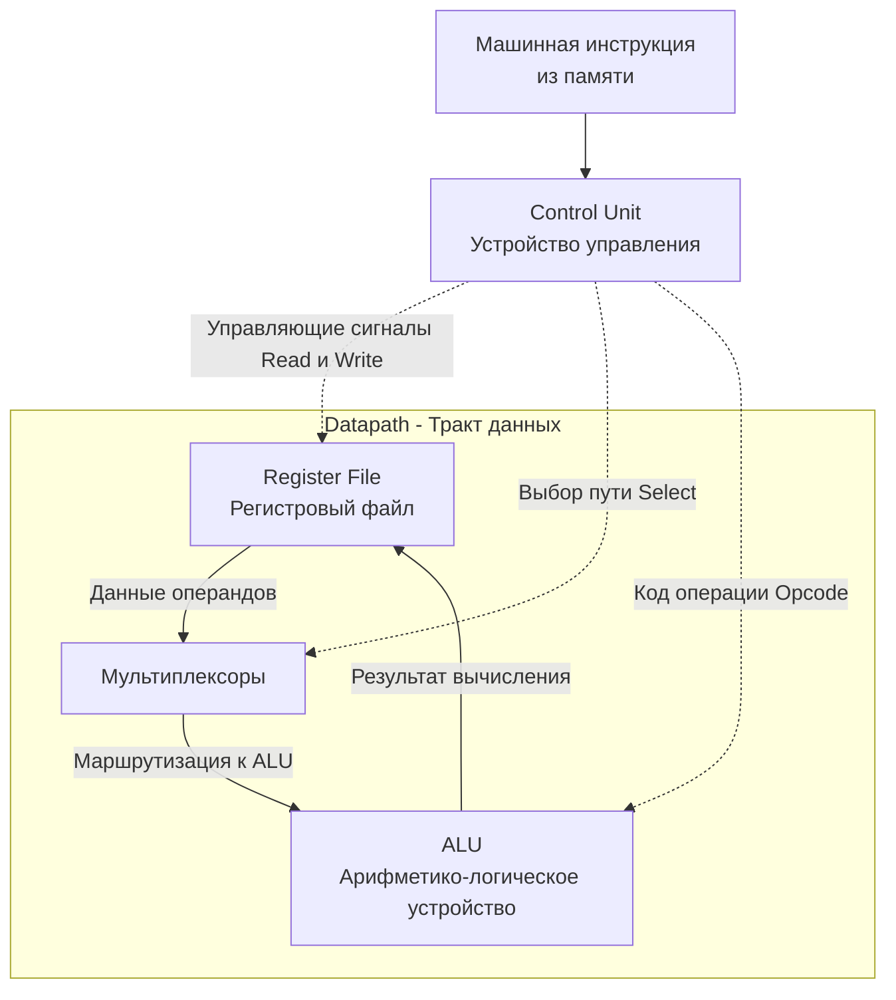

В предыдущих статьях мы собрали все детали низкоуровневого конструктора: логические вентили, сумматоры (ALU), триггеры, регистры и конечные автоматы. Теперь мы объединим эти разрозненные компоненты в единую систему — Центральный Процессор (CPU).

В классической вычислительной архитектуре любой процессор концептуально делится на три главных узла:
1. **Register File (Регистровый файл)** — сверхбыстрая локальная память.
2. **Datapath (Тракт данных)** — мускулы процессора, где физически перемалываются биты.
3. **Control Unit (Устройство управления)** — мозг процессора, дирижирующий мускулами.

Разберем их анатомию и то, как знание этих блоков помогает писать производительный Go-код.

## Register File: Сверхбыстрый блокнот процессора

Регистровый файл — это массив регистров (каждый из которых состоит из массива D-триггеров, как мы выяснили в [[5. Регистры, счетчики и конечные автоматы]]). Это единственное место, где процессор может хранить данные *во время вычислений*. ALU не умеет складывать числа, лежащие напрямую в оперативной памяти — их сначала нужно загрузить в регистровый файл.

В архитектуре x86-64 таких регистров общего назначения (GPR — General Purpose Registers) всего 16: `RAX`, `RBX`, `RCX`, `RDX`, `RSI`, `RDI`, `RBP`, `RSP` и от `R8` до `R15`. Каждый вмещает 64 бита (8 байт). 
То есть вся "рабочая" память самого ядра процессора — это жалкие 128 байт!

> [!info] Под капотом
> Физически регистровый файл сложнее простого массива переменных. Чтобы ALU могло сложить два числа за один такт (например, `ADD RAX, RBX`), регистровый файл имеет **многопортовую архитектуру**. Это позволяет процессору одновременно (за один электрический импульс) извлекать значения из портов чтения для `RAX` и `RBX`, отправлять их в ALU и на том же такте записывать результат через порт записи обратно в `RAX`.

## Datapath: Мускулы и кровеносная система

Тракт данных (Datapath) — это совокупность всех вычислительных элементов и путей (шин), по которым между ними перемещаются биты.

Его основные компоненты:
1. **ALU (Арифметико-логическое устройство):** выполняет математику и логические операции (мы собирали его из вентилей в [[3. Комбинационная логика. Учим кремний считать]]).
2. **Регистровый файл:** поставляет данные для ALU.
3. **Шины (Buses):** пучки микроскопических проводов, соединяющие компоненты (обычно по 64 провода для параллельной передачи 64-битного числа).
4. **Мультиплексоры (MUX):** аппаратные переключатели, маршрутизирующие потоки данных. Например, на вход ALU может прийти сигнал из регистра, а может — константа, жестко зашитая прямо в текущую машинную команду. MUX выбирает нужный источник тока.

## Control Unit: Мозг и Дирижер

Если Datapath — это мускулы, то **Control Unit (CU)** — это нервная система. Сам по себе Datapath ничего не делает, это просто набор готовых к работе цепей. Ему нужно сказать, какие регистры читать, какую схему внутри ALU включить и куда записать результат.

Control Unit — это гигантский аппаратный конечный автомат. Он принимает на вход машинную инструкцию (например, двоичный код `01001000 00000001 11000011` — это инструкция `ADD RAX, RBX`), декодирует ее и рассылает управляющие электрические сигналы (1 или 0) ко всем компонентам Datapath:

*   Подает сигнал `Read Enable` на регистры `RAX` и `RBX`.
*   Переключает MUX так, чтобы выходы этих регистров соединились со входами ALU.
*   Отправляет в ALU код операции "Сложение" (Opcode).
*   Подает сигнал `Write Enable` на регистр `RAX`, чтобы на следующем такте сохранить туда ответ.

## Mechanical Sympathy: Go и вызов функций через регистры

Знание регистрового файла критически важно для производительности в Go.

Исторически (в С, С++ и старых версиях Go до 1.17) при вызове функции ее аргументы передавались через **стек** (оперативную память). Процессор должен был положить данные в RAM, сделать прыжок в функцию (`CALL`), а затем функция внутри себя читала эти данные обратно из RAM в свои регистры для работы. Работа с памятью — это долго.

Начиная с **Go 1.17**, компилятор перешел на **Register-based calling convention** (мы подробно разберем это в [[10. ABI, Calling Convention и стек вызовов]]).

Теперь Go старается передавать аргументы функций и возвращаемые значения напрямую через регистры CPU (`RAX`, `RBX`, `RCX` и т.д.), полностью минуя стек и промахи кэша. Передача аргумента через регистр стоит 0 наносекунд (задержка отсутствует аппаратно).

> [!warning] Ловушка / Gotcha
> Передача через регистры ограничена их физическим количеством. В Go 1.17+ под аргументы выделено ровно 9 целочисленных регистров и 15 регистров для чисел с плавающей точкой (XMM).
> Если ваша функция принимает 12 аргументов типа `int`, первые 9 будут переданы мгновенно через регистры, а оставшиеся 3 "прольются" (Spill) на стек, что вызовет дополнительные обращения к оперативной памяти и сделает вызов функции медленнее. 
> **Вывод:** Функции с гигантским количеством аргументов или возвращающие структуры с десятками полей создают дополнительную нагрузку на подсистему памяти, так как не помещаются в Register File.

> [!tip] Собеседование
> **Вопрос:** Как посмотреть, какие регистры использует Go для вызова конкретной функции?
> **Ответ:** Скомпилировать код с флагом `go build -gcflags="-S" main.go`. В терминал выведется ассемблерный код.
> Если перед инструкцией `CALL` вы видите что-то вроде `MOVQ AX, BX` — аргумент передан через регистр. Если вы видите манипуляции со стеком типа `MOVQ AX, 16(SP)` — регистров не хватило (или это старая версия Go), и аргумент отправлен в память.

## Итог

1. **Register File (Регистровый файл)** — крошечный массив самой быстрой памяти прямо в ядре процессора (в x86-64 их всего 16 для целых чисел). 
2. **Datapath (Тракт данных)** — маршрутная сеть из мультиплексоров, шин и ALU, по которой физически протекают биты во время вычислений.
3. **Control Unit (Устройство управления)** — конечный автомат, который читает машинный код, переводит его в управляющие электрические импульсы и заставляет Datapath совершать полезную работу.
4. Современный Go (1.17+) активно эксплуатирует регистры для молниеносной передачи аргументов в функции, что дает бесплатный прирост производительности примерно на 5-10% в CPU-bound задачах по сравнению со старыми версиями языка.

Теперь мы знаем, из чего состоит CPU. Но как он забирает инструкции из оперативной памяти и выполняет их шаг за шагом со скоростью миллиарды раз в секунду? В следующей статье мы рассмотрим этот пульс — основу работы любого компьютера: [[7. Цикл исполнения инструкции. Fetch, Decode, Execute]].