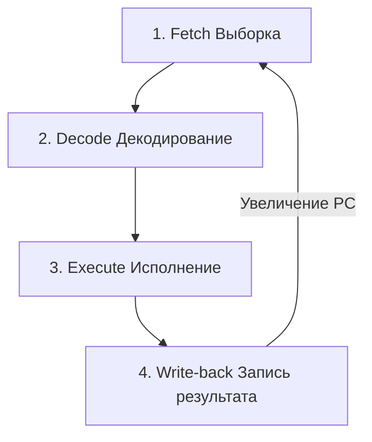

## Сердцебиение процессора

В предыдущих статьях мы собрали всё необходимое железо: АЛУ для математики, регистры для памяти, и Устройство управления (Control Unit, CU) для руководства парадом. Но как именно процессор заставляет вашу Go-программу двигаться вперед, строка за строкой?

Ответ кроется в **Цикле исполнения инструкции** (Instruction Cycle, или Fetch-Decode-Execute cycle). Это бесконечный цикл, который запускается в момент включения компьютера и останавливается только при его выключении. Ваш процессор, работающий на частоте 3 ГГц, прокручивает этот цикл примерно 3 миллиарда раз в секунду.

Для работы этого цикла Устройству управления критически важны два специальных регистра:
1. **PC (Program Counter / Счетчик команд)**: В архитектуре x86-64 он называется `RIP` (Instruction Pointer). Этот регистр всегда хранит *адрес памяти*, где лежит следующая инструкция, которую нужно выполнить.
2. **IR (Instruction Register / Регистр инструкций)**: Сюда процессор копирует саму инструкцию (байт-код) из оперативной памяти перед тем, как ее расшифровать.

## Четыре такта работы процессора

Каждое выполнение одной машинной команды разбивается на четыре фундаментальных шага.



### 1. Fetch (Выборка)
Процессор смотрит в регистр `PC`. Допустим, там записан адрес памяти `0x00401000`. 
Устройство управления выставляет этот адрес на Шину адреса и запрашивает чтение. Память (или [[Кэши CPU|кэш L1]]) возвращает байтики по этому адресу. Эти байтики копируются в регистр `IR`. 
Сразу после этого процессор делает инкремент `PC` — увеличивает его значение на длину прочитанной инструкции, чтобы `PC` указывал на следующую команду.

### 2. Decode (Декодирование)
Устройство управления (CU) берет байты из регистра `IR` и расшифровывает их. Оно понимает: "Ага, это OpCode операции сложения (`ADD`), а операнды — это регистры `RAX` и `RBX`". На этом этапе CU подготавливает нужные провода в Datapath.

### 3. Execute (Исполнение)
Сигналы отправляются в АЛУ. Транзисторы пропускают ток, сумматоры (о которых мы говорили в статье [[3. Комбинационная логика. Учим кремний считать]]) мгновенно вычисляют результат сложения. Если инструкция была не математической, а, например, чтением из памяти, на этом этапе происходит обращение по шинам к RAM.

### 4. Write-back (Запись результата)
Результат из АЛУ (или данные, пришедшие из памяти) записывается в целевой регистр или отправляется обратно в RAM. Цикл завершен. Процессор возвращается к шагу 1.

## Управление потоком: Как работает if/else

Если `PC` всегда просто увеличивается (инкрементируется), как программы могут ветвиться? Как работает оператор `if` в Go?

На уровне железа не существует `if`, `else` или `for`. Существует только одна магическая команда — **JMP (Jump / Прыжок)** и её условные вариации.

Инструкция `JMP` делает предельно простую вещь на шаге *Execute*: она берет переданный ей адрес и **перезаписывает значение регистра PC**. На следующем шаге *Fetch* процессор возьмет инструкцию не из следующей строки памяти, а оттуда, куда приказал прыгнуть `JMP`.

Давайте посмотрим на Go-код и его абстрактный ассемблерный эквивалент:

```go
package main

func check(a int) int {
	if a == 42 {
		return 1
	}
	return 0
}
```

Компилятор Go переведет этот `if` в комбинацию инструкций сравнения и условного прыжка (Conditional Jump):

```asm
; Абстрактный ассемблер (шаги цикла исполнения)
CMP RAX, 42      ; Сравниваем значение в регистре RAX (наша a) с 42. 
                 ; ALU вычитает 42 из RAX. Если результат 0, ALU выставляет спец. флаг Zero Flag.
JNE skip_block   ; Jump if Not Equal. Если Zero Flag не выставлен (a != 42), 
                 ; процессор перезаписывает PC адресом метки skip_block.
MOV RAX, 1       ; Если прыжка не было, выполняем тело if (return 1)
RET              ; Возврат из функции
skip_block:
MOV RAX, 0       ; Если был прыжок, выполняем эту часть (return 0)
RET
```

> [!info] Под капотом
> Вызов функции (`CALL` в ассемблере) работает похоже на `JMP`. Но перед тем как перезаписать `PC` новым адресом (прыгнуть в функцию), процессор берет *текущее* значение `PC` и сохраняет его в Стек вызовов (Call Stack). Когда функция завершается, инструкция `RET` (Return) берет этот сохраненный адрес из стека и кладет его обратно в `PC`. Так процессор "вспоминает", откуда он пришел, и продолжает выполнение программы после вызова функции.

## Mechanical Sympathy: Бесконечные циклы в Go

Теперь давайте свяжем цикл исполнения инструкций на уровне железа с рантаймом Go. 

> [!tip] Собеседование
> **Вопрос:** Что произойдет с Go-программой, если запустить горутину с пустым бесконечным циклом `for {}` на машине с одним ядром? Заблокирует ли это всю программу?
> **Ответ:** Зависит от версии Go. 
> До версии Go 1.14 такой цикл намертво вешал ядро. Рантайм Go использует кооперативную многозадачность. Если `PC` крутится в бесконечном цикле (постоянный `JMP` на одну и ту же инструкцию), горутина никогда не вызывает функции рантайма, а значит, планировщик не может забрать у нее управление.
> **Но с Go 1.14 ввели асинхронную вытесняющую многозадачность (Asynchronous Preemption).** Системный поток (sysmon) видит, что горутина захватила CPU слишком надолго, и посылает потоку ОС аппаратный сигнал `SIGURG`. Ядро ОС *прерывает* цикл процессора (Interrupt), сохраняет регистр `PC` в структуру `gobuf.pc` (мы говорили об этом в статье [[4. Последовательностная логика. Учим кремний помнить]]) и насильно отдает CPU другой горутине.

```go
package main

import (
	"fmt"
	"runtime"
	"time"
)

func main() {
	// Ограничиваем программу одним логическим ядром (одним "конвейером PC")
	runtime.GOMAXPROCS(1) 

	go func() {
		// Бесконечный цикл. На уровне CPU это JMP сам на себя.
		// До Go 1.14 это заблокировало бы единственный тред навсегда.
		for {
			// Механическая симпатия: здесь нет системных вызовов, 
			// нет аллокаций памяти, нет вызовов функций.
		}
	}()

	time.Sleep(100 * time.Millisecond)
	// Благодаря асинхронному вытеснению (SIGURG), эта строка выполнится, 
	// и планировщик (sysmon) переключит контекст.
	fmt.Println("Программа успешно продолжила работу на Go 1.14+")
}
```

## Итог

1. Процессор ничего не понимает в абстракциях. Он просто бесконечно крутит цикл **Fetch $\rightarrow$ Decode $\rightarrow$ Execute $\rightarrow$ Write-back**.
2. Регистр **PC (Счетчик команд)** — это "курсор" выполнения программы. 
3. Операторы `if`, `for`, `switch` и вызовы функций компилируются в инструкции изменения регистра `PC` (`JMP`, `CALL`).

Но у описанного нами классического цикла (когда шаги выполняются строго друг за другом) есть огромная проблема. Он слишком медленный. 
Пока ALU делает математику на шаге *Execute*, подсистема работы с памятью (на шаге *Fetch*) простаивает без дела! 

Чтобы выжать из железа максимум, инженеры придумали гениальный трюк, превратив процессор в фабрику. Об этом — в следующей статье: [[7. Ускорение CPU. Конвейеризация и Суперскалярность]].