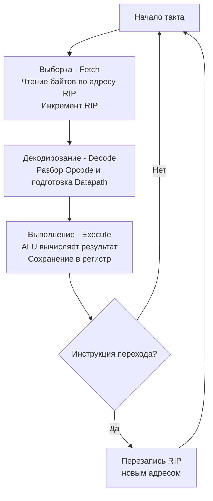

В прошлой статье ([[6. Анатомия CPU. Datapath, Control Unit и Register File]]) мы собрали процессор из статических компонентов: регистров, вычислителей и блоков управления. Но чтобы "железо" начало приносить пользу, по нему должны побежать данные. 

Процессор — это конечный автомат. Его работа заключается в бесконечном, монотонном повторении одного и того же алгоритма, такт за тактом, миллиарды раз в секунду. Этот процесс называется **Циклом исполнения инструкции (Instruction Cycle)**.

Концептуально он состоит из трех основных фаз: **Fetch** (Выборка), **Decode** (Декодирование) и **Execute** (Выполнение).

---

## 1. Fetch (Выборка инструкции)

Процессор ничего не "знает" о вашей программе в целом. В любой момент времени его кругозор ограничен ровно одной командой.

Внутри процессора есть специальный счетчик — **Program Counter (PC)**, который в x86-64 называется регистром `RIP` (Instruction Pointer). Он хранит физический (или виртуальный) адрес следующей машинной инструкции в памяти.

На фазе **Fetch** происходит следующее:
1. Control Unit отправляет адрес из регистра `RIP` в подсистему памяти (через шину адреса).
2. Процессор запрашивает данные по этому адресу. Сначала он ищет их в сверхбыстром кэше инструкций **L1i**. Если там пусто (Cache Miss), запрос уходит в L2, L3 и, наконец, в медленную оперативную RAM.
3. Полученные байты (например, `48 01 D8` — машинный код) загружаются в специальный невидимый для программиста регистр — Instruction Register (IR).
4. Control Unit **инкрементирует** значение `RIP`, чтобы на следующем цикле он указывал на следующую команду в памяти.

> [!info] Под капотом
> Для бэкендера здесь кроется важнейший нюанс производительности. Если ваша программа прыгает по памяти хаотично (много виртуальных вызовов, интерфейсов, указателей), процессор постоянно промахивается мимо кэша инструкций (L1i Cache Miss). В этом случае фаза Fetch замирает: ядро процессора буквально "зависает" на сотни тактов, ожидая, пока нужные байты приедут из RAM. Это называется **Pipeline Stall** (остановка конвейера).

## 2. Decode (Декодирование)

Байты получены, но для Datapath (мускулов процессора) это просто бессмысленный набор нулей и единиц. Набор байт нужно превратить в электрические сигналы управления. Этим занимается **Декодер инструкций (Instruction Decoder)** внутри Control Unit.

На фазе **Decode**:
1. Декодер анализирует биты операции (Opcode). Например, он понимает, что `48 01 D8` — это инструкция сложения 64-битных регистров (`ADD RAX, RBX`).
2. Он определяет, нужны ли дополнительные данные (операнды).
3. Декодер "включает" нужные провода: подает сигнал `Read` на регистры `RAX` и `RBX`, переключает мультиплексоры, чтобы направить эти данные в ALU, и подготавливает ALU к сложению.

> [!warning] Ловушка / Gotcha
> В архитектуре x86-64 (на которой работает большинство серверов) инструкции имеют **переменную длину** (от 1 до 15 байт). Декодеру x86 приходится быть безумно сложным: он должен сначала понять длину инструкции, прежде чем сможет найти, где начинается следующая. Это одна из причин, почему ARM-архитектура (Apple Silicon, AWS Graviton), где все инструкции имеют фиксированную длину (обычно 4 байта), сегодня часто обходит x86 по энергоэффективности — их декодеры намного проще и быстрее.

## 3. Execute (Выполнение)

Сцена подготовлена, актеры (данные) на местах. Наступает фаза выполнения.

На фазе **Execute**:
1. Datapath выполняет саму работу. ALU складывает числа, вычисляет побитовое ИЛИ или сдвигает биты.
2. Результат вычисления записывается обратно (эта мини-фаза часто называется **Writeback**). Итог сохраняется в целевой регистр или отправляется в контроллер памяти для записи в RAM.
3. Если инструкция была инструкцией ветвления (например, условный переход `JMP` или вызов функции `CALL`), то результат записывается напрямую в регистр `RIP`. Это насильно меняет ход выполнения программы: следующий **Fetch** начнет чтение не со следующей строчки, а с совершенно нового адреса.



## Mechanical Sympathy: Go Runtime и цикл процессора

Понимание цикла "Fetch-Decode-Execute" — это ключ к ответу на один из самых популярных вопросов на Senior-собеседованиях по Go.

> [!tip] Собеседование
> **Вопрос:** У нас есть горутина с бесконечным циклом:
> ```go
> func main() {
>     runtime.GOMAXPROCS(1)
>     go func() {
>         for {
>             // Пустой бесконечный цикл
>         }
>     }()
>     time.Sleep(time.Second)
>     fmt.Println("Готово")
> }
> ```
> Выведет ли программа "Готово"? Как планировщик Go прерывает такие циклы?
> 
> **Ответ:** На уровне "железа" пустой `for {}` — это инструкция безусловного перехода (например, `JMP`), которая заставляет цикл `Fetch-Decode-Execute` бесконечно крутиться на одном и том же адресе в памяти. Процессор не знает о горутинах и не отдаст ядро сам.
> 
> До версии **Go 1.14** программа бы зависла навсегда (или до ручного убийства процесса), так как планировщик был *кооперативным*. Он мог забрать управление только если горутина делала вызов функции, обращалась к памяти (аллокация) или делала системный вызов. В пустом цикле этого нет.
> 
> Начиная с **Go 1.14**, в рантайм внедрили **асинхронную вытесняющую многозадачность (Asynchronous Preemption)**. 
> Планировщик Go использует фоновый системный тред (sysmon), который замечает, что горутина выполняется слишком долго (больше 10 мс). Sysmon отправляет операционной системе команду послать этому треду сигнал (`SIGURG` в Linux). 
> 
> Операционная система генерирует **Аппаратное прерывание** (подробнее в [[34. Аппаратные прерывания и Системные вызовы]]). Прерывание буквально *взламывает* аппаратный цикл `Fetch-Decode-Execute`: процессор бросает текущий `RIP`, сохраняет его в стек и принудительно переключается на обработчик сигнала рантайма Go. Там рантайм паркует зависшую горутину и отдает поток другой задаче.

Таким образом, высокоуровневые концепции Go напрямую зависят от низкоуровневого поведения железа и того, как ОС может управлять циклом выполнения инструкций.

## Итог

1. **Fetch (Выборка)** — чтение машинного кода из памяти (чаще всего из кэша L1i) по адресу, указанному в счетчике команд (PC / RIP).
2. **Decode (Декодирование)** — аппаратный перевод сырых байтов в управляющие сигналы для регистров, шин и ALU.
3. **Execute (Выполнение)** — физическое исполнение операции (математика, чтение, запись) и сохранение результата.
4. Вызов функции или ветвление (`if/else`) — это просто аппаратная перезапись счетчика `RIP` на этапе Execute, ломающая линейное исполнение.
5. Этот цикл работает непрерывно. Единственный способ прервать зависший `Fetch-Decode-Execute` снаружи (что и делает современный Go) — использовать механизм аппаратных прерываний ОС.

Цикл работы понятен. Но кто решает, какой именно набор байтов означает `ADD`, а какой — `JMP`? Как компилятор Go понимает, какие биты сгенерировать, чтобы процессор их успешно декодировал? Ответ кроется в контракте между создателями железа и программистами. В следующей статье мы разберем: [[8. ISA. Интерфейс между железом и софтом]].