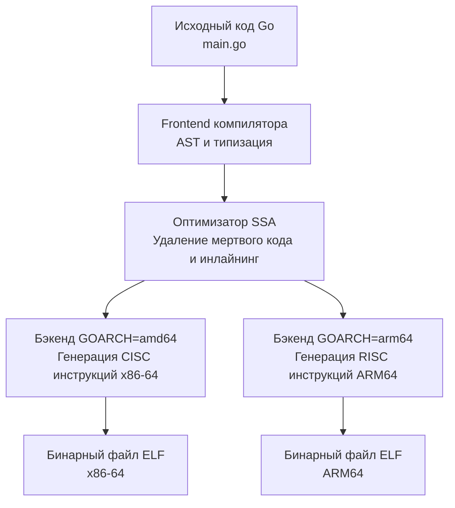

В статье [[7. Цикл исполнения инструкции. Fetch, Decode, Execute]] мы разобрали, как процессор читает байты из памяти и декодирует их. Но как процессор понимает, что байт `0x01` означает сложение, а не прыжок? Кто вообще решает, какие байты генерировать компилятору?

Здесь на сцену выходит **ISA (Instruction Set Architecture — Архитектура системы команд)**.

Если сказать терминами бэкенд-разработчика: **ISA — это API процессора**. 
Аппаратные компоненты (ALU, регистры, шины), которые мы собирали в [[6. Анатомия CPU. Datapath, Control Unit и Register File]], — это приватная реализация (микроархитектура). Вы, как программист, не можете взаимодействовать с микроархитектурой напрямую. Вы общаетесь с процессором только через публичный контракт — ISA.

## Интерфейс и Реализация

ISA определяет строгий набор правил:
*   Какие машинные инструкции (Opcodes) поддерживает процессор.
*   Сколько регистров доступно программисту и как они называются (например, `RAX` или `X0`).
*   Как процессор работает с памятью (адресация, размеры операндов).
*   Как обрабатываются прерывания и ошибки.

> [!info] Под капотом
> Разделение на ISA и микроархитектуру — это величайший триумф абстракции в hardware. 
> Процессоры Intel Core i9 и AMD Ryzen внутри устроены абсолютно по-разному. У них разное количество транзисторов, разные кэши, разные мультиплексоры. Но они реализуют **один и тот же интерфейс — ISA x86-64**.
> Именно поэтому ваш бинарник, скомпилированный под `amd64`, будет одинаково успешно работать и на серверах с Intel, и на серверах с AMD. Процессоры "под капотом" переведут этот публичный контракт в свои внутренние микрооперации.

## Два лагеря: CISC vs RISC

В мире архитектур исторически сложились две доминирующие философии, с которыми сегодня сталкивается каждый Go-разработчик.

### 1. CISC (Complex Instruction Set Computer)
*   **Главный представитель:** `x86-64` (Intel, AMD).
*   **Философия:** Сделать инструкции максимально умными. Одна инструкция может быть очень сложной: она может одновременно прочитать данные из памяти, прибавить к ним значение из регистра и записать результат обратно в память.
*   **Особенность:** Инструкции имеют переменную длину (от 1 до 15 байт). Это усложняет декодер процессора, но делает бинарный код более компактным.

### 2. RISC (Reduced Instruction Set Computer)
*   **Главный представитель:** `ARM64` (Apple Silicon M1/M2/M3, AWS Graviton), `RISC-V`.
*   **Философия:** Оставить только простые, базовые инструкции. Если нужно прибавить число из памяти к регистру, вы должны использовать три разные команды: загрузить из памяти в регистр (`LOAD`), сложить два регистра (`ADD`), сохранить результат обратно в память (`STORE`). Это называется архитектурой *Load/Store*.
*   **Особенность:** Инструкции имеют фиксированную длину (ровно 4 байта). Декодеру очень легко их парсить, что позволяет процессору работать быстрее и потреблять в разы меньше энергии (поэтому ARM победил в мобильных телефонах, а сейчас захватывает серверный рынок).

## Go и кросс-компиляция (GOARCH)

Языки вроде Python или PHP не знают об ISA — они выполняются интерпретатором. Java и C# компилируются в промежуточный байткод (IL), который транслируется в инструкции процессора уже в рантайме (JIT-компиляция) виртуальной машиной.

**Go работает иначе.** Он использует модель AOT (Ahead-Of-Time) компиляции. Когда вы пишете `go build`, компилятор должен сгенерировать сырой машинный код под конкретный контракт (ISA). 

Именно за это отвечает переменная окружения `GOARCH`.



Разработчики Go проделали колоссальную работу: вы можете сидеть за макбуком на ARM-процессоре (Apple Silicon) и одной командой собрать бинарник для серверов на Intel:
```bash
GOOS=linux GOARCH=amd64 go build main.go
```
Компилятору не нужен запущенный Linux или процессор Intel, чтобы создать этот файл. Он просто берет AST вашей программы и на этапе бэкенда компиляции переводит его в словарь инструкций `x86-64`, упаковывая в формат ELF (Executable and Linkable Format).

> [!warning] Ловушка / Gotcha
> Вызов `GOOS=linux GOARCH=amd64 go build` работает как магия, пока ваш проект написан на чистом Go (Pure Go).
> Но как только вы подключаете зависимость, использующую **CGO** (например, драйвер SQLite `go-sqlite3` или библиотеку для работы с Kafka `confluent-kafka-go`), кросс-компиляция ломается. 
> Почему? Потому что Go-компилятор умеет кросс-компилировать только Go-код. Для C-кода он вызывает системный компилятор (gcc/clang). Ваш локальный `clang` на Mac настроен генерировать код только под родной Mac (arm64/darwin). Чтобы скомпилировать C-код под Linux/amd64, вам придется вручную устанавливать и настраивать кросс-компилятор C (C cross-toolchain), что превращается в инфраструктурную боль.
> *Именно поэтому в мире Go так ценятся pure-go библиотеки.*

## Mechanical Sympathy: Псевдо-ассемблер Plan 9

Несмотря на абстракцию `GOARCH`, иногда Go-разработчикам нужно спуститься на уровень ISA вручную (например, чтобы написать высокооптимизированную криптографическую функцию без накладных расходов).

Но если вы посмотрите на ассемблерный код в исходниках стандартной библиотеки Go, вы увидите странную вещь: он не похож ни на стандартный синтаксис Intel, ни на AT&T.

Дело в том, что Go использует свой собственный диалект ассемблера — **Plan 9 Assembly**.
Создатели Go (Роб Пайк, Кен Томпсон) работали над ОС Plan 9 в Bell Labs. Они придумали *промежуточный* ассемблер.

Вместо того чтобы заставлять программиста жестко привязываться к регистрам конкретной ISA, Plan 9 вводит псевдо-регистры (например, `FP` — Frame Pointer, `SB` — Static Base). Компилятор Go читает этот псевдо-ассемблер и на лету транслирует его в реальные инструкции текущей целевой архитектуры (amd64, arm64). Это делает работу бэкенда компилятора модульной и упрощает добавление поддержки новых процессоров (например, RISC-V).

> [!tip] Собеседование
> **Вопрос:** Вы написали и протестировали lock-free алгоритм на своем ноутбуке с процессором Intel. Код работает без сбоев. Но после деплоя на новые AWS Graviton (ARM64) серверы, код начал выдавать состояние гонки данных (Data Race), хотя логика не менялась. Как такое возможно, если ISA просто транслирует код?
> **Ответ:** Разные ISA имеют разные контракты не только по набору команд, но и по **Модели памяти (Memory Model)**. Архитектура x86-64 обладает "строгой" моделью памяти (Strong Memory Model) — она гарантирует порядок записи и чтения большинства данных на уровне железа. Архитектура ARM64 имеет "слабую" модель (Weak Memory Model) — процессор имеет право переставлять инструкции чтения и записи местами ради оптимизации, если между ними нет явных зависимостей. На ARM необходимо строго расставлять барьеры памяти (Memory Fences), которые на x86 часто не нужны. (Мы погрузимся в этот хардкор в статьях раздела про Memory Ordering).

## Итог

1. **ISA (Архитектура системы команд)** — это API процессора. Контракт, описывающий, какие команды и регистры доступны софту.
2. Процессоры с разным физическим устройством могут реализовывать одну и ту же ISA (Intel и AMD оба реализуют x86-64).
3. **CISC (x86-64)** имеет сложные инструкции переменной длины. **RISC (ARM64)** — простые инструкции фиксированной длины.
4. Go — компилируемый язык. Его бэкенд переводит SSA в машинный код конкретной ISA, что управляется переменной `GOARCH`.
5. Кросс-компиляция в Go работает безупречно "из коробки", пока вы не начинаете использовать CGO.

Теперь мы знаем, что между исходным кодом и железом есть контракт. Но как этот скомпилированный код выглядит в реальности? Как заглянуть "под капот" своего бинарника и прочитать то, что видит процессор? В следующей статье мы познакомимся с языком, на котором говорит машина: [[9. Базовый Ассемблер. Как CPU видит код]].